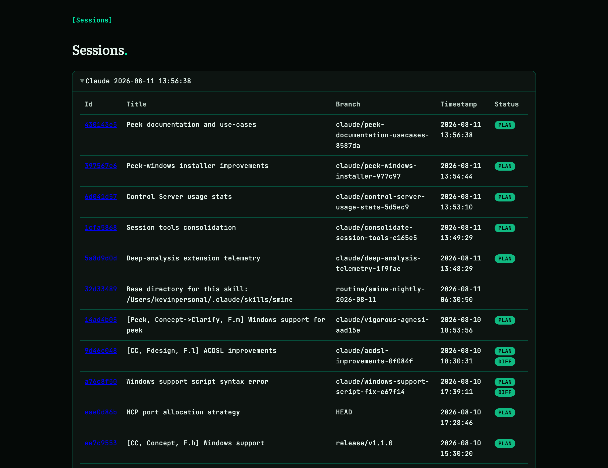

# peek-mcp

Shared session context for AI agents. peek-mcp watches the sessions Claude Code and Codex CLI write to disk and serves them live over MCP — turns, plans, and git diffs — so agents can hand work to each other, review each other, escape full context windows, be orchestrated as a fleet, and have their history mined. No copy-paste, no summarization, no workflow change.

Agents already write everything to disk as JSONL — peek-mcp just reads it, passively. There is nothing to push and nothing to configure in the producing agent: any connected client calls a tool and gets the context it needs.

## Use cases

| Use case | You want to… |
|---|---|
| [Model handoff](docs/use-cases/model-handoff.md) | have a cheap model review what an expensive one built |
| [Compaction preventer](docs/use-cases/compaction-preventer.md) | continue in a fresh session instead of compacting a full one |
| [Agent orchestration](docs/use-cases/agent-orchestration.md) | supervise several worker sessions from one place |
| [Cross-agent communication](docs/use-cases/cross-agent-communication.md) | let Claude Code and Codex read each other's work |
| [Session analysis](docs/use-cases/session-analysis.md) | mine past sessions for retrospectives |

## How it works

```
Claude Code / Codex writes JSONL to disk (always, no configuration needed)
                    |
             fsnotify file watcher
                    |
          in-memory buffer per session
                    |
        MCP server over streamable HTTP or stdio
                    |
    Sonnet / GPT-5-mini calls session_get(n)
```

Alongside turns, peek-mcp passively watches two more sources:

- **Plans** — Claude Code writes a plan file per task; peek-mcp stores it with the session so `session_get` surfaces it. For Codex, the plan is the latest `proposed_plan` block.
- **Git diffs** — after each new turn, peek-mcp infers the session branch's base and runs `git diff --merge-base <base>` in the session's working directory. `session_get` exposes the result via its `diff` section; the resolved base is reported as `diff_target`.

## Quick start

Install:

```bash
go install github.com/kevinhorst/peek-mcp@latest
```

Or grab a prebuilt binary from the [latest release](https://github.com/kevinhorst/peek-mcp/releases/latest) (Windows setup: see the [reference](docs/reference.md#windows)).

Run the interactive setup wizard — it detects your environment and writes the correct config for Claude Code, Codex CLI, or both, merging without destroying other keys:

```bash
peek-mcp
```

Non-interactive (used by the Windows installer, works everywhere):

```bash
peek-mcp setup --claude --codex --control-server=false
```

Or start the server directly:

```bash
peek-mcp start
```

This serves the MCP endpoint on `http://localhost:4242/mcp` by default.

Connect it to a client:

```bash
# Claude Chat
claude mcp add peek-mcp http://localhost:4242/mcp --transport http
```

```json
// Claude Code — .claude/settings.json
{
  "mcpServers": {
    "peek-mcp": { "type": "http", "url": "http://localhost:4242/mcp" }
  }
}
```

```toml
# Codex — ~/codex/config.toml
[mcp_servers.peek-mcp]
command = "/absolute/path/to/peek-mcp"
args = ["start", "--transport=stdio"]
```

## Tools

One call — `session_get` — does the job: turns, plan, and diffs for a session, with flat boolean flags to select the sections you want. `session_list` is the roster.

| Tool | Returns |
|---|---|
| `session_get` | turns + plan + diff (+ uncommitted diff) for a session, sections selected by flags |
| `session_list` | all sessions with metadata (branch, model, activity, diff base) |

Full parameters, title-matching and pagination rules, supported agents, and the Claude/Codex parity table: [docs/tools.md](docs/tools.md).

## Dashboard

Run with `--control-port` and peek-mcp serves a live, read-only dashboard on loopback — session list, turns, plan, and diffs, updating as agents work. It doubles as a scriptable JSON API. See [docs/reference.md](docs/reference.md#control-server-dashboard--json-api).



## More

- [Tool reference](docs/tools.md) — every parameter, supported agents, agent parity
- [Operations reference](docs/reference.md) — flags, env vars, control server, hot reload, `.mcpb`, Windows
- [Contributing](CONTRIBUTING.md)

## License

MIT
