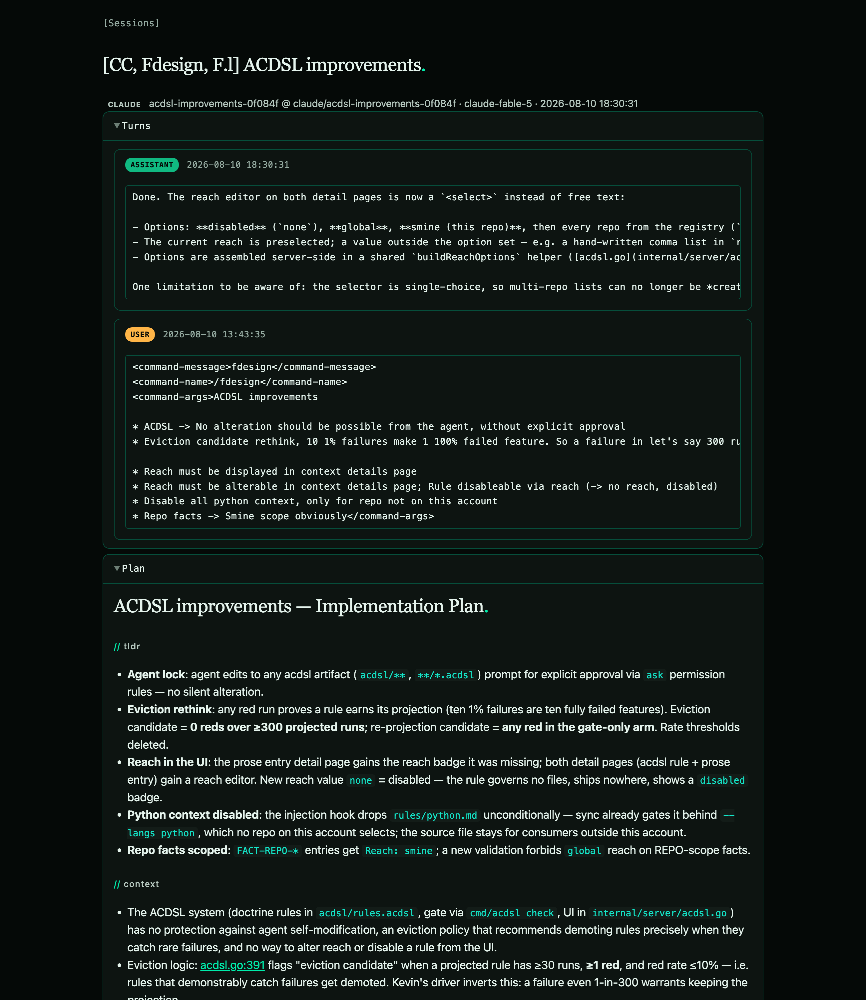

[← peek-mcp](../../README.md) · Use cases

# Model handoff

Let a cheap model review what an expensive one just built — without re-prompting the expensive model or copy-pasting context by hand.

## When

- An Opus or Fable session finishes a task and you want a quick second opinion, not another expensive turn.
- The review is mechanical (spot bugs, check the diff, sanity-check the plan) — exactly what a smaller model like Sonnet or GPT-5-mini does well and fast.
- Re-prompting the big model would burn tokens and minutes to reload context it already has on disk.

## Setup

Nothing beyond the [Quick start](../../README.md#quick-start): start `peek-mcp`, connect it to the reviewing client (Claude Chat with Sonnet, or Codex with GPT-5-mini). The reviewer reads the producing session straight from disk.

## Walkthrough

1. The expensive session runs its task and stops. peek-mcp has been watching its JSONL the whole time — nothing to trigger.

2. In the cheaper client, point it at the most recent session:

   > Use `session_get` to review what was just built and flag any issues.

3. The model calls the tool. One call returns one object — the recent turns, the plan, and the git diff against the inferred base branch (`turns` arrives as a serialized JSON array, shown parsed here for readability):

   ```json
   {
     "turns": [
       { "role": "assistant", "text": "Done. The reach editor on both detail pages is now a <select> instead of free text: ...", "timestamp": "2026-08-10T18:30:31Z" }
     ],
     "plan": "# ACDSL improvements — Implementation Plan\n## TLDR\n- Agent lock: agent edits to any acdsl artifact prompt for explicit approval ...",
     "diff": "diff --git a/internal/server/acdsl.go b/internal/server/acdsl.go\n@@ ...",
     "diff_target": "feature/agentic-dsl-finish",
     "has_more": true
   }
   ```

4. The reviewer now has the same context the builder had — turns, intent (plan), and the actual code change (diff) — and reviews it in one cheap pass. No re-prompt of the expensive model, no manual paste.

The dashboard shows the same session a human would read alongside the model:



## What to expect

- **One call is enough.** `session_get` returns turns + plan + diff by default; deselect sections with the boolean flags. If `has_more` is true, call again with the returned `request_id` for the next page.
- **The diff is precomputed** against an inferred base branch, refreshed on each new turn — the reviewer sees committed work without running git.
- **Omit `id`** to grab the most recent session, or pass `title` to target a specific one (see [tools](../tools.md)).
