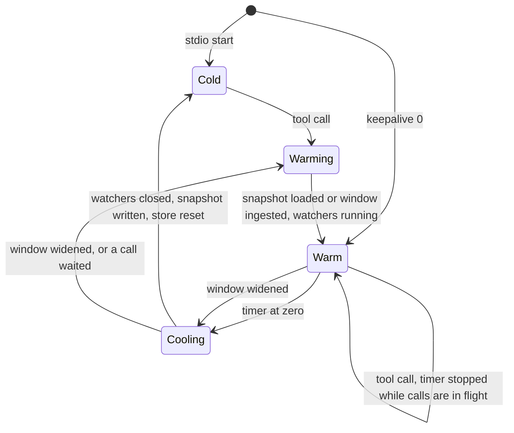

# Instance resource lifecycle — Implementation Plan

mode: `familiar`, target: `frontier`, stage: `code`, refuted: `no (plan-mode run)`

## TLDR

- **Fewer descriptors** — tool-results directories leave the watch set, and directories that aged out of the window are unwatched at every rescan.
- **Smaller stdio window** — stdio instances watch 3 days by default, the http daemon keeps 14, and one tool argument widens a running instance without a restart.
- **Warm and cold** — a stdio instance holds no watchers and no store until its first tool call and gives both back after one idle hour, keeping its store in one snapshot file.
- **Shared results** — uncommitted diff, session diff, diff base and plan revisions are computed by one instance and read from disk by the others.
- **Result** — an idle Claude session costs one small process instead of about 17,000 descriptors and 1 to 4 GB.

## Scope

- **In**
  - **Tool-results skip**
    - the transcript walk in `watcher/watcher.go` — [D1](#decisions)
  - **Stdio window**
    - transport default in `cmd/start.go`, flag text, `docs/reference.md` — [D2](#decisions)
  - **Lifecycle**
    - cold start, warm on first call, idle timer, cool-down — [D3](#decisions), [D4](#decisions), [D8](#decisions), [D9](#decisions), [D17](#decisions)
    - store snapshot per instance — [D6](#decisions), [D7](#decisions)
    - instance state in the instance record and stats — [D5](#decisions)
  - **Window widening**
    - `window_days` on `session_list` — [D10](#decisions)
  - **Watch expiry**
    - rescan removes aged-out directories — [D11](#decisions)
  - **Shared results**
    - freshness rule per result file — [D12](#decisions)
    - plan revision index from disk — [D13](#decisions)
    - unique temp files and their cleanup — [D14](#decisions), [D15](#decisions)
  - **Output token cap**
    - recommended and written tool-output cap of 50,000 tokens — [D19](#decisions)
- **Out**
  - **Other repository**
    - `cmd/sessions/main.go` and the launch line in `settings/claude_code/claude.json` — [D18](#decisions)
  - **Context blow-up**
    - result sizes of `session_list` and `session_get` — the request states no fix in this scope
- **Not changed**
  - **Http daemon**
    - warm from start, never cold, 14-day window — [D2](#decisions), [D4](#decisions)
  - **Hook reader**
    - the `cat` of `peek-diff` in the prompt hook — [D16](#decisions)
  - **Tool results**
    - result shapes of all three tools
  - **Vendored fsnotify**
    - no edit under `vendor/`

## Assumptions

| ID | Assumption | Reality (brief) | Reality [AGENT-ONLY] | Location [AGENT-ONLY] |
| :--- | :--- | :--- | :--- | :--- |
| A1 | the watcher already tracks a byte offset per transcript, so a reload reads only new lines | **Half true** — offsets exist, but only inside a single-use watcher and next to a stateful parser per file | `Watcher.files` holds offset plus parser per path. `Run` closes its loaded channel unguarded and owns the fsnotify handle as a local, so a watcher cannot run twice. A reload needs offsets and parser state restored into a new watcher. | [watcher/watcher.go:102](watcher/watcher.go:102)<br>[watcher/watcher.go:139](watcher/watcher.go:139) |
| A2 | a state dir with per-session files already exists (as the base for the store on disk) | **Not a store** — it holds diff base, diff snapshot, plan versions and telemetry only | No turns, events, usage, titles or counters are persisted. `hydrateFromState` restores diff base, the snapshot flag and plan revisions. A cold instance has nothing to load unless this plan writes it. | [session/store.go:536](session/store.go:536)<br>[state/dir.go:17](state/dir.go:17) |
| A3 | `awaitReady` already holds a tool call until the initial load completes | **One-shot** — the ready signal is a channel closed once | `MarkReady` is a bare close and panics on a second call. There is no reset. | [session/store.go:499](session/store.go:499)<br>[tools/tools.go:42](tools/tools.go:42) |
| A4 | closing the fsnotify watcher releases every descriptor it opened | **Holds** | `Close` snapshots all watches, internal ones included, and closes each descriptor. | [vendor/github.com/fsnotify/fsnotify/backend_kqueue.go:244](vendor/github.com/fsnotify/fsnotify/backend_kqueue.go:244) |
| A5 | the flag's changed state separates the default from an override, and the environment variable is the override path | **Holds** | `applyEnvFallbacks` sets the flag, which marks it changed. The key is not in the config file's editable set, so nothing else sets it. | [cmd/start.go:473](cmd/start.go:473)<br>[config/file.go:36](config/file.go:36) |
| A6 | a temp file named after its target plus a random part is harmless in the state dir | **Wrong in plan dirs** — a leftover is read as a plan version | The plan reader takes the name up to the first dot as the index. A leftover of the initial file parses as index 0. A name with a leading dot fails the parse and is skipped. | [state/dir.go:325](state/dir.go:325) |
| A7 | no code path reads tool-results files | **Holds for the watcher** | The Claude parser opens one tool-results file by its pointer path, without any watch. No transcript-shaped file exists under a tool-results directory on this machine (0 found). | [claude/parser.go:691](claude/parser.go:691)<br>[watcher/watcher.go:528](watcher/watcher.go:528) |
| A8 | `WatchList` returns exactly the paths peek added, and a removed directory is reported as created once by its parent | **Holds by reading** — not run | `WatchList` lists user watches only. `remove` clears the seen mark, and `sendCreateIfNew` emits one create and re-opens a single internal descriptor. A child added by peek is not removed with its parent. | [vendor/github.com/fsnotify/fsnotify/backend_kqueue.go:296](vendor/github.com/fsnotify/fsnotify/backend_kqueue.go:296)<br>[vendor/github.com/fsnotify/fsnotify/backend_kqueue.go:654](vendor/github.com/fsnotify/fsnotify/backend_kqueue.go:654) |
| A9 | a session diff file newer than the session's latest turn means the diff is current | **Not for clean trees** — an empty diff is never written | `persistSnapshot` skips empty output so the last real diff survives. For a clean tree the file never becomes newer than the turn, so every warm instance still computes. | [watcher/diff_watcher.go:190](watcher/diff_watcher.go:190) |
| A10 | tool calls are what an instance is used for, so the first call can start it | **Two more consumers** — dashboards and the prompt hook | Every instance runs a control server whose handlers read the store directly. The hook file is written by the diff watcher, which needs the store's session list. | [cmd/start.go:214](cmd/start.go:214)<br>[control/server.go:119](control/server.go:119)<br>[watcher/diff_watcher.go:233](watcher/diff_watcher.go:233) |

## Drivers

| ID | Origin | Observed | Wanted | Impact |
| :--- | :--- | :--- | :--- | :--- |
| R1 | "half of it is dead weight … 8,442 of the 16,850 descriptors per instance are tool-results files" | the walk collects every directory — [watcher/watcher.go:243](watcher/watcher.go:243) | tool-results directories are never watched | behavior-preserving |
| R2 | "stdio instances default to 3 days" | one default of 14 for every transport — [cmd/start.go:346](cmd/start.go:346) | 3 for stdio, 14 for http, explicit value wins | behavioral |
| R3 | "an instance loads and starts watching on its first tool call … at zero the instance goes cold" | watchers and ingestion start in the command body before any request — [cmd/start.go:114](cmd/start.go:114) | cold start, warm on call, cold after idle | behavioral |
| R4 | "how an interactive session running a mining skill reaches 14 days — a) restart-free widening through the lifecycle's reload path" | the window is fixed at process start — [cmd/start.go:71](cmd/start.go:71) | a running instance widens its window on request | contract-touching |
| R5 | "the rescan that adds directories also removes the ones whose newest descendant fell behind the cutoff" | the rescan only adds — [watcher/watcher.go:274](watcher/watcher.go:274) | watch set equals the window after every rescan | behavioral |
| R6 | "the file on disk is the result; an instance computes only when that file is older than its input" | every instance computes and writes on its own — [watcher/diff_watcher.go:251](watcher/diff_watcher.go:251) | one compute per input change machine-wide | behavioral |
| R7 | "the next index comes from the files on disk, not from the instance's own count" | index is the in-memory count — [session/store.go:221](session/store.go:221) | no instance overwrites another's revision | behavioral |
| R8 | "unique temp names in both atomic-write helpers" | fixed temp name per target — [state/dir.go:91](state/dir.go:91), [watcher/diff_watcher.go:446](watcher/diff_watcher.go:446) | concurrent writers never share a temp file | behavior-preserving |

## Decisions

| ID | Problem [AGENT-ONLY] | Decision [AGENT-ONLY] | Brief | Decision (brief) | Consequences | Why | Rejected | Facts [AGENT-ONLY] |
| :--- | :--- | :--- | :--- | :--- | :--- | :--- | :--- | :--- |
| D1 | Each watched tool-results directory costs one descriptor per file, and the watcher reads none of them. | `[USER]` The walk returns skip-dir for a directory named tool-results before collecting it. This covers a walk rooted at such a directory, which the create-event path produces. | **Dead descriptors** — half of an instance's descriptors watch files nobody reads. | **Skip them** — the walk never collects a tool-results directory. | **One left** — the parent's watch still holds a single descriptor for the directory itself. | **Reliable** — no reader depends on those watches. | **Filter in fsnotify** — vendored code is not edited. | [F11](#baseline-verified-agent-only)<br>[F12](#baseline-verified-agent-only)<br>[A7](#assumptions) |
| D2 | All transports share one 14-day default although a stdio instance serves one session. | `[USER]` When the transport is stdio and the window flag is unchanged, the window is 3 days. A flag or `PEEK_WATCH_WINDOW_DAYS` counts as changed and wins. Http keeps 14. | **One default** — stdio pays for 14 days it rarely needs. | **Three days** — stdio defaults to 3, an explicit value wins. | **Days 4 to 14** — a stdio instance no longer knows them until widened ([D10](#decisions)). | **Controllable** — the user steers it by flag or environment without touching the launch line. | **Flag in the launch line** — the request keeps the launch line flag-free. | [F9](#baseline-verified-agent-only)<br>[F10](#baseline-verified-agent-only)<br>[A5](#assumptions) |
| D3 | Every instance pays watchers and a full store at spawn. 25 of 43 recorded instances never served a call. | `[USER]` An instance starts cold. The first tool call warms it: restore or ingest, then watch. A timer starts when the last call in flight ends. At zero the instance cools: watchers closed, store written to disk, memory freed. The next call warms it again. | **Paid unused** — cost is charged at spawn and never released. | **Warm on demand** — load on first call, release after idle. | **First call waits** — it blocks on the load, as calls during startup do today. | **Reliable** — cost follows use. | — | [F1](#baseline-verified-agent-only)<br>[F2](#baseline-verified-agent-only) |
| D4 | The timer length is open. The http daemon serves the dashboard and must stay loaded. | `[USER]` The keepalive is one hour, controlled by `PEEK_CACHE_KEEPALIVE_SEC`, a whole number of seconds. The variable is the fallback of a new flag `--cache-keepalive-sec`, as every other setting has both. Default by transport: 3600 for stdio, 0 for http. 0 switches the lifecycle off: warm at start, never cold. Deliberate deviation from data-integrity rule 2: the timer moves a cache state, every transition is lossless and re-derivable from the transcripts. | **Timer length** — open in the request. | **One hour** — set by `PEEK_CACHE_KEEPALIVE_SEC` in seconds, 0 turns the lifecycle off. | **Daemon unchanged** — http defaults to off.<br>**Held an hour** — one call keeps an instance's full cost for 3600 seconds. | **Controllable** — one setting, with an off position that restores today's behavior. | **15 minutes** — the planner's first value, replaced at the design gate.<br>**Constant without setting** — no off switch for debugging. | [F26](#baseline-verified-agent-only)<br>[F9](#baseline-verified-agent-only) |
| D5 | The request asks whether an instance with a control server ever goes cold. Every instance has one, so an exemption would exempt all. | Stdio instances go cold regardless of their control server. Control requests neither warm an instance nor reset its timer. A cold instance's dashboard lists no sessions. The instance record gains a state field (cold, warming, warm) and the stats response lists it per instance. | **Control server** — it runs on every instance. | **No exemption** — only tool calls drive the lifecycle. | **Empty when cold** — a stdio instance's dashboard shows no sessions; the daemon's dashboard is the live one. | **Debuggable** — stats shows which instance is cold, and a forgotten browser tab cannot pin an instance warm. | **Control requests warm** — an open event stream would hold the instance warm forever.<br>**Exempt control instances** — nothing would ever go cold. | [F7](#baseline-verified-agent-only)<br>[F22](#baseline-verified-agent-only)<br>[A10](#assumptions) |
| D6 | The request leaves open whether the store cache is one file set per instance or one shared between instances. | One snapshot file per instance beside its instance record. Written at cool-down. Deleted after a successful load, at process exit, and by the state GC once its process is gone. | **Cache layout** — open in the request. | **Per instance** — one file, read only by the process that wrote it. | **First warm-up ingests** — a new instance cannot start from a peer's snapshot. | **Reliable** — same process and binary on both sides, so no format version, no config fingerprint and no pruning rule. | **Shared snapshot** — every instance would load and rewrite it, so it only grows; pruning needs to know which transcript files fed a session, and turns are filed by their own session id. | [F22](#baseline-verified-agent-only)<br>[F5](#baseline-verified-agent-only) |
| D7 | The cold transition writes the store to disk and the warm transition loads it. Nothing of a session's turns, events or usage is on disk today, parsers carry pending state per file, and sessions hold pointer links a plain encoder flattens. | The snapshot holds every session with turn and event buffers, subagents, counters and usage, the title index, and per transcript file its offset plus the parser's pending state. Pointer links (active skills, per-request usage targets) are written as keys and re-linked on load. Encoding is gob through explicit snapshot types in the session package. A snapshot that fails to load is deleted and the instance warms by full ingest. | **Store on disk** — the store has no serial form. | **Full snapshot** — sessions, offsets and parser state in one file. | **Size** — new encode and decode for session, subagent, both buffers, usage links and both parsers, estimated 400 to 600 lines plus tests; the parser interface gains state export and import. | **Reliable** — a warm-up after idle loads one file and reads only new lines instead of parsing the window (1.03 GB in 3 days). | **Re-ingest on warm-up** — planner's disagreement, stated once: it needs none of this surface and is always exact, at one full window parse per warm-up; not chosen because the request decides the store is written to disk.<br>**JSON** — the session's JSON tags hide most fields. | [F3](#baseline-verified-agent-only)<br>[F4](#baseline-verified-agent-only)<br>[F5](#baseline-verified-agent-only)<br>[F6](#baseline-verified-agent-only)<br>[A1](#assumptions)<br>[A2](#assumptions) |
| D8 | The request leaves open what the diff watcher does while cold, and what exactly stops. | Warm set: the Claude, Cowork and Codex transcript watchers, the plan watcher, the Codex index watcher and the diff watcher, built new for every warm period under one context. Cool-down order: cancel that context, wait for every watcher to return, write the snapshot, reset the store, return memory to the OS. Process-level and untouched: MCP server, control server, state GC, invocation counter, telemetry store. | **Cold set** — what stops is undefined. | **All watchers** — the diff watcher included. | **Hot reload** — the hook file is refreshed only by a warm instance: the daemon, or a stdio instance inside its keepalive; `docs/reference.md` says so. | **Reliable** — a cold instance runs no timers against the store and no git processes. | **Diff polling while cold** — its repo list comes from the store; polling the process's own directory has no activity signal and would run a diff every interval for every open session. | [F23](#baseline-verified-agent-only)<br>[F24](#baseline-verified-agent-only)<br>[F1](#baseline-verified-agent-only)<br>[A4](#assumptions) |
| D9 | The ready signal is one-shot, and a call must neither start on a cold store nor be cut off by a cool-down. | The store gains a reset that clears sessions, title index and diff cache and re-arms the ready signal. `awaitReady` first acquires the lifecycle, which starts a warm-up when cold and counts the call as in flight, then waits on the ready signal with the existing 2-minute timeout, runs the handler and releases. The timer starts when the in-flight count returns to zero. A call arriving during cool-down waits for it, then warms. A warm-up runs on the process context, so a cancelled call does not abort it. | **One-shot ready** — the signal cannot fire twice. | **Re-armed** — the store resets its signal; the lifecycle owns state and timer. | **Same timeout** — a slow warm-up answers with the existing load-pending error and keeps loading. | **Debuggable** — one readiness signal, one state owner. | **Readiness in the lifecycle only** — three consumers read the store's signal today.<br>**MCP before-call hook** — it cannot hold a call or run after it. | [F2](#baseline-verified-agent-only)<br>[F8](#baseline-verified-agent-only)<br>[F27](#baseline-verified-agent-only)<br>[A3](#assumptions) |
| D10 | An interactive session running a mining skill needs 14 days and has no environment lever. | `session_list` gains an integer argument `window_days`, at least 1. A value above the instance's current window reloads the instance inside that call: cool-down, then warm-up with the wider window, which ingests the added days from offset zero. The wider window stays for the rest of the process. A smaller or equal value changes nothing. | **Widening** — the window is fixed at process start. | **One argument** — `window_days` on `session_list` widens the instance. | **Contract** — tool schema and tool docs change; the widening call waits for the added days (3.5 GB at 14) and may answer load-pending; the mining skills pass the argument from their own repository. | **Controllable** — the caller that needs the days asks for them. | **Mining only from routine runs** — interactive sessions would lose mining.<br>**Window per call** — a follow-up read by id after a cold period would miss the session.<br>**Argument on every tool** — mining lists first. | [F25](#baseline-verified-agent-only)<br>[F6](#baseline-verified-agent-only)<br>[F27](#baseline-verified-agent-only) |
| D11 | Watches only grow. A directory that aged out keeps its descriptor and one per child until the process exits. | `[USER]` The rescan removes every directory peek added whose newest descendant is behind the cutoff. The always-watched exemption moves from the walk root to the agent directory, so the create event that follows a removal does not re-add the directory. Per-file offsets stay. | **Watch drift** — nothing leaves the watch set. | **Expire** — the rescan removes what left the window. | **Five minutes** — a write into an expired directory is picked up at the next rescan, as for any cold directory today. | **Reliable** — the watch set equals the window after every rescan. | **Remove parent-held paths too** — the parent would report them as new on each change. | [F13](#baseline-verified-agent-only)<br>[F11](#baseline-verified-agent-only)<br>[A8](#assumptions) |
| D12 | Every warm instance computes the same diffs and writes the same files. | `[USER]` The file on disk is the result: an instance computes only when the file is older than its input, otherwise it reads the file into its store. Rules per file are in the table below. The git dir is resolved once per directory per warm period. An unchanged uncommitted diff advances the file's timestamp without a rewrite. | **Same work N times** — one diff per instance per interval. | **File is the result** — compute only when the file is older than its input. | **Clean trees** — an empty session diff is never written, so warm instances still compute it on each turn; a diff over 5 MB reaches readers truncated. | **Reliable** — no owner and no lease; any instance may compute and all read the same file. | **Owner or lease** — the request excludes it.<br>**Daemon computes for all** — instances stay standalone. | [F15](#baseline-verified-agent-only)<br>[F16](#baseline-verified-agent-only)<br>[F17](#baseline-verified-agent-only)<br>[A9](#assumptions) |
| D13 | A revision's index is the instance's in-memory count, so an instance that missed an edit overwrites a file another instance wrote. | `[USER]` Before recording a revision of a persisted session, the store reads the latest plan and the versions from disk. Equal content means already recorded: the store adopts the versions beyond its own count, emits their events and writes nothing. Otherwise the previous content is the latest on disk and the index is the highest on disk plus one. | **Index clash** — two instances write different diffs under one index. | **Disk decides** — index and previous content come from the files. | **Classification** — two instances that classify one revision differently still write two files under one index, as today. | **Reliable** — an instance that missed an edit appends instead of overwriting. | **Keep in-memory count** — it is the defect. | [F18](#baseline-verified-agent-only) |
| D14 | Both atomic-write helpers use one fixed temp name per target, so two instances share a temp file. | Both helpers create a unique temp file in the target's directory, named with a leading dot, then rename. The hook file keeps mode 0644. Deliberate deviation from the pasted diff, which names the temp file after the target without the dot. | **Shared temp** — concurrent writers collide. | **Unique, dotted** — a random temp name with a leading dot. | **Leftovers** — a crash leaves a stray temp file, never a torn target. | **Reliable** — a leftover is invisible to every directory reader. | **Pattern from the request** — a leftover of the initial plan file is read as plan version 0.<br>**Filter in the plan reader** — every directory reader would need the same filter. | [F19](#baseline-verified-agent-only)<br>[A6](#assumptions) |
| D15 | The request leaves open whether the state GC removes stray temp files. | The state GC removes files ending in the temp suffix that are older than one hour, anywhere under the state root, and snapshot files whose process is gone. Temp files in git dirs are not swept. | **Stray files** — crashes leave temp files and snapshots. | **GC sweeps** — temp files after one hour, snapshots of dead processes. | **Git dirs** — one small stray file per crash stays inside the git dir. | **Reliable** — leftovers have a bounded life without a new pass. | **Sweep git dirs** — the GC has no list of repos. | [F20](#baseline-verified-agent-only)<br>[F22](#baseline-verified-agent-only) |
| D16 | The request leaves open the reader side of the hook file outside peek-mcp. | No reader change. The only reader is the prompt hook, which prints the file. Rename keeps it whole, and timestamp-only updates are invisible to it. | **Hook reader** — it reads a file peek now touches more often. | **Unchanged** — content and path stay as they are. | **None** — the hook snippet and its docs stay. | **Reliable** — the reader sees whole files only. | — | [F21](#baseline-verified-agent-only) |
| D17 | The lifecycle is called by the tool handlers and wired by the start command. | A `Lifecycle` type in the tools package beside the invocation counter. The start command hands it two functions, warm-up and cool-down, which hold the watcher wiring that runs inline today. | **Home** — where the lifecycle type lives. | **Tools package** — beside the other instance-scoped helper. | **Start command** — its watcher block moves into two functions. | **Debuggable** — state machine and wiring are separate and testable without watchers. | **New package** — one type does not need one.<br>**Session package** — it would import the watchers that import it. | [F8](#baseline-verified-agent-only) |
| D18 | Two entries of the request change files of another repository. | Not part of this plan: the explicit window flag in `sessions pending` and the launch line. This plan keeps the flag and the environment variable they rely on. | **Other repo** — out of this worktree's reach. | **Left out** — changed where those files live. | **Until then** — `sessions pending` sees 3 days. | **Reliable** — one plan, one repository. | — | [A5](#assumptions) |
| D19 | The tool-output cap peek recommends and writes is 125,000 tokens, which lets one result fill a large share of a session's context. | `[USER]` The value becomes 50,000 tokens wherever peek states it: the startup warning's recommended minimum, the Claude Code server env that `setup` writes, the Codex output limit that `setup` writes, and the bundle manifest's env. `setup` reads the start command's constant instead of its own literals. | **Cap too high** — one result may take 125,000 tokens. | **Fifty thousand** — one constant, used by the warning and by `setup`. | **Large lists** — a `session_list` above about 200 KB, as with `window_days` 14 on this machine (305 to 320 KB today), exceeds the cap and is refused by the client; existing installs keep 125,000 until `setup` runs again or their launch line changes. | **Controllable** — one constant decides what peek recommends and writes. | **Warning only** — `setup` would keep writing the old value. | [D10](#decisions)<br>[D18](#decisions) |

### Lifecycle



- **Warming** — calls wait on the ready signal, up to 2 minutes each ([D9](#decisions))
- **Cooling** — calls wait for cold, then warm ([D9](#decisions))
- **Keepalive 0** — no timer, the only way out of warm is a widening reload ([D4](#decisions), [D10](#decisions))

### Shared result rules

| Result | File | Fresh when | Fresh: instance does | Stale: instance does |
| :--- | :--- | :--- | :--- | :--- |
| uncommitted diff | hook file in the git dir | newer than now minus the poll interval | reads it, updates its sessions on change | computes; writes on change, else advances the timestamp |
| session diff | diff snapshot | newer than the session's latest turn | reads it as the live diff | computes; writes when non-empty and changed, advances the timestamp when non-empty and unchanged |
| diff base | diff base | present | reads and pins it | computes, pins, writes |
| plan revision | latest plan and numbered files | latest equals the current plan | adopts the versions from disk | writes the next index from disk |

## Open questions

N/A — fdesign decides every question

## Changes

| File | Kind | Entry |
| :--- | :--- | :--- |
| `watcher/watcher.go` | modified | [Watch set](#watch-set-modified)<br>[Watcher file states](#watcher-file-states-modified) |
| `watcher/watcher_test.go` | modified | [Watch set](#watch-set-modified)<br>[Watcher file states](#watcher-file-states-modified) |
| `cmd/start.go` | modified | [Stdio window](#stdio-window-modified)<br>[Start command wiring](#start-command-wiring-modified) |
| `cmd/start_test.go` | modified | [Stdio window](#stdio-window-modified)<br>[Start command wiring](#start-command-wiring-modified) |
| `docs/reference.md` | modified | [Stdio window](#stdio-window-modified)<br>[Docs](#docs-modified) |
| `cmd/setup.go` | modified | [Output token cap](#output-token-cap-modified) |
| `mcpb/manifest.json` | modified | [Output token cap](#output-token-cap-modified) |
| `state/dir.go` | modified | [State temp files](#state-temp-files-modified)<br>[Shared diff results](#shared-diff-results-modified)<br>[Instance store file](#instance-store-file-modified) |
| `state/dir_test.go` | modified | [State temp files](#state-temp-files-modified)<br>[Shared diff results](#shared-diff-results-modified)<br>[Instance store file](#instance-store-file-modified) |
| `watcher/diff_watcher.go` | modified | [Hook file temp](#hook-file-temp-modified)<br>[Shared diff results](#shared-diff-results-modified) |
| `watcher/diff_watcher_test.go` | modified | [Shared diff results](#shared-diff-results-modified) |
| `watcher/diff_watcher_pin_test.go` | modified | [Shared diff results](#shared-diff-results-modified) |
| `session/store.go` | modified | [Plan revisions from disk](#plan-revisions-from-disk-modified)<br>[Store snapshot](#store-snapshot-new) |
| `session/store_events_test.go` | modified | [Plan revisions from disk](#plan-revisions-from-disk-modified) |
| `watcher/parser.go` | modified | [Parser state](#parser-state-modified) |
| `claude/parser.go` | modified | [Parser state](#parser-state-modified) |
| `claude/parser_test.go` | modified | [Parser state](#parser-state-modified) |
| `codex/parser.go` | modified | [Parser state](#parser-state-modified) |
| `codex/parser_test.go` | modified | [Parser state](#parser-state-modified) |
| `session/store_snapshot.go` | created | [Store snapshot](#store-snapshot-new) |
| `session/store_snapshot_test.go` | created | [Store snapshot](#store-snapshot-new) |
| `session/turn_buffer.go` | modified | [Store snapshot](#store-snapshot-new) |
| `session/event_buffer.go` | modified | [Store snapshot](#store-snapshot-new) |
| `session/snapshot_cache.go` | modified | [Store snapshot](#store-snapshot-new) |
| `session/store_test.go` | modified | [Store snapshot](#store-snapshot-new) |
| `tools/lifecycle.go` | created | [Lifecycle](#lifecycle-new) |
| `tools/lifecycle_test.go` | created | [Lifecycle](#lifecycle-new) |
| `tools/invocations.go` | modified | [Instance state](#instance-state-modified) |
| `tools/invocations_test.go` | modified | [Instance state](#instance-state-modified) |
| `tools/tools.go` | modified | [Tool wiring](#tool-wiring-modified) |
| `tools/tools_test.go` | modified | [Tool wiring](#tool-wiring-modified) |
| `cmd/warm.go` | created | [Warm set](#warm-set-new) |
| `cmd/warm_test.go` | created | [Warm set](#warm-set-new) |
| `control/process_unix.go` | modified | [Start command wiring](#start-command-wiring-modified) |
| `control/process_windows.go` | modified | [Start command wiring](#start-command-wiring-modified) |
| `control/stats.go` | modified | [Start command wiring](#start-command-wiring-modified) |
| `control/api_test.go` | modified | [Start command wiring](#start-command-wiring-modified) |
| `docs/tools.md` | modified | [Docs](#docs-modified) |

- **Phases**
  - 1: descriptors, stdio window, temp files — no dependency on later phases
  - 2: shared results
  - 3: serial form of store, parsers and watcher positions
  - 4: lifecycle and its wiring
- **After every phase** the build is green and the binary behaves as before plus that phase

### Watch set (modified)

location: `watcher/watcher.go`, `watcher/watcher_test.go`
mirrors: `TestWalkAndWatch_WatchPruning` for both new tests
phase: 1

- **Decisions** — [D1](#decisions), [D11](#decisions)
- **Deviation from the pasted diff**
  - the three-clause condition becomes a named predicate, as the style guide allows one boolean operator per condition
  - the constant block is shown as gofmt aligns it

```diff
 const (
-	agentFilePrefix  = "agent-"
-	metaJsonSuffix   = ".meta.json"
-	subagentsDirName = "subagents"
-	journalFileName  = "journal.jsonl"
+	agentFilePrefix    = "agent-"
+	metaJsonSuffix     = ".meta.json"
+	subagentsDirName   = "subagents"
+	journalFileName    = "journal.jsonl"
+	toolResultsDirName = "tool-results"
 )
```

```diff
 func (w *Watcher) walkAndWatch(watcher *fsnotify.Watcher, root string) {
 	// ...
 		recordModTime(newest, path, entry, info)
 
 		if entry.IsDir() {
+			if entry.Name() == toolResultsDirName {
+				return filepath.SkipDir
+			}
 			dirs = append(dirs, path)
 			return nil
 		}
 	// ...
+	added := make(map[string]struct{})
+	for _, dir := range watcher.WatchList() {
+		added[dir] = struct{}{}
+	}
+
 	for _, dir := range dirs {
-		if dir != root && !cutoff.IsZero() && newest[dir].Before(cutoff) {
+		isExpired := dir != w.agentDir && !cutoff.IsZero() && newest[dir].Before(cutoff)
+		if isExpired {
+			w.unwatchExpired(watcher, added, dir)
 			continue
 		}
 		if err := watcher.Add(dir); err != nil {
 			slog.Warn("walkAndWatch: watcher.Add", "path", dir, "err", err)
 		}
 	}
```

```go
func (w *Watcher) unwatchExpired(watcher *fsnotify.Watcher, added map[string]struct{}, dir string) {
	if _, isAdded := added[dir]; !isAdded {
		return
	}

	if err := watcher.Remove(dir); err != nil {
		slog.Warn("Watcher.unwatchExpired: Failed to remove watch", "path", dir, "err", err)
	}
}
```

- **Placement** — the new function follows the walk function

### Stdio window (modified)

location: `cmd/start.go`, `cmd/start_test.go`, `docs/reference.md`
mirrors: `TestApplyConfigFileFallbacks` for the new test
phase: 1

- **Decision** — [D2](#decisions)
- **Deviation from the pasted diff**
  - the transport check moves into one helper, because the keepalive in phase 4 takes its default the same way
  - the helper keeps the condition to one named predicate

```diff
-const recommendedMaxOutputTokens = 125_000
+const (
+	recommendedMaxOutputTokens = 50_000
+	stdioWatchWindowDays       = 3
+)
```

- **Token value** — the new value is [D19](#decisions); its other uses are in [Output token cap](#output-token-cap-modified)

```diff
 	Run: func(cmd *cobra.Command, args []string) {
 		// ...
 		backLink, _ := flags.GetString("back-link")
-		watchWindowDays, _ := flags.GetInt("watch-window-days")
+		watchWindowDays := intFlagForTransport(flags, "watch-window-days", stdioWatchWindowDays, transport)
 		watchWindow := time.Duration(watchWindowDays) * 24 * time.Hour
```

```diff
 func init() {
 	// ...
-	flags.Int("watch-window-days", 14, "How far back peek ingests transcripts and watches directories for live activity (0 = everything; macOS holds one fd per watched file)")
+	flags.Int("watch-window-days", 14, "How far back peek ingests transcripts and watches directories for live activity (0 = everything; stdio defaults to 3; macOS holds one fd per watched file)")
```

```go
// intFlagForTransport reads an int flag whose default differs for stdio:
// left unset by flag and environment, it yields stdioValue there.
func intFlagForTransport(flags *pflag.FlagSet, name string, stdioValue int, transport string) int {
	value, _ := flags.GetInt(name)
	isStdioDefault := transport == "stdio" && !flags.Changed(name)
	if isStdioDefault {
		return stdioValue
	}
	return value
}
```

- **Import** — `github.com/spf13/pflag`, already vendored through cobra
- **Docs row** in the flag table, final content

```markdown
| `--watch-window-days` | `14` (http), `3` (stdio) | How far back peek ingests transcripts and watches directories for live activity (0 = everything). A stdio instance serves one session and defaults to 3 days unless the flag or `PEEK_WATCH_WINDOW_DAYS` is set. macOS holds one fd per watched directory and file, so cold projects outside the window are neither read nor watched; a cold project turning active is picked up within 5 minutes, and a directory that aged out of the window is unwatched at the same rescan. Directories named `tool-results` are never watched |
```

### Output token cap (modified)

location: `cmd/setup.go`, `mcpb/manifest.json`
phase: 1

- **Decision** — [D19](#decisions)
- **Constant** — set in [Stdio window](#stdio-window-modified); both setup paths read it

```diff
 		servers["peek-mcp"] = map[string]any{
 			"type":    "stdio",
 			"command": binPath,
 			"args":    mcpArgs(controlServer),
 			"env": map[string]any{
-				"MAX_MCP_OUTPUT_TOKENS": "125000",
+				"MAX_MCP_OUTPUT_TOKENS": strconv.Itoa(recommendedMaxOutputTokens),
 			},
 		}
```

```diff
 func setupCodex(p *prompter, controlServer bool) error {
 	// ...
-	block := fmt.Sprintf("tool_output_token_limit = 125000\n[mcp_servers.peek-mcp]\ncommand = %q\nargs = [%s]\n",
-		binPath, strings.Join(quoted, ", "))
+	block := fmt.Sprintf(
+		"tool_output_token_limit = %d\n[mcp_servers.peek-mcp]\ncommand = %q\nargs = [%s]\n",
+		recommendedMaxOutputTokens,
+		binPath,
+		strings.Join(quoted, ", "),
+	)
```

- **Bundle manifest** — env block, final content

```json
{
  "MAX_MCP_OUTPUT_TOKENS": "50000"
}
```

### State temp files (modified)

location: `state/dir.go`, `state/dir_test.go`
mirrors: `TestDirReadWrite`, `TestGc` for the new cases
phase: 1

- **Decisions** — [D14](#decisions), [D15](#decisions)
- **Deviation from the pasted diff**
  - the temp name gets a leading dot ([D14](#decisions))
  - the body takes a write function, because the store snapshot in phase 3 streams into the same helper instead of building one string
- **Removed** — the file permission constant, as a created temp file is already 0600

```diff
 	initialFile     = "000.md"
 
-	dirPerm  = 0o700
-	filePerm = 0o600
+	dirPerm = 0o700
+
+	tempSuffix = ".tmp"
+	tempMaxAge = time.Hour
```

```go
func (d *Dir) pruneTemps(cutoff time.Time) {
	filepath.WalkDir(d.root, func(path string, entry fs.DirEntry, err error) error {
		isTemp := err == nil && !entry.IsDir() && strings.HasSuffix(entry.Name(), tempSuffix)
		if !isTemp {
			return nil
		}

		info, err := entry.Info()
		isStale := err == nil && info.ModTime().Before(cutoff)
		if isStale {
			os.Remove(path)
		}
		return nil
	})
}

func (d *Dir) writeFile(path, content string) error {
	return d.writeStream(path, func(writer io.Writer) error {
		_, err := io.WriteString(writer, content)
		return err
	})
}

// writeStream writes through a unique dot-named temp file beside the target and renames it over the target.
func (d *Dir) writeStream(path string, write func(writer io.Writer) error) error {
	dir := filepath.Dir(path)
	if err := os.MkdirAll(dir, dirPerm); err != nil {
		return errors.Wrap(err, "Dir.writeStream: Failed to create state directory")
	}

	file, err := os.CreateTemp(dir, "."+filepath.Base(path)+".*"+tempSuffix)
	if err != nil {
		return errors.Wrap(err, "Dir.writeStream: Failed to create temp file")
	}

	tmp := file.Name()
	buffered := bufio.NewWriter(file)
	err = write(buffered)
	if err == nil {
		err = buffered.Flush()
	}
	if closeErr := file.Close(); err == nil {
		err = closeErr
	}
	if err != nil {
		os.Remove(tmp)
		return errors.Wrap(err, "Dir.writeStream: Failed to write temp file")
	}

	if err := os.Rename(tmp, path); err != nil {
		os.Remove(tmp)
		return errors.Wrap(err, "Dir.writeStream: Failed to rename temp file")
	}
	return nil
}
```

```diff
 func (d *Dir) Gc(retention, snapshotRetention time.Duration) {
+	d.pruneTemps(time.Now().Add(-tempMaxAge))
+
 	agentDirs, err := os.ReadDir(d.root)
 	if err != nil {
 		return
 	}
```

- **Replaces** — the write helper at [state/dir.go:86](state/dir.go:86)
- **Legacy leftovers** — a fixed-name temp file of an older binary ends in the same suffix and is swept too

### Hook file temp (modified)

location: `watcher/diff_watcher.go`
phase: 1

- **Decision** — [D14](#decisions)

```go
const hookFilePerm = 0o644

func writeFileAtomic(path, content string) error {
	file, err := os.CreateTemp(filepath.Dir(path), "."+filepath.Base(path)+".*.tmp")
	if err != nil {
		return errors.Wrap(err, "writeFileAtomic: Failed to create temp file")
	}

	tmp := file.Name()
	_, err = file.WriteString(content)
	if closeErr := file.Close(); err == nil {
		err = closeErr
	}
	if err == nil {
		err = os.Chmod(tmp, hookFilePerm)
	}
	if err == nil {
		err = os.Rename(tmp, path)
	}
	if err != nil {
		os.Remove(tmp)
		return errors.Wrap(err, "writeFileAtomic: Failed to write file")
	}
	return nil
}
```

- **Replaces** — the function at [watcher/diff_watcher.go:445](watcher/diff_watcher.go:445)
- **Import** — the file switches from the standard errors package to `github.com/pkg/errors`, which offers the same `Is` and `As`

### Shared diff results (modified)

location: `watcher/diff_watcher.go`, `watcher/diff_watcher_test.go`, `watcher/diff_watcher_pin_test.go`, `state/dir.go`, `state/dir_test.go`
mirrors: `TestRefresh_PinAndSnapshot` for the new cases
hot: Goroutines, channels, and locking; Validation, transaction, and guard logic
phase: 2

- **Decision** — [D12](#decisions)
- **Compared against the file** — whether a result is unchanged is decided against the file's content, never against this instance's memory, so a timestamp is only advanced over content that is current

```diff
 type DiffWatcher struct {
 	// ...
 	baseMu    sync.Mutex
 	baseByKey map[diffBaseKey]string
+
+	gitDirMu    sync.Mutex
+	gitDirByCwd map[string]string
 }
```

```diff
 func NewDiffWatcher(store *session.Store, broker *events.Broker, interval, window time.Duration, stateDir *state.Dir) *DiffWatcher {
 	return &DiffWatcher{
 		// ...
-		dirty:     make(map[session.Id]string),
-		baseByKey: make(map[diffBaseKey]string),
+		dirty:       make(map[session.Id]string),
+		baseByKey:   make(map[diffBaseKey]string),
+		gitDirByCwd: make(map[string]string),
 	}
 }
```

```go
const hookFileName = "peek-diff"

// pollRepo keeps one repo's hook file and the sessions sharing that directory current.
func (w *DiffWatcher) pollRepo(ctx context.Context, cwd string) {
	defer w.polling.Delete(cwd)

	gitDir, ok := w.resolveGitDir(ctx, cwd)
	if !ok {
		return
	}

	output, ok := w.uncommittedDiff(ctx, cwd, filepath.Join(gitDir, hookFileName))
	if !ok {
		return
	}

	if prev, ok := w.lastDiff.Load(gitDir); ok && prev.(string) == output {
		return // unchanged since last tick — no store churn
	}
	w.lastDiff.Store(gitDir, output)

	truncated := state.Truncate(output)
	for _, sess := range w.store.List() {
		if sess.Meta.CWD == cwd {
			w.store.UpdateUncommittedDiff(sess.Meta.SessionId, truncated)
		}
	}
	slog.Debug("DiffWatcher: refreshed uncommitted diff", "cwd", cwd, "bytes", len(output))
}

func (w *DiffWatcher) resolveGitDir(ctx context.Context, cwd string) (string, bool) {
	w.gitDirMu.Lock()
	gitDir, isKnown := w.gitDirByCwd[cwd]
	w.gitDirMu.Unlock()
	if isKnown {
		return gitDir, true
	}

	if !gitReady(ctx, cwd) {
		return "", false
	}

	gitDir, err := gitOutput(ctx, cwd, "rev-parse", "--absolute-git-dir")
	if err != nil {
		return "", false
	}

	w.gitDirMu.Lock()
	w.gitDirByCwd[cwd] = gitDir
	w.gitDirMu.Unlock()
	return gitDir, true
}

// uncommittedDiff returns the hook file's content when an instance refreshed it within the
// last interval; otherwise it computes git diff HEAD and publishes it to the hook file.
func (w *DiffWatcher) uncommittedDiff(ctx context.Context, cwd, hookPath string) (string, bool) {
	existing, modTime, hasFile := readHookFile(hookPath)
	isFresh := hasFile && time.Since(modTime) < w.interval
	if isFresh {
		return existing, true
	}

	if !gitReady(ctx, cwd) {
		return "", false
	}

	output, err := gitDiff(ctx, cwd, "HEAD")
	if err != nil {
		logDiffErr(cwd, "git diff HEAD", err)
		return "", false
	}

	isUnchanged := hasFile && existing == output
	publishHookFile(isUnchanged, output, hookPath)
	return output, true
}

func publishHookFile(isUnchanged bool, output, path string) {
	if isUnchanged {
		now := time.Now()
		if err := os.Chtimes(path, now, now); err != nil {
			slog.Warn("publishHookFile: Failed to advance timestamp", "path", path, "err", err)
		}
		return
	}

	if err := writeFileAtomic(path, output); err != nil {
		slog.Warn("publishHookFile: Failed to write hook file", "path", path, "err", err)
	}
}

func readHookFile(path string) (content string, modTime time.Time, ok bool) {
	info, err := os.Stat(path)
	if err != nil {
		return "", modTime, false
	}

	data, err := os.ReadFile(path)
	if err != nil {
		return "", modTime, false
	}
	return string(data), info.ModTime(), true
}
```

- **Replaces** — the poll function at [watcher/diff_watcher.go:251](watcher/diff_watcher.go:251)
- **Session diff and diff base**

```diff
 func (w *DiffWatcher) refresh(ctx context.Context, id session.Id, cwd string) {
 	// ...
 		base = pinnedBase
 		target = pinnedTarget
 	}
 
+	existing, isFresh := w.readSnapshot(sess)
+	if isFresh {
+		w.store.UpdateDiff(id, target, existing)
+		w.store.MarkSnapshotPersisted(id, existing)
+		return
+	}
+
 	output, err := gitDiff(ctx, cwd, base)
 	if err != nil {
 		logDiffErr(string(id), "git diff", err)
 		w.store.MarkDiffSnapshot(id)
 		return
 	}
 
-	previous := sess.DiffOutput
 	w.store.UpdateDiff(id, target, output)
-	w.persistSnapshot(output, previous, sess)
+	w.persistSnapshot(output, existing, sess)
 	slog.Debug("DiffWatcher: refreshed diff", "session", id, "base", base, "bytes", len(output))
 }
```

```diff
 func (w *DiffWatcher) pinBase(ctx context.Context, cwd string, id session.Id) (sha, target string, ok bool) {
+	if base, isPinned := w.readBase(id); isPinned {
+		w.store.PinDiffBase(id, base.Sha, base.Target)
+		return base.Sha, base.Target, true
+	}
+
 	target = w.diffBase(ctx, cwd)
```

```go
// Empty outputs never overwrite the snapshot: an empty live diff is served
// live, but the last real work is retained for post-cleanup analysis.
func (w *DiffWatcher) persistSnapshot(output, previous string, sess *session.Session) {
	if w.stateDir == nil || output == "" {
		return
	}

	isUnchanged := state.Truncate(output) == previous
	if err := w.publishSnapshot(isUnchanged, output, sess); err != nil {
		slog.Warn("DiffWatcher.persistSnapshot: Failed to write snapshot", "session", sess.Meta.SessionId, "err", err)
		return
	}

	w.store.MarkSnapshotPersisted(sess.Meta.SessionId, output)
}

func (w *DiffWatcher) publishSnapshot(isUnchanged bool, output string, sess *session.Session) error {
	agent := string(sess.Agent)
	id := string(sess.Meta.SessionId)
	if isUnchanged {
		return w.stateDir.TouchDiffSnapshot(agent, id)
	}
	return w.stateDir.WriteDiffSnapshot(agent, output, id)
}

func (w *DiffWatcher) readBase(id session.Id) (state.DiffBase, bool) {
	var base state.DiffBase
	if w.stateDir == nil {
		return base, false
	}

	sess, ok := w.store.GetById(id)
	if !ok {
		return base, false
	}
	return w.stateDir.ReadDiffBase(string(sess.Agent), string(id))
}

// readSnapshot returns the persisted session diff and whether an instance wrote it after the session's latest turn.
func (w *DiffWatcher) readSnapshot(sess *session.Session) (content string, isFresh bool) {
	if w.stateDir == nil {
		return "", false
	}

	content, capturedAt, ok := w.stateDir.ReadDiffSnapshot(string(sess.Agent), string(sess.Meta.SessionId))
	if !ok {
		return "", false
	}
	return content, !capturedAt.Before(sess.LastActive)
}
```

- **Replaces** — the snapshot writer at [watcher/diff_watcher.go:190](watcher/diff_watcher.go:190)
- **State dir addition**

```go
func (d *Dir) TouchDiffSnapshot(agent, sessionId string) error {
	now := time.Now()
	path := filepath.Join(d.sessionDir(agent, sessionId), diffSnapshotFile)
	return errors.Wrap(os.Chtimes(path, now, now), "Dir.TouchDiffSnapshot: Failed to advance timestamp")
}
```

### Plan revisions from disk (modified)

location: `session/store.go`, `session/store_events_test.go`
mirrors: `TestHydrateFromState` for the new test
hot: Validation, transaction, and guard logic
phase: 2

- **Decision** — [D13](#decisions)

```go
func (s *Store) adoptPlanVersions(agent, id string, session *Session) {
	next := nextPlanIndex(session.PlanRevisions)
	for _, version := range s.StateDir.ReadPlanVersions(agent, id) {
		if version.Index < next {
			continue
		}

		revision := s.appendPlanVersion(session, version)
		if revision.Index == 0 {
			continue
		}

		planPayload := &PlanPayload{Revision: revision.Index}
		event := &Event{Kind: EventKindPlanRevised, Plan: planPayload, Timestamp: revision.Timestamp}
		s.appendEvent(session, event)
	}
}

func (s *Store) appendPlanVersion(session *Session, version *state.PlanVersion) *PlanRevision {
	revision := &PlanRevision{
		Index:        version.Index,
		IsAlteration: version.IsAlteration,
		Timestamp:    version.ModTime,
	}
	if version.Index == 0 {
		revision.Content = version.Content
	} else {
		revision.Diff = version.Content
	}

	session.PlanRevisions = append(session.PlanRevisions, revision)
	if revision.IsAlteration {
		session.Counters.PlanAlterations++
	}
	return revision
}

func (s *Store) hydratePlanState(agent, id string, session *Session) {
	versions := s.StateDir.ReadPlanVersions(agent, id)
	if len(versions) == 0 {
		return
	}

	for _, version := range versions {
		s.appendPlanVersion(session, version)
	}

	if latest, ok := s.StateDir.ReadPlanLatest(agent, id); ok {
		session.PlanContent = latest
	}
}

func (s *Store) setPlanContent(content string, session *Session, timestamp time.Time) {
	if content == "" || content == session.PlanContent {
		return
	}

	if !s.syncPlanFromDisk(content, session) {
		previous := session.PlanContent
		session.PlanContent = content
		s.recordPlanRevision(content, previous, session, timestamp)
	}
	s.publish(events.TypePlanUpdated, session.Meta.SessionId, session.Agent)
}

// syncPlanFromDisk adopts plan revisions another instance recorded and reports
// whether the disk already holds the given content.
func (s *Store) syncPlanFromDisk(content string, session *Session) bool {
	isPersisted := s.StateDir != nil && session.Agent == AgentClaude
	if !isPersisted {
		return false
	}

	agent := string(session.Agent)
	id := string(session.Meta.SessionId)
	latest, ok := s.StateDir.ReadPlanLatest(agent, id)
	if !ok {
		return false
	}

	if latest != session.PlanContent {
		s.adoptPlanVersions(agent, id, session)
		session.PlanContent = latest
	}
	return latest == content
}

func nextPlanIndex(revisions []*PlanRevision) int {
	if len(revisions) == 0 {
		return 0
	}
	return revisions[len(revisions)-1].Index + 1
}
```

```diff
 func (s *Store) recordPlanRevision(current, previous string, session *Session, timestamp time.Time) {
 	// ...
 	revision := &PlanRevision{
 		Diff:         unifiedDiff(current, previous),
-		Index:        len(session.PlanRevisions),
+		Index:        nextPlanIndex(session.PlanRevisions),
 		IsAlteration: session.isAlterationPhase(),
 		Timestamp:    timestamp,
 	}
```

- **Replaces** — the plan setter at [session/store.go:196](session/store.go:196) and the hydration at [session/store.go:558](session/store.go:558)
- **Unpersisted sessions** — Codex sessions and stores without a state dir keep today's path: no disk read, index from memory

### Parser state (modified)

location: `watcher/parser.go`, `claude/parser.go`, `claude/parser_test.go`, `codex/parser.go`, `codex/parser_test.go`
hot: New interfaces or generic types
phase: 3

- **Decision** — [D7](#decisions)
- **Field renames** — the two pending-call types get exported fields so gob can encode them; every use inside the two parser files follows

```go
type Parser interface {
	ParseLine(line []byte) *session.Turn
	// Restore loads what State returned into a fresh parser.
	Restore(state []byte) error
	// State returns what the parser carries from one line to the next.
	State() ([]byte, error)
}
```

```diff
 type pendingToolUse struct {
-	input json.RawMessage
-	name  string
+	Input json.RawMessage
+	Name  string
 }
```

```go
type parserState struct {
	PendingTools   map[string]*pendingToolUse
	PermissionMode string
}

func (p *Parser) Restore(data []byte) error {
	state := &parserState{}
	if err := gob.NewDecoder(bytes.NewReader(data)).Decode(state); err != nil {
		return errors.Wrap(err, "Parser.Restore: Failed to decode")
	}

	p.permissionMode = state.PermissionMode
	if state.PendingTools != nil {
		p.pendingTools = state.PendingTools
	}
	return nil
}

func (p *Parser) State() ([]byte, error) {
	var buffer bytes.Buffer
	state := &parserState{PendingTools: p.pendingTools, PermissionMode: p.permissionMode}
	if err := gob.NewEncoder(&buffer).Encode(state); err != nil {
		return nil, errors.Wrap(err, "Parser.State: Failed to encode")
	}
	return buffer.Bytes(), nil
}
```

- **Codex parser** — the same two functions over its own state

```diff
 type escalatedCall struct {
-	cmd           string
-	justification string
+	Cmd           string
+	Justification string
 }
```

```go
type parserState struct {
	Model            string
	PendingEscalated map[string]*escalatedCall
	SessionId        session.Id
	SubagentActor    string
}

func (p *Parser) Restore(data []byte) error {
	state := &parserState{}
	if err := gob.NewDecoder(bytes.NewReader(data)).Decode(state); err != nil {
		return errors.Wrap(err, "Parser.Restore: Failed to decode")
	}

	p.model = state.Model
	p.sessionId = state.SessionId
	p.subagentActor = state.SubagentActor
	if state.PendingEscalated != nil {
		p.pendingEscalated = state.PendingEscalated
	}
	return nil
}

func (p *Parser) State() ([]byte, error) {
	var buffer bytes.Buffer
	state := &parserState{
		Model:            p.model,
		PendingEscalated: p.pendingEscalated,
		SessionId:        p.sessionId,
		SubagentActor:    p.subagentActor,
	}
	if err := gob.NewEncoder(&buffer).Encode(state); err != nil {
		return nil, errors.Wrap(err, "Parser.State: Failed to encode")
	}
	return buffer.Bytes(), nil
}
```

- **Empty maps** — gob omits an empty map, so a restore keeps the constructor's map when none arrives

### Store snapshot (new)

location: `session/store_snapshot.go`, `session/store_snapshot_test.go`, `session/turn_buffer.go`, `session/event_buffer.go`, `session/snapshot_cache.go`, `session/store.go`, `session/store_test.go`
hot: Goroutines, channels, and locking
phase: 3

- **Decisions** — [D7](#decisions), [D9](#decisions)
- **How the session is encoded**
  - gob encodes a session's exported fields directly
  - the two buffers encode themselves, as all their fields are unexported
  - the four unexported session fields travel beside the session, with pointer links written as keys
- **Known gob limit** — a struct field pointing at an all-zero struct comes back nil
  - affects a turn's usage and an event's payload when every field is zero
  - readers of event payloads are swept for nil checks ([Contracts](#contracts))
- **New file**

```go
package session

import (
	"encoding/gob"
	"io"

	"github.com/pkg/errors"
)

type usageTargetKind int

const (
	usageTargetSession usageTargetKind = iota + 1
	usageTargetSkill
	usageTargetSubagent
)

// FileState is one transcript file's read position and its parser's cross-line state.
type FileState struct {
	Offset int64
	Parser []byte
}

type requestUsageSnapshot struct {
	Counted Usage
	Targets []*usageTarget
}

func (s *requestUsageSnapshot) restore(session *Session) *requestUsage {
	usage := &requestUsage{counted: s.Counted}
	for _, target := range s.Targets {
		usage.targets = append(usage.targets, target.resolve(session))
	}
	return usage
}

type sessionSnapshot struct {
	ActiveSkills    map[string]int
	CurrentPromptId string
	PlanExitSeen    bool
	RequestUsage    map[string]*requestUsageSnapshot
	Session         *Session
}

func newSessionSnapshot(session *Session) *sessionSnapshot {
	return &sessionSnapshot{
		ActiveSkills:    activeSkillIndexes(session),
		CurrentPromptId: session.currentPromptId,
		PlanExitSeen:    session.planExitSeen,
		RequestUsage:    requestUsageSnapshots(session),
		Session:         session,
	}
}

func (s *sessionSnapshot) restore() *Session {
	session := s.Session
	session.currentPromptId = s.CurrentPromptId
	session.planExitSeen = s.PlanExitSeen

	session.activeSkills = make(map[string]*SkillStat, len(s.ActiveSkills))
	for actor, index := range s.ActiveSkills {
		session.activeSkills[actor] = session.Skills[index]
	}

	session.usageByRequestId = make(map[string]*requestUsage, len(s.RequestUsage))
	for requestId, usage := range s.RequestUsage {
		session.usageByRequestId[requestId] = usage.restore(session)
	}
	return session
}

// StoreSnapshot is a Store's serial form together with the watcher file states it was built from.
type StoreSnapshot struct {
	Files          map[string]FileState
	PlainTitleById map[Id]string
	Sessions       []*sessionSnapshot
}

type usageTarget struct {
	Kind       usageTargetKind
	SkillIndex int
	SubagentId string
}

func (t *usageTarget) resolve(session *Session) *Usage {
	switch t.Kind {
	case usageTargetSession:
		return &session.TotalUsage
	case usageTargetSkill:
		return &session.Skills[t.SkillIndex].Usage
	case usageTargetSubagent:
		return &session.Subagents[t.SubagentId].Usage
	}
	return nil
}

func activeSkillIndexes(session *Session) map[string]int {
	indexBySkill := make(map[*SkillStat]int, len(session.Skills))
	for index, skill := range session.Skills {
		indexBySkill[skill] = index
	}

	indexes := make(map[string]int, len(session.activeSkills))
	for actor, skill := range session.activeSkills {
		indexes[actor] = indexBySkill[skill]
	}
	return indexes
}

func requestUsageSnapshots(session *Session) map[string]*requestUsageSnapshot {
	targetByUsage := usageTargets(session)
	snapshots := make(map[string]*requestUsageSnapshot, len(session.usageByRequestId))
	for requestId, usage := range session.usageByRequestId {
		snapshot := &requestUsageSnapshot{Counted: usage.counted}
		for _, target := range usage.targets {
			snapshot.Targets = append(snapshot.Targets, targetByUsage[target])
		}
		snapshots[requestId] = snapshot
	}
	return snapshots
}

func usageTargets(session *Session) map[*Usage]*usageTarget {
	targets := make(map[*Usage]*usageTarget)
	targets[&session.TotalUsage] = &usageTarget{Kind: usageTargetSession}
	for index, skill := range session.Skills {
		targets[&skill.Usage] = &usageTarget{Kind: usageTargetSkill, SkillIndex: index}
	}
	for id, stat := range session.Subagents {
		targets[&stat.Usage] = &usageTarget{Kind: usageTargetSubagent, SubagentId: id}
	}
	return targets
}

func ReadStoreSnapshot(reader io.Reader) (*StoreSnapshot, error) {
	snapshot := &StoreSnapshot{}
	if err := gob.NewDecoder(reader).Decode(snapshot); err != nil {
		return nil, errors.Wrap(err, "ReadStoreSnapshot: Failed to decode")
	}
	return snapshot, nil
}
```

- **Turn buffer** — added to its file

```go
type turnBufferSnapshot struct {
	Capacity       int
	Items          []*Turn
	Pushed         int
	PushedToolOnly int
}

func (b *TurnBuffer) GobDecode(data []byte) error {
	snapshot := &turnBufferSnapshot{}
	if err := gob.NewDecoder(bytes.NewReader(data)).Decode(snapshot); err != nil {
		return errors.Wrap(err, "TurnBuffer.GobDecode: Failed to decode")
	}

	b.capacity = snapshot.Capacity
	b.items = snapshot.Items
	b.pushed = snapshot.Pushed
	b.pushedToolOnly = snapshot.PushedToolOnly
	return nil
}

func (b *TurnBuffer) GobEncode() ([]byte, error) {
	var buffer bytes.Buffer
	snapshot := &turnBufferSnapshot{
		Capacity:       b.capacity,
		Items:          b.items,
		Pushed:         b.pushed,
		PushedToolOnly: b.pushedToolOnly,
	}
	if err := gob.NewEncoder(&buffer).Encode(snapshot); err != nil {
		return nil, errors.Wrap(err, "TurnBuffer.GobEncode: Failed to encode")
	}
	return buffer.Bytes(), nil
}
```

- **Event buffer** — added to its file

```go
type eventBufferSnapshot struct {
	Capacity     int
	DenialBudget int
	Denials      int
	Items        []*Event
}

func (b *EventBuffer) GobDecode(data []byte) error {
	snapshot := &eventBufferSnapshot{}
	if err := gob.NewDecoder(bytes.NewReader(data)).Decode(snapshot); err != nil {
		return errors.Wrap(err, "EventBuffer.GobDecode: Failed to decode")
	}

	b.capacity = snapshot.Capacity
	b.denialBudget = snapshot.DenialBudget
	b.denials = snapshot.Denials
	b.items = snapshot.Items
	return nil
}

func (b *EventBuffer) GobEncode() ([]byte, error) {
	var buffer bytes.Buffer
	snapshot := &eventBufferSnapshot{
		Capacity:     b.capacity,
		DenialBudget: b.denialBudget,
		Denials:      b.denials,
		Items:        b.items,
	}
	if err := gob.NewEncoder(&buffer).Encode(snapshot); err != nil {
		return nil, errors.Wrap(err, "EventBuffer.GobEncode: Failed to encode")
	}
	return buffer.Bytes(), nil
}
```

- **Imports** — both buffer files switch from the standard errors package to `github.com/pkg/errors` and add `bytes` and `encoding/gob`
- **Diff cache** — added to its file

```go
func (c *snapshotCache) clear() {
	c.mu.Lock()
	defer c.mu.Unlock()

	c.content = make(map[Id]string)
	c.entries = make(map[Id]*list.Element)
	c.order.Init()
}
```

- **Store** — the ready signal is read and closed under the store's lock, as a reset replaces it

```go
func (s *Store) IsReady() bool {
	select {
	case <-s.Ready():
		return true
	default:
		return false
	}
}

func (s *Store) MarkReady() {
	s.mu.RLock()
	defer s.mu.RUnlock()

	close(s.ready)
}

func (s *Store) Ready() <-chan struct{} {
	s.mu.RLock()
	defer s.mu.RUnlock()

	return s.ready
}

// Reset drops every session and re-arms the ready signal for the next warm period.
func (s *Store) Reset() {
	s.mu.Lock()
	defer s.mu.Unlock()

	s.plainTitleById = make(map[Id]string)
	s.ready = make(chan struct{})
	s.sessions = make(map[Id]*Session)
	s.snapshots.clear()
}

func (s *Store) Restore(snapshot *StoreSnapshot) {
	s.mu.Lock()
	defer s.mu.Unlock()

	for _, item := range snapshot.Sessions {
		session := item.restore()
		id := session.Meta.SessionId
		s.sessions[id] = session
		s.publish(events.TypeSessionCreated, id, session.Agent)
	}
	for id, title := range snapshot.PlainTitleById {
		s.plainTitleById[id] = title
	}
}

// WriteSnapshot encodes every session together with the watchers' file states. No watcher may be ingesting.
func (s *Store) WriteSnapshot(files map[string]FileState, writer io.Writer) error {
	s.mu.RLock()
	defer s.mu.RUnlock()

	snapshot := &StoreSnapshot{Files: files, PlainTitleById: s.plainTitleById}
	for _, session := range s.sessions {
		snapshot.Sessions = append(snapshot.Sessions, newSessionSnapshot(session))
	}

	err := gob.NewEncoder(writer).Encode(snapshot)
	return errors.Wrap(err, "Store.WriteSnapshot: Failed to encode")
}
```

- **Replaces** — the three ready functions at [session/store.go:499](session/store.go:499)

### Watcher file states (modified)

location: `watcher/watcher.go`, `watcher/watcher_test.go`
mirrors: `TestReadNewLines_PerFileParserState` for the new test
phase: 3

- **Decision** — [D7](#decisions)
- **One map for all watchers** — the snapshot holds every watcher's files in one map; a watcher restores only the paths under its own directory

```go
func (f *watchedFile) state() (session.FileState, error) {
	state := session.FileState{Offset: f.offset}
	if f.parser == nil {
		return state, nil
	}

	parserState, err := f.parser.State()
	if err != nil {
		return state, err
	}
	state.Parser = parserState
	return state, nil
}

func (w *Watcher) watchedFromState(state session.FileState) (*watchedFile, error) {
	watched := &watchedFile{offset: state.Offset}
	if len(state.Parser) == 0 {
		return watched, nil
	}

	watched.parser = w.newParser()
	if err := watched.parser.Restore(state.Parser); err != nil {
		return nil, err
	}
	return watched, nil
}

// FileStates returns every tracked file's read position and parser state.
func (w *Watcher) FileStates() (map[string]session.FileState, error) {
	w.mu.Lock()
	defer w.mu.Unlock()

	states := make(map[string]session.FileState, len(w.files))
	for path, watched := range w.files {
		state, err := watched.state()
		if err != nil {
			return nil, errors.Wrapf(err, "Watcher.FileStates: File %s", path)
		}
		states[path] = state
	}
	return states, nil
}

// RestoreFiles loads the states of the files under this watcher's directory; call it between New and Run.
func (w *Watcher) RestoreFiles(states map[string]session.FileState) error {
	w.mu.Lock()
	defer w.mu.Unlock()

	prefix := w.agentDir + string(filepath.Separator)
	for path, state := range states {
		if !strings.HasPrefix(path, prefix) {
			continue
		}

		watched, err := w.watchedFromState(state)
		if err != nil {
			return errors.Wrapf(err, "Watcher.RestoreFiles: File %s", path)
		}
		w.files[path] = watched
	}
	return nil
}
```

### Instance store file (modified)

location: `state/dir.go`, `state/dir_test.go`
mirrors: `TestInstances`, `TestPruneInstances` for the new test
hot: Validation, transaction, and guard logic
phase: 3

- **Decisions** — [D6](#decisions), [D15](#decisions)
- **Name** — the instance id plus a store suffix, beside the instance record; the record readers keep filtering on their own suffix

```go
const instanceStoreSuffix = ".store"

func (d *Dir) instanceStorePath(id string) string {
	return filepath.Join(d.root, instancesDir, sanitize(id)+instanceStoreSuffix)
}

func (d *Dir) OpenInstanceStore(id string) (*os.File, error) {
	return os.Open(d.instanceStorePath(id))
}

// PruneInstanceStores removes the store files of processes that are gone.
func (d *Dir) PruneInstanceStores(isAlive func(pid int) bool) {
	dir := filepath.Join(d.root, instancesDir)
	entries, err := os.ReadDir(dir)
	if err != nil {
		return
	}

	for _, entry := range entries {
		pid, isStore := instanceStorePid(entry.Name())
		isOrphan := isStore && !isAlive(pid)
		if isOrphan {
			os.Remove(filepath.Join(dir, entry.Name()))
		}
	}
}

func (d *Dir) RemoveInstanceStore(id string) {
	os.Remove(d.instanceStorePath(id))
}

func (d *Dir) WriteInstanceStore(id string, write func(writer io.Writer) error) error {
	return d.writeStream(d.instanceStorePath(id), write)
}

func instanceStorePid(name string) (int, bool) {
	id, isStore := strings.CutSuffix(name, instanceStoreSuffix)
	if !isStore {
		return 0, false
	}

	_, pidText, hasPid := strings.Cut(id, "-")
	if !hasPid {
		return 0, false
	}

	pid, err := strconv.Atoi(pidText)
	return pid, err == nil
}
```

- **A reused pid** keeps a dead instance's file until that process ends or the state retention removes it

### Lifecycle (new)

location: `tools/lifecycle.go`, `tools/lifecycle_test.go`
hot: Goroutines, channels, and locking
phase: 4

- **Decisions** — [D3](#decisions), [D4](#decisions), [D9](#decisions), [D10](#decisions), [D17](#decisions)
- **Locking rule** — warm and cool run under the lifecycle's lock, so they never overlap and a call arriving meanwhile waits
- **Stale timer** — every acquire bumps a generation; a timer that fires with an older generation does nothing
- **State reports** — the lifecycle reports warming and cold; the warm set reports warm when its load completes, which keeps the load goroutine off the lifecycle's lock

```go
package tools

import (
	"sync"
	"time"
)

type LifecycleState string

const (
	StateCold    LifecycleState = "cold"
	StateWarm    LifecycleState = "warm"
	StateWarming LifecycleState = "warming"
)

// Lifecycle moves an instance between cold and warm: a tool call warms it, and the
// keepalive that starts when the last call in flight ends cools it again.
type Lifecycle struct {
	mu sync.Mutex

	cool       func()
	generation int
	inFlight   int
	isWarm     bool
	keepalive  time.Duration
	onState    func(state LifecycleState)
	timer      *time.Timer
	warm       func(window time.Duration)
	window     time.Duration
}

func NewLifecycle(
	cool func(),
	keepalive time.Duration,
	onState func(state LifecycleState),
	warm func(window time.Duration),
	window time.Duration,
) *Lifecycle {
	return &Lifecycle{
		cool:      cool,
		keepalive: keepalive,
		onState:   onState,
		warm:      warm,
		window:    window,
	}
}

func (l *Lifecycle) coolDown() {
	l.cool()
	l.isWarm = false
	l.onState(StateCold)
}

// expire runs on the keepalive timer's goroutine.
func (l *Lifecycle) expire(generation int) {
	l.mu.Lock()
	defer l.mu.Unlock()

	isStale := generation != l.generation || !l.isWarm
	if isStale {
		return
	}
	l.coolDown()
}

func (l *Lifecycle) warmUp() {
	l.onState(StateWarming)
	l.warm(l.window)
	l.isWarm = true
}

// Acquire counts one call in flight and warms a cold instance. The caller waits on
// the store's ready signal and calls Release when the call ends.
func (l *Lifecycle) Acquire() {
	l.mu.Lock()
	defer l.mu.Unlock()

	l.inFlight++
	l.generation++
	if l.timer != nil {
		l.timer.Stop()
	}
	if !l.isWarm {
		l.warmUp()
	}
}

func (l *Lifecycle) Release() {
	l.mu.Lock()
	defer l.mu.Unlock()

	l.inFlight--
	isIdle := l.inFlight == 0 && l.keepalive > 0
	if !isIdle {
		return
	}

	generation := l.generation
	l.timer = time.AfterFunc(l.keepalive, func() { l.expire(generation) })
}

// Start warms the instance at once when the keepalive is off; it then never cools.
func (l *Lifecycle) Start() {
	l.mu.Lock()
	defer l.mu.Unlock()

	if l.keepalive > 0 {
		return
	}
	l.warmUp()
}

// Widen reloads the instance with a wider watch window and keeps it for the rest of the process.
func (l *Lifecycle) Widen(window time.Duration) {
	l.mu.Lock()
	defer l.mu.Unlock()

	isWider := l.window > 0 && window > l.window
	if !isWider {
		return
	}

	l.window = window
	if l.isWarm {
		l.cool()
	}
	l.warmUp()
}
```

- **Window zero** means everything, so nothing is wider than it

### Instance state (modified)

location: `tools/invocations.go`, `tools/invocations_test.go`
mirrors: `TestInvocationCounterPersist` for the new case
phase: 4

- **Decision** — [D5](#decisions)

```diff
 type InstanceRecord struct {
 	InstanceInfo
 	Clients   []string             `json:"clients,omitempty"`
+	State     LifecycleState       `json:"state,omitempty"`
 	Tools     map[string]ToolStats `json:"tools,omitempty"`
 	UpdatedAt time.Time            `json:"updated_at"`
 }
 
 type InvocationCounter struct {
 	mu       sync.Mutex
 	info     InstanceInfo
 	clients  []string
 	counts   map[string]ToolStats
+	state    LifecycleState
 	stateDir *state.Dir
 }
 
 func NewInvocationCounter(info InstanceInfo, stateDir *state.Dir) *InvocationCounter {
 	info.Id = fmt.Sprintf("%d-%d", info.StartedAt.Unix(), info.PID)
-	return &InvocationCounter{info: info, counts: make(map[string]ToolStats), stateDir: stateDir}
+	return &InvocationCounter{
+		counts:   make(map[string]ToolStats),
+		info:     info,
+		state:    StateCold,
+		stateDir: stateDir,
+	}
 }
```

```diff
 func (c *InvocationCounter) persist() {
 	// ...
 	record := InstanceRecord{
 		InstanceInfo: c.info,
 		Clients:      slices.Clone(c.clients),
+		State:        c.state,
 		Tools:        maps.Clone(c.counts),
 		UpdatedAt:    time.Now(),
 	}
```

```go
func (c *InvocationCounter) Id() string {
	return c.info.Id
}

func (c *InvocationCounter) SetState(state LifecycleState) {
	c.mu.Lock()
	defer c.mu.Unlock()

	c.state = state
	c.persist()
}
```

- **Stats** — the instance view embeds the record, so the stats response carries the state without a change in the control package

### Tool wiring (modified)

location: `tools/tools.go`, `tools/tools_test.go`
mirrors: `TestAwaitReady` for the new test
hot: Validation, transaction, and guard logic
phase: 4

- **Decisions** — [D9](#decisions), [D10](#decisions)
- **Parameter order** — both changed signatures list their parameters alphabetically, as the style guide asks

```diff
 var (
 	errInitialLoadPending     = errors.New("initial session load still in progress; retry shortly")
 	errSessionSelectorMissing = errors.New("id or title parameter is required")
+	errWindowDaysInvalid      = errors.New("window_days must be at least 1")
 )
 
 const (
 	DefaultReturnedTurns = 20
 	readyTimeout         = 2 * time.Minute
+	windowDaysParam      = "window_days"
 )
```

```go
func awaitReady(
	handler server.ToolHandlerFunc,
	lifecycle *Lifecycle,
	store *session.Store,
	timeout time.Duration,
) server.ToolHandlerFunc {
	return func(ctx context.Context, request mcp.CallToolRequest) (*mcp.CallToolResult, error) {
		lifecycle.Acquire()
		defer lifecycle.Release()

		timer := time.NewTimer(timeout)
		defer timer.Stop()

		select {
		case <-store.Ready():
			return handler(ctx, request)
		case <-ctx.Done():
			return nil, ctx.Err()
		case <-timer.C:
			return mcp.NewToolResultError(errInitialLoadPending.Error()), nil
		}
	}
}

// widened applies the window_days argument before the call waits for the store.
func widened(handler server.ToolHandlerFunc, lifecycle *Lifecycle) server.ToolHandlerFunc {
	return func(ctx context.Context, request mcp.CallToolRequest) (*mcp.CallToolResult, error) {
		if _, isSet := request.GetArguments()[windowDaysParam]; !isSet {
			return handler(ctx, request)
		}

		// window_days
		days := request.GetInt(windowDaysParam, 0)
		if days < 1 {
			return mcp.NewToolResultError(errWindowDaysInvalid.Error()), nil
		}

		lifecycle.Widen(time.Duration(days) * 24 * time.Hour)
		return handler(ctx, request)
	}
}
```

```diff
-func Register(server *server.MCPServer, store *session.Store, counter *InvocationCounter, telemetryStore *telemetry.Store, detector *telemetry.Detector) {
+func Register(
+	counter *InvocationCounter,
+	detector *telemetry.Detector,
+	lifecycle *Lifecycle,
+	server *server.MCPServer,
+	store *session.Store,
+	telemetryStore *telemetry.Store,
+) {
 	// ...
 	sessionGet.Meta = withMaxResultSize()
-	server.AddTool(sessionGet, counted(counter, "session_get", awaitReady(store, readyTimeout, sessionGetHandler(store, pageStore))))
+	getHandler := awaitReady(sessionGetHandler(store, pageStore), lifecycle, store, readyTimeout)
+	server.AddTool(sessionGet, counted(counter, "session_get", getHandler))
 
 	sessionList :=
 		mcp.NewTool("session_list",
 			// ...
 			mcp.WithString("project",
 				mcp.Description("Exact project label filter (e.g. \"cowork\"). Lists all sessions when omitted."),
 			),
+			mcp.WithNumber(windowDaysParam,
+				mcp.Description("Widen this instance's watch window to this many days before listing (stdio instances start with 3). The wider window stays until the instance exits, and the call waits while the added days load. Omit to list the current window."),
+			),
 		)
 	sessionList.Meta = withMaxResultSize()
-	server.AddTool(sessionList, counted(counter, "session_list", awaitReady(store, readyTimeout, sessionListHandler(store))))
+	listHandler := awaitReady(sessionListHandler(store), lifecycle, store, readyTimeout)
+	server.AddTool(sessionList, counted(counter, "session_list", widened(listHandler, lifecycle)))
 	// ...
 	sessionEvents.Meta = withMaxResultSize()
-	server.AddTool(sessionEvents, counted(counter, "session_events", awaitReady(store, readyTimeout, sessionEventsHandler(detector, store, eventsPageStore, telemetryStore))))
+	eventsHandler := sessionEventsHandler(detector, store, eventsPageStore, telemetryStore)
+	server.AddTool(sessionEvents, counted(counter, "session_events", awaitReady(eventsHandler, lifecycle, store, readyTimeout)))
 }
```

- **Replaces** — the ready wrapper at [tools/tools.go:42](tools/tools.go:42)

### Warm set (new)

location: `cmd/warm.go`, `cmd/warm_test.go`
hot: Goroutines, channels, and locking
phase: 4

- **Decisions** — [D6](#decisions), [D7](#decisions), [D8](#decisions)
- **What moves here** — the watcher block of the start command, [cmd/start.go:114](cmd/start.go:114) to [cmd/start.go:191](cmd/start.go:191)
- **Failure of a watcher** still ends the process, as today
- **Snapshot that does not load** — it is removed, the watchers are built again empty, and the store stays untouched

```go
package cmd

import (
	"bufio"
	"context"
	"errors"
	"io"
	"log/slog"
	"maps"
	"os"
	"path/filepath"
	"runtime/debug"
	"sync"
	"time"

	"github.com/kevinhorst/peek-mcp/claude"
	"github.com/kevinhorst/peek-mcp/codex"
	"github.com/kevinhorst/peek-mcp/events"
	"github.com/kevinhorst/peek-mcp/session"
	"github.com/kevinhorst/peek-mcp/state"
	"github.com/kevinhorst/peek-mcp/tools"
	"github.com/kevinhorst/peek-mcp/watcher"
)

// warmDeps is what every warm period is built from; it lives as long as the process.
type warmDeps struct {
	broker       *events.Broker
	claudeHome   string
	codexHome    string
	coworkHome   string
	invocations  *tools.InvocationCounter
	pollInterval time.Duration
	pollWindow   time.Duration
	stateDir     *state.Dir
	store        *session.Store
}

func (d *warmDeps) coworkStoreDirs() []string {
	var dirs []string
	if d.coworkHome == "" {
		return dirs
	}

	for _, name := range coworkStoreNames {
		storeDir := filepath.Join(d.coworkHome, name)
		info, err := os.Stat(storeDir)
		isDir := err == nil && info.IsDir()
		if isDir {
			dirs = append(dirs, storeDir)
		}
	}
	return dirs
}

// restoreSnapshot loads the instance's store snapshot into the store and the watchers. It reports
// false when there is none or it does not load; the caller then starts from fresh watchers.
func (d *warmDeps) restoreSnapshot(watchers []*watcher.Watcher) bool {
	if d.stateDir == nil {
		return false
	}

	id := d.invocations.Id()
	file, err := d.stateDir.OpenInstanceStore(id)
	if err != nil {
		return false
	}
	defer d.stateDir.RemoveInstanceStore(id)
	defer file.Close()

	snapshot, err := session.ReadStoreSnapshot(bufio.NewReader(file))
	if err != nil {
		slog.Warn("warmDeps.restoreSnapshot: Failed to read snapshot", "instance", id, "err", err)
		return false
	}

	for _, transcripts := range watchers {
		if err := transcripts.RestoreFiles(snapshot.Files); err != nil {
			slog.Warn("warmDeps.restoreSnapshot: Failed to restore file states", "instance", id, "err", err)
			return false
		}
	}

	d.store.Restore(snapshot)
	return true
}

func (d *warmDeps) transcriptWatchers(window time.Duration) []*watcher.Watcher {
	var watchers []*watcher.Watcher
	newClaudeParser := func() watcher.Parser { return claude.NewParser() }

	if d.claudeHome != "" {
		watchedDir := filepath.Join(d.claudeHome, claude.ProjectsDir)
		watchers = append(watchers, watcher.New(session.AgentClaude, watchedDir, window, newClaudeParser, d.store))
	}

	for _, storeDir := range d.coworkStoreDirs() {
		coworkWatcher := watcher.New(session.AgentClaude, storeDir, window, newClaudeParser, d.store)
		coworkWatcher.TranscriptPathOk = isCoworkTranscriptPath
		coworkWatcher.Project = "cowork"
		watchers = append(watchers, coworkWatcher)
	}

	if d.codexHome != "" {
		watchedDir := filepath.Join(d.codexHome, codex.SessionDir)
		newCodexParser := func() watcher.Parser { return codex.NewParser() }
		watchers = append(watchers, watcher.New(session.AgentCodex, watchedDir, window, newCodexParser, d.store))
	}
	return watchers
}

func (d *warmDeps) writeSnapshot(watchers []*watcher.Watcher) {
	if d.stateDir == nil {
		return
	}

	files := make(map[string]session.FileState)
	for _, transcripts := range watchers {
		states, err := transcripts.FileStates()
		if err != nil {
			slog.Warn("warmDeps.writeSnapshot: Failed to collect file states", "err", err)
			return
		}
		maps.Copy(files, states)
	}

	err := d.stateDir.WriteInstanceStore(d.invocations.Id(), func(writer io.Writer) error {
		return d.store.WriteSnapshot(files, writer)
	})
	if err != nil {
		slog.Warn("warmDeps.writeSnapshot: Failed to write snapshot", "err", err)
	}
}

// warmSet is one warm period: the watchers, their context and their goroutines.
type warmSet struct {
	cancel   context.CancelFunc
	group    sync.WaitGroup
	watchers []*watcher.Watcher
}

func startWarmSet(ctx context.Context, deps *warmDeps, window time.Duration) *warmSet {
	startedAt := time.Now()
	warmCtx, cancel := context.WithCancel(ctx)
	set := &warmSet{cancel: cancel}

	set.watchers = deps.transcriptWatchers(window)
	if !deps.restoreSnapshot(set.watchers) {
		set.watchers = deps.transcriptWatchers(window)
	}

	var loads []<-chan struct{}
	for _, transcripts := range set.watchers {
		loads = append(loads, transcripts.Loaded())
		set.group.Go(func() { runWatcher(warmCtx, transcripts.Run, "transcript watcher") })
	}

	if deps.claudeHome != "" {
		plans := watcher.NewPlanWatcher(filepath.Join(deps.claudeHome, "plans"), deps.store)
		set.group.Go(func() { runWatcher(warmCtx, plans.Run, "plan watcher") })
	}

	if deps.codexHome != "" {
		index := watcher.NewCodexIndexWatcher(deps.codexHome, deps.store)
		loads = append(loads, index.Loaded())
		set.group.Go(func() { runWatcher(warmCtx, index.Run, "codex index watcher") })
	}

	diffs := watcher.NewDiffWatcher(
		deps.store,
		deps.broker,
		deps.pollInterval,
		deps.pollWindow,
		deps.stateDir,
	)
	set.group.Go(func() { runWatcher(warmCtx, diffs.Run, "diff watcher") })

	set.group.Go(func() { reportLoaded(warmCtx, deps, loads, startedAt) })
	return set
}

// stop ends the warm period: watchers closed, store written to the instance's snapshot file and dropped from memory.
func (s *warmSet) stop(deps *warmDeps) {
	s.cancel()
	s.group.Wait()

	deps.writeSnapshot(s.watchers)
	deps.store.Reset()
	debug.FreeOSMemory()
}

func reportLoaded(ctx context.Context, deps *warmDeps, loads []<-chan struct{}, startedAt time.Time) {
	if awaitInitialLoad(ctx, deps.store, loads, startedAt) {
		deps.invocations.SetState(tools.StateWarm)
	}
}

func runWatcher(ctx context.Context, loop func(ctx context.Context) error, name string) {
	err := loop(ctx)
	isFailure := err != nil && !errors.Is(err, context.Canceled)
	if isFailure {
		slog.Error("runWatcher: Watcher failed", "watcher", name, "err", err)
		os.Exit(1)
	}
}
```

- **Order in stop** — the load reporter is in the wait group, so no ready signal is closed after the reset re-armed it

### Start command wiring (modified)

location: `cmd/start.go`, `cmd/start_test.go`, `control/process_unix.go`, `control/process_windows.go`, `control/stats.go`, `control/api_test.go`
phase: 4

- **Decisions** — [D4](#decisions), [D8](#decisions), [D15](#decisions), [D17](#decisions)
- **Liveness helper** — the control package's process check is exported under the name `ProcessAlive`, in both platform files and at its one call site, so the state GC can pass it

```diff
 const (
 	recommendedMaxOutputTokens = 50_000
+	stdioCacheKeepaliveSec     = 3600
 	stdioWatchWindowDays       = 3
 )
```

```diff
 	Run: func(cmd *cobra.Command, args []string) {
 		// ...
 		watchWindowDays := intFlagForTransport(flags, "watch-window-days", stdioWatchWindowDays, transport)
 		watchWindow := time.Duration(watchWindowDays) * 24 * time.Hour
+		keepaliveSec := intFlagForTransport(flags, "cache-keepalive-sec", stdioCacheKeepaliveSec, transport)
+		keepalive := time.Duration(keepaliveSec) * time.Second
 		// ...
 		if telemetryStore != nil {
 			telemetryStore.StateDir = stateDir
 		}
 
-		var loads []<-chan struct{}
-
-		if claudeHome != "" {
-			watchedDir := filepath.Join(claudeHome, claude.ProjectsDir)
-			// ... every watcher, awaitInitialLoad and the diff watcher, through line 191
-		}()
-
 		info := tools.InstanceInfo{
 			// ...
 		}
 		invocations := tools.NewInvocationCounter(info, stateDir)
 		invocations.Persist()
 		defer invocations.Persist()
 
+		deps := &warmDeps{
+			broker:       broker,
+			claudeHome:   claudeHome,
+			codexHome:    codexHome,
+			coworkHome:   coworkHome,
+			invocations:  invocations,
+			pollInterval: pollInterval,
+			pollWindow:   pollWindow,
+			stateDir:     stateDir,
+			store:        store,
+		}
+		var warm *warmSet
+		warmUp := func(window time.Duration) { warm = startWarmSet(ctx, deps, window) }
+		coolDown := func() { warm.stop(deps) }
+		lifecycle := tools.NewLifecycle(
+			coolDown,
+			keepalive,
+			invocations.SetState,
+			warmUp,
+			watchWindow,
+		)
+		lifecycle.Start()
+		if stateDir != nil {
+			defer stateDir.RemoveInstanceStore(invocations.Id())
+		}
+
 		hooks := &server.Hooks{}
 		// ...
-		tools.Register(srv, store, invocations, telemetryStore, detector)
+		tools.Register(
+			invocations,
+			detector,
+			lifecycle,
+			srv,
+			store,
+			telemetryStore,
+		)
```

```diff
 func init() {
 	// ...
 	flags.Int("watch-window-days", 14, "...")
+	flags.Int("cache-keepalive-sec", 0, "Seconds an instance stays loaded after its last tool call before it closes its watchers and frees its session store (0 = always loaded; stdio defaults to 3600)")
```

```diff
 var envFallbacks = map[string]string{
 	// ...
 	"watch-window-days":       "PEEK_WATCH_WINDOW_DAYS",
+	"cache-keepalive-sec":     "PEEK_CACHE_KEEPALIVE_SEC",
```

```go
func runStateGc(ctx context.Context, stateDir *state.Dir, retentionDays, snapshotRetentionDays int) {
	retention := time.Duration(retentionDays) * 24 * time.Hour
	snapshotRetention := time.Duration(snapshotRetentionDays) * 24 * time.Hour
	stateDir.Gc(retention, snapshotRetention)
	stateDir.PruneInstanceStores(control.ProcessAlive)

	ticker := time.NewTicker(24 * time.Hour)
	defer ticker.Stop()

	for {
		select {
		case <-ctx.Done():
			return
		case <-ticker.C:
			stateDir.Gc(retention, snapshotRetention)
			stateDir.PruneInstanceStores(control.ProcessAlive)
		}
	}
}

func awaitInitialLoad(ctx context.Context, store *session.Store, loads []<-chan struct{}, startedAt time.Time) bool {
	for _, loaded := range loads {
		select {
		case <-ctx.Done():
			return false
		case <-loaded:
		}
	}

	store.MarkReady()
	slog.Info("awaitInitialLoad: Initial session load complete", "sessions", len(store.List()), "took", time.Since(startedAt).Round(time.Millisecond))
	return true
}
```

- **Replaces** — the GC loop at [cmd/start.go:357](cmd/start.go:357) and the load wait at [cmd/start.go:379](cmd/start.go:379)
- **GC without retention** — the early return for two disabled retentions goes, as the temp sweep and the store prune run regardless; each retention pass keeps its own guard
- **Exit while cold** — the deferred removal deletes the instance's snapshot file; a killed process leaves it to the GC

### Docs (modified)

location: `docs/reference.md`, `docs/tools.md`
phase: 4

- **Flag table** — one new row

```markdown
| `--cache-keepalive-sec` | `0` (http), `3600` (stdio) | Seconds an instance stays loaded after its last tool call. At zero it goes cold: it closes its file watchers, writes its session store to `instances/<id>.store` in the state dir and frees the memory; the next tool call loads the store back and reads only what changed. `0` keeps the instance loaded from start, as before. Only tool calls count — the dashboard of a cold instance lists no sessions |
```

- **Environment table** — one new row

```markdown
| `PEEK_CACHE_KEEPALIVE_SEC` | `--cache-keepalive-sec` |
```

- **Control server section** — one sentence after the stats sentence

```markdown
`/api/stats` lists every instance with its `state` (`cold`, `warming`, `warm`).
```

- **Hot reload section** — one paragraph after the first

```markdown
The diff file is refreshed only by a loaded instance: an http instance, or a stdio instance within `--cache-keepalive-sec` of its last tool call. Several loaded instances share the work — one computes per interval, the others read the file. A setup with stdio instances only keeps hot reload by setting `PEEK_CACHE_KEEPALIVE_SEC=0`.
```

- **Tool docs** — two rows for `session_list`, final table

```markdown
| Param | Type | Required | Description |
|-------|------|----------|-------------|
| `agent` | string | no | Agent: `claude` or `codex`. Lists all sessions when omitted |
| `project` | string | no | Exact project label filter. Lists all sessions when omitted |
| `window_days` | number | no | Widen this instance's watch window to this many days before listing; at least 1. The wider window stays until the instance exits, and the call waits while the added days load. A stdio instance starts with 3 days |
```

## Contracts

| Contract | Sides | Sweep |
| :--- | :--- | :--- |
| C1 parser interface | `watcher.Parser`<br>`claude.Parser`<br>`codex.Parser` | grep `ParseLine(line []byte)` outside vendor: exactly these three |
| C2 pending-call field names | `pendingToolUse`<br>`escalatedCall` | grep `\.input\b`, `\.name\b` in `claude/parser.go` and `\.cmd\b`, `\.justification\b` in `codex/parser.go` to zero |
| C3 tool registration | `tools.Register`<br>`awaitReady` | grep `Register(` and `awaitReady(` in `cmd` and `tools`, tests included |
| C4 `session_list` schema | `tools/tools.go`<br>`docs/tools.md` | `window_days` named in both; `README.md` and `skills/peek/SKILL.md` list no arguments and stay |
| C5 instance record | `tools.InstanceRecord`<br>stats response | `state` in the record and in `/api/stats`; no template reads it |
| C6 flags and environment | `cmd/start.go`<br>`docs/reference.md` | `cache-keepalive-sec` in flags, fallbacks and both doc tables |
| C7 hook file | `watcher/diff_watcher.go`<br>`hooks/settings.snippet.json` | grep `peek-diff`: path, content and mode unchanged |
| C8 state dir names | `state/dir.go` readers | temp names start with a dot; store files end in `.store`; record readers filter on `.json` |
| C9 process liveness | `control.ProcessAlive` | grep `processAlive` to zero |
| C10 ready signal | `Store.Ready`<br>`Store.IsReady`<br>`Store.MarkReady` | callers: `tools/tools.go`, `control/api.go`, `cmd/start.go` — unchanged call shape |
| C12 tool-output cap | `cmd/start.go`<br>`cmd/setup.go`<br>`mcpb/manifest.json` | grep `125000` and `125_000` outside vendor and plans to zero |
| C11 event payload readers | `tools`, `control`, `session` | grep `\.Plan\.`, `\.Skill\.`, `\.Subagent\.`, `\.Task\.`, `\.UserAnswer\.`, `\.Model\.`, `\.PermissionMode\.`, `\.Permission\.` on events: each read is behind a nil check |

## Tests

| Location.Method | Cases | Comment |
| :--- | :--- | :--- |
| watcher/watcher_test.go.TestWalkAndWatch_ToolResults | tool-results-not-watched<br>tool-results-as-root-not-watched<br>subagents-sibling-still-watched | asserts on the watch list |
| watcher/watcher_test.go.TestWalkAndWatch_Expiry | aged-dir-unwatched-on-rescan<br>unwatched-dir-not-readded-as-root<br>fresh-dir-as-root-watched<br>agent-dir-always-watched<br>reactivated-dir-resumes-at-offset<br>horizon-zero-never-expires | ages directories with `os.Chtimes`, second walk simulates the rescan |
| cmd/start_test.go.TestIntFlagForTransport | stdio-unset-uses-stdio-value<br>stdio-flag-wins<br>stdio-env-wins<br>http-unset-uses-flag-default | table test over a fresh command per case |
| state/dir_test.go.TestDirReadWrite | write-leaves-no-temp<br>stray-temp-not-a-plan-version<br>concurrent-writers-one-target | added cases |
| state/dir_test.go.TestGc | stale-temp-removed<br>fresh-temp-kept | added cases |
| watcher/diff_watcher_test.go.TestPollRepo | fresh-hook-file-read-not-computed<br>stale-hook-file-recomputed<br>unchanged-result-advances-timestamp<br>changed-result-rewrites<br>no-temp-left<br>not-a-repo-skipped | new; a marker content in the hook file proves a read |
| watcher/diff_watcher_pin_test.go.TestRefresh_PinAndSnapshot | fresh-snapshot-adopted<br>stale-snapshot-recomputed<br>unchanged-snapshot-touched<br>base-read-from-disk | added cases |
| session/store_events_test.go.TestPlanRevisions_SharedDisk | second-store-adopts-recorded-revision<br>missed-edit-appends-next-index<br>adopted-revision-emits-event<br>codex-session-not-synced<br>no-state-dir-index-from-memory | new; two stores over one state dir |
| claude/parser_test.go.TestParser_StateRoundTrip | pending-tool-survives<br>permission-mode-survives<br>empty-state | restored parser yields the same turn as an uninterrupted one |
| codex/parser_test.go.TestParser_StateRoundTrip | session-id-and-model-survive<br>pending-escalation-survives<br>subagent-actor-survives | same shape |
| session/store_snapshot_test.go.TestStoreSnapshot_RoundTrip | sessions-equal-after-round-trip<br>active-skill-relinked<br>request-usage-relinked<br>subagent-usage-relinked<br>buffers-keep-capacity-and-counters<br>zero-payload-event-restored | equality compared after one encode and decode on both sides |
| session/store_snapshot_test.go.TestStoreSnapshot_SplitIngest | one case per split point of a fixture turn sequence | ingest k turns, snapshot, restore, ingest the rest, equal to the full ingest |
| session/store_test.go.TestStore_Reset | sessions-dropped<br>ready-rearmed<br>diff-cache-cleared<br>mark-ready-after-reset | new |
| watcher/watcher_test.go.TestWatcher_FileStates | states-cover-transcript-meta-journal<br>restore-resumes-at-offset<br>restore-keeps-parser-state<br>foreign-paths-ignored<br>corrupt-parser-state-errors | new |
| state/dir_test.go.TestInstanceStore | write-open-remove<br>prune-removes-dead-process-store<br>prune-keeps-live-process-store<br>prune-ignores-records | new |
| tools/lifecycle_test.go.TestLifecycle | acquire-warms-cold-instance<br>second-acquire-does-not-warm-again<br>release-starts-keepalive-and-cools<br>acquire-during-keepalive-cancels<br>call-in-flight-blocks-cool<br>stale-timer-ignored<br>keepalive-zero-warms-at-start-never-cools<br>widen-reloads-with-wider-window<br>widen-not-wider-noop<br>widen-from-everything-noop<br>state-reports-in-order | new; warm and cool are counting fakes |
| tools/invocations_test.go.TestInvocationCounterPersist | state-in-record | added case |
| tools/tools_test.go.TestAwaitReady | existing cases with a lifecycle<br>call-warms-cold-instance<br>release-after-handler | updated |
| tools/tools_test.go.TestWidened | absent-no-widen<br>valid-widens<br>zero-rejected<br>negative-rejected | new |
| tools/tools_test.go.TestSnapshot_ToolOutputEqual | session-get-equal-after-restore<br>session-events-equal-after-restore | new; guards the gob limit at the tool surface |
| cmd/warm_test.go.TestWarmSet | stop-writes-store-and-empties<br>restart-resumes-without-double-ingest<br>lines-added-while-cold-are-read<br>corrupt-snapshot-falls-back<br>no-state-dir-full-ingest | new; temp Claude home and state dir |
| cmd/start_test.go.TestAwaitInitialLoad | loaded-returns-true<br>cancelled-returns-false | updated |
| control/api_test.go.TestStats_InstanceState | state-listed-per-instance | new |

- **Not tested**
  - descriptor counts: kqueue's per-child descriptors are invisible to the watch list, so they are measured live ([V8](#verification), [V12](#verification))
  - the transport defaults inside the command body: covered through the helper's test only
  - two real processes racing on one git dir: the unit tests stand in with files written by hand
  - the token cap: a constant read by a warning and two config writers, checked by the sweep of C12

## Verification

| ID | Check | Command | Expected | Surface |
| :--- | :--- | :--- | :--- | :--- |
| V1 | formatting | `gofmt -l cmd tools session state watcher claude codex control` | no output | local |
| V2 | vet | `go vet ./...` | exit 0 | local |
| V3 | tests | `go test ./...` | every package ok | local |
| V4 | races | `go test -race ./tools/... ./session/... ./watcher/... ./state/... ./cmd/...` | ok, no race report | local |
| V5 | build | `make build-local` | `dist/peek-mcp` exists | local |
| V6 | start a lifecycle instance in the background | `./dist/peek-mcp start --transport=http --port=4299 --control-port=42499 --state-dir=dist/verify-state --cache-keepalive-sec=20 --watch-window-days=3` | log shows the control server listening and no load-complete line | dev stack |
| V7 | cold at start | `curl -s http://127.0.0.1:42499/api/stats` piped to `jq '{pid, sessions: .sessions.total, state: (.instances[] \| select(.self) \| .state)}'` | sessions 0, state `cold` | dev stack |
| V8 | cold descriptors | `lsof -p <pid from V7>` piped to `wc -l` | under 100 | dev stack |
| V9 | open an MCP session | `curl -s -D - -X POST http://127.0.0.1:4299/mcp -H 'Content-Type: application/json' -H 'Accept: application/json, text/event-stream' -d '{"jsonrpc":"2.0","id":1,"method":"initialize","params":{"protocolVersion":"2025-03-26","capabilities":{},"clientInfo":{"name":"verify","version":"1"}}}'` | response header `Mcp-Session-Id` | dev stack |
| V10 | first call warms | `curl -s -X POST http://127.0.0.1:4299/mcp -H 'Content-Type: application/json' -H 'Accept: application/json, text/event-stream' -H 'Mcp-Session-Id: <id from V9>' -d '{"jsonrpc":"2.0","id":2,"method":"tools/call","params":{"name":"session_list","arguments":{}}}'` | a sessions list with at least this session | dev stack |
| V11 | warm state | command of V7, then command of V8 | state `warm`, sessions above 0, descriptor count above V8 by hundreds | dev stack |
| V12 | cold after keepalive | 25 seconds after V10: command of V7, command of V8, `ls dist/verify-state/instances` | state `cold`, sessions 0, under 100 descriptors, one `.json` and one `.store` file | dev stack |
| V13 | second call restores | command of V10, then `ls dist/verify-state/instances` | same sessions as V10, no `.store` file | dev stack |
| V14 | widening | command of V10 with arguments `{"window_days":14}` | more sessions than V10; a second load-complete line in the log | dev stack |
| V15 | invalid window | command of V10 with arguments `{"window_days":0}` | tool error `window_days must be at least 1` | dev stack |
| V16 | exit while cold | wait for state `cold`, `kill -INT <pid from V7>`, `ls dist/verify-state/instances` | process ends, no `.store` file | dev stack |
| V17 | deployed instances | `curl -s http://127.0.0.1:42442/api/stats` piped to `jq '[.instances[] \| select(.running) \| {pid, transport, state, total_count}]'` | stdio instances without a call in the last hour show `cold`, the http daemon `warm` | live |
| V18 | deployed descriptors | `lsof -p <pid of a cold stdio instance from V17>` piped to `wc -l` | under 100, against about 33,700 lines before | live |

## Stop conditions

1. An approved signature/contract can't hold as planned → stop and report. Never improvise architecture mid-edit.
2. Second failed fix on the same mechanism → stop, research the actual cause, redesign. No third band-aid.
3. Missing prerequisite (generated code, running infra) → run the producing step. If infrastructure is down, ask. Never skip validation, never start infrastructure yourself.
4. Discovered work materially exceeds the approved scope → ask before continuing.
5. You find the same kind of bug a second time: inside your own diff → fix every instance in the diff now. Pre-existing, outside the diff → report it and ask before searching further; sweeps eat context and are the user's call.
6. A structural obstacle (import cycle, package visibility) tempts a new abstraction (interface, DTO, wrapper) → stop and report. The fix is relocating the component, not indirection.

## Current state [AGENT-ONLY]

N/A — new route

## Target state [AGENT-ONLY]

N/A — new route

## Baseline (verified) [AGENT-ONLY]

Base: branch `claude/peek-mcp-performance-937188` at c5fcaa4 (v1.2.11), clean.

| ID | Fact | Needed for | Location |
| :--- | :--- | :--- | :--- |
| F11! | the walk appends every directory; a create event walks the created directory as root, and the root is always watched | [D1](#decisions), [D11](#decisions) | [watcher/watcher.go:243](watcher/watcher.go:243)<br>[watcher/watcher.go:192](watcher/watcher.go:192)<br>[watcher/watcher.go:275](watcher/watcher.go:275) |
| F12! | kqueue `Add` on a directory opens one descriptor per child; a child directory gets a single internal watch that does not recurse | [D1](#decisions) | [vendor/github.com/fsnotify/fsnotify/backend_kqueue.go:581](vendor/github.com/fsnotify/fsnotify/backend_kqueue.go:581)<br>[vendor/github.com/fsnotify/fsnotify/backend_kqueue.go:672](vendor/github.com/fsnotify/fsnotify/backend_kqueue.go:672) |
| F9! | an environment fallback sets the flag, which marks it changed | [D2](#decisions) | [cmd/start.go:473](cmd/start.go:473) |
| F10 | the window key is not in the config file's editable set | [D2](#decisions) | [config/file.go:36](config/file.go:36) |
| F1! | `Watcher.Run` is single-use: the fsnotify handle is a local, the loaded channel is closed unguarded, and it stops only through its context | [D3](#decisions), [D8](#decisions) | [watcher/watcher.go:139](watcher/watcher.go:139) |
| F2! | `MarkReady` closes the ready channel; the store has no reset | [D3](#decisions), [D9](#decisions) | [session/store.go:499](session/store.go:499) |
| F26! | data-integrity rule 2: no timers on stateful flows | [D4](#decisions) | [context/general/data-integrity.md:8](context/general/data-integrity.md:8) |
| F7! | the control server starts on both transports and walks the port range; its handlers read the store directly | [D5](#decisions) | [cmd/start.go:214](cmd/start.go:214)<br>[control/server.go:119](control/server.go:119) |
| F22! | the invocation counter writes one instance record per process, named by start time and pid; the instance prune removes records older than 48 hours | [D5](#decisions), [D6](#decisions), [D15](#decisions) | [tools/invocations.go:35](tools/invocations.go:35)<br>[state/dir.go:214](state/dir.go:214) |
| F5! | a session links by pointer: active skills into the skill list, per-request usage targets into usage totals | [D6](#decisions), [D7](#decisions) | [session/session.go:54](session/session.go:54)<br>[session/session.go:298](session/session.go:298) |
| F3! | the store persists plan versions only; `hydrateFromState` restores diff base, snapshot flag and plan revisions | [D7](#decisions) | [session/store.go:239](session/store.go:239)<br>[session/store.go:536](session/store.go:536) |
| F4! | parsers keep state per file: pending tool uses and permission mode for Claude; model, pending escalations, session id and subagent actor for Codex | [D7](#decisions) | [claude/parser.go:66](claude/parser.go:66)<br>[codex/parser.go:49](codex/parser.go:49) |
| F6! | transcripts changed in the last 3 days: 1.03 GB; in 14 days: 4.57 GB, tool-results excluded | [D7](#decisions), [D10](#decisions) | `find … -mtime -3` and `-mtime -14` piped to `du -ck`, 2026-10-02 |
| F23! | the diff watcher takes its repo list from the store's sessions inside the poll window | [D8](#decisions) | [watcher/diff_watcher.go:233](watcher/diff_watcher.go:233) |
| F24 | plan watcher and Codex index watcher each own an fsnotify watcher and stop only through their context | [D8](#decisions) | [watcher/plan_watcher.go:29](watcher/plan_watcher.go:29)<br>[watcher/codex_index_watcher.go:22](watcher/codex_index_watcher.go:22) |
| F8! | all three tool handlers pass through `counted` and `awaitReady`; there is no other path | [D9](#decisions), [D17](#decisions) | [tools/tools.go:34](tools/tools.go:34)<br>[tools/tools.go:127](tools/tools.go:127) |
| F27 | `awaitReady` waits up to 2 minutes, then answers with the load-pending error | [D9](#decisions), [D10](#decisions) | [tools/tools.go:25](tools/tools.go:25)<br>[tools/tools.go:42](tools/tools.go:42) |
| F25 | `session_list` takes the arguments agent and project only | [D10](#decisions) | [tools/tools.go:133](tools/tools.go:133) |
| F13! | `Remove` closes the path's descriptor and its internal children and clears the seen mark; children added by the user stay; `WatchList` lists user watches only; an unseen path is reported as created | [D11](#decisions) | [vendor/github.com/fsnotify/fsnotify/backend_kqueue.go:149](vendor/github.com/fsnotify/fsnotify/backend_kqueue.go:149)<br>[vendor/github.com/fsnotify/fsnotify/backend_kqueue.go:296](vendor/github.com/fsnotify/fsnotify/backend_kqueue.go:296)<br>[vendor/github.com/fsnotify/fsnotify/backend_kqueue.go:654](vendor/github.com/fsnotify/fsnotify/backend_kqueue.go:654) |
| F15! | `pollRepo` skips on an in-process map only and never reads the existing file | [D12](#decisions) | [watcher/diff_watcher.go:251](watcher/diff_watcher.go:251) |
| F16! | `refresh` runs only for sessions with a new turn; `persistSnapshot` skips empty output and compares against in-memory state | [D12](#decisions) | [watcher/diff_watcher.go:88](watcher/diff_watcher.go:88)<br>[watcher/diff_watcher.go:190](watcher/diff_watcher.go:190) |
| F17! | `pinBase` computes and writes whenever the session has no base in memory | [D12](#decisions) | [watcher/diff_watcher.go:158](watcher/diff_watcher.go:158) |
| F18! | `recordPlanRevision` takes the index from the in-memory revision count; `setPlanContent` compares against in-memory content | [D13](#decisions) | [session/store.go:196](session/store.go:196) |
| F19! | the plan reader parses the index from the name up to the first dot; a name with a leading dot is skipped | [D14](#decisions) | [state/dir.go:325](state/dir.go:325) |
| F20! | the state GC removes whole session dirs by newest modification time and diff snapshots by age; it never removes single temp files | [D15](#decisions) | [state/dir.go:50](state/dir.go:50)<br>[state/dir.go:102](state/dir.go:102) |
| F21 | the only reader of the hook file is the prompt hook's `cat` | [D16](#decisions) | [hooks/settings.snippet.json:8](hooks/settings.snippet.json:8)<br>[docs/reference.md:105](docs/reference.md:105) |

## Exemplar & reuse [AGENT-ONLY]

| Existing | Used for |
| :--- | :--- |
| `fsnotify.Watcher.WatchList` and `Remove` | watch expiry |
| `os.CreateTemp` | unique temp files in both write helpers |
| `Dir.ReadDiffSnapshot`, `Dir.ReadDiffBase`, `Dir.ReadPlanLatest`, `Dir.ReadPlanVersions` | freshness checks and plan sync, no new readers |
| `state.Truncate` | comparing a computed diff with the file's content |
| `awaitInitialLoad` | load wait of every warm period |
| `InvocationCounter.persist` | writing the instance state |
| `control.processAlive` | liveness check of the store prune, exported |
| `time.AfterFunc`, `sync.WaitGroup.Go` | keepalive timer and warm-set goroutines |
| `runUntilLoaded`, `initRepo`, `buildFeatureRepo`, `seedSession`, `provideToolStore` | test fixtures |

- **Without exemplar** — the lifecycle state machine and the gob store snapshot: no state machine and no gob use exist in this repository

## Test runbook [AGENT-ONLY]

- **lifecycle-cold-warm-cold** — http instance on ports 4299 and 42499, `session_list` over `/mcp`, state from `/api/stats` — real transcripts, state dir under `dist/`
- **window-widening** — same instance, `session_list` with `window_days` — real transcripts
- **invalid-window** — same instance, `session_list` with `window_days` 0
- **deployed-state** — `/api/stats` of the daemon on 42442 — live instance records

## Addenda

N/A — no change since creation

## Changelog

| Date | Trigger | What changed |
| :--- | :--- | :--- |
| — | initial | plan created |
| 2026-10-02 | code gate | shared result rules: the session diff row names the timestamp advance for an unchanged result |
| 2026-10-02 | code gate feedback: 125,000 to 50,000 tokens | D19 added; recommended cap 50,000 in the start command, `setup` and the bundle manifest; stage set to code |
