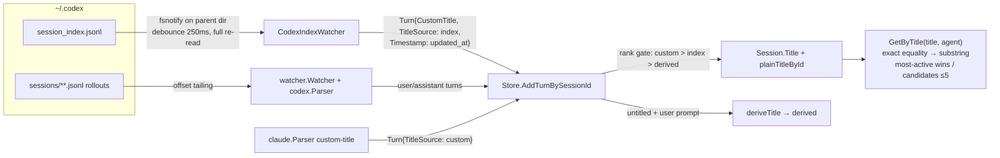

# Codex Title Search — Implementation Plan

## TLDR

- Codex session titles are ingested from `~/.codex/session_index.jsonl` by a new index watcher and fed through the existing title-signal pipeline, so every `title`-accepting tool resolves Codex sessions by thread name.
- Title lookup gains a case-insensitive substring fallback after the exact match; ambiguous substring matches return a candidate list (max 5) instead of guessing; an explicit `agent` argument scopes both match modes.
- Sessions without an index/custom title get a derived title from the first real user prompt (80 chars, flagged `derived`); derived titles never overwrite index or custom titles.
- `session_list` exposes `title_source` (`custom` | `index` | `derived`) so title trustworthiness is visible.
- No new MCP tools; `title` parameter descriptions change, and `session_get` gains the `agent` parameter the other four tools already have.
- Two concept assumptions were falsified during grounding and resolved by user decision: the exact-match hash map is replaced by a plain-title map so duplicate titles resolve by activity ([D1](#d1)), and derived titles skip Codex/Claude wrapper messages ([D2](#d2)).

## Context

- Implements the approved concept [concept.md](plans/codex_title_search/concept/concept.md) and its design sketch [index_watcher.md](plans/codex_title_search/concept/index_watcher.md) — both binding.
- Today only Claude `custom-title` entries produce titles ([claude/parser.go:170](claude/parser.go:170)); Codex sessions are addressable by UUID only.
- Codex maintains titles in `~/.codex/session_index.jsonl`; the file is appended on rename and atomically rewritten (temp + rename) on thread deletion, so the offset-tailing `Watcher` cannot be reused.
- Lookup today is exact-hash only ([session/store.go:152](session/store.go:152)); the concept adds substring fallback, agent scoping, and duplicate resolution by most-recent activity.
- Constraint: MCP tools stay read-only; no new tools.

## Scope

- **In:**
  - **index watcher:** new `watcher.CodexIndexWatcher` reading `session_index.jsonl` (startup + debounced fsnotify events on the parent directory).
  - **index entry model:** new `codex.IndexEntry` with `Validate`.
  - **title provenance:** `TitleSource` (`custom` | `index` | `derived`) on `session.Session`, `session.Turn`, and `tools.sessionListItem`; precedence custom > index > derived.
  - **derived-title fallback:** first real user prompt, first line, 80 runes, store-level (applies to Claude and Codex sessions).
  - **lookup:** substring fallback, ambiguity candidate list (cap 5), agent scoping, most-recently-active duplicate resolution.
  - **LastActive seeding:** title-only sessions seed `LastActive` from the index row's `updated_at`.
  - **tool surface:** `title` description update on all five tools; `agent` parameter added to `session_get`.
  - **docs:** README parameter tables swept.
- **Out (explicit non-goals, all concept Backlog):**
  - **user-assigned titles:** write mechanism via control server.
  - **fuzzy matching:** edit distance beyond substring.
  - **Claude ai-title:** parsing `ai-title` entries as derived-tier source.
  - **archived sessions:** watching `~/.codex/archived_sessions/`.
- **Not changed:**
  - **session watcher:** offset-tailing `watcher.Watcher` and both rollout parsers' turn handling.
  - **plan/diff watchers:** behavior untouched (`PlanWatcher` only loses its private `waitForDir` to a shared package function, byte-identical behavior).
  - **pagination and tool set:** no new tools, `session_full` paging untouched.
- **Deferred findings:**
  - **Store field order:** `Store` mixes exported/unexported fields against RULE-STRUCT-001 ([session/store.go:17](session/store.go:17)) — pre-existing, not touched beyond the planned field swap.
  - **stale TODO:** `//TODO: Filter by agent` at [session/store.go:213](session/store.go:213) is already implemented — left in place.
  - **gofmt drift:** `session/store_test.go` has misaligned literals (e.g. lines 21–22) — fixed incidentally by gofmt when the file is edited.

## Assumptions

| Assumption | Reality | Location |
|---|---|---|
| Concept: index had 39 rows | 43 rows today; mechanism unchanged | ~/.codex/session_index.jsonl |
| Concept: duplicate ids appear in the file (append-on-rename) | Current file has zero duplicate ids (rewritten since last deletion); last-line-wins parsing still required per Codex source semantics | ~/.codex/session_index.jsonl |
| Concept: "Propagate Supabase schema" ×4 | Confirmed: ×4, plus two more titles ×2 — duplicates are real and current | ~/.codex/session_index.jsonl |
| Concept: exact-hash lookup stays unchanged AND exact duplicates resolve to most-recently-active | Contradiction: `IdByTitle` stores one id per hash ([store.go:20](session/store.go:20)) — it cannot resolve duplicates by activity → [D1](#d1) | session/store.go:20 |
| Concept: derived title = first line of first user message | Falsified for Codex: the first user message is always a wrapper (`# AGENTS.md instructions`, `<recommended_plugins>`, `<environment_context>`, `<skill>`), never the prompt → [D2](#d2) | ~/.codex/sessions/2026/07/* (5 rollouts sampled) |
| Concept: title-signal path is idempotent for repeated identical titles | Falsified: when `HasNewTitle` is false the title-signal turn falls through to `session.AddTurn`, polluting `TurnActive` with roleless turns on every index re-read → [D4](#d4) | session/store.go:57 |

## Decisions

| ID | Problem | Facts | Decision | Why |
|---|---|---|---|---|
| <a id="d1"></a>D1 | Exact lookup: one id per hash vs. "most-recently-active duplicate wins" | [F1!](#f1), [F2!](#f2) | [USER] **Replace** `IdByTitle` + `hashTitle` with one map `plainTitleById` (id → normalized plain title); exact = equality scan, substring = contains scan, both pick by `LastActive` | Always-correct under later activity, single title structure (substring needs the plain-title map anyway; the hash variant keeps two parallel structures and goes stale when the losing session becomes active later). Scan is O(sessions), trivially small. Deliberate deviation from the concept's "hash — unchanged" wording, user-approved |
| <a id="d2"></a>D2 | First Codex user message is never the prompt — derived titles would be "# AGENTS.md instructions" for every Codex session | [F3!](#f3) | [USER] Keep the fallback, but skip a candidate whose trimmed text starts with `<` or `# AGENTS.md`; since the check runs on every user turn while the session is untitled, the next real prompt supplies the title | Covers every wrapper observed in real rollouts with two prefix checks and no new mechanism — the retry-on-next-turn behavior falls out of the existing "only when still untitled" condition |
| <a id="d3"></a>D3 | How the store knows a title's provenance | [F4!](#f4) | New signal field `Turn.TitleSource`; claude parser stamps `custom`, index watcher stamps `index`, the store's derived path stamps `derived`. Precedence rank custom=2 > index=1 > derived=0; equal rank may overwrite (renames), lower rank never does | Single mechanism rides the existing title-signal pipeline; rank ordering implements the concept's "explicit/index > derived" and keeps the Backlog user-assigned tier (`custom`) on top |
| <a id="d4"></a>D4 | Repeated identical index titles fall through to `AddTurn` and pollute `TurnActive` | [F1!](#f1) | Title-signal turns (`CustomTitle != ""`) always return inside the title branch — accepted or not, they never reach `session.AddTurn` | Index re-reads re-emit every title on each file change; without the early return every reload appends a roleless turn to every Codex session |
| <a id="d5"></a>D5 | `session_get` has no `agent` parameter but the concept's API text promises agent scoping on all five tools | [F5!](#f5) | Add the optional `agent` parameter to `session_get`, same description as the other four tools | The concept's uniform parameter description is unimplementable on `session_get` otherwise; adding a parameter is not a new tool |
| <a id="d6"></a>D6 | Guarding against title-signal turns without provenance | [F4!](#f4) | `Turn.Validate` requires `TitleSource` on title-signal turns | Prevents silent rank-0 misclassification; both producers (claude parser, index watcher) stamp it — validation strengthened, not weakened |
| <a id="d7"></a>D7 | Agent filter parsing in `resolveSession` | [F6!](#f6) | `agent` absent → no filter (search all agents); present → validated via the existing `Store.ResolveAgent`, invalid values error. Extracted as `resolveAgentFilter` (single caller, sanctioned by RULE-NEST-001 — inlining creates 3-level nesting) | `ResolveAgent("")` would force-resolve to the single enabled agent and error on dual-agent setups; the filter must distinguish "absent" from "invalid" |
| <a id="d8"></a>D8 | Derived-title shape | — | First line of the prompt, whitespace-trimmed, truncated to 80 **runes** (not bytes) | Byte truncation can split a UTF-8 sequence mid-character (German prompts are real here) |
| <a id="d9"></a>D9 | `IndexEntry` validation strictness | [F7!](#f7) | Require `id` and `thread_name`; zero `updated_at` tolerated (seeding branch skips zero timestamps) | A row without id/name is unusable; a missing timestamp only loses the LastActive seed, not the title |
| <a id="d10"></a>D10 | Debounce mechanism | [F8](#f8) | Stopped `time.Timer`, `Reset(250ms)` per matching event, reload on `timer.C`. No drain dance — Go 1.23+ timer semantics (go.mod: 1.26.2) | Coalesces Codex burst writes into one re-read with one timer and zero extra goroutines |
| <a id="d11"></a>D11 | Two watchers need wait-for-directory logic | [F9](#f9) | Extract `PlanWatcher.waitForDir` into a package-level `waitForDir(ctx, fsWatcher, dir)` used by both watchers (2 callers) | Duplicating 20 lines across sibling watchers fails the reuse rule; behavior byte-identical |
| <a id="d12"></a>D12 | Error style for lookup failures | [F6!](#f6) | `GetByTitle` errors keep the tool-facing style without `Component.Method:` prefix (`no session matching title %q` — message moved verbatim from tools) | Mirrors `Store.ResolveAgent`, the existing user-facing error in the same file; these strings surface directly in MCP tool results. Deliberate deviation from RULE-ERR-001 prefixes, matching the established sibling |
| <a id="d13"></a>D13 | [USER] Full re-read + 250 ms debounce; parent-directory watch with filename filter; candidate cap 5; LastActive seeding from `updated_at`; index-row removal not reconciled; agent scoping semantics | — | [USER] — fixed by the approved concept ([concept.md](plans/codex_title_search/concept/concept.md) Decisions) | Binding concept decisions; not re-litigated |

## Baseline (verified)

Base branch: `claude/codex-title-search-design-faec8d` (current worktree, clean).

| ID | Fact | Needed for | Location |
|---|---|---|---|
| <a id="f1"></a>F1! | Title branch: `HasNewTitle` true → update + return; false → **falls through** to plan/turn handling, so a repeated identical title-signal turn reaches `AddTurn` | [D1](#d1), [D4](#d4) | [session/store.go:57](session/store.go:57) |
| <a id="f2"></a>F2! | `IdByTitle map[string]Id` — one id per title hash; registration overwrites; only consumer is `GetByTitle` (+ tests) | [D1](#d1) | [session/store.go:20](session/store.go:20), [session/store.go:152](session/store.go:152) |
| <a id="f3"></a>F3! | Real rollouts: first user `response_item` is `# AGENTS.md instructions` / `<recommended_plugins>` / `<environment_context>` / `<skill>` in all 5 recent sessions sampled; the real prompt is a later user message | [D2](#d2) | ~/.codex/sessions/2026/07/* |
| <a id="f4"></a>F4! | `Turn` carries `CustomTitle` as a `json:"-"` signal field; `Turn.Validate` has a dedicated title-signal branch requiring only the session id | [D3](#d3), [D6](#d6) | [session/turn.go:39](session/turn.go:39) |
| <a id="f5"></a>F5! | `session_get` is registered with `id`, `title`, `n` — no `agent` parameter; the other four title tools have it | [D5](#d5) | [tools/tools.go:77](tools/tools.go:77) |
| <a id="f6"></a>F6! | `Store.ResolveAgent("")` resolves to the single enabled agent or errors when both are enabled; `fmt.Errorf` without component prefix is the established user-facing error style in the store | [D7](#d7), [D12](#d12) | [session/store.go:38](session/store.go:38) |
| <a id="f7"></a>F7! | Real index rows: `{"id","thread_name","updated_at"}`, RFC3339 timestamps; 43 rows; duplicate titles ×4/×2/×2; zero duplicate ids currently | [D9](#d9), [D1](#d1) | ~/.codex/session_index.jsonl |
| <a id="f8"></a>F8 | go.mod requires Go 1.26.2 — `strings.Lines` iterator and post-1.23 timer semantics available | [D10](#d10), [§5](#c5) | go.mod:3 |
| <a id="f9"></a>F9 | `PlanWatcher` watches a directory, filters events by name suffix, and polls every 5 s in `waitForDir` until the directory exists | [D11](#d11), [§5](#c5) | [watcher/plan_watcher.go:29](watcher/plan_watcher.go:29) |
| <a id="f10"></a>F10 | `LastActive` is only ever set from a turn's `Timestamp` in `Session.AddTurn`; title-signal turns from the claude parser carry a zero `Timestamp` | [§3](#c3) | [session/session.go:38](session/session.go:38), [claude/parser.go:175](claude/parser.go:175) |
| <a id="f11"></a>F11 | Existing test `fail-substring-does-not-match` asserts that `"Login"` does **not** match `"Login simplification"` — this behavior deliberately flips | [§10](#c10) | [session/store_test.go:334](session/store_test.go:334) |
| <a id="f12"></a>F12 | README documents the `title` parameter as "Exact session title (matched by normalized hash, case-insensitive)" in 5 tables and omits `agent` for `session_get` | [§11](#c11) | README.md:46–94 |

## Exemplar & reuse

| Existing | Used for |
|---|---|
| Title-signal pipeline (`Turn.CustomTitle` → `Store.AddTurnBySessionId`) | Index titles enter the store with zero new store entry points |
| `Store.ResolveAgent` | Validating the optional `agent` filter in `resolveAgentFilter` |
| `PlanWatcher.waitForDir` (extracted per [D11](#d11)) | Directory wait for both `PlanWatcher` and `CodexIndexWatcher` |
| `sortByLastActiveDesc` ordering (extracted comparator) | Sorting exact/substring matches and candidate lists |
| `fsnotify` dir-watch + name-filter pattern | Surviving the atomic index rewrite (inode replacement) |

- Every Changes entry has an exemplar (see `mirrors:` lines). No change is without one.

## Changes

### 1. Title source type and precedence (modified)
<a id="c1"></a>
location: `session/session.go`
mirrors: `Agent` typed-string pattern in the same file

```diff
 type (
 	Id    string
 	Agent string
+	TitleSource string
 )
 
 const (
 	AgentClaude Agent = "claude"
 	AgentCodex  Agent = "codex"
 )
+
+const (
+	TitleSourceCustom  TitleSource = "custom"
+	TitleSourceDerived TitleSource = "derived"
+	TitleSourceIndex   TitleSource = "index"
+)
```

```diff
 type Session struct {
 	Meta            Meta      `json:"meta"`
 	Agent           Agent     `json:"agent"`
 	Title           string    `json:"title,omitempty"`
+	TitleSource     TitleSource `json:"title_source,omitempty"`
 	LastActive      time.Time `json:"last_active"`
```

```diff
-func (s *Session) HasNewTitle(title string) bool {
+func (s *Session) HasNewTitle(title string, source TitleSource) bool {
 	if title == "" {
 		return false
 	}
 
+	if titleSourceRank(source) < titleSourceRank(s.TitleSource) {
+		return false
+	}
+
 	return s.Title != title
 }
```

New package-level function (free functions last per RULE-FILE-001):

```go
func titleSourceRank(source TitleSource) int {
	switch source {
	case TitleSourceCustom:
		return 2
	case TitleSourceIndex:
		return 1
	case TitleSourceDerived:
		return 0
	}
	return 0
}
```

- The trailing `return 0` covers the empty zero value on fresh sessions; it does not swallow enum members — all three are named (data-integrity §4).

### 2. Turn signal field and validation (modified)
<a id="c2"></a>
location: `session/turn.go`
mirrors: `CustomTitle` signal-field pattern in the same struct

```diff
 	PlanFilePath string    `json:"-"`                    // plan signal only, not serialized
 	PlanContent  string    `json:"-"`                    // inline plan content from attachment
 	CustomTitle      string    `json:"-"`                    // title signal only, not serialized
+	TitleSource  TitleSource `json:"-"`
```

```diff
 	// title-signal turns only carry a session ID and title
 	if t.CustomTitle != "" {
 		if t.Meta.SessionId == "" {
 			return errors.New("Turn.Validate: title signal turn requires session ID")
 		}
+		if t.TitleSource == "" {
+			return errors.New("Turn.Validate: title signal turn requires title source")
+		}
 		return nil
 	}
```

### 3. Store: registration, precedence, derived fallback, substring lookup (modified)
<a id="c3"></a>
location: `session/store.go`
mirrors: existing title branch and `sortByLastActiveDesc` in the same file

Per [D1](#d1) — `IdByTitle` and `hashTitle` are deleted, `plainTitleById` is the single title structure.

```diff
 type Store struct {
 	mu sync.RWMutex
 
-	IdByTitle     map[string]Id // SHA-256 hex of normalized title → session Id
 	TurnAdded     chan Id
 	depth         int
 	enabledAgents []Agent
+	plainTitleById map[Id]string
 	sessions      map[Id]*Session
 }
 
 func NewStore(depth int, agents ...Agent) *Store {
 	return &Store{
 		sessions:      make(map[Id]*Session),
-		IdByTitle:     make(map[string]Id),
+		plainTitleById: make(map[Id]string),
 		depth:         depth,
```

Title branch and derived fallback in `AddTurnBySessionId`:

```diff
 func (s *Store) AddTurnBySessionId(id Id, agent Agent, turn *Turn) {
 	session := s.getOrCreate(id, agent)
 	s.mu.Lock()
 	defer s.mu.Unlock()
 
 	// update only title
-	if session.HasNewTitle(turn.CustomTitle) {
-		slog.Debug("Updating title", "session", id, "title", turn.CustomTitle)
-
-		old := hashTitle(session.Title)
-		if session.Title != "" {
-			delete(s.IdByTitle, old)
-		}
-
-		session.Title = turn.CustomTitle
-		s.IdByTitle[hashTitle(turn.CustomTitle)] = id
+	if turn.CustomTitle != "" {
+		if session.LastActive.IsZero() && !turn.Timestamp.IsZero() {
+			session.LastActive = turn.Timestamp
+		}
+
+		if !session.HasNewTitle(turn.CustomTitle, turn.TitleSource) {
+			return
+		}
+
+		slog.Debug("Updating title", "session", id, "title", turn.CustomTitle, "source", turn.TitleSource)
+		s.setTitle(session, turn.CustomTitle, turn.TitleSource)
 		return
 	}
 
 	// update only plan content
 	if turn.PlanFilePath != "" {
 		// ... unchanged ...
 	}
 
+	isUntitled := session.Title == ""
+	isUserPrompt := turn.Role == RoleUser && turn.Text != ""
+	if isUntitled && isUserPrompt {
+		if derivedTitle := deriveTitle(turn.Text); derivedTitle != "" {
+			s.setTitle(session, derivedTitle, TitleSourceDerived)
+		}
+	}
+
 	// update user or assistent turn
 	session.AddTurn(turn)
```

- LastActive seeding runs before the acceptance check so a re-emitted identical index title still seeds a title-only session ([F10](#f10)).
- The unconditional `return` for title-signal turns implements [D4](#d4).

New methods and functions (complete units):

```go
func (s *Store) setTitle(session *Session, title string, source TitleSource) {
	session.Title = title
	session.TitleSource = source
	s.plainTitleById[session.Meta.SessionId] = strings.ToLower(strings.TrimSpace(title))
}
```

- Called from the title branch and the derived branch (2 callers); callers hold `s.mu`.

`deriveTitle` — wrapper skip per [D2](#d2):

```go
const derivedTitleMaxRunes = 80

func deriveTitle(text string) string {
	firstLine := strings.TrimSpace(strings.SplitN(text, "\n", 2)[0])
	if strings.HasPrefix(firstLine, "<") || strings.HasPrefix(firstLine, "# AGENTS.md") {
		return ""
	}

	runes := []rune(firstLine)
	if len(runes) > derivedTitleMaxRunes {
		return string(runes[:derivedTitleMaxRunes])
	}
	return firstLine
}
```

- 2 callers after tests target it directly; if the gate insists on runtime callers only, it stays justified by RULE-NEST-001 — inlining puts the truncation `if` at nesting level 3 inside `AddTurnBySessionId`.

Replacement `GetByTitle` (signature change: error instead of bool):

```go
const maxTitleCandidates = 5

func (s *Store) GetByTitle(title string, agent Agent) (*Session, error) {
	s.mu.RLock()
	defer s.mu.RUnlock()

	needle := strings.ToLower(strings.TrimSpace(title))

	var exactMatches []*Session
	var substringMatches []*Session
	for id, plainTitle := range s.plainTitleById {
		sess, ok := s.sessions[id]
		if !ok {
			continue
		}
		if agent != "" && sess.Agent != agent {
			continue
		}
		if plainTitle == needle {
			exactMatches = append(exactMatches, sess)
			continue
		}
		if strings.Contains(plainTitle, needle) {
			substringMatches = append(substringMatches, sess)
		}
	}

	sortSessionsByLastActiveDesc(exactMatches)
	if len(exactMatches) > 0 {
		return exactMatches[0], nil
	}

	sortSessionsByLastActiveDesc(substringMatches)
	if len(substringMatches) == 1 {
		return substringMatches[0], nil
	}
	if len(substringMatches) == 0 {
		return nil, fmt.Errorf("no session matching title %q", title)
	}

	candidates := substringMatches
	if len(candidates) > maxTitleCandidates {
		candidates = candidates[:maxTitleCandidates]
	}

	lines := make([]string, 0, len(candidates))
	for _, sess := range candidates {
		line := fmt.Sprintf("%q (id %s, last active %s)", sess.Title, sess.Meta.SessionId, sess.LastActive.Format(time.RFC3339))
		lines = append(lines, line)
	}
	return nil, fmt.Errorf("multiple sessions match title %q: %s", title, strings.Join(lines, "; "))
}
```

- Error strings per [D12](#d12); the not-found message moves verbatim from `tools.resolveSession`.
- `hashTitle` and its `crypto/sha256` / `encoding/hex` imports are deleted; `time` is added.

Sort comparator extracted (2 callers):

```diff
 func (s *Store) sortByLastActiveDesc(agents ...Agent) []*Session {
 	sessions := slices.Collect(maps.Values(s.sessions))
-	//TODO: Filter by agent
 	if len(agents) > 0 {
 		agent := agents[0]
 		sessions = slices.DeleteFunc(sessions, func(sess *Session) bool {
 			return sess.Agent != agent
 		})
 	}
 
-	sort.Slice(sessions, func(i, j int) bool {
-		return sessions[j].LastActive.Before(sessions[i].LastActive)
-	})
-
+	sortSessionsByLastActiveDesc(sessions)
 	return sessions
 }
```

```go
func sortSessionsByLastActiveDesc(sessions []*Session) {
	sort.Slice(sessions, func(i, j int) bool {
		return sessions[j].LastActive.Before(sessions[i].LastActive)
	})
}
```

### 4. Codex index entry model (new)
<a id="c4"></a>
location: `codex/index_entry.go`, const added in `codex/parser.go`
mirrors: `codex/entry.go` (type + `Validate` shape, stdlib `errors`)

```diff
 const (
 	SessionDir = "sessions"
+	IndexFile  = "session_index.jsonl"
```

```go
package codex

import (
	"errors"
	"time"

	"github.com/kevinhorst/peek-mcp/session"
)

type IndexEntry struct {
	Id         session.Id `json:"id"`
	ThreadName string     `json:"thread_name"`
	UpdatedAt  time.Time  `json:"updated_at"`
}

func (e *IndexEntry) Validate() error {
	if e == nil {
		return errors.New("codex index entry is nil")
	}

	// Id
	if e.Id == "" {
		return errors.New("id must not be empty")
	}

	// ThreadName
	if e.ThreadName == "" {
		return errors.New("thread_name must not be empty")
	}

	return nil
}
```

- Field comments per RULE-VALIDATE-002 (the sibling predates the rule; the rule wins for new code).
- `UpdatedAt` deliberately not validated ([D9](#d9)).

### 5. Codex index watcher (new)
<a id="c5"></a>
location: `watcher/codex_index_watcher.go`, shared helper extracted in `watcher/plan_watcher.go`
mirrors: `watcher/plan_watcher.go` (struct, constructor, Run loop, dir wait)

```go
package watcher

import (
	"context"
	"encoding/json"
	"log/slog"
	"os"
	"path/filepath"
	"strings"
	"time"

	"github.com/fsnotify/fsnotify"
	"github.com/kevinhorst/peek-mcp/codex"
	"github.com/kevinhorst/peek-mcp/session"
)

const (
	indexDebounce      = 250 * time.Millisecond
	indexWarnSizeBytes = 1 << 20
)

type CodexIndexWatcher struct {
	codexHome string
	store     *session.Store
}

func NewCodexIndexWatcher(codexHome string, store *session.Store) *CodexIndexWatcher {
	return &CodexIndexWatcher{
		codexHome: codexHome,
		store:     store,
	}
}

func (w *CodexIndexWatcher) loadIndex() {
	indexPath := filepath.Join(w.codexHome, codex.IndexFile)
	content, err := os.ReadFile(indexPath)
	if err != nil {
		slog.Debug("CodexIndexWatcher.loadIndex: Failed to read index", "err", err)
		return
	}

	if len(content) > indexWarnSizeBytes {
		slog.Warn("CodexIndexWatcher.loadIndex: Index file unexpectedly large", "bytes", len(content))
	}

	entries := make(map[session.Id]*codex.IndexEntry)
	for line := range strings.Lines(string(content)) {
		trimmed := strings.TrimSpace(line)
		if trimmed == "" {
			continue
		}

		var entry codex.IndexEntry
		if err := json.Unmarshal([]byte(trimmed), &entry); err != nil {
			slog.Debug("CodexIndexWatcher.loadIndex: Skipping malformed line", "err", err)
			continue
		}
		if err := entry.Validate(); err != nil {
			slog.Debug("CodexIndexWatcher.loadIndex: Skipping invalid entry", "err", err)
			continue
		}

		entries[entry.Id] = &entry
	}

	for id, entry := range entries {
		turn := &session.Turn{
			CustomTitle: entry.ThreadName,
			Meta:        &session.Meta{SessionId: id},
			Timestamp:   entry.UpdatedAt,
			TitleSource: session.TitleSourceIndex,
		}
		w.store.AddTurnBySessionId(id, session.AgentCodex, turn)
	}
}

func (w *CodexIndexWatcher) Run(ctx context.Context) error {
	watcher, err := fsnotify.NewWatcher()
	if err != nil {
		return err
	}
	defer watcher.Close()

	if err := waitForDir(ctx, watcher, w.codexHome); err != nil {
		return err
	}

	w.loadIndex()

	debounce := time.NewTimer(indexDebounce)
	debounce.Stop()

	for {
		select {
		case <-ctx.Done():
			return ctx.Err()
		case event, ok := <-watcher.Events:
			if !ok {
				return nil
			}
			if !event.Has(fsnotify.Write) && !event.Has(fsnotify.Create) {
				continue
			}
			if filepath.Base(event.Name) != codex.IndexFile {
				continue
			}
			debounce.Reset(indexDebounce)
		case <-debounce.C:
			w.loadIndex()
		case err, ok := <-watcher.Errors:
			if !ok {
				return nil
			}
			slog.Error("CodexIndexWatcher error", "err", err)
		}
	}
}
```

- Map collection implements last-line-wins per id; emission order over the map is irrelevant because each id appears once.
- Watching `w.codexHome` (the parent directory) with a basename filter survives the atomic temp-file + rename replacement ([D13](#d13)).
- `strings.Lines` requires Go 1.24+ — available ([F8](#f8)).

`waitForDir` extraction in `plan_watcher.go` ([D11](#d11)):

```diff
 func (w *PlanWatcher) Run(ctx context.Context) error {
 	// ...
-	if err := w.waitForDir(ctx, watcher); err != nil {
+	if err := waitForDir(ctx, watcher, w.plansDir); err != nil {
 		return err
 	}
 	// ...
 }
 
-func (w *PlanWatcher) waitForDir(ctx context.Context, fsWatcher *fsnotify.Watcher) error {
-	if err := fsWatcher.Add(w.plansDir); err == nil {
+func waitForDir(ctx context.Context, fsWatcher *fsnotify.Watcher, dir string) error {
+	if err := fsWatcher.Add(dir); err == nil {
 		return nil
 	}
 
-	slog.Info("PlanWatcher: plans dir not found, waiting for creation", "dir", w.plansDir)
+	slog.Info("waitForDir: Dir not found, waiting for creation", "dir", dir)
 	ticker := time.NewTicker(5 * time.Second)
 	defer ticker.Stop()
 
 	for {
 		select {
 		case <-ctx.Done():
 			return ctx.Err()
 		case <-ticker.C:
-			if err := fsWatcher.Add(w.plansDir); err == nil {
-				slog.Info("PlanWatcher: plans dir found, watching", "dir", w.plansDir)
+			if err := fsWatcher.Add(dir); err == nil {
+				slog.Info("waitForDir: Dir found, watching", "dir", dir)
 				return nil
 			}
 		}
 	}
 }
```

### 6. Claude parser stamps custom source (modified)
<a id="c6"></a>
location: `claude/parser.go`
mirrors: existing `handleCustomTitle`

```diff
 func (p *Parser) handleCustomTitle(entry *Entry) *session.Turn {
 	if entry.CustomTitle == "" {
 		return nil
 	}
 
 	return &session.Turn{
 		CustomTitle: entry.CustomTitle,
 		Meta: &session.Meta{
 			SessionId: entry.SessionId,
 		},
+		TitleSource: session.TitleSourceCustom,
 	}
 }
```

### 7. Start the index watcher (modified)
<a id="c7"></a>
location: `cmd/start.go`
mirrors: the plan-watcher goroutine in the claude block ([cmd/start.go:80](cmd/start.go:80))

```diff
 	if codexHome != "" {
 		go func() {
 			watchedDir := filepath.Join(codexHome, codex.SessionDir)
 			err := watcher.New(session.AgentCodex, watchedDir, codex.NewParser(), store).Run(ctx)
 			if err != nil && !errors.Is(err, context.Canceled) {
 				slog.Error("codex watcher error", "err", err)
 				os.Exit(1)
 			}
 		}()
+
+		go func() {
+			err := watcher.NewCodexIndexWatcher(codexHome, store).Run(ctx)
+			if err != nil && !errors.Is(err, context.Canceled) {
+				slog.Error("codex index watcher error", "err", err)
+				os.Exit(1)
+			}
+		}()
 	}
```

### 8. Tools: lookup wiring and parameter surface (modified)
<a id="c8"></a>
location: `tools/tools.go`
mirrors: existing `resolveSession` / `resolveAgentFromRequest`

```diff
 // resolveSession looks up a session by id or title from request args.
 // Precedence: id > title.
 func resolveSession(s *session.Store, request mcp.CallToolRequest) (*session.Session, error) {
 	args := request.GetArguments()
 
 	if id, ok := args["id"].(string); ok && id != "" {
 		sess, found := s.GetById(session.Id(id))
 		if !found {
 			return nil, fmt.Errorf("session %q not found", id)
 		}
 		return sess, nil
 	}
 
 	if title, ok := args["title"].(string); ok && title != "" {
-		sess, found := s.GetByTitle(title)
-		if !found {
-			return nil, fmt.Errorf("no session matching title %q", title)
-		}
-		return sess, nil
+		agent, err := resolveAgentFilter(s, request)
+		if err != nil {
+			return nil, err
+		}
+		return s.GetByTitle(title, agent)
 	}
 
 	return nil, errSessionSelectorMissing
 }
```

```go
func resolveAgentFilter(s *session.Store, request mcp.CallToolRequest) (session.Agent, error) {
	raw, _ := request.GetArguments()["agent"].(string)
	if raw == "" {
		return "", nil
	}

	return s.ResolveAgent(session.Agent(raw))
}
```

- Single caller, sanctioned by RULE-NEST-001 ([D7](#d7)).

Title parameter description — same new text on all five tools (`session_full`, `session_get`, `session_plan`, `session_diff`, `session_uncommitted_diff`), shown once for `session_full`:

```diff
 		mcp.WithString("title",
-			mcp.Description("Exact session title (matched by normalized hash, case-insensitive)"),
+			mcp.Description("Session title. Exact match first (case-insensitive); falls back to substring match. Scoped to agent when provided. For Codex, titles come from Codex's session index (thread name)."),
 		),
```

`session_get` gains the `agent` parameter ([D5](#d5)):

```diff
 	sessionGet := mcp.NewTool("session_get",
 		mcp.WithDescription("Returns the last N turns from a specific session by ID or title."),
 		mcp.WithString("id",
 			mcp.Description("Session ID"),
 		),
 		mcp.WithString("title",
 			mcp.Description("Session title. Exact match first (case-insensitive); falls back to substring match. Scoped to agent when provided. For Codex, titles come from Codex's session index (thread name)."),
 		),
+		mcp.WithString("agent",
+			mcp.Description("Agent: \"claude\" or \"codex\". Scopes title matching when provided."),
+		),
 		mcp.WithNumber("n",
 			mcp.Description("Number of turns to return (default 5)"),
 		),
 	)
```

`sessionListHandler` fills the new field:

```diff
 		items[i] = sessionListItem{
 			Id:         sess.Meta.SessionId,
 			Agent:      sess.Agent,
 			Title:      sess.Title,
+			TitleSource: sess.TitleSource,
 			LastActive: sess.LastActive,
 			HasPlan:    sess.PlanContent != "" || sess.PlanFilePath != "",
 			HasDiff:    sess.DiffOutput != "",
 		}
```

### 9. List view model (modified)
<a id="c9"></a>
location: `tools/viewmodels.go`
mirrors: existing `sessionListItem`

```diff
 type sessionListItem struct {
 	Id         session.Id    `json:"id"`
 	Agent      session.Agent `json:"agent"`
 	Title      string        `json:"title,omitempty"`
+	TitleSource session.TitleSource `json:"title_source,omitempty"`
 	LastActive time.Time     `json:"last_active"`
 	HasPlan    bool          `json:"has_plan"`
 	HasDiff    bool          `json:"has_diff"`
 }
```

### 10. Tests (modified + new)
<a id="c10"></a>
location: `session/store_test.go`, `session/turn_test.go`, `codex/index_entry_test.go`, `watcher/codex_index_watcher_test.go`
mirrors: `session/store_test.go` table pattern, `codex/entry_test.go` validate tests

- Skeletons mirror the named exemplars (sanctioned descriptive coverage; cases in the Tests section).
- `provideCompleteStore` title turns gain `TitleSource: TitleSourceCustom`.
- `TestGetByTitle` is rewritten for the `(…) (*Session, error)` signature; `fail-substring-does-not-match` flips to a pass case by design ([F11](#f11)).
- `watcher` and `codex` test files are new (the watcher package currently has no tests; `loadIndex` is tested directly against temp files without fsnotify).

### 11. README sweep (modified)
<a id="c11"></a>
location: `README.md`
mirrors: existing parameter tables

- Replace the 5 `title` row descriptions with the new text from [§8](#c8).
- Add the `agent` row to the `session_get` table.
- Extend the `session_list` description with `title` and `title_source` in the returned fields.

## Hot items

Classes from `context/general/hot-items.md`:

- **Goroutines/channels/timers (class 2):** `CodexIndexWatcher.Run` — full implementation in [§5](#c5). Debounce is one stopped `time.Timer` reset per event; no extra goroutines, no channels beyond fsnotify's; relies on Go 1.23+ timer semantics ([D10](#d10)).
- **Validation logic change (class 5):** `Turn.Validate` gains a requirement (title-signal turns need `TitleSource`, [§2](#c2)) and `HasNewTitle` gains the precedence gate ([§1](#c1)). Both strengthen; nothing is weakened or bypassed. Full diffs in their entries.
- No SQL, no new interfaces or generics, no migrations, no anonymous structs.

## Data flow



## Tests

| Location.Method | Cases | Comment |
|---|---|---|
| session/store_test.go `TestGetByTitle` | pass-exact-match<br>pass-case-insensitive<br>pass-substring-match<br>pass-substring-was-previously-not-found<br>fail-not-found<br>fail-substring-ambiguous-lists-candidates<br>pass-exact-duplicate-most-recent-wins<br>pass-agent-filtered<br>fail-agent-mismatch<br>fail-invalid-agent-not-validated-here | new signature; ambiguity case asserts error contains ≤5 candidates sorted by last_active desc; previously-failing substring case flips ([F11](#f11)) |
| session/store_test.go `TestAddTurn_CustomTitle` | pass-set-title<br>pass-update-title<br>pass-index-source-set<br>pass-repeated-title-does-not-add-turn | last case asserts `Turns(…)` stays empty after re-emitting an identical index title ([D4](#d4)) |
| session/store_test.go `TestAddTurn_TitlePrecedence` | derived-then-index-overwrites<br>index-then-derived-ignored<br>index-then-custom-overwrites<br>custom-then-index-ignored<br>index-rename-same-rank-overwrites | rank matrix from [D3](#d3) |
| session/store_test.go `TestAddTurn_DerivedTitle` | derives-first-line<br>truncates-80-runes<br>skips-wrapper-prefixes<br>derives-from-next-user-turn-after-wrapper<br>assistant-turn-does-not-derive | wrapper cases per [D2](#d2) |
| session/store_test.go `TestAddTurn_TitleOnlySession` | seeds-last-active-from-timestamp<br>listed-in-session-list<br>turn-timestamp-takes-over | title-only session semantics |
| session/turn_test.go `TestTurnValidate` | title-signal-missing-source-fails<br>title-signal-with-source-passes | added to existing validate cases |
| codex/index_entry_test.go `TestIndexEntryValidate` | pass-complete<br>fail-nil<br>fail-missing-id<br>fail-missing-thread-name<br>pass-zero-updated-at | mirrors codex/entry_test.go |
| watcher/codex_index_watcher_test.go `TestLoadIndex` | last-line-wins-duplicate-ids<br>skips-malformed-lines<br>missing-file-noop<br>titles-land-in-store | calls `loadIndex` directly on temp files; no fsnotify |

- Integration tests: none — the repo has no watcher/fsnotify test harness; event handling is covered by the e2e verification below.
- Not tested: fsnotify event delivery, debounce timing, watch survival across atomic rename — no existing harness; verified in the running system. Tool handlers (`resolveSession`, descriptions) — the tools package has no tests today; behavior is exercised e2e.

## Contracts & sweeps

| Contract | Sides | Sweep |
|---|---|---|
| `session_list` response gains `title_source` | Go producer; MCP consumers (Claude/Codex sessions), README | README `session_list` section updated; additive, omitempty — no breakage |
| `title` parameter semantics (exact → substring, agent-scoped) | 5 tool registrations; README tables ×5 | grep README + tools.go for "normalized hash" → zero after sweep |
| `session_get` gains `agent` param | tools.go registration; README table | additive |
| `Store.GetByTitle` signature `(title, agent) (*Session, error)` | session package; tools.go; store_test.go | Go-only; compiler enforces |
| `Store.IdByTitle` removal ([D1](#d1)) | session package internals + tests | repo-wide grep `IdByTitle`\|`hashTitle` → zero survivors |
| `session.Turn.TitleSource` signal | claude parser, codex index watcher, store, turn tests | internal, `json:"-"` — not serialized |
| `session_index.jsonl` read contract | Codex (producer, external), IndexEntry (consumer) | field names verified against live file ([F7](#f7)) |

## Verification

- [ ] Run `make test` — all packages pass.
- [ ] Run `go vet ./...` and `gofmt -l .` (excluding vendor) — no findings.
- [ ] Run `make serve-http` with real `~/.codex` — startup log shows no errors; `session_list` shows Codex sessions with titles and `title_source: "index"`.
- [ ] Call `session_get` with `title: "pgroll"` — resolves "Set up pgroll migrations" via substring.
- [ ] Call `session_get` with `title: "supabase schema"` — error lists ≤5 candidates (4× "Propagate Supabase schema" + "Trim schema from supabase types"), sorted by last_active desc.
- [ ] Call `session_get` with `title: "Propagate Supabase schema"` (exact, 4 duplicates) — returns the most recently active one, no error.
- [ ] Call `session_full` with `title` + `agent: "claude"` against a Codex-only title — "no session matching title".
- [ ] Rename a thread in Codex — new title resolves within ~1 s without restart.
- [ ] Delete a thread in Codex (atomic rewrite), then rename another — the rename still lands (watch survived the inode swap).
- [ ] Start a fresh Codex session, ask one real question before Codex names it — `session_list` shows a derived title (not "# AGENTS.md instructions"), later flips to the index title with `title_source: "index"`.
- [ ] Degenerate: move `session_index.jsonl` aside and start the server — runs clean, debug log only, Codex rollout ingestion unaffected.

## Stop conditions

| ID | Condition | Action |
|---|---|---|
| S1 | An approved signature/contract can't hold as planned | Stop and report. Never improvise architecture mid-edit |
| S2 | Second failed fix on the same mechanism | Stop, research the actual cause, redesign. No third band-aid |
| S3 | Missing prerequisite (generated code, running infra) | Run the producing step. If infrastructure is down, ask. Never skip validation, never start infrastructure yourself |
| S4 | Discovered work materially exceeds the approved scope | Ask before continuing |
| S5 | Same kind of bug a second time: inside own diff → fix all instances now; pre-existing outside the diff | Report and ask before searching further |
| S6 | A structural obstacle tempts a new abstraction (interface, DTO, wrapper) | Stop and report. The fix is relocating the component, not indirection |
| S7 | fsnotify does not deliver Create for the renamed-into-place index file on macOS (watch appears dead after Codex thread deletion) | Stop and report — do not switch to polling without approval |
| S8 | A real index row fails `IndexEntry` parsing (schema drift vs. [F7](#f7)) | Stop and report the actual line; do not loosen validation silently |
| S9 | Wrapper-skip heuristic ([D2](#d2)) rejects a real user prompt in verification | Report the prompt; do not widen/narrow the heuristic without approval |

## Open questions

*(none — Q1/Q2 resolved, see Changelog)*

## Changelog

| Date | Trigger | What changed |
|---|---|---|
| — | initial | plan created |
| 2026-07-19 | Q: exact-match structure (Q1 → D1) | [USER] option a — hash map replaced by plain-title map |
| 2026-07-19 | Q: derived-title wrappers (Q2 → D2) | [USER] option a — wrapper-skip heuristic |
