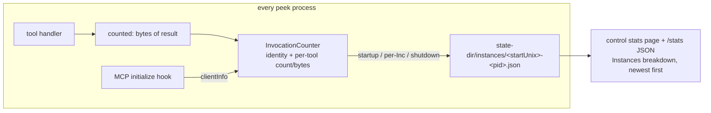

# Peek statistics — Change Plan

route: `change`

## TLDR

- Answer to the clarification: **no** — nothing accumulates across peek instances today. The dashboard's "Tool invocations" table is the in-memory counter of the one process that owns control port 42442; every other instance (codex stdio, `claude -p`, harness) keeps its own counter and throws it away on exit.
- Change: make instance accounting real and complete — every peek process writes its own instance record (identity, client, start/last-seen, per-tool invocation counts and returned bytes) to the shared state dir, gated only on `state-dir` being set.
- The dashboard stats page (and `/stats` JSON) gains an **Instances** breakdown: which instance, spawned by which MCP client, how long it ran, which tools it served, how many bytes it returned.
- Bytes, not tokens: peek has no tokenizer; returned-payload bytes are recorded (user accepted bytes).

## Context

- **Problem:** the stats page suggests accumulated invocation statistics; the user doubts every peek session (harness, codex via stdio, `claude -p`) is included — and is right to.
- **Cause:** `InvocationCounter` is per-process, in-memory, tool-name-only ([tools/invocations.go:8](tools/invocations.go:8)), incremented before the handler runs ([tools/tools.go:31](tools/tools.go:31)), never persisted; only the instance holding port 42442 is ever looked at.
- **Constraint:** house persistence style is JSON-overwrite with atomic temp+rename into the state dir ([state/dir.go:67](state/dir.go:67)); no file locking exists — so each instance must write only its own file.
- **Discriminator:** the MCP initialize handshake carries `clientInfo` (name+version of the spawning client); mcp-go v0.52.0 exposes it via `server.WithHooks` + `AddAfterInitialize` (verified in module source).

## Drivers

| ID | Observed | Wanted | Impact | Origin |
|---|---|---|---|---|
| DR1 | Stats page shows invocation counts of one process only; other instances' activity is invisible and lost on exit | Every peek instance's activity is persisted and visible | behavioral | user request ("does it really accumulate EVERY peek session? I just don't believe so") |
| DR2 | No per-instance data at all: no identity on disk, no duration, no per-call bytes | Breakdown per instance: which instance (client, pid, transport), ran how long, which invocations, how many bytes returned | behavioral | user request |
| DR3 | `/stats` JSON field `invocations` is `map[string]int` | Values become `{count, bytes}` objects | contract-touching | consequence of DR2 |

## Scope

- **In:**
  - **per-tool bytes:** `InvocationCounter` records count + returned bytes per tool.
  - **instance record:** identity (pid, ppid, transport, version, MCP client name/version), started_at, updated_at, tools map — persisted per instance under `<state-dir>/instances/`.
  - **write points:** at startup, on every invocation, on clean shutdown.
  - **breakdown UI:** Instances section on the dashboard stats page + `instances` array in `/stats` JSON.
- **Out:**
  - **token estimation:** no tokenizer; bytes only (user accepted).
  - **request-level log:** no per-call event log (JSONL) — aggregates per tool per instance only; the request asks for "which invocations and how many bytes", satisfied by the per-tool breakdown.
  - **cross-instance merge totals as a persisted artifact:** totals are computed at render time.
- **Not changed:**
  - **telemetry subsystem:** OTLP session stats (`telemetry/`) untouched.
  - **retention:** existing mod-time GC covers instance files without code change (verified below).
- **Deferred findings:**
  - **duplicate registration:** the user's environment registers peek twice (`Peek_MCP` and `peek-mcp`) — visible in tool listings; config cleanup, not code.

## Assumptions

| Assumption | Reality | Location |
|---|---|---|
| User premise: stats might accumulate every peek session | False — per-process in-memory only, no persistence, no instance identity on disk | [tools/invocations.go:8](tools/invocations.go:8), [cmd/start.go:158](cmd/start.go:158) |
| Every spawned instance has a state dir to write to | True by default — `state-dir` defaults to `~/.peek/state` for all instances incl. stdio/`claude -p`/codex ([cmd/start.go:279](cmd/start.go:279)); empty flag disables persistence (record stays in-memory) | [cmd/start.go:95](cmd/start.go:95) |
| GC will prune old instance files without change | True — `Gc` treats each top-level dir as an agent dir and prunes children by newest mod-time; `newestModTime` and `os.RemoveAll` both work on plain files | [state/dir.go:49](state/dir.go:49), [state/dir.go:216](state/dir.go:216) |
| MCP client identity is obtainable | True — `OnAfterInitialize` hook delivers `InitializeRequest.Params.ClientInfo` (mcp-go v0.52.0 module source, server/hooks.go:75, mcp/types.go:502) | go.mod:8 |

## Current state

- [tools/invocations.go](tools/invocations.go) — 27 lines: mutex + `map[string]int`, `Inc`/`Snapshot`. No bytes, no identity, no persistence.
- [tools/tools.go:29](tools/tools.go:29) — `counted` wrapper increments before the handler; result never inspected.
- [cmd/start.go:158](cmd/start.go:158) — counter created unconditionally; passed to control server only ([cmd/start.go:185](cmd/start.go:185)).
- [control/stats.go:43](control/stats.go:43) — dashboard reads `Snapshot()`; `statsResponse.Invocations map[string]int` ([control/viewmodels.go:97](control/viewmodels.go:97)); rendered by [control/templates/_stats.html:13](control/templates/_stats.html:13).
- [state/dir.go](state/dir.go) — atomic-rename `writeFile`, per-agent/session layout, mod-time GC; no instances concept.

## Target state



- **Principle:** single source of truth — the in-memory counter *is* the instance record; persistence is a fold-side effect, mirroring `telemetry.Store.persist` ([telemetry/store.go:178](telemetry/store.go:178)). No parallel second stats mechanism.
- **Principle:** writer isolation over locking — one file per instance, only its own process writes it; atomic rename is sufficient (house mechanism, [state/dir.go:67](state/dir.go:67)).

## Behavior contract

- **Unchanged:** telemetry.json content and writes; all MCP tool responses; dashboard pages other than stats; state GC semantics.
- **Intentional changes (flagged):**
  - `/stats` JSON `invocations` values become `{"count": n, "bytes": m}` (DR3).
  - `/stats` JSON gains `instances` array; stats page gains Instances section.
  - Invocation now counted **after** the handler returns (needed to measure the result); a handler panic no longer increments the counter — accepted.
  - New files appear under `<state-dir>/instances/`.

## Decisions

| ID | Problem | Facts | Decision | Why |
|---|---|---|---|---|
| D1 | Which instances write stats? | telemetry gated on control-port ([cmd/start.go:91](cmd/start.go:91)); state-dir defaults on for every instance | Gate instance persistence **only on state-dir**, never on control-port | Answers DR1 completely — codex stdio, `claude -p`, harness all write; control-port gating is what made stats partial |
| D2 | Storage layout | no file locking; last-writer-wins hazard exists for shared files; GC prunes by mod-time | One JSON file per instance: `<state-dir>/instances/<startUnix>-<pid>.json`, overwrite-own-file only | Writer isolation removes all cross-process conflict (reliable); GC covers retention for free |
| D3 | Instance discriminator ("which instance") | ClientInfo available via `OnAfterInitialize`; ppid free via `os.Getppid()` | Record MCP client name+version (distinct set) + pid, ppid, transport, peek version | ClientInfo names the actual spawner (claude-code vs codex vs harness) platform-independently; no `ps` exec needed |
| D4 | Bytes vs tokens | no tokenizer in repo; user: "bytes are fine" | `len(json.Marshal(result))` of the `CallToolResult`; 0 on error/nil result [USER] | Serialized result ≈ wire payload; deterministic, no new dependency |
| D5 | Run duration for exited instances | stdio serve returns on stdin EOF; signals cancel ctx | `updated_at` refreshed on every write + one final persist on shutdown; duration = updated−started (live instances: now−started) | No heartbeat goroutine needed; only kill -9 loses the tail, degrades predictably |
| D6 | Where the record type lives | telemetry pattern: domain type + marshal in domain pkg, raw IO in state ([telemetry/store.go:64](telemetry/store.go:64), [state/dir.go:178](state/dir.go:178)) | `InstanceRecord`/`ToolStats` in `tools` next to the counter; `state.Dir` gets `WriteInstance`/`ReadInstances` | Mirrors the telemetry split; control already imports tools ([control/viewmodels.go:8](control/viewmodels.go:8)) |
| D7 | Old counter kept alongside? | replace-means-gone rule | `InvocationCounter` is extended in place — `map[string]int` shape deleted everywhere (control viewmodel + template updated in the same phase) | Single mechanism; no legacy shape survives |
| D8 | Unbounded instance files at render | one instance per `claude -p`/session run → thousands over 90 days | `ReadInstances(limit)` returns newest 100 by mod-time; GC handles disk | Bounded render cost; predictable degradation |
| D9 | Liveness display | pid recorded; `syscall.Kill(pid, 0)` errs `ESRCH` when gone | Mark instance running when signal-0 succeeds or returns `EPERM`; mark the rendering process itself as self | Distinguishes live vs exited without persistence changes |

## Open questions

None — must stay empty at approval.

## Baseline (verified)

N/A — change route (facts live in Current state / Assumptions).

## Exemplar & reuse

N/A — change route. Mirrors are on each Changes entry; cross-cutting reuse: `state.Dir.writeFile` (atomic persist), `telemetry.Store.persist` fold pattern, `bytes`/`ts` template funcs.

## Changes

### Phase 1 — record and persist per-instance stats

App works after this phase: counters richer, files written, stats page shows count+bytes for the live process.

#### 1. Instance-aware invocation counter (modified)
location: `tools/invocations.go`
mirrors: `telemetry/store.go` (mutex + fold + persist-inside-fold + nil StateDir guard)

Full replacement unit (hot item: locking — see Hot items):

```go
package tools

import (
	"encoding/json"
	"fmt"
	"maps"
	"slices"
	"sync"
	"time"

	"github.com/kevinhorst/peek-mcp/state"
)

type ToolStats struct {
	Count int   `json:"count"`
	Bytes int64 `json:"bytes"`
}

type InstanceInfo struct {
	Id        string    `json:"id"`
	PID       int       `json:"pid"`
	PPID      int       `json:"ppid"`
	Transport string    `json:"transport"`
	Version   string    `json:"version"`
	StartedAt time.Time `json:"started_at"`
}

type InstanceRecord struct {
	InstanceInfo
	Clients   []string             `json:"clients,omitempty"`
	Tools     map[string]ToolStats `json:"tools,omitempty"`
	UpdatedAt time.Time            `json:"updated_at"`
}

type InvocationCounter struct {
	mu       sync.Mutex
	info     InstanceInfo
	clients  []string
	counts   map[string]ToolStats
	stateDir *state.Dir
}

func NewInvocationCounter(info InstanceInfo, stateDir *state.Dir) *InvocationCounter {
	info.Id = fmt.Sprintf("%d-%d", info.StartedAt.Unix(), info.PID)
	return &InvocationCounter{info: info, counts: make(map[string]ToolStats), stateDir: stateDir}
}

func (c *InvocationCounter) Inc(tool string, bytes int64) {
	c.mu.Lock()
	defer c.mu.Unlock()
	stats := c.counts[tool]
	stats.Count++
	stats.Bytes += bytes
	c.counts[tool] = stats
	c.persist()
}

func (c *InvocationCounter) AddClient(client string) {
	if client == "" {
		return
	}
	c.mu.Lock()
	defer c.mu.Unlock()
	if slices.Contains(c.clients, client) {
		return
	}
	c.clients = append(c.clients, client)
	c.persist()
}

func (c *InvocationCounter) Snapshot() map[string]ToolStats {
	c.mu.Lock()
	defer c.mu.Unlock()
	return maps.Clone(c.counts)
}

func (c *InvocationCounter) Persist() {
	c.mu.Lock()
	defer c.mu.Unlock()
	c.persist()
}

func (c *InvocationCounter) persist() {
	if c.stateDir == nil {
		return
	}
	record := InstanceRecord{
		InstanceInfo: c.info,
		Clients:      slices.Clone(c.clients),
		Tools:        maps.Clone(c.counts),
		UpdatedAt:    time.Now(),
	}
	data, err := json.Marshal(record)
	if err != nil {
		return
	}
	_ = c.stateDir.WriteInstance(c.info.Id, string(data))
}
```

#### 2. Measure returned bytes in the counted wrapper (modified)
location: `tools/tools.go`

```diff
 func counted(counter *InvocationCounter, name string, handler server.ToolHandlerFunc) server.ToolHandlerFunc {
 	return func(ctx context.Context, req mcp.CallToolRequest) (*mcp.CallToolResult, error) {
-		counter.Inc(name)
-		return handler(ctx, req)
+		result, err := handler(ctx, req)
+		counter.Inc(name, resultBytes(result))
+		return result, err
 	}
 }
+
+func resultBytes(result *mcp.CallToolResult) int64 {
+	if result == nil {
+		return 0
+	}
+	data, err := json.Marshal(result)
+	if err != nil {
+		return 0
+	}
+	return int64(len(data))
+}
```

#### 3. Instance file IO (modified)
location: `state/dir.go`
mirrors: `WriteTelemetry`/`ReadTelemetry` ([state/dir.go:170](state/dir.go:170))

```go
const instancesDir = "instances"

func (d *Dir) WriteInstance(id, content string) error {
	return d.writeFile(filepath.Join(d.root, instancesDir, sanitize(id)+".json"), content)
}

func (d *Dir) ReadInstances(limit int) []string {
	dir := filepath.Join(d.root, instancesDir)
	entries, err := os.ReadDir(dir)
	if err != nil {
		return nil
	}

	type candidate struct {
		name    string
		modTime time.Time
	}
	candidates := make([]candidate, 0, len(entries))
	for _, entry := range entries {
		if entry.IsDir() || !strings.HasSuffix(entry.Name(), ".json") {
			continue
		}
		info, err := entry.Info()
		if err != nil {
			continue
		}
		candidates = append(candidates, candidate{name: entry.Name(), modTime: info.ModTime()})
	}
	sort.Slice(candidates, func(i, j int) bool { return candidates[i].modTime.After(candidates[j].modTime) })

	contents := make([]string, 0, min(limit, len(candidates)))
	for _, c := range candidates[:min(limit, len(candidates))] {
		data, err := os.ReadFile(filepath.Join(dir, c.name))
		if err != nil {
			continue
		}
		contents = append(contents, string(data))
	}
	return contents
}
```

#### 4. Wiring: identity, client hook, startup/shutdown writes (modified)
location: `cmd/start.go`

- Counter construction moves **above** `server.NewMCPServer` (the hook closure needs it); `stateDir` already exists at that point (line 95–103).

```diff
+		info := tools.InstanceInfo{
+			PID:       os.Getpid(),
+			PPID:      os.Getppid(),
+			Transport: transport,
+			Version:   Version(),
+			StartedAt: startedAt,
+		}
+		invocations := tools.NewInvocationCounter(info, stateDir)
+		invocations.Persist()
+		defer invocations.Persist()
+
+		hooks := &server.Hooks{}
+		hooks.AddAfterInitialize(func(ctx context.Context, id any, message *mcp.InitializeRequest, result *mcp.InitializeResult) {
+			invocations.AddClient(strings.TrimSpace(message.Params.ClientInfo.Name + " " + message.Params.ClientInfo.Version))
+		})
 		srv := server.NewMCPServer("peek-mcp", Version(),
 			server.WithToolCapabilities(true),
 			server.WithResourceCapabilities(false, true),
+			server.WithHooks(hooks),
 		)
-		invocations := tools.NewInvocationCounter()
```

- Imports gain `strings` and `github.com/mark3labs/mcp-go/mcp`.
- The `defer invocations.Persist()` covers stdin-EOF stdio exit and signal-cancelled http exit; `os.Exit(1)` error paths skip it — accepted (D5).

#### 5. Adapt live-process stats to the new snapshot shape (modified)
location: `control/viewmodels.go`, `control/templates/_stats.html`

```diff
 type statsResponse struct {
 	// ...
-	Invocations      map[string]int          `json:"invocations,omitempty"`
+	Invocations      map[string]tools.ToolStats `json:"invocations,omitempty"`
```

```diff
 {{if .Invocations}}
 <h2>Tool invocations</h2>
 <table class="evidence-table">
-  {{range $tool, $count := .Invocations}}<tr><th>{{$tool}}</th><td>{{$count}}</td></tr>{{end}}
+  {{range $tool, $stats := .Invocations}}<tr><th>{{$tool}}</th><td>{{$stats.Count}}× · {{bytes $stats.Bytes}}</td></tr>{{end}}
 </table>
 {{end}}
```

### Phase 2 — instances breakdown on the dashboard

App works after this phase: full DR2 breakdown visible.

#### 6. Instance views (modified)
location: `control/stats.go`, `control/viewmodels.go`
mirrors: `statsResponse` assembly ([control/stats.go:14](control/stats.go:14))

```go
const maxInstancesShown = 100

type instanceView struct {
	tools.InstanceRecord
	Self       bool   `json:"self"`
	Running    bool   `json:"running"`
	RanFor     string `json:"ran_for"`
	TotalCount int    `json:"total_count"`
	TotalBytes int64  `json:"total_bytes"`
}

func newInstanceView(record tools.InstanceRecord, selfPID int) instanceView {
	view := instanceView{InstanceRecord: record}
	view.Self = record.PID == selfPID
	view.Running = processAlive(record.PID)
	end := record.UpdatedAt
	if view.Running {
		end = time.Now()
	}
	view.RanFor = end.Sub(record.StartedAt).Truncate(time.Second).String()
	for _, stats := range record.Tools {
		view.TotalCount += stats.Count
		view.TotalBytes += stats.Bytes
	}
	return view
}

func processAlive(pid int) bool {
	if pid <= 0 {
		return false
	}
	err := syscall.Kill(pid, 0)
	return err == nil || errors.Is(err, syscall.EPERM)
}
```

- `stats()` gains, guarded like `StateDiskBytes` ([control/stats.go:40](control/stats.go:40)):

```diff
 	if s.stateDir != nil {
 		resp.StateDiskBytes = s.stateDir.Size()
+		for _, content := range s.stateDir.ReadInstances(maxInstancesShown) {
+			var record tools.InstanceRecord
+			if err := json.Unmarshal([]byte(content), &record); err != nil {
+				continue
+			}
+			resp.Instances = append(resp.Instances, newInstanceView(record, resp.PID))
+		}
 	}
```

- `statsResponse` gains `Instances []instanceView` with json tag `instances,omitempty`.
- Files are already newest-first from `ReadInstances`; no re-sort.

#### 7. Instances section on the stats page (modified)
location: `control/templates/_stats.html`
ui: screenshot deferred — captured from the running app during implementation verification and stored under the session plan dir (plan mode forbids running the server now; see Stop conditions S8).

```html
{{if .Instances}}
<h2>Instances</h2>
<table class="evidence-table">
  <tr><th>Client</th><th>PID</th><th>Transport</th><th>Started</th><th>Ran for</th><th>Status</th><th>Invocations</th><th>Bytes</th></tr>
  {{range .Instances}}
  <tr>
    <td>{{range $i, $c := .Clients}}{{if $i}}<br>{{end}}{{$c}}{{end}}</td>
    <td>{{.PID}}{{if .Self}} (this){{end}}</td>
    <td>{{.Transport}}</td>
    <td>{{ts .StartedAt}}</td>
    <td>{{.RanFor}}</td>
    <td>{{if .Running}}running{{else}}exited{{end}}</td>
    <td>{{range $tool, $stats := .Tools}}{{$tool}}: {{$stats.Count}}× · {{bytes $stats.Bytes}}<br>{{end}}{{if not .Tools}}—{{end}}</td>
    <td>{{bytes .TotalBytes}}</td>
  </tr>
  {{end}}
</table>
{{end}}
```

## Hot items

- **Goroutines/locking — InvocationCounter rework:** full example implementation is written out in Changes §1. Locking discipline: every public method takes `c.mu`; `persist` is the only lock-assumed private helper and is called exclusively under the lock; snapshot data handed out of the lock is cloned (`maps.Clone`, `slices.Clone`). The `OnAfterInitialize` hook runs on mcp-go's request goroutine — it only calls the mutex-guarded `AddClient`, no shared state outside the counter.
- **UI-touching change:** stats page Instances section — screenshot of the actual rendered UI cannot be captured in plan mode (server must run); it is a mandatory implementation-verification item (see Verification) with stop condition S8 if the rendering deviates from the template above.

## Tests

| Location.Method | Cases | Comment |
|---|---|---|
| tools/invocations_test.go TestInvocationCounter | 50 concurrent `Inc` with bytes sum to count=50 and summed bytes<br>snapshot mutation does not leak back<br>`Inc` on nil stateDir does not panic | extends existing test, same skeleton |
| tools/invocations_test.go TestInvocationCounterPersist | `Persist` writes `instances/<startUnix>-<pid>.json` under a t.TempDir state dir<br>record round-trips: pid, transport, clients, tools, updated_at set<br>`AddClient` dedupes and persists | |
| tools/tools_test.go TestResultBytes | nil result → 0<br>text result → serialized length > 0 | |
| state/dir_test.go TestInstances | write two instances, `ReadInstances(10)` returns both newest-first<br>limit=1 returns only newest<br>missing dir → nil<br>`Gc` removes an instance file older than retention, keeps a fresh one | mirrors existing dir_test cases |
| control (stats test, nearest: server_test.go/pages_test.go) TestStatsInstances | state dir with one exited-instance record → `/…/stats` JSON contains `instances[0]` with running=false, totals summed<br>invocations map renders count+bytes shape | |

- not tested: mcp-go hook delivery of ClientInfo (third-party handshake path) — covered by runbook/verification against a live client instead.

## Test runbook

- **stdio-instance-record** — spawn `peek-mcp start --transport=stdio` via a live Claude Code session, then inspect `~/.peek/state/instances/` (jq the newest file).
- **breakdown-page** — open the dashboard stats page on port 42442; Instances table lists the http harness instance and the stdio instances with clients, durations, byte counts.
- **stats-json** — `curl` the control `/…/stats` endpoint; `instances` array and object-valued `invocations` present.

## Contracts & sweeps

| Contract | Sides | Sweep |
|---|---|---|
| `/stats` JSON: `invocations` value shape `int` → `{count,bytes}`; new `instances` array (DR3, intentional) | control server ↔ dashboard fragment (only in-repo consumer) | grep `invocations` across repo, docs/, README — every hit updated or confirmed dashboard-internal; zero remaining `map[string]int` invocation references |
| Instance file format `instances/<id>.json` (new, producer=tools, consumer=control) | `tools.InstanceRecord` marshal ↔ control unmarshal | single struct shared via `tools` package — no duplicate shape to sweep |
| `NewInvocationCounter` signature change | tools ↔ cmd/start.go ↔ tests | grep `NewInvocationCounter` to zero old-signature call sites |

## Verification

- [ ] `make test` — all packages green.
- [ ] `make build-local` — builds.
- [ ] Run an http instance (`make serve-http` with control port) and, from a real Claude Code session, invoke `session_list` via a stdio peek — expect a file per instance under `~/.peek/state/instances/`, the stdio one carrying client `claude-code <version>` and non-zero bytes for `session_list`.
- [ ] Trigger a codex session using peek — expect its own instance file with the codex client name (DR1 empirically answered).
- [ ] Open the stats page — Instances table shows self marked "(this)", exited stdio instances as "exited" with plausible ran-for values; capture the screenshot into the session plan dir.
- [ ] `curl` `/…/stats` — `instances` present, `invocations` values are `{count,bytes}` objects.
- [ ] Degenerate: start with `--state-dir=""` — no instances section, no crash; empty `instances/` dir → section absent.
- [ ] Backdate an instance file (`touch -t`) beyond retention and run a GC cycle — file removed, fresh ones kept.

## Stop conditions

| ID | Condition | Action |
|---|---|---|
| S1 | An approved signature/contract can't hold as planned | Stop and report — never improvise architecture mid-edit |
| S2 | Second failed fix on the same mechanism | Stop, research actual cause, redesign — no third band-aid |
| S3 | Missing prerequisite (generated code, running infra) | Run the producing step; if infra is down, ask — never skip validation or start infra yourself |
| S4 | Discovered work materially exceeds approved scope | Ask before continuing |
| S5 | Same kind of bug found twice: in own diff → fix all in diff; pre-existing outside → report, ask before sweeping | Per rule |
| S6 | Structural obstacle tempts a new abstraction (interface/DTO/wrapper) | Stop and report — relocate the component instead |
| S7 | `OnAfterInitialize` does not deliver ClientInfo for stdio or http transport in practice | Stop, report — do not silently fall back to `ps`-based parent lookup without approval |
| S8 | Rendered Instances UI deviates from the approved template, or an out-of-repo `/stats` JSON consumer surfaces | Stop, show screenshot / consumer, ask |

## Changelog

| Date | Trigger | What changed |
|---|---|---|
| — | initial | plan created |
