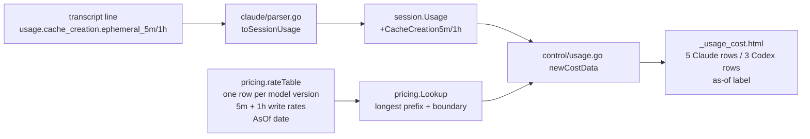
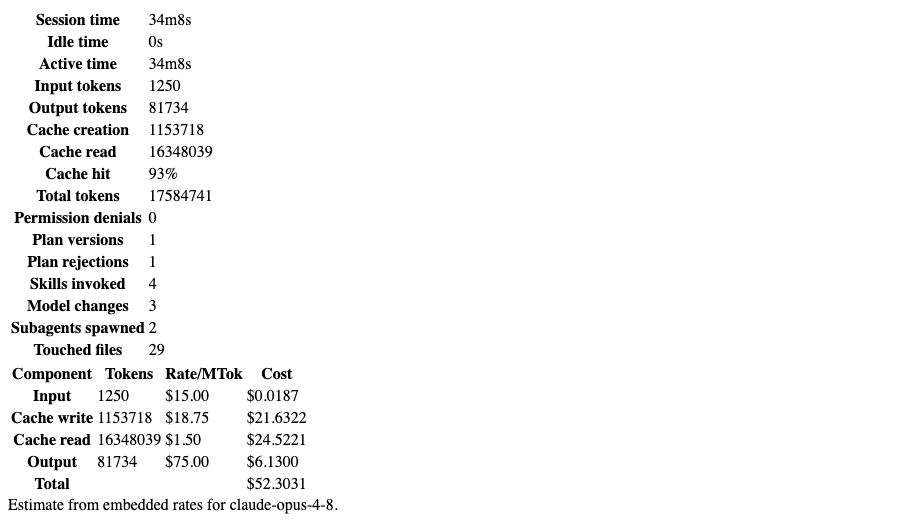
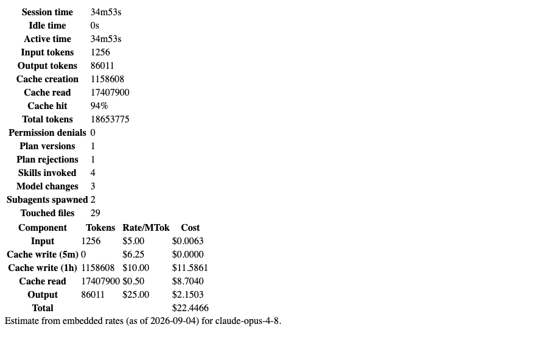

# Pricing model refresh (Sonnet 5, all current models, cache-write tiers) — Change Plan

route: `change`

## TLDR
- The pricing code lives in the peek-mcp repo (`pricing/pricing.go`), not in claude-configs. This plan changes peek-mcp.
- Every Claude row in the embedded rate table is wrong or missing today: Fable 5 is priced at half its real rate, every Opus 4.x session is priced at 3× its real rate (the retired Opus 4 row catches them by prefix), and Sonnet 5, Opus 5, Fable 5.1, and every GPT-5.4+ model have no row at all.
- The table is replaced with one row per current model, verified today against the official Anthropic and OpenAI pricing pages, with an "as of" date shown in the UI.
- Prefix matching gets a boundary rule so `gpt-5.5` no longer silently prices as `gpt-5`, and so a retired-family row can never catch a newer model again.
- Cache writes get split into 5-minute and 1-hour tiers. Real transcripts show 98% of Claude Code cache writes are 1-hour writes, which bill at 2× base input, not the 1.25× the model uses today. The parser starts reading the breakdown that is already in every transcript line.
- Result: per-session, per-skill, and per-subagent cost estimates in the peek control UI are correct for every model seen in the last months of transcripts, and stale rows can be spotted by the displayed date.

## Context
- **Problem:** cost estimates in the peek control UI are computed from a hand-written rate table last touched at its creation ([pricing.go:12](/Users/kevinpersonal/GolandProjects/peek-mcp/pricing/pricing.go:12)); models released since then are unpriced or mispriced.
- **Cause 1 — stale values:** Fable 5 row says $5/$25, real is $10/$50; the `claude-opus-4` family row ($15/$75) is the longest prefix match for `claude-opus-4-6`, `4-7`, `4-8` whose real rate is $5/$25.
- **Cause 2 — single cache-write rate:** [usage.go:100](/Users/kevinpersonal/GolandProjects/peek-mcp/control/usage.go:100) prices all cache writes at one rate; the parser drops the `cache_creation` tier breakdown ([parser.go:170](/Users/kevinpersonal/GolandProjects/peek-mcp/claude/parser.go:170)).
- **Originating plan:** [telemetry_status_config_usage.md](/Users/kevinpersonal/GolandProjects/peek-mcp/plans/control_server/design/telemetry_status_config_usage.md) (decision P1: minimal embedded slice, values "best-effort as of planning date"); the fuller [usage_reporting concept](/Users/kevinpersonal/GolandProjects/peek-mcp/plans/usage_reporting/concept/concept.md) stays a separate feature (its open question 6 is exactly the 1h-write problem fixed here).
- **Constraints:** no network fetch of prices (concept decision, kept); costs stay computed at read time so a table fix retroactively fixes every displayed estimate; no override file (out of scope, concept backlog).

## Drivers
| ID | Observed | Wanted | Impact | Origin |
|---|---|---|---|---|
| DR1 | `claude-sonnet-5`, `claude-opus-5`, `claude-fable-5-1` render "No pricing for model …" | a cost row for every model seen in transcripts | behavioral | request ("pricing model for all models incl. sonnet5") |
| DR2 | `claude-fable-5` priced $5/$25; `claude-opus-4-8` priced $15/$75 via the `claude-opus-4` prefix | official rates ($10/$50 and $5/$25) | behavioral | request ("cross check current pricings are fresh") |
| DR3 | `gpt-5.4`, `gpt-5.5`, `gpt-5.6-*` silently priced at `gpt-5` rates via prefix | own rows; an unknown `gpt-5.x` is reported unknown, never priced as `gpt-5` | behavioral | grounding, [pricing.go:24](/Users/kevinpersonal/GolandProjects/peek-mcp/pricing/pricing.go:24) |
| DR4 | all cache writes priced at the 5m rate (1.25×); 98% of real writes are 1h (2×) | 5m and 1h writes priced at their own rates | contract-touching (Usage struct gains fields) | grounding, real transcripts |
| DR5 | UI says "Estimate from embedded rates" with no date | the table's as-of date visible next to the estimate | behavioral | concept user story "costs labeled with the pricing table's date" |

## Scope
- **Opportunity menu (user's cut recorded first):**
  - **rate refresh + missing models (DR1, DR2, DR3):** requested — In.
  - **cache-write tiers (DR4):** found in grounding, 37.5% undercount on the dominant write tier — In (recommended, see [D3](#decisions)).
  - **as-of date (DR5):** trivial, concept user story — In.
  - **override file, `session_usage` MCP tool, per-model split:** concept MVP items — Out.
- **In:**
  - **rate table:** replace all rows with the verified table below, one row per model version.
  - **prefix boundary:** a prefix matches only when the next character is `-`, `[`, or end of string.
  - **cache tiers:** parser reads `cache_creation.ephemeral_5m_input_tokens` / `ephemeral_1h_input_tokens`; Usage carries them; cost rows price them separately.
  - **as-of label:** `pricing.AsOf` constant rendered in the cost fragment.
- **Out:**
  - **pricing override file / env var:** concept backlog, not asked.
  - **OpenAI long-context tier (>272K):** peek has no per-request context size; standard tier only.
  - **Anthropic fast mode (`speed: "fast"` at 2× rates):** field exists in transcripts, not requested.
  - **Mythos rows:** limited availability, never seen in transcripts.
  - **peek-mcp release/version bump:** Kevin cuts releases.
- **Not changed:**
  - **Codex cost formula:** `(input − cached)·Pin + cached·Pcr + out·Pout` stays.
  - **cost fragment route and layout:** `usage?detail=cost` and its table shape stay.
  - **telemetry `cost_usd`:** the OTEL-reported cost in `telemetry/store.go` is a different number (reported by Claude Code itself) and is untouched.
- **Deferred findings:**
  - **fast mode:** `usage.speed` is present in every transcript line; a later change can price `"fast"` at the fast-mode table.
  - **`gpt-5.1-codex-mini` (16 Codex sessions):** not on the OpenAI page any more; prices via the `gpt-5.1` prefix. Acceptable, noted.

## Assumptions
| Assumption | Reality | Location |
|---|---|---|
| The pricing model lives in claude-configs (session was opened there) | It lives in peek-mcp; claude-configs has no rate table, only prose multipliers in docs | grep of both repos; [pricing.go](/Users/kevinpersonal/GolandProjects/peek-mcp/pricing/pricing.go) |
| Sonnet 5 introductory pricing ($2/$10) ends 2026-09-01 | Anthropic made $2/$10 the standard price; the $3/$15 increase was cancelled | platform.claude.com pricing page, fetched 2026-09-04 |
| Transcripts cannot distinguish 5m from 1h cache writes (concept open question 6) | Every assistant line carries `usage.cache_creation.{ephemeral_5m_input_tokens, ephemeral_1h_input_tokens}` | real transcript line, see [F5](#current-state) |
| Third-party price pages agree with OpenAI | Morph lists `gpt-5.6-sol` at $5/$30; the official page says $4/$0.40/$20 | official page wins, see [F9](#current-state) |
| Bare aliases (`opus`, `sonnet`, `haiku`) reach the cost code | They appear only inside Agent tool inputs; `message.model` is always a full id, so `Meta.Model` never holds an alias | jq over all transcripts: zero assistant messages with alias models |

## Current state
- **Facts** (F-ids are cited by Decisions):

| ID | Fact | Needed for | Location |
|---|---|---|---|
| F1! | Rate table has family-prefix rows (`claude-opus-4`, `claude-sonnet-4`, `claude-haiku-4`) and a bare `gpt-5` row; longest prefix wins with no boundary check | [D1](#decisions), [D2](#decisions) | [pricing.go:12-37](/Users/kevinpersonal/GolandProjects/peek-mcp/pricing/pricing.go:12) |
| F2! | Official Anthropic rates 2026-09-04 (input / 5m write / 1h write / read / output per MTok): Fable 5.1 and Mythos 5.1 = 10 / 12.50 / 20 / 0.25 / 50<br>Fable 5 = 10 / 12.50 / 20 / 1 / 50<br>Opus 5, 4.8, 4.7, 4.6, 4.5 = 5 / 6.25 / 10 / 0.50 / 25<br>Opus 4.1, 4 (retired) = 15 / 18.75 / 30 / 1.50 / 75<br>Sonnet 5 = 2 / 2.50 / 4 / 0.20 / 10<br>Sonnet 4.6, 4.5, 4 = 3 / 3.75 / 6 / 0.30 / 15<br>Haiku 4.5 = 1 / 1.25 / 2 / 0.10 / 5<br>Haiku 3.5 = 0.80 / 1 / 1.60 / 0.08 / 4 | [D1](#decisions), § rate table | [platform.claude.com pricing](https://platform.claude.com/docs/en/about-claude/pricing), fetched 2026-09-04 |
| F3! | Cache read is 0.1× base input on all models except Fable 5.1 / Mythos 5.1 (0.025×); 5m write 1.25×; 1h write 2× | [D3](#decisions) | same page, § Prompt caching |
| F4! | Claude 4.6+ bill the full 1M context at standard rates, so a `[1m]` model suffix carries no surcharge | [D2](#decisions) | same page, § Long context pricing |
| F5! | Real transcript usage line: `"cache_creation":{"ephemeral_1h_input_tokens":17720,"ephemeral_5m_input_tokens":0}` next to `cache_creation_input_tokens:17720`; over the 50 most recent transcripts 1h writes = 43.9M tokens, 5m writes = 0.9M | [D3](#decisions) | `~/.claude/projects/*/*.jsonl`, jq sum 2026-09-04 |
| F6! | Model ids seen in Claude transcripts (assistant `message.model`, count of lines): `claude-fable-5` 41963, `claude-opus-4-8` 19007, `claude-sonnet-5` 1964, `claude-fable-5-1` 1238, `claude-opus-4-6` 985, `claude-opus-5` 333, `gpt-5.5` 251, `gpt-5.4` 180, `claude-opus-4-7` 92, `claude-sonnet-4-6` 59, `gpt-5.6-terra` 26, `gpt-5.6-sol` 26, `gpt-5.1-codex-mini` 10; Codex rollouts: `gpt-5.4` 270, `gpt-5.5` 176, `gpt-5.6-sol` 32, `gpt-5.6-terra` 18, `gpt-5.6` 2; peek state also holds `claude-opus-4-8[1m]`, `claude-sonnet-5[1m]` | [D1](#decisions), [D2](#decisions) | grep over `~/.claude/projects`, `~/.codex/sessions`, `~/.peek/state` |
| F7 | `claude.Usage` has four flat int fields; `Message.Validate` calls `Usage.Validate` (non-negativity only) | § claude usage | [claude/usage.go:5](/Users/kevinpersonal/GolandProjects/peek-mcp/claude/usage.go:5), [message.go:28](/Users/kevinpersonal/GolandProjects/peek-mcp/claude/message.go:28) |
| F8 | `session.Usage` is the agent-neutral struct with `omitempty` JSON tags; it is persisted in `~/.peek/state/claude/<id>/diff.snapshot` and summed via `Add` | [D4](#decisions), § session usage | [session/usage.go:5](/Users/kevinpersonal/GolandProjects/peek-mcp/session/usage.go:5); state files contain `cache_creation_input_tokens` |
| F9! | Official OpenAI standard-tier rates (input / cached / output per MTok): gpt-5.6-sol 4 / 0.40 / 20<br>gpt-5.6-terra 2 / 0.20 / 12<br>gpt-5.6-luna 0.20 / 0.02 / 1.20<br>gpt-5.5 5 / 0.50 / 30<br>gpt-5.4 2.50 / 0.25 / 15<br>gpt-5.4-mini 0.75 / 0.075 / 4.50<br>gpt-5.4-nano 0.20 / 0.02 / 1.25<br>gpt-5.3-codex 1.75 / 0.175 / 14<br>gpt-5.2 1.75 / 0.175 / 14<br>gpt-5.1 1.25 / 0.125 / 10<br>gpt-5 1.25 / 0.125 / 10<br>gpt-5-mini 0.25 / 0.025 / 2<br>gpt-5-nano 0.05 / 0.005 / 0.40<br>`gpt-5-codex` no longer listed | [D1](#decisions), § rate table | [developers.openai.com pricing](https://developers.openai.com/api/docs/pricing), fetched 2026-09-04 |
| F10 | Cost rows are built in `newCostData`; three call sites (session total, per skill, per subagent) all go through it | § control usage | [control/usage.go:81](/Users/kevinpersonal/GolandProjects/peek-mcp/control/usage.go:81), [sessions.go:194](/Users/kevinpersonal/GolandProjects/peek-mcp/control/sessions.go:194) |
| F11 | The control test for the unknown-model path relies on the fixture model `opus` being unpriced | § tests | [usage_test.go:53](/Users/kevinpersonal/GolandProjects/peek-mcp/control/usage_test.go:53), [pricing_test.go:38](/Users/kevinpersonal/GolandProjects/peek-mcp/pricing/pricing_test.go:38) |
| F12 | Parser fixture first line has flat usage only (`input 100, output 50, cache_creation 200, cache_read 300`) | § parser test | [claude/fixtures/assistant_messages.jsonl:1](/Users/kevinpersonal/GolandProjects/peek-mcp/claude/fixtures/assistant_messages.jsonl:1) |
| F13 | peek-mcp checkout is on `main`, clean, at `cbdfa44 cmd: release v1.2.2`; test gate is `make test` (`go test ./...`) | [D5](#decisions), Verification | `git status`, Makefile |

- **File inventory:**
  - `pricing/pricing.go` — rate table (9 rows), `Lookup` (longest prefix), `Cost`.
  - `pricing/pricing_test.go` — 4 lookup cases, 2 cost cases.
  - `claude/usage.go` — transcript usage struct (4 fields) + validation.
  - `claude/parser.go` — maps `claude.Usage` → `session.Usage` in two places (lines 170 and 266, duplicated verbatim).
  - `session/usage.go` — neutral usage struct, `Validate`, `Add`.
  - `control/usage.go` — `newCostData` builds the cost rows.
  - `control/templates/_usage_cost.html` — renders rows + "Estimate from embedded rates for …" meta line.

## Target state

- **Principle:** single source of truth for rates — one table, one date constant, values copied verbatim from the vendor page; mechanism: package-level `var`/`const` in `pricing`.
- **Principle:** the ingest path keeps every billing-relevant field the transcript already provides; mechanism: two extra ints on `session.Usage`, mapped by one helper instead of two duplicated literals.
- **Principle:** a lookup never returns a rate from a different model family; mechanism: boundary check after the prefix match.

## Behavior contract
- **Must not change:**
  - Codex cost formula and its three rows.
  - `Lookup` still resolves dated suffixes (`claude-sonnet-4-5-20250929`) and `[1m]` suffixes to the versioned row.
  - Unknown model → `Known=false` → "No pricing for model …" (unchanged text).
  - Old persisted snapshots without tier fields still load (new fields are `omitempty` ints, zero by default) and still produce a cost.
  - `displayTotalTokens` and `cachePercent` unchanged (tier fields are a breakdown of `CacheCreationInputTokens`, never added to totals).
- **Intentional changes (flagged):**
  - Claude cost table shows five rows instead of four: Input, Cache write (5m), Cache write (1h), Cache read, Output ([D3](#decisions)).
  - Prices for every Claude and GPT model change to the verified values ([D1](#decisions)).
  - `gpt-5.5`-style ids stop matching `gpt-5` ([D2](#decisions)).
  - Meta line gains the as-of date ([D5](#decisions) row DR5).
  - `session.Usage` JSON (MCP `session_get` output, state snapshots) gains two optional fields — additive.

## Decisions
| ID | Problem | Facts | Decision | Why |
|---|---|---|---|---|
| D1 | Which rows the table holds | [F2](#current-state), [F6](#current-state), [F9](#current-state) | One row per model version for every model on the two official pages that is not limited-availability, plus retired rows for models present in old transcripts (Opus 4.x, Sonnet 4.x, Haiku 3.5). Family-prefix rows (`claude-opus-4`) and `gpt-5-codex` are removed. | Debuggable: a wrong price is one row, not a prefix collision. Removing the family rows is what stops a retired rate from catching a newer model. |
| D2 | Prefix match crosses families (`gpt-5` catches `gpt-5.5`) | [F1](#current-state), [F4](#current-state), [F6](#current-state) | Keep longest-prefix but require the next character after the prefix to be `-`, `[`, or end of string. | Reliable: a new `gpt-5.7` is reported unknown instead of priced at a 2023 rate. `[1m]` still resolves (no surcharge per F4), dated suffixes still resolve. |
| D3 | Cache writes have two prices, the model has one | [F3](#current-state), [F5](#current-state) | Split: `Rates` gets `CacheWrite5mPerMTok` and `CacheWrite1hPerMTok`; the parser carries the breakdown; cost rows price each tier. Tokens not covered by the breakdown (old transcripts) are priced at the 5m rate, in the row labeled "Cache write (5m)". | 98% of real writes are 1h; pricing them at 1.25× instead of 2× undercounts the second-largest cost component by 37.5%. Untiered → 5m because 5m is the API default TTL when no tier is recorded. |
| D4 | Where the tier counts live | [F8](#current-state) | Two new ints on `session.Usage` with `omitempty` tags, summed in `Add`, validated non-negative; no new struct. | Fewest concepts; persisted snapshots stay loadable; Codex never sets them. |
| D5 | Repo and branch for the implementation | [F13](#current-state) | [USER] worktree `~/GolandProjects/peek-mcp/.claude/worktrees/pricing-refresh` on new branch `pricing-refresh` off `main` (created 2026-09-04). The session cannot move its own cwd (pinned to its isolated worktree), so every edit, test, and git command uses that absolute path | This session's worktree belongs to claude-configs; peek-mcp is a different repo. A peek-mcp worktree keeps `main` clean and Kevin merges himself. |
| D6 | OpenAI models with no page row (`gpt-5.1-codex-mini`, bare `gpt-5.6`) | [F9](#current-state), [F6](#current-state) | No synthetic rows. `gpt-5.1-codex-mini` prices via the `gpt-5.1` row; bare `gpt-5.6` is unknown. | An invented price is worse than "No pricing"; prefix fallback within a version is the existing, documented behavior. |
| D7 | Bare aliases (`opus`, `sonnet`, `haiku`) | Assumptions table | No alias rows. | Aliases never reach `Meta.Model` (assistant `message.model` is always a full id); an alias row would only mask a future data bug. |
| D8 | Duplicated usage mapping in the parser | [F7](#current-state) | Extract `toSessionUsage(*Usage) *session.Usage` and call it from both sites. | Adding two fields to two copies is the second time the copies would drift; one helper is the single source of truth. |

## Open questions
- none — Q1 answered ([D5](#decisions))

## Baseline (verified)
N/A — change route

## Exemplar & reuse
N/A — change route

## Changes
Each phase is independently shippable; the app builds and `make test` passes after every phase.

### Phase 1 — rate table, boundary match, as-of date (DR1, DR2, DR3, DR5)

#### pricing package (modified)
location: `pricing/pricing.go`

```go
package pricing

import "strings"

// AsOf is the date the embedded rates were last verified against the vendor pages.
const AsOf = "2026-09-04"

type Rates struct {
	InputPerMTok        float64
	OutputPerMTok       float64
	CacheWrite5mPerMTok float64
	CacheWrite1hPerMTok float64
	CacheReadPerMTok    float64
}

// rateTable holds one row per model version. Keys are matched as prefixes of
// the transcript model id with a boundary rule (see Lookup), so a key must be
// the full versioned id, never a family name.
//
// Sources (verified 2026-09-04):
//   https://platform.claude.com/docs/en/about-claude/pricing
//   https://developers.openai.com/api/docs/pricing (standard tier, <272K context)
var rateTable = map[string]Rates{
	// Anthropic — cache read 0.1× input, 5m write 1.25×, 1h write 2×
	"claude-fable-5-1":  {InputPerMTok: 10, OutputPerMTok: 50, CacheWrite5mPerMTok: 12.50, CacheWrite1hPerMTok: 20, CacheReadPerMTok: 0.25}, // read 0.025×
	"claude-fable-5":    {InputPerMTok: 10, OutputPerMTok: 50, CacheWrite5mPerMTok: 12.50, CacheWrite1hPerMTok: 20, CacheReadPerMTok: 1},
	"claude-opus-5":     {InputPerMTok: 5, OutputPerMTok: 25, CacheWrite5mPerMTok: 6.25, CacheWrite1hPerMTok: 10, CacheReadPerMTok: 0.50},
	"claude-opus-4-8":   {InputPerMTok: 5, OutputPerMTok: 25, CacheWrite5mPerMTok: 6.25, CacheWrite1hPerMTok: 10, CacheReadPerMTok: 0.50},
	"claude-opus-4-7":   {InputPerMTok: 5, OutputPerMTok: 25, CacheWrite5mPerMTok: 6.25, CacheWrite1hPerMTok: 10, CacheReadPerMTok: 0.50},
	"claude-opus-4-6":   {InputPerMTok: 5, OutputPerMTok: 25, CacheWrite5mPerMTok: 6.25, CacheWrite1hPerMTok: 10, CacheReadPerMTok: 0.50},
	"claude-opus-4-5":   {InputPerMTok: 5, OutputPerMTok: 25, CacheWrite5mPerMTok: 6.25, CacheWrite1hPerMTok: 10, CacheReadPerMTok: 0.50},
	"claude-opus-4-1":   {InputPerMTok: 15, OutputPerMTok: 75, CacheWrite5mPerMTok: 18.75, CacheWrite1hPerMTok: 30, CacheReadPerMTok: 1.50}, // retired
	"claude-opus-4":     {InputPerMTok: 15, OutputPerMTok: 75, CacheWrite5mPerMTok: 18.75, CacheWrite1hPerMTok: 30, CacheReadPerMTok: 1.50}, // retired
	"claude-sonnet-5":   {InputPerMTok: 2, OutputPerMTok: 10, CacheWrite5mPerMTok: 2.50, CacheWrite1hPerMTok: 4, CacheReadPerMTok: 0.20},
	"claude-sonnet-4-6": {InputPerMTok: 3, OutputPerMTok: 15, CacheWrite5mPerMTok: 3.75, CacheWrite1hPerMTok: 6, CacheReadPerMTok: 0.30},
	"claude-sonnet-4-5": {InputPerMTok: 3, OutputPerMTok: 15, CacheWrite5mPerMTok: 3.75, CacheWrite1hPerMTok: 6, CacheReadPerMTok: 0.30},
	"claude-sonnet-4":   {InputPerMTok: 3, OutputPerMTok: 15, CacheWrite5mPerMTok: 3.75, CacheWrite1hPerMTok: 6, CacheReadPerMTok: 0.30}, // retired
	"claude-haiku-4-5":  {InputPerMTok: 1, OutputPerMTok: 5, CacheWrite5mPerMTok: 1.25, CacheWrite1hPerMTok: 2, CacheReadPerMTok: 0.10},
	"claude-haiku-3-5":  {InputPerMTok: 0.80, OutputPerMTok: 4, CacheWrite5mPerMTok: 1, CacheWrite1hPerMTok: 1.60, CacheReadPerMTok: 0.08}, // retired
	// OpenAI — cached input only; no write tiers
	"gpt-5.6-sol":   {InputPerMTok: 4, OutputPerMTok: 20, CacheReadPerMTok: 0.40},
	"gpt-5.6-terra": {InputPerMTok: 2, OutputPerMTok: 12, CacheReadPerMTok: 0.20},
	"gpt-5.6-luna":  {InputPerMTok: 0.20, OutputPerMTok: 1.20, CacheReadPerMTok: 0.02},
	"gpt-5.5":       {InputPerMTok: 5, OutputPerMTok: 30, CacheReadPerMTok: 0.50},
	"gpt-5.4":       {InputPerMTok: 2.50, OutputPerMTok: 15, CacheReadPerMTok: 0.25},
	"gpt-5.4-mini":  {InputPerMTok: 0.75, OutputPerMTok: 4.50, CacheReadPerMTok: 0.075},
	"gpt-5.4-nano":  {InputPerMTok: 0.20, OutputPerMTok: 1.25, CacheReadPerMTok: 0.02},
	"gpt-5.3-codex": {InputPerMTok: 1.75, OutputPerMTok: 14, CacheReadPerMTok: 0.175},
	"gpt-5.2":       {InputPerMTok: 1.75, OutputPerMTok: 14, CacheReadPerMTok: 0.175},
	"gpt-5.1":       {InputPerMTok: 1.25, OutputPerMTok: 10, CacheReadPerMTok: 0.125},
	"gpt-5":         {InputPerMTok: 1.25, OutputPerMTok: 10, CacheReadPerMTok: 0.125},
	"gpt-5-mini":    {InputPerMTok: 0.25, OutputPerMTok: 2, CacheReadPerMTok: 0.025},
	"gpt-5-nano":    {InputPerMTok: 0.05, OutputPerMTok: 0.40, CacheReadPerMTok: 0.005},
}

// Lookup resolves a transcript model id to its rates. The longest table key
// that is a prefix of model wins, but only when the character after the prefix
// is a version/variant boundary ('-', '[') or the end of the id — so
// "gpt-5.5" never resolves to the "gpt-5" row, while "claude-opus-4-8[1m]" and
// "claude-sonnet-4-5-20250929" resolve to their versioned rows.
func Lookup(model string) (Rates, bool) {
	var bestRates Rates
	bestLength := -1
	for prefix, rates := range rateTable {
		if !strings.HasPrefix(model, prefix) || !boundaryAfter(model, len(prefix)) {
			continue
		}
		if len(prefix) > bestLength {
			bestLength = len(prefix)
			bestRates = rates
		}
	}
	return bestRates, bestLength >= 0
}

func boundaryAfter(model string, at int) bool {
	if at >= len(model) {
		return true
	}
	return model[at] == '-' || model[at] == '['
}

func Cost(tokens int, ratePerMTok float64) float64 {
	return float64(tokens) / 1e6 * ratePerMTok
}
```

- Full file shown because every row changes; `Cost` is unchanged.
- Phase 1 alone: `control/usage.go` uses `CacheWrite5mPerMTok` for the single write row (see the Phase 1 diff below) so the build stays green before Phase 2 splits it.

#### control usage cost rows, Phase 1 slice (modified)
location: `control/usage.go`

```diff
 type costData struct {
 	Id    session.Id
 	Model string
+	AsOf  string
 	Known bool
 	Rows  []costRow
 	Total string
 }
 // ...
 func newCostData(id session.Id, agent session.Agent, model string, usage *session.Usage) costData {
-	data := costData{Id: id, Model: model}
+	data := costData{Id: id, Model: model, AsOf: pricing.AsOf}
 	rates, known := pricing.Lookup(model)
 	// ...
 		data.Rows = []costRow{
 			newCostRow("Input", usage.InputTokens, rates.InputPerMTok, &total),
-			newCostRow("Cache write", usage.CacheCreationInputTokens, rates.CacheWritePerMTok, &total),
+			newCostRow("Cache write", usage.CacheCreationInputTokens, rates.CacheWrite5mPerMTok, &total),
 			newCostRow("Cache read", usage.CacheReadInputTokens, rates.CacheReadPerMTok, &total),
```

#### cost fragment template (modified)
location: `control/templates/_usage_cost.html`

```diff
-<div class="meta">Estimate from embedded rates for {{.Model}}.</div>
+<div class="meta">Estimate from embedded rates (as of {{.AsOf}}) for {{.Model}}.</div>
```

### Phase 2 — cache-write tiers (DR4)

#### claude transcript usage (modified)
location: `claude/usage.go`
mirrors: its own existing field/validation shape

```diff
 type Usage struct {
 	InputTokens              int `json:"input_tokens"`
 	OutputTokens             int `json:"output_tokens"`
 	CacheCreationInputTokens int `json:"cache_creation_input_tokens"`
 	CacheReadInputTokens     int `json:"cache_read_input_tokens"`
+	CacheCreation            *CacheCreation `json:"cache_creation"` // optional; absent in older transcripts
+}
+
+// CacheCreation is the per-TTL breakdown of CacheCreationInputTokens.
+type CacheCreation struct {
+	Ephemeral5mInputTokens int `json:"ephemeral_5m_input_tokens"`
+	Ephemeral1hInputTokens int `json:"ephemeral_1h_input_tokens"`
 }
 // ...
 func (u *Usage) Validate() error {
 	// ...
 	if u.CacheReadInputTokens < 0 {
 		return errors.New("cache_read_input_tokens must be non-negative")
 	}
+	if u.CacheCreation != nil {
+		if u.CacheCreation.Ephemeral5mInputTokens < 0 {
+			return errors.New("cache_creation.ephemeral_5m_input_tokens must be non-negative")
+		}
+		if u.CacheCreation.Ephemeral1hInputTokens < 0 {
+			return errors.New("cache_creation.ephemeral_1h_input_tokens must be non-negative")
+		}
+	}
 
 	return nil
 }
```

#### session usage (modified)
location: `session/usage.go`

```diff
 type Usage struct {
+	CacheCreation1hInputTokens int `json:"cache_creation_1h_input_tokens,omitempty"`
+	CacheCreation5mInputTokens int `json:"cache_creation_5m_input_tokens,omitempty"`
 	CacheCreationInputTokens int `json:"cache_creation_input_tokens,omitempty"`
 	CacheReadInputTokens     int `json:"cache_read_input_tokens,omitempty"`
 // ...
 func (u *Usage) Validate() error {
 	// ...
 	if u.TotalTokens < 0 {
 		return errors.New("total_tokens must be non-negative")
 	}
+	if u.CacheCreation5mInputTokens < 0 {
+		return errors.New("cache_creation_5m_input_tokens must be non-negative")
+	}
+	if u.CacheCreation1hInputTokens < 0 {
+		return errors.New("cache_creation_1h_input_tokens must be non-negative")
+	}
 	return nil
 }
 
 func (u *Usage) Add(other *Usage) {
 	// ...
 	u.CacheCreationInputTokens += other.CacheCreationInputTokens
+	u.CacheCreation5mInputTokens += other.CacheCreation5mInputTokens
+	u.CacheCreation1hInputTokens += other.CacheCreation1hInputTokens
 	u.CacheReadInputTokens += other.CacheReadInputTokens
 }
```

- Field order follows the file's existing alphabetical-ish ordering; gofmt aligns the tags.

#### claude parser usage mapping (modified)
location: `claude/parser.go`

```go
// toSessionUsage converts transcript usage to the agent-neutral struct,
// carrying the cache-write tier breakdown when the transcript has it.
func toSessionUsage(usage *Usage) *session.Usage {
	if usage == nil {
		return nil
	}
	out := &session.Usage{
		InputTokens:              usage.InputTokens,
		OutputTokens:             usage.OutputTokens,
		CacheCreationInputTokens: usage.CacheCreationInputTokens,
		CacheReadInputTokens:     usage.CacheReadInputTokens,
	}
	if usage.CacheCreation != nil {
		out.CacheCreation5mInputTokens = usage.CacheCreation.Ephemeral5mInputTokens
		out.CacheCreation1hInputTokens = usage.CacheCreation.Ephemeral1hInputTokens
	}
	return out
}
```

```diff
 func (p *Parser) handleAssistant(entry *Entry) *session.Turn {
 	// ...
-	var usage *session.Usage
-	if message.Usage != nil {
-		usage = &session.Usage{
-			InputTokens:              message.Usage.InputTokens,
-			OutputTokens:             message.Usage.OutputTokens,
-			CacheCreationInputTokens: message.Usage.CacheCreationInputTokens,
-			CacheReadInputTokens:     message.Usage.CacheReadInputTokens,
-		}
-	}
+	usage := toSessionUsage(message.Usage)
 	turn := &session.Turn{
```

```diff
 	case EntryTypeAssistant:
 		// ...
-		if message.Usage != nil {
-			usage = &session.Usage{
-				InputTokens:              message.Usage.InputTokens,
-				OutputTokens:              message.Usage.OutputTokens,
-				CacheCreationInputTokens: message.Usage.CacheCreationInputTokens,
-				CacheReadInputTokens:     message.Usage.CacheReadInputTokens,
-			}
-		}
+		usage = toSessionUsage(message.Usage)
 	}
```

- The exact enclosing function name of the second site (around line 255) is confirmed at implementation time; the hunk is the `case EntryTypeAssistant` branch.

#### control usage cost rows, Phase 2 slice (modified)
location: `control/usage.go`

```diff
 func newCostData(id session.Id, agent session.Agent, model string, usage *session.Usage) costData {
 	// ...
 	} else {
+		// Writes without a tier breakdown (older transcripts) are priced at the
+		// 5m rate, the API default TTL.
+		untiered := max(0, usage.CacheCreationInputTokens-usage.CacheCreation5mInputTokens-usage.CacheCreation1hInputTokens)
 		data.Rows = []costRow{
 			newCostRow("Input", usage.InputTokens, rates.InputPerMTok, &total),
-			newCostRow("Cache write", usage.CacheCreationInputTokens, rates.CacheWrite5mPerMTok, &total),
+			newCostRow("Cache write (5m)", usage.CacheCreation5mInputTokens+untiered, rates.CacheWrite5mPerMTok, &total),
+			newCostRow("Cache write (1h)", usage.CacheCreation1hInputTokens, rates.CacheWrite1hPerMTok, &total),
 			newCostRow("Cache read", usage.CacheReadInputTokens, rates.CacheReadPerMTok, &total),
 			newCostRow("Output", usage.OutputTokens, rates.OutputPerMTok, &total),
 		}
```

#### parser fixture (modified)
location: `claude/fixtures/assistant_messages.jsonl`
- Line 1 `message.usage` gains the real-world breakdown object so the parser test can assert tier mapping:

```json
{
  "input_tokens": 100,
  "output_tokens": 50,
  "cache_creation_input_tokens": 200,
  "cache_read_input_tokens": 300,
  "cache_creation": {
    "ephemeral_5m_input_tokens": 50,
    "ephemeral_1h_input_tokens": 150
  }
}
```

- Edited in place on the existing single-line JSON record (the file is JSONL; the pretty print above is for review only).

## Hot items
- **Validation logic (ACTION-CONCEPT-HOT-005):** the only guard changes are the four non-negativity checks shown in full in the `claude/usage.go` and `session/usage.go` diffs and the `max(0, …)` clamp in `newCostData`. No guard is weakened or removed.
- **UI (ACTION-CONCEPT-HOT-007):** the cost fragment gains one row and a date in an existing meta line. Captured from the running control server on the same Opus 4.8 session (`aa8674f6`), before (main build) and after (this branch):

  Before:

  

  After:

  
- No new interfaces, generics, goroutines, SQL, or anonymous structs.

## Tests
| Location.Method | Cases | Comment |
|---|---|---|
| pricing/pricing_test.go TestLookup | exact-match (fable-5 → input 10)<br>longest-prefix-wins (`gpt-5.1-2026-01-15` → gpt-5.1; `gpt-5-nano-2025` → nano)<br>dated-model-suffix (`claude-sonnet-4-5-20250929` → 3)<br>bracket-suffix (`claude-opus-4-8[1m]` → 5)<br>boundary-rejects-dot (`gpt-5.5` → 5, not 1.25; `gpt-5.7` → unknown)<br>opus-4-8-not-opus-4 (`claude-opus-4-8` → 5, not 15)<br>sonnet-5 (`claude-sonnet-5` → 2 / 10 / 2.50 / 4 / 0.20)<br>fable-5-1-read (`claude-fable-5-1` → read 0.25)<br>unknown-model (`opus` → false) | existing cases updated to new values; new cases pin each driver |
| pricing/pricing_test.go TestCost | zero-tokens<br>one-mtok-equals-rate | unchanged |
| claude/usage_test.go TestUsage_Validate | existing 6 cases<br>pass-nil-cache-creation<br>fail-negative-ephemeral-5m<br>fail-negative-ephemeral-1h | mirrors the existing `provideCompleteUsage` skeleton |
| claude/parser_test.go TestClaude_AssistantWithText | existing asserts<br>cache-creation-5m = 50<br>cache-creation-1h = 150 | fixture line 1 updated |
| claude/parser_test.go TestClaude_AssistantUsageWithoutBreakdown | line without `cache_creation` → tier fields 0, total 200 | new; uses an inline JSON literal in the same style as other parser tests |
| session/usage_test.go TestUsage_Validate | existing cases<br>fail-negative-cache-creation-5m<br>fail-negative-cache-creation-1h | `provideCompleteUsage` gains the two fields |
| session/usage_test.go TestUsage_Add | existing asserts + 5m and 1h sums | |
| control/usage_test.go TestUsageCostDetail | known-model: asserts `Estimate from embedded rates (as of 2026-09-04) for claude-fable-5`<br>tiered-rows: session usage 5m=100, 1h=1000, total=1100 → body contains `Cache write (5m)` with `<td>100</td>` and `Cache write (1h)` with `<td>1000</td>`<br>untiered-legacy: total=200, tiers 0 → `Cache write (5m)` shows 200<br>unknown-model, not-found-404, old-route-404, invalid-detail unchanged | fixture model `opus` stays unknown (D7) |
| not tested | vendor page freshness — a date constant cannot be unit-tested; it is a Verification item and a maintenance rule |

## Test runbook
- **cost-known-claude:** `GET /fragments/sessions/<id>/usage?detail=cost` on a live Fable 5.1 session — five rows, as-of date, total.
- **cost-legacy-snapshot:** same route on a session restored from a pre-change `~/.peek/state` snapshot — four non-zero rows, 1h row shows 0.
- **cost-unknown:** same route on a session whose model is not in the table — "No pricing for model …".
- **cost-codex:** same route on a `gpt-5.5` Codex session — three rows at 5 / 0.50 / 30.
- No request files (default mode); the control server is exercised with curl per the config-server verification convention.

## Contracts & sweeps
| Contract | Sides | Sweep |
|---|---|---|
| `pricing.Rates` field names (`CacheWritePerMTok` → `CacheWrite5mPerMTok` + `CacheWrite1hPerMTok`) | pricing ↔ control/usage.go | `grep -rn CacheWritePerMTok --include=*.go` → zero after Phase 2 (only consumer is `newCostData`) |
| `session.Usage` JSON shape | session ↔ MCP `session_get`/`session_events` output ↔ `~/.peek/state` snapshots | additive `omitempty` fields; no consumer reads them yet; `grep -rn cache_creation_ --include=*.go --include=*.html` lists only the files in Changes |
| cost fragment meta text | control template ↔ control/usage_test.go | `grep -rn "Estimate from embedded rates"` → template + test, both updated |
| `claude.Usage` transcript JSON | Claude Code JSONL ↔ claude/usage.go | field names copied from the real line in F5; absent object tolerated (pointer) |

## Verification
- [x] In `/Users/kevinpersonal/GolandProjects/peek-mcp/.claude/worktrees/pricing-refresh` — `git branch --show-current` prints `pricing-refresh`, `git status` clean (worktree created at plan time per D5).
- [x] Phase 1: `make test` in peek-mcp passes.
- [x] Phase 1: `go test ./pricing -run TestLookup -v` — all nine lookup cases pass.
- [x] Phase 2: `make test` passes, including the parser fixture with the breakdown.
- [x] Sweep: `grep -rn CacheWritePerMTok --include=*.go .` (excluding vendor) prints nothing.
- [x] Sweep: `gofmt -l ./pricing ./claude ./session ./control` prints nothing.
- [x] Live check: start the control server from the branch build against the real state dir, curl `/fragments/sessions/<current fable-5-1 session id>/usage?detail=cost` — expect rows Input, Cache write (5m), Cache write (1h), Cache read, Output; the 1h row holds most of the write tokens; meta line ends with `(as of 2026-09-04) for claude-fable-5-1`.
- [x] Live check: curl the same fragment for a `claude-opus-4-8[1m]` session — rate column shows $5.00 input, $25.00 output (not $15/$75).
- [x] Live check: curl the same fragment for a `claude-sonnet-5` session — $2.00 / $10.00, cache read $0.20.
- [x] Degenerate: a session with zero usage renders five rows of 0 tokens and `$0.0000` total, no panic.
- [x] Degenerate: a session with `Meta.Model` empty renders "No pricing for model (unknown)".
- [x] Legacy snapshot: restart the server on a state dir written before the change — sessions load; cost fragment shows 1h = 0 and all writes under the 5m row.
- [x] Capture before/after PNG of the cost fragment for the same session via `~/.claude/skills/fdesign/scripts/capture-ui.sh` and attach to the persisted plan under `design/ui/` (before = build from `main`, after = branch build).
- [x] Persist this plan to `plans/control_server/design/change-pricing-refresh.md` in peek-mcp (repo convention: undated plan dirs) with the Changelog row appended.

## Stop conditions
| ID | Condition | Action |
|---|---|---|
| S1 | An approved signature or contract cannot hold as planned | stop, report, never improvise (ACTION-IMPL-001) |
| S2 | Second failed approach in a row on one unit | stop, re-read disk state, re-plan (ACTION-IMPL-002) |
| S3 | Discovered work materially exceeds this plan | ask before continuing (ACTION-IMPL-004) |
| S4 | Same bug class found a second time outside the diff | report and ask before sweeping (ACTION-IMPL-005) |
| S5 | A validation or guard would need weakening to pass | stop, sign-off required (ACTION-IMPL-INTEG-007) |
| S6 | Structural obstacle tempts a new abstraction | stop, relocate instead (ACTION-IMPL-006) |
| S7 | A real transcript line has `cache_creation` with 5m+1h > `cache_creation_input_tokens` | stop; the untiered clamp assumption in D3 is wrong — report the line |
| S8 | A vendor page value changed between planning and implementation | update the row and `AsOf`, note it in the Changelog, continue |
| S9 | `~/.peek/state` snapshot fails to load after the `session.Usage` change | stop; D4's additive-field assumption is wrong |

## Changelog
| Date | Trigger | What changed |
|---|---|---|
| — | initial | plan created |
| 2026-09-04 | Q: repo and branch | D5 → [USER] peek-mcp worktree + branch `pricing-refresh`, session switches there |
| 2026-09-04 | implemented | all phases built and verified; Verification items ticked; before/after captures added under ui/ |
