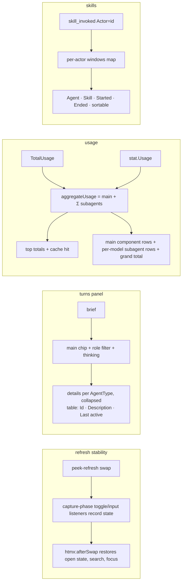

# Control server UI/UX improvements — Change Plan

route: `change`

## TLDR

- Fourteen dashboard adjustments from usage of v1.2.3, grouped into 8 independently shippable phases.
- **Turns:** section open by default; a User/Assistant filter beside the thinking toggle.
- **Subagent navigation:** the flat chip strip (60+ chips) becomes per-agent-type dropdowns under `main`, default collapsed, each holding a table of Id | Description | Last active; the Subagents usage detail gets the same grouping.
- **Refresh stability:** htmx swaps currently reset every open dropdown and drop search input — a small state-preservation script (mirroring the claude-configs dashboard pattern) keeps open/closed state, search text, and focus across swaps, so the page stops jumping.
- **Usage totals:** the top Usage panel accumulates main + all subagents (tokens, cache hit, cost); per-agent briefs stay per-agent. Started at / Last active become visible for the session and for every subagent.
- **Skills:** each invocation is attributed to its agent (main or subagent id), gets Started and Ended columns, and skill windows become per-agent so subagent skill events stop hijacking main's window.
- **Sorting (new design):** clickable column headers on the Subagents and Skills tables, server-side via `sort`/`dir` query params that survive refresh.
- **Touched files:** non-`.claude` files grouped into per-extension dropdowns plus a dedicated live search box; cap 1000 → 2000.
- **Limits:** `depth` default 100 → 200.
- **Instances:** on-disk cleanup of stale instance files (48 h) — OPEN question; Restart button gets breathing room.

## Context

- **Problem:** the subagent chip strip is unusable at 60+ subagents (screenshot), htmx `outerHTML` swaps reset dropdown state and make the page jump on every SSE refresh ([layout.html:22](control/templates/layout.html:22), [_turns.html:1](control/templates/_turns.html:1)), and the top Usage total counts main only ([session/session.go:263](session/session.go:263) adds to `TotalUsage`, [session/session.go:236](session/session.go:236) does not).
- **Originating plan:** [change-v1-2-3-dashboard.md](plans/control_server/design/change-v1-2-3-dashboard.md) — this plan continues its Instances/turns/files threads.
- **Reference implementation (user-given):** the claude-configs dashboard (`internal/server/` in that repo) — `details`-based grouping with count badges (`_id_families.html`), open-state snapshot/restore across htmx swaps (`config.html:66-84`, `proposals.html:134-169`), client-side filters re-applied on `htmx:afterSwap` (`routines_index.html:65-89`). Its spacing rhythm (card padding 12px 16px, section gaps 8–16px) is the style baseline. Sorting has no reference — designed from scratch here.
- **Grouping key:** subagents group by `SubagentStat.AgentType` — the runner names defined in `/Users/kevinpersonal/GolandProjects/claude-configs/agents` (`general-purpose`, `railroad-lane-*`, `implement-runner`, …).
- **Constraints:** fragments are htmx-swapped Go templates; the only JS is the inline layout script — new JS stays vanilla, dependency-free, in the layout; view logic lives in `control`; MCP tool output must not change shape except where flagged.

## Drivers

| ID | Observed | Wanted | Impact | Origin |
|---|---|---|---|---|
| DR1 | Turns section collapsed by default ([session_detail.html:22](control/templates/session_detail.html:22)) | Open by default | behavioral | request |
| DR2 | Subagent tabs are one flat wrap of 60+ chips ([_turns.html:19](control/templates/_turns.html:19)) | Per-agent-type dropdown tree under `main`, default collapsed, table inside: Id, Description (right of id), Last active immediately visible | behavioral | request + screenshot |
| DR3 | Every SSE `peek-refresh` swaps fragments `outerHTML`; open dropdowns collapse, page jumps | UI state (open sections, search text, focus) survives refresh; page stays put | behavioral | request |
| DR4 | Top Usage totals = main-agent usage only (`CurrentUsage` returns `TotalUsage`; subagent usage lives only in `stat.Usage`) | Top totals accumulate main + all subagents; per-agent info stays per-agent | behavioral | request + screenshot |
| DR5 | Subagents detail is one flat table sorted by start ([_usage_subagents.html](control/templates/_usage_subagents.html)) | Same per-type dropdown grouping; sortable | behavioral | request |
| DR6 | Touched files: alphabetical flat table + one `.claude` dropdown; no search | Per-extension dropdowns for non-claude files + dedicated search box | behavioral | request ("web search is not sufficient") |
| DR7 | `maxTouchedFiles = 1000` ([session/session.go:32](session/session.go:32)) | 2000 | behavioral | request |
| DR8 | `depth` default 100 ([cmd/start.go:326](cmd/start.go:326)) | 200 | config-touching | request ("max saved default turns to 200") |
| DR9 | Skills rows: Skill, Started, Duration, Tokens, Cost — no agent attribution, no end time, single shared skill window | Agent column (id enough), Started + Ended, sortable; correct per-agent attribution | behavioral | request |
| DR10 | Turns show user and assistant cards interleaved, no filter | Filter chips: all / user / assistant | behavioral | request |
| DR11 | Started at / Last active not shown in the Usage table or subagent rows (only derived durations) | Both visible in the main information table and per subagent | behavioral | request |
| DR12 | Instance *display* is cut at 48 h since v1.2.3, but the 227+ instance files stay on disk forever; screenshot still shows many rows | "Cleaned up after 48 hours" | behavioral (possibly disk-touching, [D13](#decisions) OPEN) | request |
| DR13 | Restart button sits directly under the last config widget ([_config.html:2](control/templates/_config.html:2)) | Visual separation | behavioral | request + screenshot |

## Scope

- **Opportunity menu (user's cut recorded first):**
  - **DR1–DR11, DR13:** requested — In.
  - **DR12 instances cleanup:** requested — mechanism OPEN ([D13](#decisions)).
- **In:**
  - **turns default:** `open` on the Turns section.
  - **subagent grouping:** turns tab tree + subagents detail grouping, both by `AgentType`.
  - **UI-state preservation:** one layout script — details open-state, search value, focus restore.
  - **usage aggregation:** aggregate token totals, cache hit, and cost (per-model) in the top panel.
  - **skills separation:** `AgentId` on `SkillStat`, per-actor skill windows, Agent/Started/Ended columns.
  - **sorting:** server-side `sort`/`dir` on the Skills and Subagents detail tables.
  - **files:** extension grouping + search; cap 2000.
  - **depth default 200:** flag help + docs.
  - **timestamps:** Started at / Last active rows in Usage panel and turns briefs; Last active column in Subagents table.
  - **turns role filter:** `role` query param, chips in the subtabs row.
  - **restart spacing:** own actions row with top margin.
- **Out:**
  - **client-side sorting:** all sorting is server-rendered; no sort JS.
  - **htmx morphing / idiomorph:** no new JS dependency; state restore covers the jump complaint.
  - **turns pagination / virtualization:** not requested.
  - **search on other tables:** search is for touched files only.
  - **instance file GC beyond instances:** session state files untouched.
- **Not changed:**
  - **JSON API shapes:** `/api/stats`, `/api/sessions/*` fields unchanged.
  - **MCP tools:** `session_get`/`session_list`/`session_events` output unchanged except the additive skills attribution ([Contracts](#contracts--sweeps)).
  - **per-agent briefs:** `turnsInfo` stays per-agent (explicitly requested).
  - **subagentTurnDepth:** already 200 ([session/session.go:36](session/session.go:36)).
- **Deferred findings:**
  - **skills usage attribution today is silently wrong:** a subagent's `skill_invoked` event closes main's active window and main-turn usage lands on the subagent's row — fixed here as part of DR9, noted because it affects historical readings.
  - **`maxSkillStats = 100`** may now truncate multi-subagent sessions (34 skills in the screenshot session); raised as part of DR9 (→ 200) rather than deferred.

## Assumptions

| Assumption | Reality | Location |
|---|---|---|
| Summing `TotalUsage` + Σ `stat.Usage` double-counts nothing | True: both paths dedupe through the shared `usageRequestIds` set before adding | [session/session.go:236](session/session.go:236), [session/session.go:263](session/session.go:263) |
| Subagent skill invocations are not observed | False: sidechain turns carry `skill_invoked` events with `Actor` = agent id, appended via `addSubagentTurn` → `AddEvent` → `openSkillWindow` | [claude/parser.go:672](claude/parser.go:672), [session/store.go:173](session/store.go:173) |
| Skills are persisted; adding fields needs migration | False: `Skills []*SkillStat` is `json:"-"` — in-memory view state only | [session/session.go:73](session/session.go:73) |
| Instance display still shows stale rows | Display cut at 48 h shipped in v1.2.3 ([control/stats.go:18](control/stats.go:18)); only the files persist — hence [D13](#decisions) OPEN | [control/stats.go:55](control/stats.go:55) |
| `details` open state can be preserved generically | True: `toggle` events reach a capture-phase body listener; claude-configs proves the snapshot/restore pattern across htmx swaps | claude-configs `config.html:66-84` |

## Current state

- [control/templates/session_detail.html](control/templates/session_detail.html) — 7 sections; only Usage `open` (:10), Turns collapsed (:22).
- [control/templates/layout.html:13-26](control/templates/layout.html:13) — inline script: error banner + SSE → `htmx.trigger(body, 'peek-refresh')`; no state preservation.
- [control/templates/_turns.html](control/templates/_turns.html) — brief table (:3), flat chip strip `.tabs.subtabs` with one anchor per subagent (:19-31), thinking toggle (:27), turn cards (:32-47).
- [control/sessions.go](control/sessions.go)
  - `turnsData`/`subagentTab`/`turnsInfo` (:57-85); `newMainInfo` (:87), `newSubagentInfo` (:295), `subagentTabLabel` (:328), `turnsQuery` (:314).
  - `handleTurnsFragment` (:251): builds tabs, fetches all turns, reverses.
  - `handleUsageFragment` (:194): totals from `sess.CurrentUsage()`, `?detail=` switch.
- [control/usage.go](control/usage.go) — `newCostData` (:82, per-model rates), `skillRow`/`newSkillsData` (:179-213, no agent, no end), `subagentRow`/`newSubagentsData` (:215-254, sorted by start asc), `filesData`/`newFilesData` (:262-282, flat + `.claude` split), `isClaudeConfigPath` (:284).
- [session/session.go](session/session.go) — `AddEvent` counts + `openSkillWindow` (:108-112); single `activeSkill` (:52); `SkillStat` without agent id (:146); `activeSkill.Usage.Add` only in main `AddTurn` (:270); `maxTouchedFiles = 1000` (:32); `maxSkillStats = 100` (:40).
- [control/stats.go](control/stats.go) — 48 h display filter (:55), `maxInstancesShown = 100`; no disk GC anywhere ([state/dir.go:218](state/dir.go:218) only reads).
- [control/templates/_config.html:2](control/templates/_config.html:2) — Restart button directly after the last config row.
- [cmd/start.go:326](cmd/start.go:326) — `flags.Int("depth", 100, …)`; docs at [docs/reference.md](docs/reference.md).

## Target state



- **Principle — view state lives in URLs or the state script, never lost in swaps.** Query params (`subagent`, `thinking`, `role`, `detail`, `sort`, `dir`) ride the fragment's own `hx-get`; ephemeral state (open dropdowns, search text) rides the layout script. Mechanism: htmx query-carrying swap targets + one vanilla JS IIFE.
- **Principle — aggregate at render, accumulate per agent.** Session state keeps per-agent usage exactly as today; the aggregate is computed in the handler. Mechanism: `Usage.Add` over a copy.
- **Principle — attribution follows the event's actor.** One skill-window map keyed by actor replaces the single pointer; each turn's usage feeds its own actor's window. Mechanism: `map[string]*SkillStat`.
- **Principle — sorting is a server concern.** Whitelisted sort keys per table, `slices.SortFunc`, `<th>` anchors that re-request the panel. Mechanism: query params on the existing `?detail=` panel URL.

## Behavior contract

- **Unchanged:** `/api/stats` and `/api/sessions/…` JSON shapes; MCP tool arguments and result text except the flagged skills view; per-agent turns briefs; turn card markup; Usage panel row set (only values and two new timestamp rows change); `.claude` files dropdown behavior.
- **Intentional changes (flagged):**
  - Top Usage token/cost numbers grow — they now include subagents (DR4).
  - Skills rows gain Agent/Ended, lose nothing; per-actor windows change duration/usage attribution vs. the (wrong) current numbers (DR9); `maxSkillStats` 100 → 200.
  - MCP `session_get` skills view gains an `agent` field — additive ([Contracts](#contracts--sweeps)).
  - Turns tab strip markup replaced by grouped dropdowns (DR2); tests keying on `.subtabs a` per subagent must change.
  - Subagents/Skills detail default order unchanged (started asc), but user-selected sort reorders rows.
  - `depth` default 100 → 200; `maxTouchedFiles` 1000 → 2000.
  - Restart button moves into a `.config-actions` div (DR13).
  - Instance files older than 48 h are deleted from disk ([D13](#decisions), user-approved).

## Decisions

| ID | Problem | Facts | Decision | Why |
|---|---|---|---|---|
| D1 | Grouped tabs: markup shape | Chip strip unusable at 60+; user suggested a table in the dropdown; claude-configs `id-family` pattern | `main` chip (+ role filter + thinking) stays a `.subtabs` row; below it, one `details.section.subagent-group` per `AgentType` (count badge in summary), indented 24px, default collapsed; body = table Id · Description · Last active; rows are `usage-row`-style hx-get links; the group containing the active subagent renders `open` server-side | Controllable: collapse state per group; debuggable: pure template change; table was the user's own suggestion |
| D2 | How UI state survives swaps | htmx `outerHTML` replaces subtrees; claude-configs snapshots open state across swaps; `toggle`/`focusin` reach capture-phase body listeners | One layout-script IIFE: record `details[data-key]` open state on `toggle`, `input[data-search-key]` value on `input`, focused search key on `focusin`; restore all three on `htmx:afterSwap` scoped to the swapped element | Server-side `open` can't know user intent per client; the reference repo proves this exact pattern; zero dependencies |
| D3 | Scope of the jump fix | Panel content is newest-first; height changes above the viewport cause jumps only when dropdowns collapse/expand unexpectedly | State restore only — no scroll-position math, no morphing library | Restoring open state removes the height discontinuities that cause the jumps; scroll hacks are fragile and the reference repo does without them |
| D4 | Aggregate usage shape | Dedup via shared `usageRequestIds` makes summing safe; subagents may run different models than main | `aggregateUsage(sess)` = copy of `CurrentUsage()` + `Usage.Add` over all `Subagents`; feeds top token rows, `TotalTokens`, `CachePercent` | One helper, view-layer only; session accumulation untouched |
| D5 | Aggregate cost with mixed models | `newCostData` prices one model; rates differ per model | Cost detail: main component rows as today, then one summary row per subagent model group (`Subagents <model> ×n`, Rate `—`, cost = `newCostData` on the group's summed usage), grand total = sum; `costData` gains an unexported `totalValue float64`; unknown-pricing groups render `?` and are excluded from the total | Per-model rates stay correct; no fake blended rate; table shape (Component/Tokens/Rate/Cost) unchanged |
| D6 | Sort mechanism (designed from scratch) | Panel already self-refreshes via its own `hx-get` URL; query params survive SSE swaps; no JS sorting exists anywhere | Server-side: `sort` + `dir` query params, whitelisted per detail table; `<th>` cells become anchors re-requesting the panel with toggled params and show `▲`/`▼` on the active column; `usageData` carries the params into the panel's refresh URL | Consistent with the `?detail=` design; state survives refresh for free; no client code |
| D7 | Which columns sort | Skills: agent/skill/started/ended/tokens; Subagents: agent/model/started/lastactive/tokens/cost | Those keys, whitelisted in `usageSortParam`; default order = today's (started asc); `dir` defaults asc, clicking the active column toggles | Covers the request; whitelist keeps the handler total |
| D8 | Skills separation depth | Single `activeSkill` shared by all actors; subagent events already flow through `openSkillWindow`; main-turn usage feeds whatever window is open | Per-actor windows: `activeSkills map[string]*SkillStat` keyed by `event.Actor` (`""` = main); `SkillStat` gains `AgentId`; `AddTurn` feeds actor `""`, `AddSubagentTurn` feeds `turn.SubagentId`; `HandlePromptBoundary` closes only main's window; subagent windows close on the actor's next skill event or session end | Display-only attribution would keep producing corrupt durations/usage; per-actor windows make the numbers true, which is what "separation" means |
| D9 | Skills Agent column content | "Id enough"; `subagentTabLabel` already renders `type suffix` labels | Reuse `subagentTabLabel` when the actor has a `SubagentStat`; literal `main` for actor `""`; raw 8-char prefix otherwise | Same identity rendering everywhere; zero new naming scheme |
| D10 | Extension grouping + search shape | Files list is flat + `.claude` dropdown; no search; claude-configs filters client-side re-applied after swap | Non-claude files: one `details` per lowercased extension (`(none)` for extensionless), sorted by file count desc then name, default collapsed, count badge; search `<input data-search-key>` above, filtering `tr[data-search]` rows case-insensitively across all groups incl. `.claude`; non-empty query force-opens groups with hits | Dropdown-per-extension is the literal request; live client-side search beats a server round-trip per keystroke; survives swaps via D2 |
| D11 | Role filter mechanics | Turn cards render from `data.Turns`; `turnsQuery` builds the panel URL | `role` query param (`user`/`assistant`, absent = all); chips `all·user·assistant` rendered before the thinking toggle; the handler filters `data.Turns` by `Role`; `turnsQuery` gains the param so tab/toggle links preserve it | Same URL-state pattern as `thinking`; server-side keeps the template dumb |
| D12 | Where Started/Last active appear | `StartedAt`/`LastActive` exist on session; `FirstActive`/`LastActive` on stats | Usage table: `Started at` + `Last active` rows above Session time; turns brief: same two rows (main: session times; subagent: first/last active); Subagents detail: new `Last active` column after Started | The literal request, three surfaces, all data already present |
| D13 | Instance cleanup mechanism | Display cut at 48 h already live; 227+ files accumulate on disk; no GC exists; an idle running instance may not rewrite its file for 48 h (file re-created on next persist) | [USER] on-disk GC: `Dir.PruneInstances(48h)` deletes instance JSONs with mtime older, called from `stats()` before reading | The 48 h display cut shipped in v1.2.3; only disk GC changes anything real; approved at plan review |
| D14 | Restart spacing | Button is last child after config rows | Wrap in `<div class="config-actions">`; CSS `.config-actions { margin-top: 20px; }` | Minimal, mirrors `.section-controls` spacing idiom |
| D15 | maxSkillStats with subagent skills counted | 100 cap; screenshot session has 34 main-window skills, subagent skills now become visible rows | Raise to 200 (matches `maxSubagentStats`) | Attribution change makes more rows legitimate; same ceiling philosophy as subagents |

## Open questions

None — Q1 (instance cleanup) resolved to on-disk GC at plan review ([D13](#decisions)).

## Baseline (verified)

N/A — change route (facts live in Current state / Assumptions).

## Exemplar & reuse

N/A — change route. Cross-cutting reuse: `details.section` collapsible + `usage-row` hover/click rows ([style.css:368,445](control/assets/style.css:368)), `subagentTabLabel` ([control/sessions.go:328](control/sessions.go:328)), `newCostData`/`displayTotalTokens` ([control/usage.go](control/usage.go)), `Usage.Add` ([session/usage.go](session/usage.go)), `ts` template func, `slices.SortFunc` ordering pattern, claude-configs state-restore JS shape (external reference, reimplemented).

## Changes

### Phase 1 — Defaults and spacing (DR1, DR7, DR8, DR13)

App works after this phase: Turns open on load, higher caps, separated Restart button.

#### 1. Turns section open (modified)
location: `control/templates/session_detail.html`

```diff
-<details class="section">
+<details class="section" open>
   <summary>Turns</summary>
   <div hx-get="/fragments/sessions/{{.Summary.Id}}/turns" hx-trigger="load, peek-refresh from:body throttle:1s" hx-swap="outerHTML">
```

#### 2. Caps and depth default (modified)
location: `session/session.go`, `cmd/start.go`, `docs/reference.md`

```diff
-const maxTouchedFiles = 1000
+const maxTouchedFiles = 2000
```

```diff
-const maxSkillStats = 100
+const maxSkillStats = 200
```

```diff
-	flags.Int("depth", 100, "Ring buffer size per session (max turns kept)")
+	flags.Int("depth", 200, "Ring buffer size per session (max turns kept)")
```

- `docs/reference.md`: every mention of the depth default 100 → 200 (grep sweep, see [Contracts](#contracts--sweeps)).

#### 3. Restart actions row (modified)
location: `control/templates/_config.html`, `control/assets/style.css`
ui: before = user's screenshot (button touching the slog-level widget); after-screenshot captured during implementation verification into `ui/restart-spacing-after.png`.

```diff
 {{range .Rows}}{{template "_config_row.html" .}}{{end}}
-{{if .RestartAvailable}}<button hx-post="/api/restart" hx-confirm="Restart peek-mcp?">Restart</button>{{end}}
+{{if .RestartAvailable}}<div class="config-actions"><button hx-post="/api/restart" hx-confirm="Restart peek-mcp?">Restart</button></div>{{end}}
```

```css
.config-actions { margin-top: 20px; }
```

### Phase 2 — Refresh stability (DR3)

App works after this phase: open dropdowns, search text, and focus survive every SSE-triggered swap; no more jumping. Foundation for phases 5–7.

#### 4. UI-state preservation script (new)
location: `control/templates/layout.html` (appended inside the existing inline `<script>` block)

Contract: any `details` carrying `data-key` and any `input` carrying `data-search-key` (+ `data-search-target` selector) is preserved automatically; templates opt in by attribute, no per-fragment JS.

```js
var uiOpen = {};
var uiSearch = {};
var uiFocusKey = null;

document.body.addEventListener('toggle', function (evt) {
  var key = evt.target.getAttribute && evt.target.getAttribute('data-key');
  if (key) uiOpen[key] = evt.target.open;
}, true);

function applySearch(input) {
  var root = document.querySelector(input.getAttribute('data-search-target'));
  if (!root) return;
  var query = input.value.toLowerCase();
  root.querySelectorAll('tr[data-search]').forEach(function (row) {
    row.hidden = query !== '' && row.getAttribute('data-search').indexOf(query) === -1;
  });
  root.querySelectorAll('details[data-search-group]').forEach(function (group) {
    if (query !== '') group.open = group.querySelectorAll('tr[data-search]:not([hidden])').length > 0;
  });
}

document.body.addEventListener('input', function (evt) {
  var key = evt.target.getAttribute && evt.target.getAttribute('data-search-key');
  if (key) {
    uiSearch[key] = evt.target.value;
    applySearch(evt.target);
  }
});
document.body.addEventListener('focusin', function (evt) {
  var key = evt.target.getAttribute && evt.target.getAttribute('data-search-key');
  uiFocusKey = key || null;
});

document.body.addEventListener('htmx:afterSwap', function (evt) {
  var root = evt.detail.elt;
  if (!root || !root.querySelectorAll) return;
  root.querySelectorAll('details[data-key]').forEach(function (d) {
    var key = d.getAttribute('data-key');
    if (key in uiOpen) d.open = uiOpen[key];
  });
  root.querySelectorAll('input[data-search-key]').forEach(function (input) {
    var key = input.getAttribute('data-search-key');
    if (key in uiSearch) input.value = uiSearch[key];
    if (uiFocusKey === key) {
      input.focus();
      input.setSelectionRange(input.value.length, input.value.length);
    }
    applySearch(input);
  });
});
```

- The existing error-banner `htmx:afterSwap` listener stays; this is additive in the same script tag.
- The `.claude` files dropdown gets its opt-in attribute here so the fix is observable immediately:

```diff
-<details class="section">
+<details class="section" data-key="files-claude" data-search-group>
   <summary>.claude <span class="meta">{{len .Config}} files</span></summary>
```

### Phase 3 — Session time visibility (DR11)

App works after this phase: Started at / Last active visible in the Usage panel, both briefs, and the Subagents table.

#### 5. Usage panel timestamps (modified)
location: `control/sessions.go`, `control/templates/_usage.html`

```diff
 type usageData struct {
 	Id           session.Id
 	Counters     session.Counters
+	StartedAt    time.Time
+	LastActive   time.Time
 	Usage        session.Usage
```

```diff
 		if !sess.StartedAt.IsZero() {
+			data.StartedAt = sess.StartedAt
+			data.LastActive = sess.LastActive
 			wall := sess.LastActive.Sub(sess.StartedAt)
```

```diff
 <table class="usage-table">
-  {{if .SessionTime}}<tr><th>Session time</th><td>{{.SessionTime}}</td></tr>
+  {{if .SessionTime}}<tr><th>Started at</th><td>{{ts .StartedAt}}</td></tr>
+  <tr><th>Last active</th><td>{{ts .LastActive}}</td></tr>
+  <tr><th>Session time</th><td>{{.SessionTime}}</td></tr>
   <tr><th>Idle time</th><td>{{.IdleTime}}</td></tr>
```

#### 6. Brief timestamps for main and subagents (modified)
location: `control/sessions.go`, `control/templates/_turns.html`

```diff
 type turnsInfo struct {
 	Id          string
 	Description string
 	Model       string
+	StartedAt   time.Time
+	LastActive  time.Time
 	Duration    string
```

- `newMainInfo`: set from `sess.StartedAt` / `sess.LastActive` (inside the existing `!IsZero` guard).
- `newSubagentInfo`: set from `stat.FirstActive` / `stat.LastActive`.

```diff
   {{if .Info.Model}}<tr><th>Model</th><td>{{.Info.Model}}</td></tr>{{end}}
+  {{if not .Info.StartedAt.IsZero}}<tr><th>Started at</th><td>{{ts .Info.StartedAt}}</td></tr>
+  <tr><th>Last active</th><td>{{ts .Info.LastActive}}</td></tr>{{end}}
   {{if .Info.Duration}}<tr><th>Runtime</th><td>{{.Info.Duration}}</td></tr>{{end}}
```

#### 7. Subagents table Last active column (modified)
location: `control/usage.go`, `control/templates/_usage_subagents.html`

```diff
 type subagentRow struct {
 	Agent       string
 	Description string
 	Model       string
 	StartedAt   time.Time
+	LastActive  time.Time
 	Duration    string
```

- `newSubagentsData`: `LastActive: stat.LastActive`.
- Template header + row gain the column between Started and Duration.

### Phase 4 — Usage accumulation (DR4)

App works after this phase: top Usage totals and cost include all subagents; briefs stay per-agent.

#### 8. Aggregate usage helper (new)
location: `control/usage.go`
mirrors: `newSubagentsData` iteration ([control/usage.go:237](control/usage.go:237))

```go
func aggregateUsage(sess *session.Session) session.Usage {
	total := *sess.CurrentUsage()
	for _, stat := range sess.Subagents {
		total.Add(stat.Usage)
	}
	return total
}
```

#### 9. Top totals from the aggregate (modified)
location: `control/sessions.go`

```diff
 	if !s.store.WithSession(id, func(sess *session.Session) {
 		data.Counters = sess.Counters
-		data.Usage = *sess.CurrentUsage()
+		data.Usage = aggregateUsage(sess)
 		data.TotalTokens = displayTotalTokens(&data.Usage)
 		data.CachePercent = cachePercent(sess.Agent, &data.Usage)
```

#### 10. Cost detail with subagent model groups (modified)
location: `control/usage.go`, `control/sessions.go`, `control/templates/_usage_cost.html`

```diff
 type costData struct {
 	Id    session.Id
 	Model string
 	AsOf  string
 	Known bool
 	Rows  []costRow
 	Total string
+	totalValue float64
 }
```

- `newCostData` records `totalValue` alongside the formatted `Total` (one added assignment).

```go
func newSessionCostData(id session.Id, sess *session.Session) costData {
	data := newCostData(id, sess.Agent, sess.Meta.Model, sess.CurrentUsage())

	models := make(map[string]*session.Usage)
	counts := make(map[string]int)
	for _, stat := range sess.Subagents {
		model := subagentModel(stat, sess)
		if models[model] == nil {
			models[model] = &session.Usage{}
		}
		models[model].Add(stat.Usage)
		counts[model]++
	}

	total := data.totalValue
	for _, model := range slices.Sorted(maps.Keys(models)) {
		group := newCostData(id, sess.Agent, model, models[model])
		row := costRow{
			Component: fmt.Sprintf("Subagents %s ×%d", model, counts[model]),
			Tokens:    displayTotalTokens(models[model]),
			Rate:      "—",
			Cost:      group.Total,
		}
		if !group.Known {
			row.Cost = "?"
		}
		data.Rows = append(data.Rows, row)
		total += group.totalValue
	}
	data.Total = fmt.Sprintf("$%.4f", total)
	return data
}
```

- `handleUsageFragment` case `usageDetailCost` calls `newSessionCostData(id, sess)` instead of `newCostData(…)`.
- `_usage_cost.html` needs no structural change (rows render as-is); footnote line extended: "Subagent rows are priced at their own model's rates."

### Phase 5 — Sorting + skills separation (DR9, part of DR5)

App works after this phase: Skills table shows Agent/Started/Ended with correct per-actor attribution; Skills and Subagents tables sort by clickable headers.

#### 11. Per-actor skill windows (modified)
location: `session/session.go`

```diff
 type Session struct {
 	// ...
-	activeSkill     *SkillStat
+	activeSkills    map[string]*SkillStat
```

```diff
 type SkillStat struct {
+	AgentId   string    `json:"agent_id,omitempty"`
 	Skill     string    `json:"skill"`
```

```diff
-func (s *Session) CloseSkillWindow(timestamp time.Time) {
-	if s.activeSkill == nil {
-		return
-	}
-	if s.activeSkill.EndedAt.IsZero() && !timestamp.IsZero() {
-		s.activeSkill.EndedAt = timestamp
-	}
-	s.activeSkill = nil
-}
+func (s *Session) CloseSkillWindow(timestamp time.Time) {
+	s.closeSkillWindow("", timestamp)
+}
+
+func (s *Session) closeSkillWindow(actor string, timestamp time.Time) {
+	stat, ok := s.activeSkills[actor]
+	if !ok {
+		return
+	}
+	if stat.EndedAt.IsZero() && !timestamp.IsZero() {
+		stat.EndedAt = timestamp
+	}
+	delete(s.activeSkills, actor)
+}
```

```diff
 func (s *Session) openSkillWindow(event *Event) {
-	s.CloseSkillWindow(event.Timestamp)
+	s.closeSkillWindow(event.Actor, event.Timestamp)
 	if len(s.Skills) >= maxSkillStats {
 		return
 	}
+	if s.activeSkills == nil {
+		s.activeSkills = make(map[string]*SkillStat)
+	}

 	stat := &SkillStat{
+		AgentId:   event.Actor,
 		Skill:     event.Skill.Skill,
 		Args:      event.Skill.Args,
 		StartedAt: event.Timestamp,
 	}
 	s.Skills = append(s.Skills, stat)
-	s.activeSkill = stat
+	s.activeSkills[event.Actor] = stat
 }
```

```diff
 func (s *Session) AddTurn(nextTurn *Turn) {
 	// ...
-			if s.activeSkill != nil {
-				s.activeSkill.Usage.Add(nextTurn.Usage)
+			if stat, ok := s.activeSkills[""]; ok {
+				stat.Usage.Add(nextTurn.Usage)
```

```diff
 func (s *Session) AddSubagentTurn(turn *Turn) {
 	// ... after the existing usage dedup/add block
+	if turn.Usage != nil {
+		if skill, ok := s.activeSkills[turn.SubagentId]; ok {
+			skill.Usage.Add(*turn.Usage)
+		}
+	}
```

- Exact insertion point: mirror the guard structure around the existing `stat.Usage.Add` in `AddSubagentTurn` — the skill add happens under the same request-id dedup condition, so skill usage is deduped identically.
- `HandlePromptBoundary` keeps calling `CloseSkillWindow` (main only) — subagent windows close on their actor's next skill event; a still-open window renders `running`, as today.

#### 12. Skills rows: agent, ended, sorting (modified)
location: `control/usage.go`, `control/templates/_usage_skills.html`

```diff
 type skillRow struct {
+	Agent     string
 	Skill     string
 	StartedAt time.Time
+	EndedAt   time.Time
 	Duration  string
 	Tokens    int
 	Cost      string
 }
```

```go
func skillAgentLabel(agentId string, sess *session.Session) string {
	if agentId == "" {
		return "main"
	}
	if stat, ok := sess.Subagents[agentId]; ok {
		return subagentTabLabel(agentId, stat)
	}
	runes := []rune(agentId)
	if len(runes) > 8 {
		return string(runes[:8])
	}
	return agentId
}
```

- `newSkillsData` fills `Agent: skillAgentLabel(skill.AgentId, sess)` and `EndedAt: skill.EndedAt`, then sorts by the request's sort key (Change 13).
- Template columns: Agent | Skill | Started | Ended | Duration | Tokens | Cost; Ended cell renders `{{if .EndedAt.IsZero}}running{{else}}{{ts .EndedAt}}{{end}}`.

#### 13. Sort infrastructure (new + modified)
location: `control/usage.go`, `control/sessions.go`, `control/templates/_usage.html`, `_usage_skills.html`, `_usage_subagents.html`, `control/assets/style.css`

```go
const (
	sortDirAsc  = "asc"
	sortDirDesc = "desc"
)

var usageSortKeys = map[string][]string{
	usageDetailSkills:    {"agent", "skill", "started", "ended", "tokens"},
	usageDetailSubagents: {"agent", "model", "started", "lastactive", "tokens", "cost"},
}

func usageSortParam(r *http.Request, detail string) (string, string) {
	key := r.URL.Query().Get("sort")
	if !slices.Contains(usageSortKeys[detail], key) {
		return "", ""
	}
	if r.URL.Query().Get("dir") == sortDirDesc {
		return key, sortDirDesc
	}
	return key, sortDirAsc
}
```

```go
type sortState struct {
	Id     session.Id
	Detail string
	Key    string
	Dir    string
}

func (s sortState) Query(column string) string {
	dir := sortDirAsc
	if s.Key == column && s.Dir == sortDirAsc {
		dir = sortDirDesc
	}
	return fmt.Sprintf("?detail=%s&sort=%s&dir=%s", s.Detail, column, dir)
}

func (s sortState) Marker(column string) string {
	if s.Key != column {
		return ""
	}
	if s.Dir == sortDirDesc {
		return " ▼"
	}
	return " ▲"
}
```

- `usageData` gains `Sort sortState`; `handleUsageFragment` fills it from `usageSortParam` and the panel's self-refresh `hx-get` URL in `_usage.html:1` appends `&sort=…&dir=…` when set (same conditional style as `{{if .Detail}}`).
- `skillsData` and `subagentsData` gain `Sort sortState`; their builders apply it:

```go
func sortSkillRows(rows []skillRow, key, dir string) {
	if key == "" {
		return
	}
	slices.SortFunc(rows, func(a, b skillRow) int {
		var c int
		switch key {
		case "agent":
			c = strings.Compare(a.Agent, b.Agent)
		case "skill":
			c = strings.Compare(a.Skill, b.Skill)
		case "started":
			c = a.StartedAt.Compare(b.StartedAt)
		case "ended":
			c = a.EndedAt.Compare(b.EndedAt)
		case "tokens":
			c = a.Tokens - b.Tokens
		}
		if dir == sortDirDesc {
			return -c
		}
		return c
	})
}
```

- `sortSubagentRows` mirrors it for the subagents keys (cost compares the underlying float via a kept `costValue float64` on `subagentRow`).
- Header cells become links (pattern once, both tables mirror):

```html
<th><a hx-get="/fragments/sessions/{{.Id}}/usage{{.Sort.Query "agent"}}" hx-target="closest .usage-panel" hx-swap="outerHTML">Agent{{.Sort.Marker "agent"}}</a></th>
```

```css
.usage-table th a { color: inherit; text-decoration: none; cursor: pointer; }
.usage-table th a:hover { color: var(--neon); }
```

### Phase 6 — Grouped subagent navigation (DR2, DR5)

App works after this phase: turns tabs and the Subagents detail are grouped by agent type, collapsed by default.

#### 14. Turns tab tree (modified)
location: `control/sessions.go`, `control/templates/_turns.html`, `control/assets/style.css`
ui: before = user's screenshot (60+ flat chips); after-screenshot captured during implementation verification into `ui/turns-groups-after.png`.

```diff
 type turnsData struct {
 	Id           session.Id
 	Turns        []*session.Turn
 	Subagent     string
-	Tabs         []subagentTab
+	Groups       []subagentGroup
+	HasSubagents bool
 	Info         *turnsInfo
```

```go
type subagentGroup struct {
	Name string
	Open bool
	Rows []subagentTab
}
```

```diff
 type subagentTab struct {
 	Id          string
 	Label       string
 	Description string
+	LastActive  time.Time
+	Active      bool
 	Query       string
 }
```

```go
func newSubagentGroups(sess *session.Session, selected string, showThinking bool) []subagentGroup {
	byType := make(map[string]*subagentGroup)
	var groups []*subagentGroup
	for _, agentId := range sess.SubagentIds() {
		stat := sess.Subagents[agentId]
		name := stat.AgentType
		if name == "" {
			name = "unknown"
		}
		group, ok := byType[name]
		if !ok {
			group = &subagentGroup{Name: name}
			byType[name] = group
			groups = append(groups, group)
		}
		group.Rows = append(group.Rows, subagentTab{
			Id:          agentId,
			Label:       subagentTabLabel(agentId, stat),
			Description: stat.Description,
			LastActive:  stat.LastActive,
			Active:      agentId == selected,
			Query:       turnsQuery(agentId, showThinking),
		})
		if agentId == selected {
			group.Open = true
		}
	}
	slices.SortFunc(groups, func(a, b *subagentGroup) int { return strings.Compare(a.Name, b.Name) })
	result := make([]subagentGroup, 0, len(groups))
	for _, group := range groups {
		result = append(result, *group)
	}
	return result
}
```

- `handleTurnsFragment` replaces the tab-building loop with `data.Groups = newSubagentGroups(sess, data.Subagent, data.ShowThinking)`; `data.HasSubagents = len(data.Groups) > 0`.
- `turnsQuery` calls in this helper pass the role param through once Change 16 lands (signature grows there; this phase compiles against the current signature if shipped first — ship 16 before or together, see phase note below).
- Template: the per-subagent anchors leave the `.subtabs` row; groups render beneath:

```diff
 {{if or .HasSubagents .HasThinking}}
 <div class="tabs subtabs">
-  {{if .Tabs}}
+  {{if .HasSubagents}}
   <a hx-get="/fragments/sessions/{{.Id}}/turns{{.MainQuery}}" hx-target="closest .turns-panel" hx-swap="outerHTML" {{if not .Subagent}}class="active"{{end}}>main</a>
-  {{range .Tabs}}
-  <a hx-get="..." ...>{{.Label}}</a>
-  {{end}}
   {{end}}
   {{if .HasThinking}}
   <label class="thinking-toggle" ...> thinking</label>
   {{end}}
 </div>
 {{end}}
+{{if .Groups}}
+<div class="subagent-groups">
+  {{range .Groups}}
+  <details class="section subagent-group" data-key="turns-group-{{$root.Id}}-{{.Name}}"{{if .Open}} open{{end}}>
+    <summary>{{.Name}} <span class="meta">{{len .Rows}}</span></summary>
+    <table class="usage-table">
+      <tr><th>Id</th><th>Description</th><th>Last active</th></tr>
+      {{range .Rows}}
+      <tr class="usage-row{{if .Active}} active-row{{end}}" hx-get="/fragments/sessions/{{$root.Id}}/turns{{.Query}}" hx-target="closest .turns-panel" hx-swap="outerHTML">
+        <th>{{.Label}}</th><td>{{.Description}}</td><td>{{ts .LastActive}}</td>
+      </tr>
+      {{end}}
+    </table>
+  </details>
+  {{end}}
+</div>
+{{end}}
```

```css
.subagent-groups { margin: 0 0 20px 24px; }
.subagent-groups details.section { margin-bottom: 6px; }
tr.active-row th, tr.active-row td { color: var(--neon); }
```

- Server-side `Open` (selected group) + `data-key` restore (D2) cooperate: user-toggled state wins after the first interaction.

#### 15. Subagents detail grouped (modified)
location: `control/usage.go`, `control/templates/_usage_subagents.html`

- `subagentsData` becomes grouped: `Groups []subagentTableGroup` where each group is `{Name string; Rows []subagentRow}`; built by the same type-keyed loop as Change 14 (sorted groups; rows sorted by the sort state within each group — sorting scope is per group).
- Template: per group a `details.section` (`data-key="usage-subagents-{{$root.Id}}-{{.Name}}"`, collapsed, summary `{{.Name}} <span class="meta">{{len .Rows}}</span>`) containing today's table (with Last active column and sortable headers from Phases 3/5); Agent column drops (redundant inside its group).

### Phase 7 — Touched files: extension groups + search (DR6)

App works after this phase: files searchable, non-claude files grouped by extension.

#### 16. Extension grouping (modified)
location: `control/usage.go`, `control/templates/_usage_files.html`
ui: before = user's screenshot (flat path table); after-screenshot captured during implementation verification into `ui/files-groups-after.png`.

```diff
 type filesData struct {
 	Id     session.Id
-	Files  []fileRow
+	Groups []fileGroup
 	Config []fileRow
 }
```

```go
type fileGroup struct {
	Ext   string
	Files []fileRow
}
```

```go
func fileExtension(path string) string {
	ext := strings.ToLower(filepath.Ext(path))
	if ext == "" {
		return "(none)"
	}
	return ext
}
```

- `newFilesData`: bucket non-claude rows by `fileExtension`, sort rows by path within each bucket, sort groups by file count desc then extension asc.
- Template:

```html
{{if or .Groups .Config}}
<input class="files-search" type="search" placeholder="filter paths…"
       data-search-key="files-{{.Id}}" data-search-target="#files-detail-{{.Id}}">
<div id="files-detail-{{.Id}}">
{{range .Groups}}
<details class="section" data-key="files-{{$.Id}}-{{.Ext}}" data-search-group>
  <summary>{{.Ext}} <span class="meta">{{len .Files}} files</span></summary>
  {{template "usage_files_table" .Files}}
</details>
{{end}}
{{if .Config}}
<details class="section" data-key="files-claude" data-search-group>
  <summary>.claude <span class="meta">{{len .Config}} files</span></summary>
  {{template "usage_files_table" .Config}}
</details>
{{end}}
</div>
{{else}}
<div class="empty">No touched files.</div>
{{end}}
```

- `usage_files_table` rows gain the search hook: `<tr data-search="{{lower .Path}}">` (add a `lower` template func alongside `ts` in [server.go:65](control/server.go:65), or store the lowered path on `fileRow` — take the template func, it is reusable).

```css
.files-search { width: 100%; max-width: 480px; margin-bottom: 12px; background: var(--surface); border: 1px solid var(--line); border-radius: var(--radius); color: var(--text); padding: 6px 10px; font: inherit; }
.files-search:focus { border-color: var(--brand-emerald); outline: none; }
```

### Phase 8 — Turns role filter (DR10)

App works after this phase: turn cards filterable by role.

#### 17. Role filter (modified)
location: `control/sessions.go`, `control/templates/_turns.html`

- `turnsQuery(subagent string, showThinking bool)` grows a `role string` param (all call sites updated, incl. Change 14's helper); `turnsData` gains `Role string` plus prebuilt chip queries `RoleQueries map[string]string` (`""`, `"user"`, `"assistant"` — map avoids three fields; built in the handler, no template logic).
- Handler: read `role` query param (whitelist `user`/`assistant`, else empty); after the clone+reverse, filter:

```go
if data.Role != "" {
	filtered := data.Turns[:0]
	for _, turn := range data.Turns {
		if string(turn.Role) == data.Role {
			filtered = append(filtered, turn)
		}
	}
	data.Turns = filtered
}
```

- (Safe on the cloned slice from [control/sessions.go:281](control/sessions.go:281).)
- Chips in the `.subtabs` row before the thinking toggle, `active` class on the current one:

```html
<a hx-get="/fragments/sessions/{{.Id}}/turns{{index .RoleQueries ""}}" hx-target="closest .turns-panel" hx-swap="outerHTML" {{if not .Role}}class="active"{{end}}>all</a>
<a hx-get="/fragments/sessions/{{.Id}}/turns{{index .RoleQueries "user"}}" hx-target="closest .turns-panel" hx-swap="outerHTML" {{if eq .Role "user"}}class="active"{{end}}>user</a>
<a hx-get="/fragments/sessions/{{.Id}}/turns{{index .RoleQueries "assistant"}}" hx-target="closest .turns-panel" hx-swap="outerHTML" {{if eq .Role "assistant"}}class="active"{{end}}>assistant</a>
```

### Phase 9 — Instance disk cleanup (DR12, [D13](#decisions))

#### 18. Prune stale instance files (new)
location: `state/dir.go`, `control/stats.go`

```go
func (d *Dir) PruneInstances(olderThan time.Duration) {
	dir := filepath.Join(d.root, instancesDir)
	entries, err := os.ReadDir(dir)
	if err != nil {
		return
	}
	for _, entry := range entries {
		if entry.IsDir() || !strings.HasSuffix(entry.Name(), ".json") {
			continue
		}
		info, err := entry.Info()
		if err != nil {
			continue
		}
		if time.Since(info.ModTime()) > olderThan {
			os.Remove(filepath.Join(dir, entry.Name()))
		}
	}
}
```

```diff
 	if s.stateDir != nil {
+		s.stateDir.PruneInstances(instanceRetention)
 		resp.StateDiskBytes = s.stateDir.Size()
```

- Mtime-based: a running instance rewrites its file on every persist; a 48 h-idle running instance loses its file and re-creates it on the next persist — accepted (visible as a brief disappearance, no data loss).
- No goroutine: pruning runs synchronously in the stats read path (every 10 s poll, ~200 files — cheap).

## Hot items

- **None of the baseline hot classes** are touched: no SQL, no new goroutines/channels/locks (all store access stays inside the existing `WithSession` lock; the prune is synchronous), no new interfaces or generics, no generated formats, no anonymous structs (all new types are named), no weakened guards.
- **UI-touching changes** (Changes 3, 14, 16): before-state = the user's screenshots attached to the request; after-screenshots are captured during implementation verification with the runbook capture scripts into the persisted plan's `ui/` (`restart-spacing-after.png`, `turns-groups-after.png`, `files-groups-after.png`), per the visual-evidence convention of [change-v1-2-3-dashboard.md](plans/control_server/design/change-v1-2-3-dashboard.md).

## Tests

| Location.Method | Cases | Comment |
|---|---|---|
| session/session_test.go `TestSkillWindowsPerActor` | main + subagent skills open concurrently, neither closes the other<br>subagent turn usage lands on that actor's open window only<br>main turn usage lands on main's window only<br>prompt boundary closes main's window, leaves subagent windows<br>`AgentId` set from the event actor | Core of D8; extends the existing skill-window tests |
| session/session_test.go `TestAddFileTouchCap` | cap now 2000 | Adjust existing constant assertion |
| control/usage_test.go `aggregateUsage` | main only<br>main + two subagents summed<br>no double count with shared request ids (constructed usages) | View-layer aggregation |
| control/usage_test.go `newSessionCostData` | single model collapses to main rows + one group row, grand total sums<br>mixed models → one group row per model at its own rates<br>unknown model group → `?`, excluded from total | D5 |
| control/usage_test.go `sortSkillRows` / `sortSubagentRows` | each whitelisted key asc + desc<br>empty key = order preserved | D6/D7 |
| control/usage_test.go `usageSortParam` | valid key+dir passthrough<br>invalid key → empty<br>invalid dir → asc | Whitelist |
| control/usage_test.go `fileExtension` / `newFilesData` | extension lowered, dotless → `(none)`<br>groups ordered by count desc then name<br>`.claude` rows stay out of extension groups | D10 |
| control/pages_test.go (existing fragment render tests) | turns fragment renders groups + role chips (selector updates from `.subtabs a` per subagent to `.subagent-group`)<br>usage fragment renders Started at/Last active rows<br>skills fragment renders Agent/Ended columns | Update to new markup |
| state/dir_test.go `TestPruneInstances` | old file removed, fresh file kept, non-json ignored<br>missing dir is a no-op | Phase 9 only |
| not tested: the layout JS | — | no JS test harness in repo; covered by the runbook smoke pass |

## Test runbook

- **turns-groups** — dashboard `/sessions/{id}` of a live multi-subagent session: groups collapsed, expand one, trigger activity (SSE refresh) — group stays open, page does not jump.
- **role-filter** — same page: click `user` chip, only user cards; refresh keeps the filter.
- **usage-aggregate** — `/fragments/sessions/{id}/usage` vs. MCP `session_get`: top total = main + Σ subagents; brief totals unchanged per agent.
- **sorting** — `/fragments/sessions/{id}/usage?detail=skills&sort=agent&dir=desc`: rows ordered; header marker rendered.
- **files-search** — files detail: type a fragment, non-matching rows hidden, matching groups open; SSE refresh preserves query + focus.
- **instances-prune** (D13 = a) — stats page after seeding a stale instance file (`stats.sh` pattern in `plans/control_server/runbooks/`): file gone from disk, table unchanged for fresh rows.
- Existing scripts under `plans/control_server/runbooks/` (`stats.sh`, `usage_details.sh`, `turns_default.sh`) re-verify the Behavior contract's unchanged surfaces.

## Contracts & sweeps

| Contract | Sides | Sweep |
|---|---|---|
| `SkillStat` view in MCP `session_get` | session ↔ tools (`newSkillStatViews`, [tools/viewmodels_events.go:228](tools/viewmodels_events.go:228)) | Add `agent` field to the view (additive); grep `SkillStat` across tools/, docs/ |
| `depth` default | cmd flag ↔ docs ↔ config help | `grep -rn "100" docs/reference.md cmd/start.go control/config.go` scoped to depth mentions — all say 200 |
| `turnsQuery` signature | control internal, all call sites | grep `turnsQuery(` to zero stale arities |
| `subagentTab`/`Tabs` removal | control templates ↔ pages tests | grep `\.Tabs`/`subtabs` in templates + tests to zero stale uses |
| `filesData.Files` removal | control ↔ templates ↔ tests | grep `\.Files` in `_usage_files.html` context to zero |
| htmx `data-key` namespace | layout JS ↔ every opted-in template | grep `data-key=` — keys unique per element (id-scoped) |
| `/api/*` JSON | server ↔ external consumers | runbook scripts diff field sets before/after — unchanged |

## Verification

- [ ] `make build` and `make test` pass (or the repo's equivalent targets — discover in Makefile first).
- [ ] Open a live multi-subagent session: Turns section is open on page load without a click.
- [ ] Subagent chips are gone; per-type dropdowns render collapsed with counts; expanding shows Id | Description | Last active; clicking a row swaps to that subagent and its group stays open.
- [ ] Leave a dropdown open, wait for SSE activity: no collapse, no page jump.
- [ ] Top Usage total tokens = brief(main) + Σ brief(subagent) totals for the same session (spot-check the screenshot session's arithmetic).
- [ ] Cost detail shows `Subagents <model> ×n` rows and a grand total ≥ the previous main-only total.
- [ ] Usage table shows Started at and Last active; both briefs show them; Subagents table has the Last active column.
- [ ] Skills detail: subagent-invoked skills carry their agent label; Ended shows a timestamp or `running`; clicking Started twice flips the order and shows ▼.
- [ ] Turns role chips: `user` shows only user cards, `assistant` only assistant, `all` restores; state survives a refresh.
- [ ] Files detail: extension dropdowns collapsed with counts; searching `lane1` hides non-matching rows, opens matching groups, keeps focus while SSE refreshes fire.
- [ ] Session with zero subagents: no group markup, no empty dropdowns; zero touched files: "No touched files." unchanged.
- [ ] `peek start --help` shows depth default 200; docs/reference.md agrees.
- [ ] Restart button visibly separated from the last config row.
- [ ] Stale instance file deleted after one stats poll; running instances' files untouched.
- [ ] MCP `session_get` output diff vs. v1.2.3 shows only the additive skills `agent` field.

## Stop conditions

| ID | Condition | Action |
|---|---|---|
| S1 | An approved signature/contract can't hold as planned | Stop and report. Never improvise architecture mid-edit |
| S2 | Second failed fix on the same mechanism | Stop, research the actual cause, redesign. No third band-aid |
| S3 | Missing prerequisite (generated code, running infra) | Run the producing step; if infrastructure is down, ask. Never skip validation |
| S4 | Discovered work materially exceeds approved scope | Ask before continuing |
| S5 | Same kind of bug twice: in own diff → fix all in diff; pre-existing outside → report and ask | Sweeps are the user's call |
| S6 | Structural obstacle tempts a new abstraction | Stop and report; relocate, don't indirect |
| S7 | A Behavior-contract "unchanged" surface (JSON API, MCP result text) would have to change | Stop and report |
| S8 | The state-preservation script needs more than the layout IIFE (a framework, a build step, per-fragment scripts) | Stop — the vanilla-JS constraint is design intent |
| S9 | Instance pruning would touch anything other than `<state>/instances/*.json` | Stop — the GC scope is exactly the instance files ([D13](#decisions)) |

## Changelog

| Date | Trigger | What changed |
|---|---|---|
| — | initial | plan created |
| 2026-09-06 | Q: instance cleanup mechanism | D13 resolved to [USER] on-disk GC; Phase 9 ungated; S9 rescoped |
