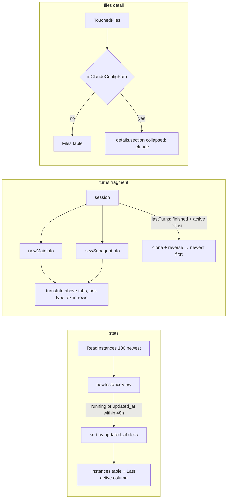

# Peek v1.2.3 dashboard adjustments — Change Plan

route: `change`

## TLDR

- Five dashboard adjustments from usage of v1.2.2, each independently shippable, then the v1.2.3 release bump.
- **Instances table:** exited instances older than 48 hours disappear, rows are ordered by last activity, and a "Last active" column shows that timestamp.
- **Turns brief:** the id/model/runtime/cost table moves above the tab row, exists for main as well as for every subagent, and breaks tokens down per type (input, output, cache creation, cache read) like the Usage panel.
- **Transcript order:** newest turn first, and the dashboard shows every turn the session holds instead of the last 20. The in-progress turn is placed where it belongs in time; today it is prepended before the cut, so a session with more than 20 turns silently loses it.
- **All turns kept:** sessions keep only `depth` turns (default 20) in a ring buffer, so "show all" needs the cap raised. The default goes to 100.
- **Touched files:** the per-session cap rises from 500 to 1000 paths.
- **Touched files:** files under a `.claude` config directory (global `~/.claude`, per-repo `.claude/`) move into a collapsed dropdown; worktree files under `.claude/worktrees/<name>/` stay in the main list because they are ordinary project files.
- **MCP protocol:** mcp-go v0.52.0 already speaks the 2025-11-25 protocol; no defect has come from the unused extras. The one cheap win is the `readOnlyHint` annotation on the three tools, so annotation-aware clients treat peek as safe. Output schemas, tasks, and elicitation stay out.

## Context

- **Problem:** the stats Instances table lists the 100 newest instance files by file mod-time regardless of liveness, with no last-active column ([control/stats.go:47](control/stats.go:47)); the turns panel shows the brief only for subagents and below the tabs ([control/templates/_turns.html:19](control/templates/_turns.html:19)); turns render oldest-first with the in-progress turn prepended before the tail cut ([session/session.go:329](session/session.go:329)); the touched-files list is one flat table ([control/templates/_usage_files.html](control/templates/_usage_files.html)).
- **Originating plans:** [change-instance-stats.md](plans/control_server/design/change-instance-stats.md) (Instances table), [peek_transcript_extension/design/raw.md](plans/peek_transcript_extension/design/raw.md) (subagent tabs + info panel), [usage_skills_tracking.md](plans/control_server/design/usage_skills_tracking.md) (touched files detail).
- **Constraints:** fragments are htmx-swapped Go templates, no JS beyond the layout; view logic lives in `control`, ordering of the session package's turn buffers is shared with the MCP tools.
- **Real data inspected:** live control server on port 42442 (v1.2.2, 227 instance files, 108 of them with `updated_at` older than 48 hours, 12 running); touched-files fragment of session aa8674f6 (paths under `~/.claude/context-required/…`, `~/.claude/plans/…`, and `<repo>/.claude/worktrees/<name>/internal/…`).
- **Release:** version is bumped by `make git-release VERSION=1.2.3` (Makefile, `cmd/version.go`, `mcpb/manifest.json`, commit + tag) — [Makefile:55](Makefile:55).

## Drivers

| ID | Observed | Wanted | Impact | Origin |
|---|---|---|---|---|
| DR1 | Instances table shows exited instances from days ago (108 of 227 files are older than 48 h) | Exited instances older than 48 h are not shown | behavioral | request ("truncated if dead for more than 48 hours") |
| DR2 | Rows ordered by file mod-time; no last-active timestamp visible ("Started" + "Ran for" only) | Rows ordered by last activity, newest first, with a "Last active" column | behavioral | request ("order by last active, more info") |
| DR3 | Brief (Id, Description, Model, Runtime, Tokens, Cost) rendered below the tab row and only for subagents | Brief above the tabs, for main and every subagent | behavioral | request + screenshot |
| DR4 | Brief shows one "Tokens" total | Per-token-type rows like the Usage panel: input, output, cache creation, cache read, total | behavioral | request ("breakdown per token type, like above") |
| DR5 | Turns render oldest-first; the in-progress turn is prepended and dropped once more than 20 turns exist | Newest turn at the top, flowing down to the oldest; in-progress turn is the top row | behavioral (dashboard) + contract-touching (turn order in `session_get`, D5) | request ("latest at the top? then it must flow differently") + grounding |
| DR6 | Touched files are one flat sorted table | `.claude` config files in a collapsed dropdown, other files shown as today | behavioral | request ("any .claude stuff moved to dropdown, default collapsed") |
| DR7 | Tools are registered without annotations ([tools/tools.go:56](tools/tools.go:56)) | Every peek tool advertises `readOnlyHint: true` | contract-touching (`tools/list` payload) | request ("MCP protocol improvements, helpful?"), confirmed in plan review |
| DR8 | Dashboard renders the last 20 turns (`tools.DefaultReturnedTurns`); sessions keep only `depth` = 20 turns ([cmd/start.go:326](cmd/start.go:326), [session/store.go:507](session/store.go:507)) | All turns of a session are kept and the dashboard shows all of them | behavioral + config-touching (`depth` default) | plan feedback ("we need all turns and show all turns") |
| DR9 | `maxTouchedFiles = 500` ([session/session.go:31](session/session.go:31)) | 1000 | behavioral | plan feedback ("increase touched_files read to 1000") |

## Scope

- **Opportunity menu (user's cut recorded first):**
  - **DR1, DR2 instances:** requested — In.
  - **DR3, DR4 brief:** requested — In.
  - **DR5 transcript order:** requested — In; the in-progress-turn bug found in grounding is fixed at its source ([D5](#decisions)).
  - **DR6 files dropdown:** requested — In.
  - **DR7 MCP protocol:** `readOnlyHint` only — In ([D7](#decisions), user-decided).
  - **DR8 all turns:** requested — dashboard shows all buffered turns; `depth` default 20 → 100 ([D11](#decisions), user-decided).
  - **DR9 touched files 1000:** requested — In.
  - **release bump 1.2.3:** In, last step.
- **In:**
  - **all turns rendered:** the turns fragment requests every buffered turn (`session.AllTurns`), no 20-cut.
  - **touched files cap:** `maxTouchedFiles` 500 → 1000.
  - **instances cut:** exited instances with `updated_at` older than 48 h are skipped; running ones always shown.
  - **instances order:** sort by `updated_at` descending; new "Last active" column.
  - **brief:** one `turnsInfo` view for main and subagents, rendered above the tabs, with per-type token rows.
  - **turn order:** dashboard renders newest-first; session buffers place the in-progress turn last.
  - **files split:** `isClaudeConfigPath` classifier; config files in a collapsed `details.section`.
- **Out:**
  - **instance retention on disk:** file GC unchanged; the 48 h cut is display-only.
  - **MCP output schemas / tasks / elicitation:** no consumer in peek's clients; not taken.
  - **auto-scroll or paging of turns:** not requested.
  - **filter UI for files (text box, toggles):** "basic" was requested; the classifier is the filter.
- **Not changed:**
  - **`/api/stats` JSON shape:** `instances[]` keeps its fields; only the row set and order change.
  - **`/api/sessions/{id}/turns` JSON:** stays oldest-first (only the in-progress placement changes under D5 a).
  - **Usage panel:** untouched; the brief mirrors its rows.
- **Deferred findings:**
  - **`Ran for` of running instances:** computed as now − started, unrelated to the last invocation; left as is.
  - **`config-server 1.0` client rows:** the hub registers as a peek client; cosmetic, not code.

## Assumptions

| Assumption | Reality | Location |
|---|---|---|
| ".claude stuff" = every path containing a `.claude` segment | False for worktree sessions: every project file sits under `<repo>/.claude/worktrees/<name>/…` — a naive segment match would hide the whole file list | live fragment of session aa8674f6, `/fragments/sessions/…/usage?detail=files` |
| The brief's token total is the subagent's full usage | True: `SubagentStat.Usage` is per subagent; main's `TotalUsage` counts main turns only (subagent turns go through `AddSubagentTurn`) | [session/session.go:266](session/session.go:266), [session/session.go:197](session/session.go:197) |
| Turns are stored newest-first somewhere and only need reversing | False: buffers are chronological (`Push` appends), `Last(n)` takes the tail; the in-progress turn is prepended at index 0 before the tail cut | [session/turn_buffer.go:31](session/turn_buffer.go:31), [session/session.go:329](session/session.go:329) |
| Instance mod-time ordering equals last-active ordering | True in practice (`persist` writes on every change) but the timestamp is not displayed; `updated_at` is the record's own field | [tools/invocations.go](tools/invocations.go), [state/dir.go:240](state/dir.go:240) |
| Peek might lag the MCP protocol | False: mcp-go v0.52.0, `LATEST_PROTOCOL_VERSION = "2025-11-25"`, `WithReadOnlyHintAnnotation` available; no defect on record from any unused protocol feature | [go.mod:8](go.mod:8), vendor/github.com/mark3labs/mcp-go/mcp/types.go:139, mcp/tools.go:944 |

## Current state

- [control/stats.go](control/stats.go) — 103 lines
  - `stats()` reads the 100 newest instance files, unmarshals, appends in mod-time order ([:47](control/stats.go:47)).
  - `newInstanceView` computes `Running`, `RanFor`, totals ([:65](control/stats.go:65)).
- [control/templates/_stats.html:19](control/templates/_stats.html:19) — Instances table: Client, PID, Transport, Started, Ran for, Status, Invocations, Bytes.
- [control/sessions.go](control/sessions.go) — 435 lines
  - `turnsData.Info *subagentInfo` ([:62](control/sessions.go:62)); `subagentInfo` struct ([:77](control/sessions.go:77)).
  - `handleTurnsFragment` sets `Info` only in the subagent branch ([:253](control/sessions.go:253)); main branch only sets `Turns` ([:257](control/sessions.go:257)).
  - `newSubagentInfo` ([:274](control/sessions.go:274)) builds the brief from `SubagentStat`.
- [control/templates/_turns.html](control/templates/_turns.html) — tabs block first ([:4](control/templates/_turns.html:4)), info table second ([:19](control/templates/_turns.html:19)), turns cards ranged in slice order ([:30](control/templates/_turns.html:30)).
- [control/assets/style.css:137](control/assets/style.css:137) — `.subtabs`, `.turns-panel .subtabs`, `.turns-panel .subagent-info` margins.
- [session/session.go:322](session/session.go:322) — `Turns` and `SubagentTurns` duplicate the prepend-then-`Last` logic (2×).
- [control/usage.go:256](control/usage.go:256) — `fileRow`, `filesData`, `newFilesData` (flat sorted list).
- [control/templates/_usage_files.html](control/templates/_usage_files.html) — one table or "No touched files."
- [tools/tools.go:56](tools/tools.go:56) — 3 tools (`session_get`, `session_list`, `session_events`), none with annotations.

## Target state



- **Principle — single source of truth:** one `turnsInfo` type feeds both main and subagent briefs; one `lastTurns` helper replaces the duplicated buffer assembly. Mechanism: Go struct reuse + template `{{if .Info}}`.
- **Principle — view-layer ordering:** newest-first is a dashboard presentation choice, done on a cloned slice in the handler; the MCP tools keep chronological output. Mechanism: `slices.Clone` + `slices.Reverse`.
- **Principle — classify at ingestion of the view:** the `.claude` split happens once in `newFilesData`; the template only renders two lists. Mechanism: path-segment scan, `details.section` (house collapsible, mirrors `_memory.html`).

## Behavior contract

- **Unchanged:** `/api/stats` field names and types; `/api/sessions/{id}/turns` remains oldest-first; MCP tool names, arguments, and result text; Usage panel rows; `session_events` touched-files output.
- **Intentional changes (flagged):**
  - Instances rows: exited instances older than 48 h omitted; order by `updated_at` desc (DR1, DR2).
  - Turns fragment: main gains a brief; brief above the tabs; brief rows change (DR3, DR4); test class `subagent-info` renamed `turns-info`.
  - Turns fragment: newest-first (DR5).
  - The in-progress turn moves from index 0 to the end of `Session.Turns` / `SubagentTurns` output — this also reorders the MCP `session_get` turn list and the `/api/…/turns` JSON (chronological end position, no longer dropped beyond the buffer depth) (D5).
  - Files detail: two lists instead of one (DR6).
  - `tools/list` advertises `annotations.readOnlyHint: true` on every peek tool (DR7).

## Decisions

| ID | Problem | Facts | Decision | Why |
|---|---|---|---|---|
| D1 | Where the 48 h cut lives | `ReadInstances` sorts by mod-time and caps at 100; records carry `updated_at` | Filter in `stats()` after unmarshal: skip when `!Running && time.Since(UpdatedAt) > instanceRetention` (48 h const in `control/stats.go`); keep the 100 cap as the read bound | Debuggable: one place, one constant; the state package stays a dumb reader; running instances never vanish |
| D2 | Order key for "last active" | `updated_at` is refreshed on every persist (start, invocation, shutdown) | Sort `resp.Instances` by `UpdatedAt` desc; display it as "Last active" | Literal reading of the request; running idle instances rank by their real last write, status column still shows "running" |
| D3 | Brief placement and shape | tabs div precedes info table; main has no info | Info table becomes the first child of `.turns-panel`; `turnsInfo` replaces `subagentInfo`; main builds it via `newMainInfo` (Id = session id, Description = title, Model = meta model, Runtime = last active − started) | One type, two constructors; template unchanged between main and subagent |
| D4 | Which token rows | Usage panel rows ([_usage.html:8](control/templates/_usage.html:8)); `Usage` has 5m/1h cache-write tiers | Input, Output, Cache creation, Cache read, Cached input (codex), Reasoning output, Total — same conditional rows as the Usage panel; no 5m/1h split (that is the cost detail's job) | "Like above" = mirror the panel; tier split would duplicate the cost table |
| D5 | In-progress turn placement | prepended at index 0 then tail-cut ([session.go:329](session/session.go:329)); dropped when > n turns | Fix in `session`: one `lastTurns(active, finished, n)` helper appending the active turn last; MCP output gains the active turn at the end, never dropped (flagged in Behavior contract) | Only placement where "latest at the top" holds for a live session; a dashboard-only reversal would put the live turn at the bottom |
| D6 | `.claude` classifier | worktree paths contain `.claude/worktrees/<name>/`; global config is `~/.claude/…`; per-repo config is `<repo>/.claude/…` | Path is config iff it has a `.claude` segment whose next segment is not `worktrees`; split on `/` and `\` | Correct for global, per-repo, and nested worktree config; platform-independent; no filesystem access |
| D7 | MCP protocol features | mcp-go exposes annotations, output schema, elicitation, tasks; peek tools are read-only; results are text; no defect on record | [USER] `mcp.WithReadOnlyHintAnnotation(true)` on all 3 tools, nothing else | 3-line change; annotation-aware clients can treat peek as safe. Output schema has no consumer and would rewrite every result path; tasks/elicitation have no peek use case |
| D8 | Reversal safety | `Last(n)` returns a subslice of the buffer's backing array | `slices.Clone` before `slices.Reverse` in the handler, after `WithSession` returns | Reversing in place would mutate session state under the store lock's protection but outside it after return |
| D9 | Files template structure | one table markup needed twice | `{{define "usage_files_table"}}` inside `_usage_files.html`, called for both lists | No duplicated markup; `ParseFS` set supports file-local defines |
| D10 | Release step | `make git-release` commits and tags locally | Last verification item; push of commit and tag stays with the user | Tag push is outward-facing |
| D11 | "All turns" vs the ring buffer | `depth` caps turns per session at 20 (flag, `PEEK_DEPTH`, persistable config key in [docs/reference.md:57](docs/reference.md:57)); 576 sessions live in the store today; `Last(n)` clamps `n` to the buffer length | [USER] Keep the ring buffer; raise the `depth` default 20 → 100 (flag help, docs); the dashboard requests `session.AllTurns` | Predictable memory ceiling, no config surface removal; 100 covers the sessions seen in the store |
| D12 | How the dashboard asks for "all" | `Last(n)` clamps `n > len` to len | `const AllTurns = math.MaxInt` in `session`; handler passes it to `Turns` / `SubagentTurns` | Zero new methods; the existing clamp does the work; MCP tools keep `n` |

## Open questions

None.

## Baseline (verified)

N/A — change route (facts live in Current state / Assumptions).

## Exemplar & reuse

N/A — change route. Cross-cutting reuse: `displayTotalTokens`, `newCostData`, `subagentModel` ([control/usage.go](control/usage.go)); `details.section` collapsible ([_memory.html:7](control/templates/_memory.html:7)); `ts` template func; `slices.SortFunc` ordering pattern ([control/usage.go:252](control/usage.go:252)).

## Changes

### Phase 1 — Instances: 48 h cut, last-active order and column

App works after this phase: stats page and `/api/stats` show only live-or-recent instances, newest activity first.

#### 1. Filter and sort instance views (modified)
location: `control/stats.go`

```diff
 const (
 	pageStats         = "stats"
 	maxInstancesShown = 100
+	instanceRetention = 48 * time.Hour
 )
```

```diff
 func (s *Server) stats() statsResponse {
 	// ...
 	if s.stateDir != nil {
 		resp.StateDiskBytes = s.stateDir.Size()
 		for _, content := range s.stateDir.ReadInstances(maxInstancesShown) {
 			var record tools.InstanceRecord
 			if err := json.Unmarshal([]byte(content), &record); err != nil {
 				continue
 			}
-			resp.Instances = append(resp.Instances, newInstanceView(record, resp.PID))
+			view := newInstanceView(record, resp.PID)
+			if !view.Running && time.Since(record.UpdatedAt) > instanceRetention {
+				continue
+			}
+			resp.Instances = append(resp.Instances, view)
 		}
+		slices.SortFunc(resp.Instances, func(a, b instanceView) int { return b.UpdatedAt.Compare(a.UpdatedAt) })
 	}
```

- Import `slices`.
- `UpdatedAt` is promoted from the embedded `tools.InstanceRecord`; JSON already carries `updated_at` — no new field.

#### 2. Last active column (modified)
location: `control/templates/_stats.html`
ui: before = live page text captured 2026-09-04 22:33 (rows mixed running/exited, ordered by mod-time, no last-active column); after-screenshot captured during implementation verification into the persisted plan's `ui/instances-after.png`.

```diff
 <table class="evidence-table">
-  <tr><th>Client</th><th>PID</th><th>Transport</th><th>Started</th><th>Ran for</th><th>Status</th><th>Invocations</th><th>Bytes</th></tr>
+  <tr><th>Client</th><th>PID</th><th>Transport</th><th>Started</th><th>Last active</th><th>Ran for</th><th>Status</th><th>Invocations</th><th>Bytes</th></tr>
   {{range .Instances}}
   <tr>
     <td>{{range $i, $c := .Clients}}{{if $i}}<br>{{end}}{{$c}}{{end}}</td>
     <td>{{.PID}}{{if .Self}} (this){{end}}</td>
     <td>{{.Transport}}</td>
     <td>{{ts .StartedAt}}</td>
+    <td>{{ts .UpdatedAt}}</td>
     <td>{{.RanFor}}</td>
```

### Phase 2 — Turns brief: above the tabs, for main, per token type

App works after this phase: every turns view opens with the brief table, then the tab row, then the cards.

#### 3. turnsInfo for main and subagents (modified)
location: `control/sessions.go`
mirrors: `newSubagentsData` ([control/usage.go:237](control/usage.go:237)) for the subagent constructor; `handleUsageFragment` ([control/sessions.go:186](control/sessions.go:186)) for the main runtime

```diff
 type turnsData struct {
 	Id           session.Id
 	Turns        []*session.Turn
 	Subagent     string
 	Tabs         []subagentTab
-	Info         *subagentInfo
+	Info         *turnsInfo
 	// ...
 }
```

```diff
-type subagentInfo struct {
+type turnsInfo struct {
 	Id          string
 	Description string
 	Model       string
 	Duration    string
+	Usage       session.Usage
 	Tokens      int
 	Cost        string
 }
```

```go
func newMainInfo(sess *session.Session) *turnsInfo {
	usage := sess.CurrentUsage()
	cost := newCostData(sess.Meta.SessionId, sess.Agent, sess.Meta.Model, usage)
	info := &turnsInfo{
		Id:          string(sess.Meta.SessionId),
		Description: sess.Title,
		Model:       sess.Meta.Model,
		Usage:       *usage,
		Tokens:      displayTotalTokens(usage),
		Cost:        cost.Total,
	}
	if !sess.StartedAt.IsZero() {
		info.Duration = sess.LastActive.Sub(sess.StartedAt).Round(time.Second).String()
	}
	return info
}
```

```diff
-func newSubagentInfo(id session.Id, agentId string, sess *session.Session) *subagentInfo {
+func newSubagentInfo(id session.Id, agentId string, sess *session.Session) *turnsInfo {
 	stat, ok := sess.Subagents[agentId]
 	if !ok {
 		return nil
 	}

 	model := subagentModel(stat, sess)
 	cost := newCostData(id, sess.Agent, model, &stat.Usage)
-	return &subagentInfo{
+	return &turnsInfo{
 		Id:          agentId,
 		Description: stat.Description,
 		Model:       model,
 		Duration:    stat.LastActive.Sub(stat.FirstActive).Round(time.Second).String(),
+		Usage:       stat.Usage,
 		Tokens:      displayTotalTokens(&stat.Usage),
 		Cost:        cost.Total,
 	}
 }
```

```diff
 func (s *Server) handleTurnsFragment(w http.ResponseWriter, r *http.Request) {
 	// ...
 		if data.Subagent != "" {
 			if turns, ok := sess.SubagentTurns(data.Subagent, tools.DefaultReturnedTurns); ok {
 				data.Turns = turns
 				data.Info = newSubagentInfo(id, data.Subagent, sess)
 			}
 			return
 		}
 		data.Turns = sess.Turns(tools.DefaultReturnedTurns)
+		data.Info = newMainInfo(sess)
 	}) {
```

#### 4. Brief markup above the tabs (modified)
location: `control/templates/_turns.html`
ui: before = user's screenshot (tabs row, then Id/Description/Model/Runtime/Tokens/Cost table, then cards); after-screenshot captured during implementation verification into `ui/turns-brief-after.png`.

```diff
 <div class="turns-panel" hx-get="/fragments/sessions/{{.Id}}/turns{{.Query}}" hx-trigger="peek-refresh from:body throttle:1s" hx-swap="outerHTML">
 {{$root := .}}
+{{if .Info}}
+<table class="usage-table turns-info">
+  <tr><th>Id</th><td>{{.Info.Id}}</td></tr>
+  {{if .Info.Description}}<tr><th>Description</th><td>{{.Info.Description}}</td></tr>{{end}}
+  {{if .Info.Model}}<tr><th>Model</th><td>{{.Info.Model}}</td></tr>{{end}}
+  {{if .Info.Duration}}<tr><th>Runtime</th><td>{{.Info.Duration}}</td></tr>{{end}}
+  <tr><th>Input tokens</th><td>{{.Info.Usage.InputTokens}}</td></tr>
+  <tr><th>Output tokens</th><td>{{.Info.Usage.OutputTokens}}</td></tr>
+  {{if .Info.Usage.CacheCreationInputTokens}}<tr><th>Cache creation</th><td>{{.Info.Usage.CacheCreationInputTokens}}</td></tr>{{end}}
+  {{if .Info.Usage.CacheReadInputTokens}}<tr><th>Cache read</th><td>{{.Info.Usage.CacheReadInputTokens}}</td></tr>{{end}}
+  {{if .Info.Usage.CachedInputTokens}}<tr><th>Cached input</th><td>{{.Info.Usage.CachedInputTokens}}</td></tr>{{end}}
+  {{if .Info.Usage.ReasoningOutputTokens}}<tr><th>Reasoning output</th><td>{{.Info.Usage.ReasoningOutputTokens}}</td></tr>{{end}}
+  <tr><th>Total tokens</th><td>{{.Info.Tokens}}</td></tr>
+  {{if .Info.Cost}}<tr><th>Cost</th><td>{{.Info.Cost}}</td></tr>{{end}}
+</table>
+{{end}}
 {{if or .Tabs .HasThinking}}
 <div class="tabs subtabs">
   // ... unchanged
 </div>
 {{end}}
-{{if .Info}}
-<table class="usage-table subagent-info">
-  <tr><th>Id</th><td>{{.Info.Id}}</td></tr>
-  {{if .Info.Description}}<tr><th>Description</th><td>{{.Info.Description}}</td></tr>{{end}}
-  {{if .Info.Model}}<tr><th>Model</th><td>{{.Info.Model}}</td></tr>{{end}}
-  <tr><th>Runtime</th><td>{{.Info.Duration}}</td></tr>
-  <tr><th>Tokens</th><td>{{.Info.Tokens}}</td></tr>
-  {{if .Info.Cost}}<tr><th>Cost</th><td>{{.Info.Cost}}</td></tr>{{end}}
-</table>
-{{end}}
 {{if .Turns}}
```

#### 5. Spacing for the new order (modified)
location: `control/assets/style.css`

```diff
-.turns-panel .subtabs { margin: 12px 0 20px; }
-.turns-panel .subagent-info { margin-bottom: 20px; }
+.turns-panel .turns-info { margin: 12px 0 20px; }
+.turns-panel .subtabs { margin: 0 0 20px; }
```

### Phase 3 — Transcript newest-first

App works after this phase: cards render newest at the top; under D5 a the in-progress turn is the first card and is never dropped.

#### 6. Clone and reverse in the fragment handler (modified)
location: `control/sessions.go`

```diff
 func (s *Server) handleTurnsFragment(w http.ResponseWriter, r *http.Request) {
 	// ...
 	}) {
 		respondNotFound("unknown session", w)
 		return
 	}
+	data.Turns = slices.Clone(data.Turns)
+	slices.Reverse(data.Turns)
 	for _, turn := range data.Turns {
```

#### 7. In-progress turn placed last (modified — only under D5 a)
location: `session/session.go`

```diff
 func (s *Session) Turns(number int) []*Turn {
-	if s.TurnActive == nil {
-		return s.TurnsFinished.Last(number)
-	}
-
-	buffer := &TurnBuffer{
-		capacity: s.TurnsFinished.capacity,
-		items:    append([]*Turn{s.TurnActive}, s.TurnsFinished.items...),
-	}
-
-	return buffer.Last(number)
+	return lastTurns(s.TurnActive, s.TurnsFinished, number)
 }

 func (s *Session) SubagentTurns(agentId string, number int) ([]*Turn, bool) {
 	stat, ok := s.Subagents[agentId]
 	if !ok {
 		return nil, false
 	}
-
-	if stat.TurnActive == nil {
-		return stat.Turns.Last(number), true
-	}
-
-	buffer := &TurnBuffer{
-		capacity: stat.Turns.capacity,
-		items:    append([]*Turn{stat.TurnActive}, stat.Turns.items...),
-	}
-
-	return buffer.Last(number), true
+	return lastTurns(stat.TurnActive, stat.Turns, number), true
 }
```

```go
func lastTurns(active *Turn, finished *TurnBuffer, number int) []*Turn {
	if active == nil {
		return finished.Last(number)
	}

	buffer := &TurnBuffer{
		capacity: finished.capacity,
		items:    append(slices.Clone(finished.items), active),
	}

	return buffer.Last(number)
}
```

#### 7a. All buffered turns in the fragment (modified)
location: `session/session.go`, `control/sessions.go`

```go
const AllTurns = math.MaxInt
```

```diff
 func (s *Server) handleTurnsFragment(w http.ResponseWriter, r *http.Request) {
 	// ...
 		if data.Subagent != "" {
-			if turns, ok := sess.SubagentTurns(data.Subagent, tools.DefaultReturnedTurns); ok {
+			if turns, ok := sess.SubagentTurns(data.Subagent, session.AllTurns); ok {
 				data.Turns = turns
 				data.Info = newSubagentInfo(id, data.Subagent, sess)
 			}
 			return
 		}
-		data.Turns = sess.Turns(tools.DefaultReturnedTurns)
+		data.Turns = sess.Turns(session.AllTurns)
 		data.Info = newMainInfo(sess)
```

- `tools` import in `control/sessions.go` stays (used by `tools.NewEventEntries`, `tools.UTF8SafeSlice`).

#### 7b. Turn cap raised (modified)
location: `cmd/start.go`, `docs/reference.md`

```diff
-	flags.Int("depth", 20, "Ring buffer size per session (max turns kept)")
+	flags.Int("depth", 100, "Ring buffer size per session (max turns kept)")
```

- Sweep every "20" that documents the depth default: [docs/reference.md:10](docs/reference.md:10), [docs/reference.md:17](docs/reference.md:17), the config editor's default display if it renders one ([control/config.go](control/config.go)). `subagentTurnDepth = 200` ([session/session.go:35](session/session.go:35)) already exceeds 100 and stays.

### Phase 4 — Touched files: `.claude` config in a collapsed dropdown

#### 7c. Touched files cap (modified)
location: `session/session.go`

```diff
-const maxTouchedFiles = 500
+const maxTouchedFiles = 1000
```

App works after this phase: files detail shows project files first, then a collapsed ".claude" section.

#### 8. Classifier and split view (modified)
location: `control/usage.go`
mirrors: `newFilesData` sort pattern ([control/usage.go:267](control/usage.go:267))

```diff
 type filesData struct {
-	Id    session.Id
-	Files []fileRow
+	Id     session.Id
+	Files  []fileRow
+	Config []fileRow
 }

 func newFilesData(sess *session.Session) *filesData {
 	data := &filesData{Id: sess.Meta.SessionId}
 	for path, counts := range sess.TouchedFiles {
-		data.Files = append(data.Files, fileRow{Path: path, Reads: counts.Reads, Writes: counts.Writes})
+		row := fileRow{Path: path, Reads: counts.Reads, Writes: counts.Writes}
+		if isClaudeConfigPath(path) {
+			data.Config = append(data.Config, row)
+			continue
+		}
+		data.Files = append(data.Files, row)
 	}
-	slices.SortFunc(data.Files, func(a, b fileRow) int { return strings.Compare(a.Path, b.Path) })
+	byPath := func(a, b fileRow) int { return strings.Compare(a.Path, b.Path) }
+	slices.SortFunc(data.Files, byPath)
+	slices.SortFunc(data.Config, byPath)
 	return data
 }
```

```go
func isClaudeConfigPath(path string) bool {
	segments := strings.FieldsFunc(path, func(r rune) bool { return r == '/' || r == '\\' })
	for i, segment := range segments {
		if segment != ".claude" {
			continue
		}
		if i+1 < len(segments) && segments[i+1] == "worktrees" {
			continue
		}
		return true
	}
	return false
}
```

#### 9. Two lists, config collapsed (modified)
location: `control/templates/_usage_files.html`
mirrors: `details.section` in [_memory.html:7](control/templates/_memory.html:7)
ui: before = flat table (live fragment of session aa8674f6, 44 rows mixing `~/.claude/context-required/…` with worktree project files); after-screenshot captured during implementation verification into `ui/files-after.png`.

```html
{{define "usage_files_table"}}
<table class="usage-table">
  <tr><th>Path</th><th>Reads</th><th>Writes</th></tr>
  {{range .}}<tr><th>{{.Path}}</th><td>{{.Reads}}</td><td>{{.Writes}}</td></tr>
  {{end}}
</table>
{{end}}
{{if or .Files .Config}}
{{if .Files}}{{template "usage_files_table" .Files}}{{end}}
{{if .Config}}
<details class="section">
  <summary>.claude <span class="meta">{{len .Config}} files</span></summary>
  {{template "usage_files_table" .Config}}
</details>
{{end}}
{{else}}
<div class="empty">No touched files.</div>
{{end}}
```

### Phase 5 — MCP tool annotations (only under D7 a)

#### 10. readOnlyHint on every tool (modified)
location: `tools/tools.go`

```diff
 	sessionGet := mcp.NewTool("session_get",
 		mcp.WithDescription("Returns session data (turns, events, plan, git diff, uncommitted diff, auto-memory) for a session. ..."),
+		mcp.WithReadOnlyHintAnnotation(true),
 		mcp.WithString("id",
```

- Same one-line addition on `session_list` ([tools/tools.go:105](tools/tools.go:105)) and `session_events` ([tools/tools.go:117](tools/tools.go:117)).

### Phase 5 — MCP tool annotations

App works after this phase: `tools/list` carries the hint; tool behavior unchanged.

#### 10. readOnlyHint on every tool (modified)
location: `tools/tools.go`

```diff
 	sessionGet := mcp.NewTool("session_get",
 		mcp.WithDescription("Returns session data (turns, events, plan, git diff, uncommitted diff, auto-memory) for a session. ..."),
+		mcp.WithReadOnlyHintAnnotation(true),
 		mcp.WithString("id",
```

- Same one-line addition on `session_list` ([tools/tools.go:105](tools/tools.go:105)) and `session_events` ([tools/tools.go:117](tools/tools.go:117)).

### Phase 6 — Release

#### 11. Version bump (modified)
location: `Makefile`, `cmd/version.go`, `mcpb/manifest.json` — via `make git-release VERSION=1.2.3`; produces the commit `cmd: release v1.2.3` and tag `v1.2.3`.

## Hot items

- **Goroutines/locking — none touched.** `lastTurns` (§7) runs inside `store.WithSession` like the code it replaces; the handler's clone-and-reverse (§6, D8) happens on the cloned slice after the store callback returned.
- **UI-touching changes (§2, §4, §9):** after-screenshots are mandatory implementation-verification items (capture script hung twice against the live server in plan mode; the previously approved instance-stats plan used the same deferral). Stop condition S8 applies if the rendering deviates from the templates above.

## Tests

| Location.Method | Cases | Comment |
|---|---|---|
| control/api_test.go TestStatsInstances | exited record with `updated_at` 49 h ago → absent from `instances`<br>exited record 47 h ago → present<br>two present records → ordered by `updated_at` desc | extends the existing test's record fixture |
| control/pages_test.go TestStatsFragment | body contains `<th>Last active</th>` | |
| control/pages_test.go TestTurnsFragment_SubagentTabs | subagent view: `usage-table turns-info`, `<th>Input tokens</th><td>10</td>`, `<th>Output tokens</th><td>20</td>`, `<th>Total tokens</th><td>30</td>`<br>main view: `turns-info` present with `<th>Id</th><td>s1</td>`<br>`turns-info` markup appears before `tabs subtabs` (index compare) | replaces the `subagent-info` assertions |
| control/pages_test.go TestTurnsFragment | "It does things." appears before "What does this do?" (index compare)<br>25 finished turns in a depth-100 store → all 25 rendered (no 20-cut) | newest-first, all turns |
| tools/tools_test.go (registration test) | every registered tool has `Annotations.ReadOnlyHint` set to true | nearest: existing tool-registration test |
| session/session_test.go TestAddTouchedFile | 1000th distinct path is kept, 1001st is dropped | update the existing cap test if present, else add |
| session/session_test.go TestTurnsActiveLast (D5 a) | active turn is the last element of `Turns(10)`<br>with `capacity+1` turns, `Turns(n)` keeps the active turn and drops the oldest<br>`SubagentTurns` same two cases | mirrors the existing `SubagentTurns` test at [:169](session/session_test.go:169) |
| control/usage_test.go TestIsClaudeConfigPath | `/Users/k/.claude/plans/x.md` → true<br>`/repo/.claude/settings.json` → true<br>`/repo/.claude/worktrees/w/control/api.go` → false<br>`/repo/.claude/worktrees/w/.claude/settings.json` → true<br>`C:\Users\k\.claude\x.md` → true<br>`/repo/control/api.go` → false | table-driven, new |
| control/usage_test.go TestUsageFilesDetail | mixed touched files → project rows in the first table, `<details class="section">` with `.claude` summary and config rows<br>only config files → no first table, details present<br>no files → "No touched files." | extends existing test at [:286](control/usage_test.go:286) |
| tools/tools_test.go (D7 a) | `tools/list` result marks every tool `annotations.readOnlyHint == true` | nearest: existing tool-registration test in tools_test.go |

- not tested: CSS spacing (visual, covered by the after-screenshots).

## Test runbook

- **stats-instances** — `plans/control_server/runbooks/stats.sh` re-verifies `/api/stats`; check `instances[]` has no exited entry with `updated_at` older than 48 h and is `updated_at`-descending (`jq '[.instances[].updated_at]'`).
- **turns-brief** — open `/sessions/<id>` Turns section for a session with subagents (e.g. `1a292f97…`): brief above tabs for main and for a subagent tab.
- **turns-order** — same page: first card is the newest turn; for a live session the in-progress turn is the first card (D5 a).
- **files-dropdown** — `/fragments/sessions/aa8674f6-1e0b-4bea-8b90-37c4677d3b84/usage?detail=files`: worktree files listed, `~/.claude/…` files inside the collapsed `.claude` details.
- **tools-list** (D7 a) — from a Claude Code session, `ToolSearch select:mcp__peek-mcp__session_list` and inspect the schema for `readOnlyHint`.

## Contracts & sweeps

| Contract | Sides | Sweep |
|---|---|---|
| `Session.Turns` / `SubagentTurns` ordering (D5 a): active turn last instead of first | session ↔ tools `session_get` ↔ control `/api/…/turns` and fragment ↔ peek skill docs | grep `TurnActive` in session/ and tools/ tests; docs/tools.md wording on turn order (none found — confirm) |
| `filesData` shape gains `Config` | control ↔ `_usage_files.html` only | grep `filesData` / `newFilesData` to two sites |
| `subagentInfo` → `turnsInfo`, CSS class `subagent-info` → `turns-info` | control ↔ templates ↔ style.css ↔ pages_test.go | grep `subagent-info` and `subagentInfo` to zero |
| `tools/list` annotations (D7 a) | tools ↔ every MCP client | grep `NewTool(` — every tool carries the hint |
| `tools/list` annotations (DR7) | tools ↔ every MCP client | grep `NewTool(` — every tool carries the hint |
| Version string 1.2.3 | Makefile ↔ cmd/version.go ↔ mcpb/manifest.json | `make git-release` handles all three; grep `1.2.2` to zero outside git history |
| `depth` default 20 → 100 (D11) | cmd flag ↔ env `PEEK_DEPTH` ↔ config key ↔ docs/reference.md ↔ README | grep `depth` and "20" default mentions; every documented default reads 100 |

## Verification

- [ ] `make test` — all packages green.
- [ ] `make build-local` — builds.
- [ ] Run `make serve-http` on a spare control port and open `/stats` — Instances table has a "Last active" column, no exited row older than 48 h, rows descend by that column; capture `ui/instances-after.png`.
- [ ] `curl /api/stats | jq '[.instances[] | select(.running|not) | .updated_at]'` — every value within the last 48 h.
- [ ] Open Turns for session `1a292f97-faa5-44ad-97f0-5f8f16a7dcf3` — brief table above the tab row for main (Id = session id, per-type token rows, cost), and for a `general-purpose` tab; capture `ui/turns-brief-after.png`.
- [ ] Same page — first card is the newest turn; with a live session, the in-progress assistant turn is the top card (D5 a).
- [ ] Same page on a long session (this one, 1a292f97…) — card count equals min(turns, 100), above 20 (run with the new default, no `--depth` flag).
- [ ] `peek-mcp start --help` and docs/reference.md — depth default reads 100.
- [ ] A session that reads more than 500 distinct files — `?detail=files` lists past 500 (verify with `session_events` touched-files count).
- [ ] `curl /api/sessions/<id>/turns | jq '.turns[-1].timestamp'` — remains the newest timestamp (JSON stays chronological).
- [ ] Open `?detail=files` for session `aa8674f6…` — worktree files in the open table, `~/.claude/context-required/…` and `~/.claude/plans/…` inside the collapsed `.claude` details; capture `ui/files-after.png`.
- [ ] Degenerate: a session touching only `.claude` files shows only the details block; a session with no files shows "No touched files."; a state dir with only stale exited instances renders no Instances section.
- [ ] (D7 a) From a fresh Claude Code session, load a peek tool schema — `annotations.readOnlyHint` is true; note whether the client stopped prompting for peek tools.
- [ ] From a fresh Claude Code session, load a peek tool schema via ToolSearch — `annotations.readOnlyHint` is true.
- [ ] Persist this plan as `plans/control_server/design/change-v1-2-3-dashboard.md` with the three after-PNGs under `design/ui/`.
- [ ] `make git-release VERSION=1.2.3` — commit `cmd: release v1.2.3` and tag `v1.2.3` exist locally; push left to the user.

## Stop conditions

| ID | Condition | Action |
|---|---|---|
| S1 | An approved signature/contract can't hold as planned | Stop and report — never improvise architecture mid-edit |
| S2 | Second failed fix on the same mechanism | Stop, research actual cause, redesign — no third band-aid |
| S3 | Missing prerequisite (generated code, running infra) | Run the producing step; if infra is down, ask — never skip validation or start infra yourself |
| S4 | Discovered work materially exceeds approved scope | Ask before continuing |
| S5 | Same kind of bug found twice: in own diff → fix all in diff; pre-existing outside → report, ask before sweeping | Per rule |
| S6 | Structural obstacle tempts a new abstraction (interface/DTO/wrapper) | Stop and report — relocate the component instead |
| S7 | A `session` or `tools` test asserts the in-progress turn at index 0 (D5 a) | Stop, show the test, ask before changing MCP-facing expectations beyond the plan |
| S8 | Rendered brief / files / instances UI deviates from the approved templates | Stop, show screenshot, ask |
| S9 | `make git-release` fails or the tree is dirty at release time | Stop, report — never force the bump by hand |

## Changelog

| Date | Trigger | What changed |
|---|---|---|
| — | initial | plan created |
| 2026-09-04 | refine: plan feedback | DR8 all turns (D11 OPEN, D12, §7a/7b), DR9 touched files 1000 (§7c) |
| 2026-09-04 | Q: depth cap | D11 → [USER] raise `depth` default to 100; §7b, sweeps, verification updated |
| 2026-09-04 | Q: MCP protocol | D5 decided inline (source fix); D7 → [USER] `readOnlyHint` only, Phase 5 restored |

## Implementation note (2026-09-04)

- All phases implemented and committed (6 package commits); `go test ./...` green, `make build-local` builds.
- UI captures (`ui/*-after.png`) could not be produced: headless Chrome exits without writing a file and the in-app browser returns black frames for the localhost control server in this environment. Every UI behavior was verified functionally instead: `/fragments/stats` carries `<th>Last active</th>`, instances are `updated_at`-descending with no exited row past 48h; `/fragments/sessions/<id>/turns` renders `usage-table turns-info` before `tabs subtabs` with per-type token rows for both main and subagents; cards are newest-first (verified by descending timestamps); `?detail=files` splits `.claude` config into a collapsed `details.section` while keeping worktree files listed; the turns fragment shows all buffered turns (38 for a live session, cap 100); `--depth` help reads 100; `session_get`/`session_list`/`session_events` advertise `readOnlyHint: true`.
