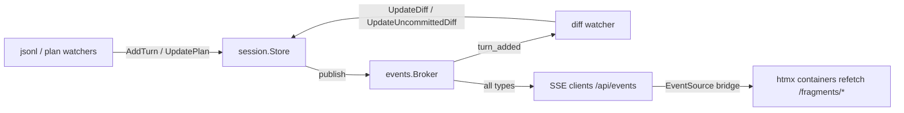

# Peek Control Server — Implementation Plan

## TLDR

- Add a local dashboard + JSON API + SSE event feed to peek-mcp, serving the in-memory session store on a dedicated `--control-port` (default off), working in both http and stdio transports.
- Replace the single-consumer `Store.TurnAdded` channel with a new `events.Broker` (pub/sub); the store publishes typed events, the diff watcher and SSE clients subscribe.
- The dashboard is built exactly like the claude-configs configserver: embedded templates + vendored htmx + the same `style.css`/fonts, server-rendered fragments, no npm, no framework.
- Bundle integration in claude-configs: the configserver spawns peek with `--control-port` and its nav gains a "Peek" link — both UIs look and behave as one suite.
- Read-only, localhost-only, DNS-rebinding-protected, optional bearer token; scriptable via `curl | jq` and `curl -N /api/events`.
- The mcpb bundle exposes `control_port` in its config UI, default 4243 — Claude Desktop users get the dashboard out of the box.

## Context

- **Binding concept:** [concept.md](plans/control_server/concept/concept.md), [http_api.md](plans/control_server/concept/http_api.md), [user_stories.md](plans/control_server/concept/user_stories.md) fix goals, API table, models, security, and limits.
- **Intake args [USER]:** steal the htmx setup and design approach from the claude-configs configserver; identical style; presented as one bundle. This supersedes the concept's "vanilla JS (`fetch` + `EventSource`), no framework" dashboard decision — htmx is the framework-of-record (still no npm, still embedded).
- **Root constraint:** `Store.TurnAdded` is a single-consumer `chan Id` cap 16 ([store.go:21](session/store.go:21)) consumed only by the diff watcher — it cannot also feed SSE; it is replaced outright.
- **Safety posture:** off by default, hardcoded `127.0.0.1` bind, Host-header check, no CORS, read-only, optional token.
- **Two repos, one plan:** peek-mcp carries the feature; claude-configs carries the bundle integration (spawn arg + nav link).

## Scope

- **In:**
  - **events broker:** new `events` package; store publishes `session_created`, `turn_added`, `plan_updated`, `diff_updated`, `uncommitted_diff_updated`.
  - **store eventing:** `TurnAdded` deleted; `NewStore` takes the broker; locked closure accessors for control reads.
  - **diff watcher migration:** consumes a broker subscription instead of `TurnAdded`.
  - **control package:** JSON API + SSE + htmx dashboard, embedded assets/templates, middleware (log, host check, token).
  - **flags:** `--control-port` / `--control-token` + `PEEK_CONTROL_PORT` / `PEEK_CONTROL_TOKEN`; README flag/env rows.
  - **goldmark dep:** plan markdown rendering, same version as claude-configs.
  - **bundle (claude-configs):** `-peek-control-port` flag, spawn arg, `PeekDashboardURL` option, nav "Peek" link.
  - **tests:** broker, store eventing, control handlers (host/auth/API/SSE/pages), configserver nav.
- **Out (explicit non-goals):**
  - **write operations:** `PUT .../title`, titles persistence (backlog).
  - **remote bind:** `--control-bind` (backlog, forces token).
  - **serving sugar:** mounting on the MCP port, gzip, ETag.
  - **dashboard backlog:** usage charts, diff highlighting, transcript search, desktop notifications.
- **Not changed:**
  - **MCP tool surface:** tools, pagination, `MaxResponseBytes*` semantics untouched (except exporting one helper).
  - **watch/parse pipeline:** jsonl watchers, parsers, plan watcher logic untouched.
- **Deferred findings:**
  - **tools race:** MCP tool handlers read `*Session` fields outside `Store.mu` (same race class this plan fixes for control) — not fixed here.
  - **Turns ordering:** `Session.Turns` prepends `TurnActive` at the head then takes the tail ([session.go:80-85](session/session.go:80)) — for sessions with ≥ n finished turns the active turn is dropped; looks unintended, needs confirmation.
  - **n-default drift:** tool descriptions say default 5, `DefaultReturnedTurns = 20` ([tools.go:15](tools/tools.go:15)).
  - **concept doc drift:** http_api.md references `title_source` and "codex_title_search matching" that do not exist in the repo.
  - **depth drift:** mcpb `user_config.depth` default 50 vs CLI default 20.

## Assumptions

| Assumption | Reality | Location |
|---|---|---|
| http_api.md: `SessionSummary` has `title_source` | No such field exists anywhere; dropped from the API shape | [session.go:18-32](session/session.go:18) |
| http_api.md: `?title=` "reuses codex_title_search matching" | Only exact SHA-256 title lookup exists; titles are Claude-only (Codex sessions carry none). Control implements a plain case-insensitive substring filter | [store.go:152-173](session/store.go:152) |
| http_api.md: `/usage` "shape from usage_reporting" | No usage tool exists; API returns `Session.TotalUsage` with its existing JSON tags | [usage.go:5-13](session/usage.go:5) |
| http_api.md: "follows the existing requestLogger pattern" | `requestLogger` is cmd-private and logs bodies at debug; control gets its own logger without body capture | [start.go:163-174](cmd/start.go:163) |
| concept.md: dashboard = vanilla JS, no framework | Superseded by intake args [USER]: htmx setup copied from claude-configs | concept.md decision list |
| concept.md: store reads are safe for a second consumer | `List`/`GetById` return live pointers; field reads outside `mu` are racy | [store.go:140-192](session/store.go:140) |

## Decisions

| ID | Problem | Facts | Decision | Why |
|---|---|---|---|---|
| <a id="d1"></a>D1 | `TurnAdded` shim vs replace (concept Q1) | [F1!](#f1) | Replace outright; channel field deleted | Repo-internal, single consumer; a shim is a dead parallel mechanism. Concept proposal adopted |
| <a id="d2"></a>D2 | `events` package typing | [F3!](#f3) | `Event` fields are plain strings (`session_id`, `agent`); `events` imports nothing from peek | Store must import `events` to publish; typed fields would cycle session→events→session. String payloads are the wire format anyway |
| <a id="d3"></a>D3 | Broker filtering | [F1!](#f1) | `Subscribe()` is unfiltered; consumers filter by type/agent | One mechanism, two consumers with different filters; drop-on-full cap 16 keeps semantics identical to today's `TurnAdded` |
| <a id="d4"></a>D4 | How the store publishes | [F1!](#f1), [F3!](#f3) | Broker is a required `NewStore` param; publishes happen at the mutation sites, non-blocking, under `mu` | Mutation site = single source of truth for events; no nil-guard second mode. `Publish` never blocks, so holding `mu` is safe |
| <a id="d5"></a>D5 | Racy control reads | [F2!](#f2), [F17](#f17) | `Store.WithSessions` / `Store.WithSession` closure accessors run the reader under `RLock`; handlers copy data inside, respond outside | Debuggable: one locking mechanism at the store boundary, no lock leaks into handlers; response writes never hold the lock |
| <a id="d6"></a>D6 | Live updates with htmx | [F4!](#f4), [F5!](#f5) | Keep the concept's SSE endpoint (typed, JSON, id-only). Dashboard uses an 8-line inline `EventSource` bridge that fires one htmx event; containers refetch. No htmx SSE extension | SSE is a concept decision (curl -N scripting). The bridge reuses the configserver's event-bus idiom (`hx-trigger="… from:body"` refetch); vendoring an extension adds a dependency the exemplar deliberately avoids |
| <a id="d7"></a>D7 | URL namespaces | [F6!](#f6) | JSON under `/api/*`, HTML fragments under `/fragments/*`, pages at `/` and `/sessions/{id}` | The concept's `/api` is a first-class JSON contract; configserver's fragments-under-/api idiom yields to it. Deliberate exemplar deviation |
| <a id="d8"></a>D8 | Token delivery (concept Q2) | — | `Authorization: Bearer`, or `?token=` sets an `HttpOnly` `SameSite=Strict` cookie; constant-time compare; `/api/healthz` exempt | Concept proposal adopted; `EventSource` cannot set headers, so the cookie is what makes the browser work. Healthz stays probe-able for liveness checks |
| <a id="d9"></a>D9 | Plan markdown rendering | [F8!](#f8) | goldmark v1.8.2, raw HTML disabled — mirror of configserver `renderMarkdown` | Concept requires rendered markdown; same dep + same guard as the exemplar |
| <a id="d10"></a>D10 | Diff truncation reuse | [F7!](#f7) | Export `tools.UTF8SafeSlice`; control imports it | One copy of the rune-safe cut; control→tools import has no cycle. Moving it to a new util package adds a concept for 12 lines |
| <a id="d11"></a>D11 | "One bundle" mechanics [USER] | [F9!](#f9), [F10!](#f10) | configserver spawns peek with `--control-port` (new `-peek-control-port` flag, default 4243) and the nav gains a "Peek" link via a FuncMap closure — no reverse proxy | Reliable/debuggable: a link plus identical styling reads as one suite; proxying SSE and assets through configserver adds failure modes and a second serving path. FuncMap closure avoids touching every page struct |
| <a id="d12"></a>D12 | Asset sharing across repos | [F5!](#f5) | `style.css`, `htmx.min.js`, `fonts/*` copied verbatim from claude-configs into `control/assets/` | Two repos, no module dependency between them; verbatim copy = zero adaptation drift at copy time; future drift accepted and re-syncable by re-copying |
| <a id="d13"></a>D13 | mcpb exposure (concept Q3) | [F13!](#f13) | [USER] Add `control_port` to `user_config`, default `4243` — dashboard on by default for Claude Desktop | Discoverability wins; the listener stays loopback-bound, host-checked, and read-only, and `0` in the config UI turns it off |
| <a id="d14"></a>D14 | turns `n` limits | [F23](#f23) | Default 5, max = `--depth`; depth passed into `control.Options` from cmd | Concept table is binding; no new store getter for an already-flagged value |
| <a id="d15"></a>D15 | Dashboard refresh granularity | [F4!](#f4) | All five SSE types collapse to one `peek-refresh` htmx event; every container refetches with `throttle:1s` | Id-only payloads (concept decision) make refetch mandatory anyway; localhost fragments are cheap; throttle caps event storms. Per-session filtering in JS would rebuild client state the exemplar forbids |

## Baseline (verified)

Base branch: `claude/control-server-feature-design-f8329e` (worktree of peek-mcp `main` line, head `1df592c`). claude-configs read at `/Users/kevinpersonal/GolandProjects/claude-configs` (head of its main working copy).

| ID | Fact | Needed for | Location |
|---|---|---|---|
| <a id="f1"></a>F1! | `TurnAdded chan Id` cap 16, non-blocking send, single consumer (diff watcher) | [D1](#d1), [D3](#d3), [D4](#d4) | [store.go:21,33,103-106](session/store.go:103), [diff_watcher.go:48](watcher/diff_watcher.go:48) |
| <a id="f2"></a>F2! | All store mutations run under `s.mu`; `GetById`/`List` return live `*Session` pointers, field reads after unlock are racy | [D5](#d5) | [store.go:51-192](session/store.go:51) |
| <a id="f3"></a>F3! | `Event` needs session id + agent; typed as `session.Id`/`session.Agent` it cycles: session→events→session | [D2](#d2), [D4](#d4) | [session.go:8-16](session/session.go:8) |
| <a id="f4"></a>F4! | configserver has zero SSE/EventSource; live refresh idioms are the `HX-Trigger` response-header bus and `hx-trigger="every 3s"` polling | [D6](#d6), [D15](#d15) | claude-configs `internal/server/config.html:25`, `_routine_row.html:3` |
| <a id="f5"></a>F5! | htmx is vendored (`assets/htmx.min.js`), no CDN, no extensions; assets+templates embedded via two `embed.FS` | [D6](#d6), [D12](#d12) | claude-configs `internal/server/server.go:19-23` |
| <a id="f6"></a>F6! | configserver `/api/*` returns HTML fragments, not JSON; the concept requires `curl \| jq` JSON | [D7](#d7) | claude-configs `internal/server/server.go:191-201`; concept.md goals |
| <a id="f7"></a>F7! | `utf8SafeSlice` unexported; 3 call sites | [D10](#d10) | [pages.go:90,98,106,114](tools/pages.go:114) |
| <a id="f8"></a>F8! | configserver renders markdown with goldmark v1.8.2, raw HTML disabled; peek's go.mod lacks goldmark | [D9](#d9) | claude-configs `internal/server/render.go:21-27`, `go.mod:9` |
| <a id="f9"></a>F9! | `startPeek` spawns `peek-mcp start --transport http --port <p>` only when the port is closed; child shares ctx | [D11](#d11) | claude-configs `cmd/configserver/main.go:121-143` |
| <a id="f10"></a>F10! | Nav is a hardcoded flat list; FuncMap is built inside `server.New` and can close over `opts` | [D11](#d11) | claude-configs `internal/server/templates/layout.html:26-37`, `server.go:76-95` |
| <a id="f11"></a>F11! | No `title_source` field; titles are Claude-only (`custom-title` signal); lookup is exact-hash | Assumptions, [§9](#c9) | [store.go:152-173](session/store.go:152) |
| <a id="f12"></a>F12! | No usage MCP tool; `Session.TotalUsage` serializes as `total_usage` with 7 int fields | [§9](#c9) | [session.go:23](session/session.go:23), [usage.go:5-13](session/usage.go:5) |
| <a id="f13"></a>F13! | mcpb manifest is stdio-only; `user_config` has depth/homes/diff_target, no port of any kind | [D13](#d13) | [manifest.json](mcpb/manifest.json) |
| <a id="f14"></a>F14 | http transport pattern: `http.Server` + ctx-shutdown goroutine + `requestLogger`/`statusWriter` | [§16](#c16) | [start.go:121-140,163-184](cmd/start.go:121) |
| <a id="f15"></a>F15 | Flags in `init`, env fallbacks via `envFallbacks` map applied when flag unchanged | [§16](#c16) | [start.go:148-161,186-196](cmd/start.go:148) |
| <a id="f16"></a>F16 | `Session.Turns(n)` merges the active turn; `TurnBuffer.Last(n)` returns the tail | [§9](#c9), [§11](#c11) | [session.go:75-86](session/session.go:75) |
| <a id="f17"></a>F17! | Finished `*Turn`s are never mutated after push (`AddTurn` replaces/copies pointers) — a slice copy taken under lock is safe to marshal after unlock | [D5](#d5) | [session.go:43-65](session/session.go:43) |
| <a id="f18"></a>F18 | Layout shell = `head`/`nav`/`foot` blocks + `#error-banner` script; pages start `{{template "head" .}}{{template "nav" .}}` | [§13](#c13) | claude-configs `internal/server/templates/layout.html:1-43` |
| <a id="f19"></a>F19 | `renderFragment` is the single render helper; error responses via tiny `respond` wrappers; peek's own flat-file precedent is `tools/respond.go` | [§5](#c5), [§7](#c7) | claude-configs `internal/server/render.go:12-17`; [tools/respond.go](tools/respond.go) |
| <a id="f20"></a>F20 | Test exemplars: `provideCompleteStore` (two sessions: Claude "Login simplification", Codex "Auth refactor"); configserver `newTestServer`/`formPost` + httptest against the real mux | Tests | [store_test.go:16-43](session/store_test.go:16); claude-configs `internal/server/server_test.go:14-24` |
| <a id="f21"></a>F21 | Makefile: `test`, `build-local`, `serve-http`, `serve-stdio`; no lint target; CI runs `go test ./...` | Verification | [Makefile](Makefile) |
| <a id="f22"></a>F22 | `statusWriter` wraps `ResponseWriter` without `Unwrap`; `http.ResponseController` needs `Unwrap` to reach `Flusher`/deadlines through a wrapper | [§8](#c8), [§10](#c10) | [start.go:176-184](cmd/start.go:176) |
| <a id="f23"></a>F23! | `Store.depth` is unexported, no getter | [D14](#d14) | [store.go:22](session/store.go:22) |
| <a id="f24"></a>F24 | README documents a flag table and env-fallback table | [§18](#c18) | [README.md:137-160](README.md:137) |

## Exemplar & reuse

| Existing | Used for |
|---|---|
| `session.Session.Turns` / `TurnBuffer.Last` ([F16](#f16)) | turns API + fragment |
| `session.Usage` JSON tags ([F12](#f12)) | `/api/sessions/{id}/usage` |
| `tools.UTF8SafeSlice` (exported by [§4](#c4)) | API diff truncation |
| `Store.sortByLastActiveDesc` | list ordering (inside `WithSessions`) |
| claude-configs `assets/` (style.css, htmx.min.js, fonts) | vendored dashboard assets ([D12](#d12)) |
| goldmark v1.8.2 ([F8](#f8)) | plan markdown |
| `requestLogger`/`statusWriter` shape ([F14](#f14)) | control logger (body capture removed) |
| `provideCompleteStore`, configserver `newTestServer` ([F20](#f20)) | test fixtures |

- Changes **without** an exemplar (risk signal): [§2](#c2) broker fan-out (nearest semantics: `TurnAdded` drop-on-full) and [§10](#c10) SSE handler — no SSE exists in either repo. Both are hot items with full code below.

Event flow being built:



## Changes

<a id="c1"></a>### 1. Events package with broker (new)

location: `events/broker.go`
mirrors: no exemplar — semantics copied from `TurnAdded` (cap 16, drop-on-full)

```go
package events

import (
	"sync"
	"time"
)

type Type string

const (
	TypeSessionCreated         Type = "session_created"
	TypeTurnAdded              Type = "turn_added"
	TypePlanUpdated            Type = "plan_updated"
	TypeDiffUpdated            Type = "diff_updated"
	TypeUncommittedDiffUpdated Type = "uncommitted_diff_updated"
)

type Event struct {
	Type      Type      `json:"type"`
	SessionId string    `json:"session_id"`
	Agent     string    `json:"agent"`
	Ts        time.Time `json:"ts"`
}

const subscriberBuffer = 16

type Broker struct {
	mu   sync.Mutex
	subs map[int]chan Event
	next int
}

func NewBroker() *Broker {
	return &Broker{subs: make(map[int]chan Event)}
}

func (b *Broker) Subscribe() (<-chan Event, func()) {
	b.mu.Lock()
	defer b.mu.Unlock()

	id := b.next
	b.next++
	ch := make(chan Event, subscriberBuffer)
	b.subs[id] = ch

	return ch, func() {
		b.mu.Lock()
		defer b.mu.Unlock()
		delete(b.subs, id)
	}
}

func (b *Broker) Publish(ev Event) {
	b.mu.Lock()
	defer b.mu.Unlock()

	for _, ch := range b.subs {
		select {
		case ch <- ev:
		default:
		}
	}
}
```

<a id="c2"></a>### 2. Store publishes events, TurnAdded deleted, locked accessors (modified)

location: `session/store.go`
mirrors: accessors follow the existing `GetById` lock discipline

- **Struct + constructor** ([D1](#d1), [D4](#d4)):

```diff
 type Store struct {
 	mu sync.RWMutex

 	IdByTitle     map[string]Id // SHA-256 hex of normalized title → session Id
-	TurnAdded     chan Id
+	broker        *events.Broker
 	depth         int
 	enabledAgents []Agent
 	sessions      map[Id]*Session
 }

-func NewStore(depth int, agents ...Agent) *Store {
+func NewStore(depth int, broker *events.Broker, agents ...Agent) *Store {
 	return &Store{
 		sessions:      make(map[Id]*Session),
 		IdByTitle:     make(map[string]Id),
 		depth:         depth,
 		enabledAgents: agents,
-		TurnAdded:     make(chan Id, 16), // small fixed buffer; dropped notifications are fine — next turn re-triggers
+		broker:        broker,
 	}
 }
```

- **Publish helper** (new method; `Publish` is non-blocking, safe under `mu`):

```go
func (s *Store) publish(t events.Type, id Id, agent Agent) {
	s.broker.Publish(events.Event{
		Type:      t,
		SessionId: string(id),
		Agent:     string(agent),
		Ts:        time.Now(),
	})
}
```

- **Turn + plan publishes**:

```diff
 func (s *Store) AddTurnBySessionId(id Id, agent Agent, turn *Turn) {
 	// ...
 	if turn.PlanFilePath != "" {
 		slog.Debug("Updating plan", "session", id)
 		session.PlanFilePath = turn.PlanFilePath

 		if turn.PlanContent != "" {
 			session.PlanContent = turn.PlanContent
+			s.publish(events.TypePlanUpdated, id, agent)
 			return
 		}

 		if content, err := os.ReadFile(turn.PlanFilePath); err == nil {
 			session.PlanContent = string(content)
+			s.publish(events.TypePlanUpdated, id, agent)
 			return
 		}
 		// ...
 			if content, err := os.ReadFile(alt); err == nil {
 				session.PlanFilePath = alt
 				session.PlanContent = string(content)
+				s.publish(events.TypePlanUpdated, id, agent)
 				return
 			}
 		// ...
 	}

 	// update user or assistent turn
 	session.AddTurn(turn)

-	select {
-	case s.TurnAdded <- id:
-	default:
-	}
+	s.publish(events.TypeTurnAdded, id, agent)
 }
```

- **Diff + uncommitted-diff + plan-path + create publishes**:

```diff
 func (s *Store) UpdateDiff(id Id, target, output string) {
 	// ...
 	if session, ok := s.sessions[id]; ok {
 		session.DiffOutput = output
 		session.DiffTarget = target
+		s.publish(events.TypeDiffUpdated, id, session.Agent)
 	}
 }
```

```diff
 func (s *Store) UpdateUncommittedDiff(id Id, output string) {
 	// ...
 	if session, ok := s.sessions[id]; ok {
 		session.UncommittedDiff = output
+		s.publish(events.TypeUncommittedDiffUpdated, id, session.Agent)
 	}
 }
```

```diff
 func (s *Store) UpdatePlanForPath(filePath, content string) {
 	// ...
 	for _, session := range s.sessions {
 		if session.PlanFilePath == filePath {
 			session.PlanContent = content
+			s.publish(events.TypePlanUpdated, session.Meta.SessionId, session.Agent)
 		}
 	}
 }
```

```diff
 func (s *Store) getOrCreate(id Id, agent Agent) *Session {
 	// ...
 	session := &Session{
 		Meta:          Meta{SessionId: id},
 		Agent:         agent,
 		TurnsFinished: NewTurnBuffer(s.depth),
 	}
 	s.sessions[id] = session
+	s.publish(events.TypeSessionCreated, id, agent)
 	return session
 }
```

- **Locked closure accessors** ([D5](#d5); callers copy data inside `fn`, never retain pointers, respond after return):

```go
func (s *Store) WithSessions(agents []Agent, fn func([]*Session)) {
	s.mu.RLock()
	defer s.mu.RUnlock()

	fn(s.sortByLastActiveDesc(agents...))
}

func (s *Store) WithSession(id Id, fn func(*Session)) bool {
	s.mu.RLock()
	defer s.mu.RUnlock()

	session, ok := s.sessions[id]
	if !ok {
		return false
	}
	fn(session)
	return true
}
```

<a id="c3"></a>### 3. Diff watcher subscribes to the broker (modified)

location: `watcher/diff_watcher.go`
mirrors: existing `Run` select loop

```diff
 type DiffWatcher struct {
 	store    *session.Store
+	broker   *events.Broker
 	target   string
 	interval time.Duration
 	// ...
 }

-func NewDiffWatcher(store *session.Store, target string, interval, window time.Duration) *DiffWatcher {
+func NewDiffWatcher(store *session.Store, broker *events.Broker, target string, interval, window time.Duration) *DiffWatcher {
 	return &DiffWatcher{
 		store:    store,
+		broker:   broker,
 		target:   target,
 		interval: interval,
 		window:   window,
 	}
 }
```

```diff
 func (w *DiffWatcher) Run(ctx context.Context) error {
 	// ...
 	ticker := time.NewTicker(w.interval)
 	defer ticker.Stop()
+	ch, cancel := w.broker.Subscribe()
+	defer cancel()

 	for {
 		select {
 		case <-ctx.Done():
 			return ctx.Err()

-		case id := <-w.store.TurnAdded:
+		case ev := <-ch:
+			if ev.Type != events.TypeTurnAdded {
+				continue
+			}
+			id := session.Id(ev.SessionId)
 			sess, ok := w.store.GetById(id)
 			if !ok || sess.Meta.CWD == "" {
 				continue
 			}
 			// ...
```

- **No feedback loop:** the watcher receives the `diff_updated` events it causes but filters them out by type.

<a id="c4"></a>### 4. Export the truncation helper (modified)

location: `tools/pages.go`
mirrors: —

```diff
-func utf8SafeSlice(s string, maxBytes int) string {
+func UTF8SafeSlice(s string, maxBytes int) string {
```

- Rename the 3 call sites at [pages.go:90,98,106](tools/pages.go:90) ([D10](#d10)).

<a id="c5"></a>### 5. Control error responses (new)

location: `control/respond.go`
mirrors: claude-configs `internal/server/respond/respond.go`, flattened per peek's `tools/respond.go` file convention ([F19](#f19))

```go
package control

import "net/http"

func respondBadRequest(message string, w http.ResponseWriter) {
	http.Error(w, message, http.StatusBadRequest)
}

func respondNotFound(message string, w http.ResponseWriter) {
	http.Error(w, message, http.StatusNotFound)
}

func respondInternalServerError(err error, w http.ResponseWriter) {
	http.Error(w, err.Error(), http.StatusInternalServerError)
}
```

<a id="c6"></a>### 6. Control view models (new)

location: `control/viewmodels.go`
mirrors: `tools/viewmodels.go`

```go
package control

import (
	"time"

	"github.com/kevinhorst/peek-mcp/session"
)

type sessionSummary struct {
	Id                 session.Id    `json:"id"`
	Agent              session.Agent `json:"agent"`
	Title              string        `json:"title,omitempty"`
	LastActive         time.Time     `json:"last_active"`
	CWD                string        `json:"cwd,omitempty"`
	GitBranch          string        `json:"git_branch,omitempty"`
	Model              string        `json:"model,omitempty"`
	HasPlan            bool          `json:"has_plan"`
	HasDiff            bool          `json:"has_diff"`
	HasUncommittedDiff bool          `json:"has_uncommitted_diff"`
}

type sessionDetail struct {
	sessionSummary
	TotalUsage session.Usage `json:"total_usage"`
	DiffTarget string        `json:"diff_target,omitempty"`
}

type sessionsResponse struct {
	Sessions []sessionSummary `json:"sessions"`
}

type turnsResponse struct {
	Turns []*session.Turn `json:"turns"`
}

type planResponse struct {
	PlanContent  string `json:"plan_content"`
	PlanFilePath string `json:"plan_file_path,omitempty"`
}

type diffResponse struct {
	Target    string `json:"target,omitempty"`
	Diff      string `json:"diff"`
	Truncated bool   `json:"truncated"`
}

type usageResponse struct {
	TotalUsage session.Usage `json:"total_usage"`
}

type healthzResponse struct {
	Status  string `json:"status"`
	Version string `json:"version"`
}

func newSessionSummary(sess *session.Session) sessionSummary {
	return sessionSummary{
		Id:                 sess.Meta.SessionId,
		Agent:              sess.Agent,
		Title:              sess.Title,
		LastActive:         sess.LastActive,
		CWD:                sess.Meta.CWD,
		GitBranch:          sess.Meta.GitBranch,
		Model:              sess.Meta.Model,
		HasPlan:            sess.PlanContent != "" || sess.PlanFilePath != "",
		HasDiff:            sess.DiffOutput != "",
		HasUncommittedDiff: sess.UncommittedDiff != "",
	}
}
```

- `has_plan`/`has_diff` predicates copied from [tools.go:249-251](tools/tools.go:249).
- `turnsResponse` reuses `session.Turn`'s existing JSON tags ([F16](#f16)); no parallel turn DTO.

<a id="c7"></a>### 7. Control rendering (new)

location: `control/render.go`
mirrors: claude-configs `internal/server/render.go`

```go
package control

import (
	"bytes"
	"html/template"
	"net/http"

	"github.com/yuin/goldmark"
)

func (s *Server) renderFragment(w http.ResponseWriter, name string, data any) {
	w.Header().Set("Content-Type", "text/html; charset=utf-8")
	if err := s.tmpl.ExecuteTemplate(w, name, data); err != nil {
		respondInternalServerError(err, w)
	}
}

func renderMarkdown(src []byte) (template.HTML, error) {
	var buf bytes.Buffer
	if err := goldmark.Convert(src, &buf); err != nil {
		return "", err
	}
	return template.HTML(buf.String()), nil
}
```

<a id="c8"></a>### 8. Control middleware (new)

location: `control/middleware.go`
mirrors: `requestLogger`/`statusWriter` in [cmd/start.go:163-184](cmd/start.go:163) (body capture removed per concept security section; `Unwrap` added for [F22](#f22))

```go
package control

import (
	"crypto/subtle"
	"log/slog"
	"net"
	"net/http"
	"strings"
)

const tokenCookie = "peek_control_token"

var allowedHosts = map[string]bool{
	"localhost": true,
	"127.0.0.1": true,
	"::1":       true,
}

func (s *Server) logRequests(next http.Handler) http.Handler {
	return http.HandlerFunc(func(w http.ResponseWriter, r *http.Request) {
		sw := &statusWriter{ResponseWriter: w, code: http.StatusOK}
		next.ServeHTTP(sw, r)
		slog.Info("control", "method", r.Method, "path", r.URL.Path, "status", sw.code)
	})
}

type statusWriter struct {
	http.ResponseWriter
	code int
}

func (sw *statusWriter) WriteHeader(code int) {
	sw.code = code
	sw.ResponseWriter.WriteHeader(code)
}

func (sw *statusWriter) Unwrap() http.ResponseWriter {
	return sw.ResponseWriter
}

func (s *Server) checkHost(next http.Handler) http.Handler {
	return http.HandlerFunc(func(w http.ResponseWriter, r *http.Request) {
		host := r.Host
		if h, _, err := net.SplitHostPort(r.Host); err == nil {
			host = h
		}
		if !allowedHosts[strings.Trim(host, "[]")] {
			http.Error(w, "forbidden host", http.StatusForbidden)
			return
		}
		next.ServeHTTP(w, r)
	})
}

func (s *Server) auth(next http.Handler) http.Handler {
	if s.token == "" {
		return next
	}
	return http.HandlerFunc(func(w http.ResponseWriter, r *http.Request) {
		if r.URL.Path == "/api/healthz" {
			next.ServeHTTP(w, r)
			return
		}
		if tokenMatches(s.token, strings.TrimPrefix(r.Header.Get("Authorization"), "Bearer ")) {
			next.ServeHTTP(w, r)
			return
		}
		if cookie, err := r.Cookie(tokenCookie); err == nil && tokenMatches(s.token, cookie.Value) {
			next.ServeHTTP(w, r)
			return
		}
		if query := r.URL.Query().Get("token"); tokenMatches(s.token, query) {
			http.SetCookie(w, &http.Cookie{
				Name:     tokenCookie,
				Value:    query,
				Path:     "/",
				HttpOnly: true,
				SameSite: http.SameSiteStrictMode,
			})
			next.ServeHTTP(w, r)
			return
		}
		http.Error(w, "unauthorized", http.StatusUnauthorized)
	})
}

func tokenMatches(want, got string) bool {
	if got == "" {
		return false
	}
	return subtle.ConstantTimeCompare([]byte(want), []byte(got)) == 1
}
```

<a id="c9"></a>### 9. JSON API handlers (new)

location: `control/api.go`
mirrors: claude-configs handler-method shape (`internal/server/model.go`), JSON instead of fragments ([D7](#d7))

```go
package control

import (
	"encoding/json"
	"log/slog"
	"net/http"
	"strconv"
	"strings"

	"github.com/kevinhorst/peek-mcp/session"
	"github.com/kevinhorst/peek-mcp/tools"
)

const (
	defaultSessionLimit = 50
	maxSessionLimit     = 200
	defaultDiffSize     = 256 * 1024
	defaultTurns        = 5
)

func writeJSON(w http.ResponseWriter, v any) {
	w.Header().Set("Content-Type", "application/json")
	if err := json.NewEncoder(w).Encode(v); err != nil {
		slog.Warn("control: encode failed", "err", err)
	}
}

func (s *Server) handleHealthz(w http.ResponseWriter, r *http.Request) {
	writeJSON(w, healthzResponse{Status: "ok", Version: s.version})
}

func intParam(r *http.Request, name string, fallback int) (int, bool) {
	raw := r.URL.Query().Get(name)
	if raw == "" {
		return fallback, true
	}
	n, err := strconv.Atoi(raw)
	if err != nil || n < 0 {
		return 0, false
	}
	return n, true
}

func (s *Server) handleSessions(w http.ResponseWriter, r *http.Request) {
	var agents []session.Agent
	switch agent := r.URL.Query().Get("agent"); agent {
	case "":
	case string(session.AgentClaude), string(session.AgentCodex):
		agents = []session.Agent{session.Agent(agent)}
	default:
		respondBadRequest("agent must be \"claude\" or \"codex\"", w)
		return
	}
	limit, ok := intParam(r, "limit", defaultSessionLimit)
	if !ok {
		respondBadRequest("limit must be a non-negative integer", w)
		return
	}
	if limit == 0 || limit > maxSessionLimit {
		limit = maxSessionLimit
	}
	title := strings.ToLower(r.URL.Query().Get("title"))

	list := make([]sessionSummary, 0)
	s.store.WithSessions(agents, func(sessions []*session.Session) {
		for _, sess := range sessions {
			if title != "" && !strings.Contains(strings.ToLower(sess.Title), title) {
				continue
			}
			list = append(list, newSessionSummary(sess))
			if len(list) == limit {
				break
			}
		}
	})
	writeJSON(w, sessionsResponse{Sessions: list})
}

func (s *Server) handleSessionDetail(w http.ResponseWriter, r *http.Request) {
	var detail sessionDetail
	found := s.store.WithSession(session.Id(r.PathValue("id")), func(sess *session.Session) {
		detail = sessionDetail{
			sessionSummary: newSessionSummary(sess),
			TotalUsage:     sess.TotalUsage,
			DiffTarget:     sess.DiffTarget,
		}
	})
	if !found {
		respondNotFound("unknown session", w)
		return
	}
	writeJSON(w, detail)
}

func (s *Server) handleTurns(w http.ResponseWriter, r *http.Request) {
	n, ok := intParam(r, "n", defaultTurns)
	if !ok {
		respondBadRequest("n must be a non-negative integer", w)
		return
	}
	if n == 0 || n > s.depth {
		n = s.depth
	}

	var turns []*session.Turn
	found := s.store.WithSession(session.Id(r.PathValue("id")), func(sess *session.Session) {
		turns = sess.Turns(n)
	})
	if !found {
		respondNotFound("unknown session", w)
		return
	}
	writeJSON(w, turnsResponse{Turns: turns})
}

func (s *Server) handlePlan(w http.ResponseWriter, r *http.Request) {
	var plan planResponse
	found := s.store.WithSession(session.Id(r.PathValue("id")), func(sess *session.Session) {
		plan = planResponse{PlanContent: sess.PlanContent, PlanFilePath: sess.PlanFilePath}
	})
	if !found {
		respondNotFound("unknown session", w)
		return
	}
	if plan.PlanContent == "" && plan.PlanFilePath == "" {
		respondNotFound("no plan for session", w)
		return
	}
	writeJSON(w, plan)
}

func (s *Server) handleDiff(w http.ResponseWriter, r *http.Request) {
	s.serveDiff(w, r, func(sess *session.Session) diffResponse {
		return diffResponse{Target: sess.DiffTarget, Diff: sess.DiffOutput}
	})
}

func (s *Server) handleUncommittedDiff(w http.ResponseWriter, r *http.Request) {
	s.serveDiff(w, r, func(sess *session.Session) diffResponse {
		return diffResponse{Diff: sess.UncommittedDiff}
	})
}

func (s *Server) serveDiff(w http.ResponseWriter, r *http.Request, extract func(*session.Session) diffResponse) {
	size, ok := intParam(r, "size", defaultDiffSize)
	if !ok {
		respondBadRequest("size must be a non-negative integer", w)
		return
	}

	var resp diffResponse
	found := s.store.WithSession(session.Id(r.PathValue("id")), func(sess *session.Session) {
		resp = extract(sess)
	})
	if !found {
		respondNotFound("unknown session", w)
		return
	}
	if size > 0 && len(resp.Diff) > size {
		resp.Diff = tools.UTF8SafeSlice(resp.Diff, size)
		resp.Truncated = true
	}
	writeJSON(w, resp)
}

func (s *Server) handleUsage(w http.ResponseWriter, r *http.Request) {
	var usage usageResponse
	found := s.store.WithSession(session.Id(r.PathValue("id")), func(sess *session.Session) {
		usage = usageResponse{TotalUsage: sess.TotalUsage}
	})
	if !found {
		respondNotFound("unknown session", w)
		return
	}
	writeJSON(w, usage)
}
```

- Data is copied inside the `WithSession` closure; `writeJSON` runs after the lock is released ([D5](#d5), [F17](#f17)).
- `size`/`n`/`limit` `0` means "maximum/full" per the concept's `size=0` semantics.

<a id="c10"></a>### 10. SSE handler (new)

location: `control/sse.go`
mirrors: no exemplar (first SSE in either repo) — hot item, full code

```go
package control

import (
	"encoding/json"
	"fmt"
	"net/http"
	"time"
)

const (
	maxSSEClients     = 16
	heartbeatInterval = 15 * time.Second
	sseWriteTimeout   = 10 * time.Second
)

func (s *Server) handleEvents(w http.ResponseWriter, r *http.Request) {
	if s.sseClients.Add(1) > maxSSEClients {
		s.sseClients.Add(-1)
		http.Error(w, "too many event streams", http.StatusTooManyRequests)
		return
	}
	defer s.sseClients.Add(-1)

	agent := r.URL.Query().Get("agent")
	ch, cancel := s.broker.Subscribe()
	defer cancel()

	w.Header().Set("Content-Type", "text/event-stream")
	w.Header().Set("Cache-Control", "no-cache")
	rc := http.NewResponseController(w)
	w.WriteHeader(http.StatusOK)
	rc.Flush()

	heartbeat := time.NewTicker(heartbeatInterval)
	defer heartbeat.Stop()

	for {
		select {
		case <-r.Context().Done():
			return
		case <-heartbeat.C:
			if writeFrame(w, rc, ": heartbeat\n\n") != nil {
				return
			}
		case ev := <-ch:
			if agent != "" && ev.Agent != agent {
				continue
			}
			data, err := json.Marshal(ev)
			if err != nil {
				continue
			}
			if writeFrame(w, rc, fmt.Sprintf("event: %s\ndata: %s\n\n", ev.Type, data)) != nil {
				return
			}
		}
	}
}

func writeFrame(w http.ResponseWriter, rc *http.ResponseController, frame string) error {
	rc.SetWriteDeadline(time.Now().Add(sseWriteTimeout))
	if _, err := fmt.Fprint(w, frame); err != nil {
		return err
	}
	return rc.Flush()
}
```

- `s.sseClients` is an `atomic.Int64` field on `Server` ([§12](#c12)).
- `ResponseController` reaches `Flusher`/deadlines through `statusWriter` via `Unwrap` ([F22](#f22)).
- A dead client fails the deadline'd write → handler returns → `cancel()` unsubscribes (concept limit section).

<a id="c11"></a>### 11. Dashboard page + fragment handlers (new)

location: `control/sessions.go`
mirrors: claude-configs `internal/server/sessions.go` handler layout (page consts, page structs, fragment handlers)

```go
package control

import (
	"net/http"

	"github.com/kevinhorst/peek-mcp/session"
	"github.com/kevinhorst/peek-mcp/tools"
)

const (
	pageSessions        = "sessions"
	tmplSessionsIndex   = "sessions_index.html"
	tmplSessionDetail   = "session_detail.html"
	tmplSessionList     = "_session_list.html"
	tmplTurns           = "_turns.html"
	tmplPlan            = "_plan.html"
	tmplDiff            = "_diff.html"
)

type indexPage struct {
	Page  string
	Title string
}

type detailPage struct {
	Page    string
	Title   string
	Summary sessionSummary
}

type sessionListData struct {
	Sessions []sessionSummary
}

type turnsData struct {
	Id    session.Id
	Turns []*session.Turn
}

type planData struct {
	Id       session.Id
	PlanHTML any
	Empty    bool
}

type diffData struct {
	Id        session.Id
	Kind      string
	Target    string
	Diff      string
	Truncated bool
	Empty     bool
}

func (s *Server) handleSessionsPage(w http.ResponseWriter, r *http.Request) {
	s.renderFragment(w, tmplSessionsIndex, indexPage{Page: pageSessions, Title: "Peek"})
}

func (s *Server) handleSessionDetailPage(w http.ResponseWriter, r *http.Request) {
	var summary sessionSummary
	found := s.store.WithSession(session.Id(r.PathValue("id")), func(sess *session.Session) {
		summary = newSessionSummary(sess)
	})
	if !found {
		respondNotFound("unknown session", w)
		return
	}
	title := summary.Title
	if title == "" {
		title = string(summary.Id)
	}
	s.renderFragment(w, tmplSessionDetail, detailPage{Page: pageSessions, Title: title, Summary: summary})
}

func (s *Server) handleSessionsFragment(w http.ResponseWriter, r *http.Request) {
	data := sessionListData{Sessions: make([]sessionSummary, 0)}
	s.store.WithSessions(nil, func(sessions []*session.Session) {
		for _, sess := range sessions {
			data.Sessions = append(data.Sessions, newSessionSummary(sess))
			if len(data.Sessions) == defaultSessionLimit {
				break
			}
		}
	})
	s.renderFragment(w, tmplSessionList, data)
}

func (s *Server) handleTurnsFragment(w http.ResponseWriter, r *http.Request) {
	id := session.Id(r.PathValue("id"))
	data := turnsData{Id: id}
	if !s.store.WithSession(id, func(sess *session.Session) { data.Turns = sess.Turns(defaultTurns) }) {
		respondNotFound("unknown session", w)
		return
	}
	s.renderFragment(w, tmplTurns, data)
}

func (s *Server) handlePlanFragment(w http.ResponseWriter, r *http.Request) {
	id := session.Id(r.PathValue("id"))
	var content string
	if !s.store.WithSession(id, func(sess *session.Session) { content = sess.PlanContent }) {
		respondNotFound("unknown session", w)
		return
	}
	data := planData{Id: id, Empty: content == ""}
	if content != "" {
		html, err := renderMarkdown([]byte(content))
		if err != nil {
			respondInternalServerError(err, w)
			return
		}
		data.PlanHTML = html
	}
	s.renderFragment(w, tmplPlan, data)
}

func (s *Server) handleDiffFragment(w http.ResponseWriter, r *http.Request) {
	s.serveDiffFragment(w, r, "diff", func(sess *session.Session) (string, string) {
		return sess.DiffOutput, sess.DiffTarget
	})
}

func (s *Server) handleUncommittedDiffFragment(w http.ResponseWriter, r *http.Request) {
	s.serveDiffFragment(w, r, "uncommitted-diff", func(sess *session.Session) (string, string) {
		return sess.UncommittedDiff, ""
	})
}

func (s *Server) serveDiffFragment(w http.ResponseWriter, r *http.Request, kind string, extract func(*session.Session) (string, string)) {
	id := session.Id(r.PathValue("id"))
	var diff, target string
	if !s.store.WithSession(id, func(sess *session.Session) { diff, target = extract(sess) }) {
		respondNotFound("unknown session", w)
		return
	}
	data := diffData{Id: id, Kind: kind, Target: target, Empty: diff == ""}
	if len(diff) > defaultDiffSize {
		diff = tools.UTF8SafeSlice(diff, defaultDiffSize)
		data.Truncated = true
	}
	data.Diff = diff
	s.renderFragment(w, tmplDiff, data)
}
```

- Fragments always truncate diffs at 256 KB; the full text stays reachable via `/api/...?size=0`.

<a id="c12"></a>### 12. Control server wiring (new)

location: `control/server.go`
mirrors: claude-configs `internal/server/server.go` (embeds, Options→Server, `Handler()` mux, assets cache header)

```go
package control

import (
	"embed"
	"html/template"
	"net/http"
	"path/filepath"
	"sync/atomic"
	"time"

	"github.com/kevinhorst/peek-mcp/events"
	"github.com/kevinhorst/peek-mcp/session"
)

//go:embed templates/*.html
var templateFS embed.FS

//go:embed assets
var assetsFS embed.FS

type Options struct {
	Store   *session.Store
	Broker  *events.Broker
	Token   string
	Version string
	Depth   int
}

type Server struct {
	store      *session.Store
	broker     *events.Broker
	token      string
	version    string
	depth      int
	tmpl       *template.Template
	sseClients atomic.Int64
}

func New(opts *Options) (*Server, error) {
	funcs := template.FuncMap{
		"baseName": filepath.Base,
		"ts": func(t time.Time) string {
			return t.Format("2006-01-02 15:04:05")
		},
	}
	tmpl, err := template.New("").Funcs(funcs).ParseFS(templateFS, "templates/*.html")
	if err != nil {
		return nil, err
	}

	return &Server{
		store:   opts.Store,
		broker:  opts.Broker,
		token:   opts.Token,
		version: opts.Version,
		depth:   opts.Depth,
		tmpl:    tmpl,
	}, nil
}

func (s *Server) assetsHandler() http.Handler {
	fileServer := http.FileServerFS(assetsFS)
	return http.HandlerFunc(func(w http.ResponseWriter, r *http.Request) {
		w.Header().Set("Cache-Control", "public, max-age=86400")
		fileServer.ServeHTTP(w, r)
	})
}

func (s *Server) Handler() http.Handler {
	mux := http.NewServeMux()
	mux.HandleFunc("GET /{$}", s.handleSessionsPage)
	mux.Handle("GET /assets/", s.assetsHandler())
	mux.HandleFunc("GET /sessions/{id}", s.handleSessionDetailPage)
	mux.HandleFunc("GET /fragments/sessions", s.handleSessionsFragment)
	mux.HandleFunc("GET /fragments/sessions/{id}/turns", s.handleTurnsFragment)
	mux.HandleFunc("GET /fragments/sessions/{id}/plan", s.handlePlanFragment)
	mux.HandleFunc("GET /fragments/sessions/{id}/diff", s.handleDiffFragment)
	mux.HandleFunc("GET /fragments/sessions/{id}/uncommitted-diff", s.handleUncommittedDiffFragment)
	mux.HandleFunc("GET /api/healthz", s.handleHealthz)
	mux.HandleFunc("GET /api/sessions", s.handleSessions)
	mux.HandleFunc("GET /api/sessions/{id}", s.handleSessionDetail)
	mux.HandleFunc("GET /api/sessions/{id}/turns", s.handleTurns)
	mux.HandleFunc("GET /api/sessions/{id}/plan", s.handlePlan)
	mux.HandleFunc("GET /api/sessions/{id}/diff", s.handleDiff)
	mux.HandleFunc("GET /api/sessions/{id}/uncommitted-diff", s.handleUncommittedDiff)
	mux.HandleFunc("GET /api/sessions/{id}/usage", s.handleUsage)
	mux.HandleFunc("GET /api/events", s.handleEvents)
	return s.logRequests(s.checkHost(s.auth(mux)))
}
```

- `ts` renders absolute timestamps (local zone of the server); the exact format string is a taste call for review.

<a id="c13"></a>### 13. Dashboard templates (new)

location: `control/templates/layout.html`, `control/templates/sessions_index.html`, `control/templates/session_detail.html`, `control/templates/_session_list.html`, `control/templates/_turns.html`, `control/templates/_plan.html`, `control/templates/_diff.html`
mirrors: claude-configs `internal/server/templates/layout.html` + `tools.html` page shape; fragment naming `_x.html`

- `layout.html` — configserver shell plus the SSE→htmx bridge ([D6](#d6), [D15](#d15)):

```html
{{define "head"}}
<!DOCTYPE html>
<html lang="en">
<head>
<meta charset="utf-8">
<meta name="viewport" content="width=device-width, initial-scale=1">
<title>{{.Title}}</title>
<script src="/assets/htmx.min.js"></script>
<link rel="stylesheet" href="/assets/style.css">
</head>
<body>
<div id="error-banner" class="error-banner"></div>
<script>
  document.body.addEventListener('htmx:responseError', function (evt) {
    var banner = document.getElementById('error-banner');
    banner.textContent = evt.detail.xhr.responseText;
    banner.style.display = 'block';
  });
  document.body.addEventListener('htmx:afterSwap', function () {
    document.getElementById('error-banner').style.display = 'none';
  });
  var source = new EventSource('/api/events');
  ['session_created', 'turn_added', 'plan_updated', 'diff_updated', 'uncommitted_diff_updated'].forEach(function (type) {
    source.addEventListener(type, function () { htmx.trigger(document.body, 'peek-refresh'); });
  });
</script>
{{end}}

{{define "nav"}}
<nav>
  <a href="/" {{if eq .Page "sessions"}}class="active"{{end}}>Sessions</a>
</nav>
{{end}}

{{define "foot"}}
</body>
</html>
{{end}}
```

- `sessions_index.html`:

```html
{{template "head" .}}
{{template "nav" .}}
<h1>Sessions</h1>
<div hx-get="/fragments/sessions" hx-trigger="load, peek-refresh from:body throttle:1s" hx-swap="outerHTML">
  <div class="empty">Loading…</div>
</div>
{{template "foot" .}}
```

- `_session_list.html` (self-replacing container, keeps its own refresh trigger):

```html
<div hx-get="/fragments/sessions" hx-trigger="peek-refresh from:body throttle:1s" hx-swap="outerHTML">
{{if .Sessions}}
<table>
  <thead><tr><th>Agent</th><th>Session</th><th>Last active</th><th>Repo</th><th>Artifacts</th></tr></thead>
  <tbody>
  {{range .Sessions}}
  <tr>
    <td><span class="badge">{{.Agent}}</span></td>
    <td><a href="/sessions/{{.Id}}">{{if .Title}}{{.Title}}{{else}}{{.Id}}{{end}}</a></td>
    <td>{{ts .LastActive}}</td>
    <td>{{if .CWD}}{{baseName .CWD}}{{if .GitBranch}} @ {{.GitBranch}}{{end}}{{end}}</td>
    <td>
      {{if .HasPlan}}<span class="badge badge-ok">plan</span>{{end}}
      {{if .HasDiff}}<span class="badge badge-ok">diff</span>{{end}}
      {{if .HasUncommittedDiff}}<span class="badge badge-action">uncommitted</span>{{end}}
    </td>
  </tr>
  {{end}}
  </tbody>
</table>
{{else}}
<div class="empty">No sessions yet — start a Claude Code or Codex session.</div>
{{end}}
</div>
```

- `session_detail.html`:

```html
{{template "head" .}}
{{template "nav" .}}
<h1>{{.Title}}</h1>
<div class="description">
  <span class="badge">{{.Summary.Agent}}</span>
  {{if .Summary.CWD}}{{baseName .Summary.CWD}}{{if .Summary.GitBranch}} @ {{.Summary.GitBranch}}{{end}}{{end}}
  {{if .Summary.Model}}· {{.Summary.Model}}{{end}}
  · {{ts .Summary.LastActive}}
</div>
<h2>Turns</h2>
<div hx-get="/fragments/sessions/{{.Summary.Id}}/turns" hx-trigger="load, peek-refresh from:body throttle:1s" hx-swap="outerHTML">
  <div class="empty">Loading…</div>
</div>
<h2>Plan</h2>
<div hx-get="/fragments/sessions/{{.Summary.Id}}/plan" hx-trigger="load, peek-refresh from:body throttle:1s" hx-swap="outerHTML">
  <div class="empty">Loading…</div>
</div>
<h2>Diff</h2>
<div hx-get="/fragments/sessions/{{.Summary.Id}}/diff" hx-trigger="load, peek-refresh from:body throttle:1s" hx-swap="outerHTML">
  <div class="empty">Loading…</div>
</div>
<h2>Uncommitted diff</h2>
<div hx-get="/fragments/sessions/{{.Summary.Id}}/uncommitted-diff" hx-trigger="load, peek-refresh from:body throttle:1s" hx-swap="outerHTML">
  <div class="empty">Loading…</div>
</div>
{{template "foot" .}}
```

- `_turns.html`:

```html
<div hx-get="/fragments/sessions/{{.Id}}/turns" hx-trigger="peek-refresh from:body throttle:1s" hx-swap="outerHTML">
{{if .Turns}}
{{range .Turns}}
<div class="card">
  <span class="badge {{if eq (printf "%s" .Role) "user"}}badge-action{{else}}badge-ok{{end}}">{{.Role}}</span>
  <span class="label">{{ts .Timestamp}}</span>
  <pre>{{.Text}}</pre>
</div>
{{end}}
{{else}}
<div class="empty">No finished turns yet.</div>
{{end}}
</div>
```

- `_plan.html`:

```html
<div hx-get="/fragments/sessions/{{.Id}}/plan" hx-trigger="peek-refresh from:body throttle:1s" hx-swap="outerHTML">
{{if .Empty}}
<div class="empty">No plan.</div>
{{else}}
<div class="md-body">{{.PlanHTML}}</div>
{{end}}
</div>
```

- `_diff.html`:

```html
<div hx-get="/fragments/sessions/{{.Id}}/{{.Kind}}" hx-trigger="peek-refresh from:body throttle:1s" hx-swap="outerHTML">
{{if .Empty}}
<div class="empty">No diff.</div>
{{else}}
{{if .Target}}<span class="label">vs {{.Target}}</span>{{end}}
{{if .Truncated}}<span class="badge badge-dim">truncated at 256 KB</span>{{end}}
<pre class="file-view">{{.Diff}}</pre>
{{end}}
</div>
```

- Exact class usage (`card`, `badge*`, `empty`, `label`, `md-body`, `file-view`) comes from the vendored `style.css` — identical look to configserver.

<a id="c14"></a>### 14. Vendored assets (new, copied)

location: `control/assets/htmx.min.js`, `control/assets/style.css`, `control/assets/fonts/*.woff2`
mirrors: byte-for-byte copies of claude-configs `internal/server/assets/` ([D12](#d12))

- Copy all 5 font files (Inter Regular/SemiBold, JetBrains Mono Regular/Medium/Bold) plus Literata — the full `fonts/` directory as-is.

<a id="c15"></a>### 15. goldmark dependency (modified)

location: `go.mod`

```
require github.com/yuin/goldmark v1.8.2
```

- Added via `go get github.com/yuin/goldmark@v1.8.2` (same version as claude-configs).

<a id="c16"></a>### 16. Start command wiring (modified)

location: `cmd/start.go`
mirrors: existing http-transport server block ([F14](#f14))

- **Flags + env:**

```diff
 	flags.Duration("poll-window", time.Hour, "Only poll repos whose session was active within this window")
+	flags.Int("control-port", 0, "Control server port (dashboard + JSON API + SSE); 0 disables")
+	flags.String("control-token", "", "Optional bearer token protecting the control server")
 	flags.String("log-level", "info", "Log level: debug, info, warn, error")
```

```diff
 	"poll-window":   "PEEK_POLL_WINDOW",
+	"control-port":  "PEEK_CONTROL_PORT",
+	"control-token": "PEEK_CONTROL_TOKEN",
 	"log-level":     "PEEK_LOG_LEVEL",
```

- **Run body** (broker created unconditionally — it is the diff watcher's feed now; control server only when enabled, in a goroutine for both transports):

```diff
 		pollWindow, _ := flags.GetDuration("poll-window")
+		controlPort, _ := flags.GetInt("control-port")
+		controlToken, _ := flags.GetString("control-token")
 		// ...
-		store := session.NewStore(depth, agents...)
+		broker := events.NewBroker()
+		store := session.NewStore(depth, broker, agents...)
 		// ...
 		go func() {
-			err := watcher.NewDiffWatcher(store, diffTarget, pollInterval, pollWindow).Run(ctx)
+			err := watcher.NewDiffWatcher(store, broker, diffTarget, pollInterval, pollWindow).Run(ctx)
 			// ...
 		}()
 		// ...
 		tools.Register(srv, store)
+
+		if controlPort > 0 {
+			controlServer, err := control.New(&control.Options{
+				Store:   store,
+				Broker:  broker,
+				Token:   controlToken,
+				Version: Version(),
+				Depth:   depth,
+			})
+			if err != nil {
+				slog.Error("control server init error", "err", err)
+				os.Exit(1)
+			}
+
+			controlAddr := fmt.Sprintf("127.0.0.1:%d", controlPort)
+			controlHTTP := &http.Server{Addr: controlAddr, Handler: controlServer.Handler()}
+			go func() {
+				<-ctx.Done()
+				controlHTTP.Shutdown(context.Background())
+			}()
+			go func() {
+				slog.Info("control server listening", "addr", "http://"+controlAddr)
+				if err := controlHTTP.ListenAndServe(); !errors.Is(err, http.ErrServerClosed) {
+					slog.Error("control server error", "err", err)
+					os.Exit(1)
+				}
+			}()
+		}

 		switch transport {
 		case "stdio":
 		// ...
```

<a id="c17"></a>### 17. mcpb manifest (modified)

location: `mcpb/manifest.json`
mirrors: existing `user_config` entries ([D13](#d13))

- Add to `user_config`:

```json
{
  "user_config": {
    "control_port": {
      "type": "number",
      "title": "Control dashboard port",
      "description": "Local dashboard + JSON API port (0 disables)",
      "default": 4243,
      "min": 0,
      "max": 65535,
      "required": false
    }
  }
}
```

- plus `"--control-port=${user_config.control_port}"` in `mcp_config.args`.

<a id="c18"></a>### 18. README flag docs (modified)

location: `README.md`
mirrors: existing flag/env tables ([F24](#f24))

- Add rows to the flag table:

```markdown
| `--control-port` | `0` | Control server port (dashboard + JSON API + SSE); 0 disables. Suggested: 4243 |
| `--control-token` | — | Optional bearer token protecting the control server |
```

- Add `PEEK_CONTROL_PORT` / `PEEK_CONTROL_TOKEN` rows to the env table; add a short "Control server" section (dashboard URL, `curl | jq` example, `curl -N /api/events` example).

<a id="c19"></a>### 19. Bundle: configserver spawns peek with control port (modified — claude-configs repo)

location: `cmd/configserver/main.go`
mirrors: existing `-peek-*` flag family and `startPeek` ([F9](#f9))

```diff
 	peekPort := flag.Int("peek-port", 4242, "peek-mcp HTTP port (0 disables peek entirely)")
+	peekControlPort := flag.Int("peek-control-port", 4243, "peek-mcp control dashboard port (0 disables the dashboard)")
 	peekStart := flag.Bool("peek-start", true, "spawn peek-mcp when the port is not serving")
```

```diff
 	endpoint := ""
+	dashboardURL := ""
 	if *peekPort != 0 {
 		endpoint = fmt.Sprintf("http://127.0.0.1:%d/mcp", *peekPort)
+		if *peekControlPort != 0 {
+			dashboardURL = fmt.Sprintf("http://127.0.0.1:%d/", *peekControlPort)
+		}
 		if *peekStart {
-			startPeek(ctx, *peekBin, *peekPort)
+			startPeek(ctx, *peekBin, *peekPort, *peekControlPort)
 		}
 	}
```

```diff
 		PeekEndpoint:       endpoint,
+		PeekDashboardURL:   dashboardURL,
 		ReposPath:          *reposPath,
```

```diff
-func startPeek(ctx context.Context, bin string, port int) {
+func startPeek(ctx context.Context, bin string, port, controlPort int) {
 	addr := fmt.Sprintf("127.0.0.1:%d", port)
 	// ...
-	cmd := exec.CommandContext(ctx, bin, "start", "--transport", "http", "--port", strconv.Itoa(port))
+	args := []string{"start", "--transport", "http", "--port", strconv.Itoa(port)}
+	if controlPort != 0 {
+		args = append(args, "--control-port", strconv.Itoa(controlPort))
+	}
+	cmd := exec.CommandContext(ctx, bin, args...)
 	cmd.Stderr = os.Stderr
```

- **Degradation:** if peek was started externally without a control port, the nav link dead-ends (connection refused) — same graceful-degradation stance as the existing "session column degraded" path; no probing added.

<a id="c20"></a>### 20. Bundle: dashboard URL into Options + FuncMap (modified — claude-configs repo)

location: `internal/server/server.go`
mirrors: existing Options fields + FuncMap entries ([F10](#f10))

```diff
 type Options struct {
 	// ...
 	PeekEndpoint       string
+	PeekDashboardURL   string
 	ReposPath          string
```

```diff
 func New(opts *Options) (*Server, error) {
 	funcs := template.FuncMap{
 		// ...
 		"pathEscape":  url.PathEscape,
+		"peekDashboardURL": func() string {
+			return opts.PeekDashboardURL
+		},
 		"queryEscape": url.QueryEscape,
 	}
```

<a id="c21"></a>### 21. Bundle: nav link (modified — claude-configs repo)

location: `internal/server/templates/layout.html`
mirrors: existing nav entries ([F10](#f10))

```diff
   <a href="/tools" {{if eq .Page "tools"}}class="active"{{end}}>Tools</a>
   <a href="/docs/checklist" {{if eq .Page "checklist"}}class="active"{{end}}>Checklist</a>
+  {{if peekDashboardURL}}<a href="{{peekDashboardURL}}">Peek</a>{{end}}
 </nav>
```

## Hot items

Per hot-items.md, each instance has its full example implementation in the plan:

- **Goroutines/channels/locking:**
  - `events.Broker` fan-out, drop-on-full, unsubscribe — [§1](#c1).
  - `Store.publish` under `mu` (non-blocking, distinct broker mutex — no lock ordering issue) + `WithSession`/`WithSessions` closure accessors — [§2](#c2).
  - Diff watcher subscription loop with type filter — [§3](#c3).
  - SSE handler: per-client goroutine (the request handler), heartbeat ticker, write deadlines, atomic client cap — [§10](#c10).
- **Validation/guard logic (new, none weakened):** host check + token auth middleware, constant-time compare — [§8](#c8).
- **Not present:** no SQL, no migrations, no new interfaces (the `parser` interface is untouched), no anonymous struct types, no generated formats.

## Tests

Unit tests (peek style: struct-slice table, `_id`, `t.Run`, testify — sibling: [store_test.go](session/store_test.go); control handler tests drive the real `Handler()` via httptest — sibling: claude-configs `server_test.go`):

| Location.Method | Cases | Comment |
|---|---|---|
| events/broker_test.go `TestSubscribeFanout` | two subscribers both receive<br>publish with zero subscribers is a no-op | |
| events/broker_test.go `TestDropOnFull` | 17 publishes into an unread subscriber: no block, 16 buffered | guards the non-blocking contract |
| events/broker_test.go `TestUnsubscribe` | after cancel no delivery<br>double cancel safe | |
| session/store_test.go (existing + new) | all `NewStore` callers updated with a broker<br>`AddTurnBySessionId` publishes `turn_added`<br>first contact publishes `session_created`<br>plan-signal turn publishes `plan_updated`<br>`UpdateDiff` publishes `diff_updated`<br>`UpdateUncommittedDiff` publishes `uncommitted_diff_updated`<br>`UpdatePlanForPath` publishes per matching session | subscribe in test, drain channel |
| session/store_test.go `TestWithSessions` / `TestWithSession` | ordering + agent filter passthrough<br>unknown id returns false | |
| control/server_test.go `TestCheckHost` | `localhost:4243` ok<br>`127.0.0.1` ok<br>`[::1]:4243` ok<br>`evil.com` 403 | table |
| control/server_test.go `TestAuth` | no token configured → open<br>correct bearer 200<br>wrong bearer 401<br>`?token=` 200 + sets HttpOnly Strict cookie<br>cookie alone 200<br>healthz without token 200 | table |
| control/api_test.go `TestSessions` | list ordered, JSON field names<br>`agent=codex` filters<br>`agent=bogus` 400<br>`title=` substring filter<br>`limit` clamps at 200 | fixture: `provideCompleteStore`-style two-session store |
| control/api_test.go `TestSessionDetail` | fields incl. `total_usage`, `diff_target`<br>unknown id 404 | |
| control/api_test.go `TestTurns` | default 5<br>`n=0` → depth<br>`n` above depth clamps<br>invalid `n` 400 | |
| control/api_test.go `TestPlan` | content + path<br>no plan 404<br>unknown id 404 | |
| control/api_test.go `TestDiff` | default truncation at 256 KB + `truncated:true`<br>`size=0` full<br>uncommitted variant | |
| control/api_test.go `TestUsage` / `TestHealthz` | totals JSON<br>status + version | |
| control/sse_test.go `TestEvents` | published event arrives as `event: turn_added` frame with JSON data<br>`agent=` filter drops others | httptest.Server + real publish |
| control/sse_test.go `TestClientCap` | 17th concurrent stream gets 429 | |
| control/pages_test.go | index page renders container<br>list fragment renders rows + empty state<br>detail page 404 on unknown id<br>plan fragment renders markdown<br>diff fragment truncation badge | |
| claude-configs internal/server `TestNavPeekLink` | `PeekDashboardURL` set → nav contains the link<br>empty → absent | extends existing overview/server tests |

Integration setups: control tests need only the in-memory store + broker (no fs, no git). SSE tests use `httptest.Server` (real network conn for streaming reads).

Not tested (approval requested):
- **startPeek arg construction** — `main` package, spawns real processes; covered by bundle verification below.
- **DiffWatcher.Run migration** — package has zero tests today and the loop needs git fixtures; the store-side publishes are covered, the subscription filter is 4 lines.
- **SSE write-deadline eviction** — needs a deliberately stalled client; flaky under httptest.
- **mcpb manifest** — no test harness for bundle configs exists.

## Contracts & sweeps

| Contract | Sides | Sweep |
|---|---|---|
| `session.NewStore` signature | cmd/start.go<br>session tests | grep `NewStore(` — all call sites pass a broker |
| `Store.TurnAdded` (deleted) | store<br>diff watcher<br>tests | grep `TurnAdded` → zero hits ([D1](#d1)) |
| `watcher.NewDiffWatcher` signature | cmd/start.go | grep `NewDiffWatcher(` |
| `utf8SafeSlice` → `UTF8SafeSlice` | tools<br>control | grep `utf8SafeSlice` → zero hits |
| API JSON shapes (`sessions`, `turns`, `plan_content`, `diff`, `truncated`, `total_usage`) | control viewmodels<br>README examples | new consumers only; http_api.md drift recorded as deferred finding |
| SSE event names | `events` consts<br>layout.html bridge list<br>README | grep each type string — bridge list matches the 5 consts |
| `--control-port` / `--control-token` / `PEEK_CONTROL_*` | start.go flags + env map<br>README tables<br>claude-configs main.go spawn<br>mcpb manifest (per D13) | grep `PEEK_CONTROL` across both repos |
| `peekDashboardURL` | server.go FuncMap<br>layout.html<br>main.go Options | grep `peekDashboardURL` / `PeekDashboardURL` in claude-configs |

## Verification

- [ ] Run `make test` in the peek worktree — all packages pass.
- [ ] Run `make build-local` — build succeeds with the new packages and goldmark dep.
- [ ] Start `peek-mcp start --control-port 4243` — log shows `control server listening addr=http://127.0.0.1:4243`.
- [ ] `curl -s http://127.0.0.1:4243/api/healthz | jq` — `{"status":"ok","version":...}`.
- [ ] `curl -s http://127.0.0.1:4243/api/sessions | jq '.sessions[0]'` — this very session appears (agent `claude`, cwd ending `control-server-feature-design-f8329e`).
- [ ] With that id: `curl` `/turns`, `/plan`, `/diff`, `/uncommitted-diff`, `/usage` — shapes match [§6](#c6); `?size=0` returns `"truncated":false`.
- [ ] `curl -N http://127.0.0.1:4243/api/events` while sending a prompt in a live Claude session — a `turn_added` frame arrives, followed by `diff_updated`; a `: heartbeat` line appears within 15 s of silence.
- [ ] `curl -s -o /dev/null -w '%{http_code}' -H "Host: evil.com" http://127.0.0.1:4243/api/sessions` — `403`.
- [ ] Restart with `--control-token secret123`: bare curl → 401; `-H "Authorization: Bearer secret123"` → 200; browser `http://127.0.0.1:4243/?token=secret123` loads and navigating to a session works without re-passing the token (cookie set).
- [ ] Run `peek-mcp start --transport stdio --control-port 4243 < /dev/null` — dashboard reachable while MCP runs on stdio.
- [ ] Start without `--control-port` — `curl http://127.0.0.1:4243/` connection refused (default off).
- [ ] Empty state: run with `--claude-home` / `--codex-home` pointing at an empty temp dir — dashboard shows the empty message, `/api/sessions` returns `{"sessions":[]}`.
- [ ] Browser end-to-end: open `http://127.0.0.1:4243/`, click a session — turns, rendered plan markdown, and diffs display in the configserver dark-neon style; trigger a new turn — list and detail update within ~1 s without manual reload.
- [ ] Run `make build-mcpb-only` — bundle builds; its manifest contains `control_port` (default 4243) and the `--control-port` arg template.
- [ ] Bundle: in claude-configs run `make serve` with peek not running — spawn log shows `--control-port 4243`; nav shows "Peek"; the link opens the dashboard; with `-peek-control-port 0` the link is absent.
- [ ] Run `go test ./...` in claude-configs — passes including the nav test.

## Stop conditions

| ID | Condition | Action |
|---|---|---|
| S1 | An approved signature/contract can't hold as planned | Stop and report. Never improvise architecture mid-edit |
| S2 | Second failed fix on the same mechanism | Stop, research the actual cause, redesign. No third band-aid |
| S3 | Missing prerequisite (generated code, running infra) | Run the producing step. If infrastructure is down, ask. Never skip validation, never start infrastructure yourself |
| S4 | Discovered work materially exceeds the approved scope | Ask before continuing |
| S5 | Same kind of bug found a second time: inside the diff → fix every instance now; pre-existing outside the diff | Report and ask before searching further; sweeps eat context and are the user's call |
| S6 | A structural obstacle (import cycle, package visibility) tempts a new abstraction (interface, DTO, wrapper) | Stop and report. The fix is relocating the component, not indirection |
| S7 | An import cycle appears between `events` and `session`/`watcher` despite [D2](#d2) | Stop and report — do not introduce an interface to break it |
| S8 | Publishing under `Store.mu` deadlocks or forces lock-order changes | Stop and report — no ad-hoc goroutines or deferred-publish queues |
| S9 | SSE flushing fails through the middleware chain despite `Unwrap` ([F22](#f22)) | Stop and report — do not exempt `/api/events` from middleware as a workaround |
| S10 | The configserver nav link can't be done via FuncMap closure and demands per-page struct changes | Stop and report ([D11](#d11)) |
| S11 | The mcpb change (per [D13](#d13)) requires more than the manifest edit (bundle re-sign/build pipeline changes) | Stop and report |

## Open questions

- None — Q1 resolved into [D13](#d13).

## Changelog

| Date | Trigger | What changed |
|---|---|---|
| — | initial | plan created |
| 2026-07-19 | Q: mcpb exposure (Q1) | D13 resolved [USER]: expose `control_port` in `user_config`, default 4243; §17 finalized |
| 2026-07-19 | adjust: unstyled dashboard | §13 templates reworked to the configserver card idiom — the vendored style.css styles no bare `table`/`a`/`pre`; session list uses `.card`+`.label`/`.meta` rows, turns use `.card-column`+`.snippet`, diff header uses `.description` |
