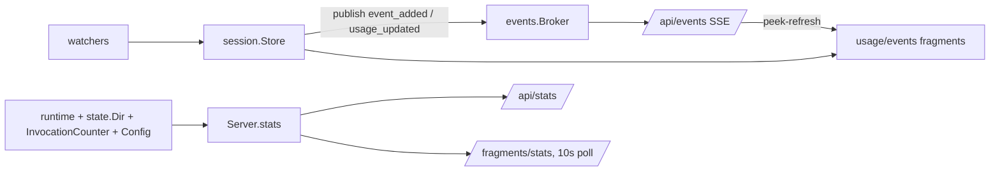

# Control server — self-usage stats & session analytics display — Change Plan

## TLDR

- Add a **Stats page + JSON endpoint** to the control server showing peek's own runtime state: PID, uptime, RAM, state-dir disk usage, effective config, loaded-session counts, MCP tool invocation counts.
- **Display the deep-analysis data** (token usage, counters, event stream) on the session detail page and expose it via a new `/api/sessions/{id}/events` endpoint — the data already exists in memory, it is only shown through MCP tools today.
- Add two broker event types (`event_added`, `usage_updated`) so the new UI sections refresh live.
- A restart button re-execs the process (http transport only); per-tool invocation counting is included.

## Context

- The control server ([control/server.go](control/server.go)) serves an HTMX dashboard + JSON API over the shared in-memory `session.Store`, but has no self-observability surface and does not display the analytics that deep-analysis added.
- Originating plans: [plans/control_server/concept/concept.md](plans/control_server/concept/concept.md) (backlog explicitly lists usage display) and [plans/deep_analysis/concept/concept.md](plans/deep_analysis/concept/concept.md) (events/counters/usage model). No `[USER]` decision in either conflicts with these drivers.
- This plan persists to `plans/control_server/design/usage_stats_addendum.md` at implementation.

## Drivers

| ID | Observed | Wanted | Impact | Origin |
|----|----------|--------|--------|--------|
| <a id="dr1"></a>DR1 | No self-usage surface exists: `GET /api/stats` → 404 on the running instance; only `/api/healthz` (`{status, version}`) | Stats page + `GET /api/stats` with:<br>PID<br>running time<br>disk usage (state dir)<br>RAM usage<br>effective config (+ restart, see [Q1](#d6))<br>loaded-session counts<br>invocation counts (see [Q2](#d7)) | behavioral (additive) | /fchange request (addendum) |
| <a id="dr2"></a>DR2 | `session.Session` carries `TotalUsage`, `Counters`, `Events` (deep-analysis), but the dashboard session detail page renders only Turns/Plan/Diff sections; the control API exposes only `total_usage` | Session detail page displays usage, counters, and the event stream; JSON API exposes them | behavioral (additive) | /fchange request (addendum) |

## Scope

- **In:**
  - **stats backend:** `GET /api/stats` + data builder ([DR1](#dr1))
  - **stats UI:** `/stats` page, `/fragments/stats` fragment, nav link
  - **invocation counters:** per-tool counter wired through `tools.Register` ([D7](#d7))
  - **session analytics display:** usage + counters + events fragments on the session detail page ([DR2](#dr2))
  - **session events API:** `GET /api/sessions/{id}/events`
  - **live refresh:** broker types `event_added` and `usage_updated` + layout listener update
  - **restart:** `POST /api/restart` + button, http transport only ([D6](#d6))
- **Out:**
  - cost estimation (excluded by deep-analysis concept)
  - editable config from the dashboard (no config-file mechanism exists — a separate feature per [D6](#d6))
  - historical/persisted metrics (stats are point-in-time)
  - usage columns in the session list (usage_reporting backlog)
- **Not changed:**
  - MCP tool surface and responses
  - auth/middleware chain, existing routes and their response shapes
  - session data model and watchers (except two added `publish` calls)
- **Deferred findings:**
  - `GET /api/sessions/{id}/usage` returns `TotalUsage` (excludes the active turn) while MCP tools return `CurrentUsage()` — inconsistency left as-is; the new endpoint uses `CurrentUsage()`

## Assumptions

| Assumption | Reality | Location |
|------------|---------|----------|
| "Invocations" are countable | No counter exists; MCP handlers are plain funcs registered in `tools.Register` and can be wrapped in-repo without touching mcp-go APIs | [tools/tools.go:29](tools/tools.go#L29) |
| "Config Change" is possible at runtime | Config is load-once cobra flags + `PEEK_*` env fallbacks; no config file, no reload path. "Change" can only mean re-exec with the current args/env | [cmd/start.go:296](cmd/start.go#L296) |
| Restart is safe | The production deployment runs `--transport=stdio` under Claude Desktop (observed via pgrep); re-exec breaks the MCP client's initialize state. Restart is only offered for http transport | [cmd/start.go:167](cmd/start.go#L167) |
| RAM usage is readable | No process-RSS API without a new dependency; `runtime.ReadMemStats` gives heap-alloc and OS-reserved bytes | [go.mod](go.mod) |

## Current state

- [control/server.go:70](control/server.go#L70) — `Handler()` registers 3 route families (pages, fragments, `/api`); no stats route.
- [control/api.go:188](control/api.go#L188) — `handleUsage` is the only analytics endpoint (`TotalUsage` only, no counters/events).
- [control/templates/session_detail.html](control/templates/session_detail.html) — sections: Turns, Plan, Diff, Uncommitted diff. No usage/events.
- [control/templates/layout.html:23](control/templates/layout.html#L23) — SSE listener list hard-codes 5 broker types.
- [session/session.go:34](session/session.go#L34) — `Session` holds `Counters`, `Events *EventBuffer`, `TotalUsage`; accessor `CurrentUsage()` at [session/session.go:125](session/session.go#L125).
- [session/store.go:100](session/store.go#L100) — events appended without any broker publish; Codex usage-signal branch ([session/store.go:116](session/store.go#L116)) returns without publish → analytics changes are invisible to SSE subscribers.
- [tools/viewmodels_events.go:14](tools/viewmodels_events.go#L14) — `eventEntry` + `newEventEntries` + `summarizeEvent` implement event display formatting, unexported.
- [state/dir.go:39](state/dir.go#L39) — `Dir` owns the state root; no size accessor.
- [cmd/start.go:139](cmd/start.go#L139) — control server wiring; all flag values in scope here.
- Observed real values (running instance, v1.0.7): 407 Claude sessions; usage for session `1cfa5868-d178-4c48-bb6d-a851daba01ce`:

```json
{
  "total_usage": {
    "cache_creation_input_tokens": 96766,
    "cache_read_input_tokens": 1137686,
    "input_tokens": 24,
    "output_tokens": 32706
  }
}
```

## Target state

```
control/
  server.go        routes: + /stats, /fragments/stats, /api/stats,
                           + /fragments/sessions/{id}/usage|events, /api/sessions/{id}/events
  stats.go         (new) stats builder + page/fragment/API handlers
  sessions.go      + usage/events fragment handlers
  api.go           + handleSessionEvents
  viewmodels.go    + statsResponse, sessionCounts, eventsResponse, Config
  templates/
    stats.html     (new) stats page
    _stats.html    (new) stats fragment (10s poll)
    _usage.html    (new) usage + counters fragment
    _events.html   (new) events fragment
tools/
  invocations.go   (new) InvocationCounter + counted wrapper
events/broker.go   + TypeEventAdded, TypeUsageUpdated
session/store.go   + 3 publish calls
state/dir.go       + Size()
cmd/start.go       + StartedAt/Config/StateDir/Invocations wiring
```

- **Principle: single source of truth** — one `Server.stats()` builder feeds both the JSON endpoint and the HTML fragment; config is snapshotted once at startup in `cmd/start.go` (where the flags live) and passed down, never re-derived.
- **Principle: reuse over reimplementation** — event display formatting is the existing tools summarizer, exported (`tools.EventEntry`, `tools.NewEventEntries`); mechanism: Go identifier export, compiler-driven rename.
- **Principle: platform-native push** — live refresh reuses the existing broker→SSE→`peek-refresh` pipeline by adding event types, not a new channel.



## Behavior contract

- All existing endpoints, fragments, and pages return byte-identical shapes; existing tests in `control/`, `session/`, `tools/` keep passing unmodified except where a signature sweep touches construction.
- `GET /api/sessions/{id}/usage` keeps its `TotalUsage` semantics (see Deferred findings).
- Diff watcher behavior unchanged: it filters `ev.Type != events.TypeTurnAdded` ([watcher/diff_watcher.go:64](watcher/diff_watcher.go#L64)), so new broker types pass it untouched.
- Intentional behavior changes (all additive, matching the behavioral drivers): new routes, new template sections, new broker types on the SSE stream, new nav link.

## Decisions

| ID | Problem | Facts | Decision | Why |
|----|---------|-------|----------|-----|
| <a id="d1"></a>D1 | Where does the stats surface live | [Current state](#current-state): 3 route families | New nav page `/stats` + `/fragments/stats` + `GET /api/stats`, mirroring the sessions page pattern | Same three-surface structure as everything else in `control/` |
| <a id="d2"></a>D2 | RAM metric without new dependency | Assumptions row 4 | `runtime.ReadMemStats`: heap-alloc + OS-reserved (`Sys`) + goroutine count | gopsutil would be a new dependency for one number; `Sys` approximates the OS footprint |
| <a id="d3"></a>D3 | What "disk usage" measures | `state.Dir` is peek's only disk footprint besides the binary | `state.Dir.Size()` walking the state root; field absent when persistence is disabled | The state dir is the only thing peek grows on disk |
| <a id="d4"></a>D4 | Where uptime starts | Control server is constructed at process start | `startedAt := time.Now()` at the top of the `start` Run func, passed via `Options.StartedAt` | Process-level truth, not server-construction time; testable |
| <a id="d5"></a>D5 | Config display + secret handling | Flags resolved only in `cmd/start.go` | Snapshot into `control.Config` at wiring time; token rendered as `token_set bool`, never the value | Wiring-time strategy selection; no secret leaves the process |
| <a id="d6"></a>D6 | What does "Config Change + Restart" mean | Assumptions rows 2–3: no config file; stdio deployment breaks on re-exec | `[USER]` display config + restart button: `POST /api/restart` re-execs the same binary/args, offered only on http transport | Picks up a new binary and externally edited launch args on http deployments; stdio deployments are restarted by their MCP client anyway; editable config would need a config-file mechanism that does not exist |
| <a id="d7"></a>D7 | Count MCP tool invocations? | Assumptions row 1; request wrote "Invocations?" | `[USER]` yes: per-tool counter via a handler wrapper in `tools.Register` | Cost is one small type + a signature sweep |
| <a id="d8"></a>D8 | Event formatting for the control UI | [tools/viewmodels_events.go:58](tools/viewmodels_events.go#L58) already summarizes every event kind | Export `EventEntry` / `NewEventEntries` and reuse; no duplication in `control/` | Port, don't rewrite — the summarizer handles all 11 event kinds incl. truncation |
| <a id="d9"></a>D9 | Analytics changes invisible to SSE | [session/store.go:100](session/store.go#L100), [:116](session/store.go#L116), [:149](session/store.go#L149) never publish | Add `TypeEventAdded` + `TypeUsageUpdated`; publish where events are appended and where Codex usage snapshots land | Without it the new sections only refresh on unrelated events; diff watcher is type-filtered, SSE is type-transparent |
| <a id="d10"></a>D10 | Stats fragment refresh trigger | RAM/uptime change with time, not with broker events | `hx-trigger="every 10s"` polling, not `peek-refresh` | Broker events do not track time-varying process metrics |
| <a id="d11"></a>D11 | Loaded-session counts accessor | `Store.WithSessions` exists ([session/store.go:368](session/store.go#L368)) | Two `WithSessions` calls (claude, codex) inside `stats()`; no new `Store` method | No new store API for a `len()` |
| <a id="d12"></a>D12 | Disposal | — | Nothing replaced; purely additive. No parallel old/new structures created | — |

## Changes

Every phase leaves the app building, tests green, and the dashboard functional.

### Phase 1 — self-stats backend ([DR1](#dr1))

#### 1.1 State dir size (new)

location: [state/dir.go](state/dir.go)
mirrors: `Gc` at [state/dir.go:81](state/dir.go#L81) (walk-the-root pattern)

```go
func (d *Dir) Size() int64 {
	var total int64
	filepath.WalkDir(d.root, func(path string, entry fs.DirEntry, err error) error {
		if err != nil || entry.IsDir() {
			return nil
		}
		if info, err := entry.Info(); err == nil {
			total += info.Size()
		}
		return nil
	})
	return total
}
```

#### 1.2 Options and Server fields (modified)

location: [control/server.go:21](control/server.go#L21)

```diff
 type Options struct {
 	Store   *session.Store
 	Broker  *events.Broker
 	Token   string
 	Version string
 	Depth   int
+	StartedAt   time.Time
+	StateDir    *state.Dir
+	Invocations *tools.InvocationCounter
+	Config      Config
 }

 type Server struct {
 	store      *session.Store
 	broker     *events.Broker
 	token      string
 	version    string
 	depth      int
 	tmpl       *template.Template
 	sseClients atomic.Int64
+	startedAt   time.Time
+	stateDir    *state.Dir
+	invocations *tools.InvocationCounter
+	config      Config
 }
```

- `New` copies the four new fields; adds template func `"bytes": formatBytes`.
- Options and Server additionally gain `Restart func()` / `restart func()` for [§5](#phase-5--restart-d6).
- New unit in [control/server.go](control/server.go):

```go
func formatBytes(n int64) string {
	const unit = 1024
	if n < unit {
		return fmt.Sprintf("%d B", n)
	}
	div, exp := int64(unit), 0
	for m := n / unit; m >= unit; m /= unit {
		div *= unit
		exp++
	}
	return fmt.Sprintf("%.1f %ciB", float64(n)/float64(div), "KMGTPE"[exp])
}
```

#### 1.3 Stats viewmodels (new)

location: [control/viewmodels.go](control/viewmodels.go)
mirrors: `healthzResponse` at [control/viewmodels.go:52](control/viewmodels.go#L52)

```go
type Config struct {
	Transport          string `json:"transport"`
	Port               int    `json:"port"`
	Depth              int    `json:"depth"`
	ClaudeHome         string `json:"claude_home,omitempty"`
	CodexHome          string `json:"codex_home,omitempty"`
	PollInterval       string `json:"poll_interval"`
	PollWindow         string `json:"poll_window"`
	StateDir           string `json:"state_dir,omitempty"`
	StateRetentionDays int    `json:"state_retention_days"`
	ControlPort        int    `json:"control_port"`
	TokenSet           bool   `json:"token_set"`
	LogLevel           string `json:"log_level"`
}

type sessionCounts struct {
	Claude int `json:"claude"`
	Codex  int `json:"codex"`
	Total  int `json:"total"`
}

type statsResponse struct {
	PID            int            `json:"pid"`
	Version        string         `json:"version"`
	StartedAt      time.Time      `json:"started_at"`
	Uptime         string         `json:"uptime"`
	HeapAllocBytes int64          `json:"heap_alloc_bytes"`
	SysBytes       int64          `json:"sys_bytes"`
	Goroutines     int            `json:"goroutines"`
	StateDiskBytes int64          `json:"state_disk_bytes,omitempty"`
	Sessions       sessionCounts  `json:"sessions"`
	Invocations    map[string]int `json:"invocations,omitempty"`
	SSEClients     int64          `json:"sse_clients"`
	Config         Config         `json:"config"`
}
```

#### 1.4 Stats builder and handlers (new)

location: `control/stats.go` (new file)
mirrors: [control/sessions.go](control/sessions.go) (page/fragment handlers) + [control/api.go:27](control/api.go#L27) (`handleHealthz`)

```go
package control

import (
	"net/http"
	"os"
	"runtime"
	"time"

	"github.com/kevinhorst/peek-mcp/session"
)

const pageStats = "stats"

func (s *Server) stats() statsResponse {
	var mem runtime.MemStats
	runtime.ReadMemStats(&mem)

	counts := sessionCounts{}
	s.store.WithSessions([]session.Agent{session.AgentClaude}, func(sessions []*session.Session) {
		counts.Claude = len(sessions)
	})
	s.store.WithSessions([]session.Agent{session.AgentCodex}, func(sessions []*session.Session) {
		counts.Codex = len(sessions)
	})
	counts.Total = counts.Claude + counts.Codex

	resp := statsResponse{
		PID:            os.Getpid(),
		Version:        s.version,
		StartedAt:      s.startedAt,
		Uptime:         time.Since(s.startedAt).Truncate(time.Second).String(),
		HeapAllocBytes: int64(mem.HeapAlloc),
		SysBytes:       int64(mem.Sys),
		Goroutines:     runtime.NumGoroutine(),
		Sessions:       counts,
		SSEClients:     s.sseClients.Load(),
		Config:         s.config,
	}
	if s.stateDir != nil {
		resp.StateDiskBytes = s.stateDir.Size()
	}
	if s.invocations != nil {
		resp.Invocations = s.invocations.Snapshot()
	}
	return resp
}

func (s *Server) handleStats(w http.ResponseWriter, r *http.Request) {
	writeJSON(w, s.stats())
}

func (s *Server) handleStatsPage(w http.ResponseWriter, r *http.Request) {
	s.renderFragment(w, tmplStats, indexPage{Page: pageStats, Title: "Peek stats"})
}

func (s *Server) handleStatsFragment(w http.ResponseWriter, r *http.Request) {
	s.renderFragment(w, tmplStatsFragment, s.stats())
}
```

- Template name constants join the block at [control/sessions.go:11](control/sessions.go#L11):

```diff
 const (
 	pageSessions      = "sessions"
 	tmplSessionsIndex = "sessions_index.html"
 	tmplSessionDetail = "session_detail.html"
+	tmplStats         = "stats.html"
+	tmplStatsFragment = "_stats.html"
 	tmplSessionList   = "_session_list.html"
```

#### 1.5 Routes (modified)

location: [control/server.go:70](control/server.go#L70)

```diff
 func (s *Server) Handler() http.Handler {
 	mux := http.NewServeMux()
 	mux.HandleFunc("GET /{$}", s.handleSessionsPage)
 	mux.Handle("GET /assets/", s.assetsHandler())
 	mux.HandleFunc("GET /sessions/{id}", s.handleSessionDetailPage)
+	mux.HandleFunc("GET /stats", s.handleStatsPage)
 	mux.HandleFunc("GET /fragments/sessions", s.handleSessionsFragment)
+	mux.HandleFunc("GET /fragments/stats", s.handleStatsFragment)
 	// ...
 	mux.HandleFunc("GET /api/healthz", s.handleHealthz)
+	mux.HandleFunc("GET /api/stats", s.handleStats)
 	mux.HandleFunc("GET /api/sessions", s.handleSessions)
```

#### 1.6 Wiring (modified)

location: [cmd/start.go:35](cmd/start.go#L35) and [cmd/start.go:139](cmd/start.go#L139)

```diff
 	Run: func(cmd *cobra.Command, args []string) {
+		startedAt := time.Now()
 		applyEnvFallbacks(cmd)
 		warnMaxOutputTokens()
```

```diff
 		if controlPort > 0 {
 			controlServer, err := control.New(&control.Options{
 				Store:   store,
 				Broker:  broker,
 				Token:   controlToken,
 				Version: Version(),
 				Depth:   depth,
+				StartedAt: startedAt,
+				StateDir:  stateDir,
+				Config: control.Config{
+					Transport:          transport,
+					Port:               port,
+					Depth:              depth,
+					ClaudeHome:         claudeHome,
+					CodexHome:          codexHome,
+					PollInterval:       pollInterval.String(),
+					PollWindow:         pollWindow.String(),
+					StateDir:           stateDirPath,
+					StateRetentionDays: stateRetentionDays,
+					ControlPort:        controlPort,
+					TokenSet:           controlToken != "",
+					LogLevel:           logLevel,
+				},
 			})
```

### Phase 2 — invocation counters ([D7](#d7))<a id="s2"></a>

#### 2.1 Counter (new)

location: `tools/invocations.go` (new file)
mirrors: `PageStore` locking style in the tools package

- Example implementation approved via [Hot items](#hot-items) (locking class).

```go
package tools

import (
	"maps"
	"sync"
)

type InvocationCounter struct {
	mu     sync.Mutex
	counts map[string]int
}

func NewInvocationCounter() *InvocationCounter {
	return &InvocationCounter{counts: make(map[string]int)}
}

func (c *InvocationCounter) Inc(tool string) {
	c.mu.Lock()
	defer c.mu.Unlock()
	c.counts[tool]++
}

func (c *InvocationCounter) Snapshot() map[string]int {
	c.mu.Lock()
	defer c.mu.Unlock()
	return maps.Clone(c.counts)
}
```

#### 2.2 Handler wrapper + Register signature (modified)

location: [tools/tools.go:29](tools/tools.go#L29)

```diff
-func Register(server *server.MCPServer, store *session.Store) {
+func Register(server *server.MCPServer, store *session.Store, counter *InvocationCounter) {
```

- Each `server.AddTool(tool, handler)` call becomes `server.AddTool(tool, counted(counter, "<tool name>", handler))` — 7 call sites, tool name matching the `mcp.NewTool` name literal.
- New unit in [tools/tools.go](tools/tools.go):

```go
func counted(counter *InvocationCounter, name string, handler server.ToolHandlerFunc) server.ToolHandlerFunc {
	return func(ctx context.Context, req mcp.CallToolRequest) (*mcp.CallToolResult, error) {
		counter.Inc(name)
		return handler(ctx, req)
	}
}
```

#### 2.3 Wiring (modified)

location: [cmd/start.go:137](cmd/start.go#L137)

```diff
-	tools.Register(srv, store)
+	invocations := tools.NewInvocationCounter()
+	tools.Register(srv, store, invocations)
```

- `Invocations: invocations` joins the `control.Options` literal from [§1.6](#16-wiring-modified).

### Phase 3 — stats UI ([DR1](#dr1))

#### 3.1 Stats page template (new)

location: `control/templates/stats.html` (new file)
mirrors: [control/templates/sessions_index.html](control/templates/sessions_index.html)

```html
{{template "head" .}}
{{template "nav" .}}
<h1>Peek</h1>
<div hx-get="/fragments/stats" hx-trigger="load, every 10s" hx-swap="outerHTML">
  <div class="empty">Loading…</div>
</div>
{{template "foot" .}}
```

#### 3.2 Stats fragment template (new)

location: `control/templates/_stats.html` (new file)
mirrors: [control/templates/_turns.html](control/templates/_turns.html) (self-replacing outerHTML fragment)

```html
<div hx-get="/fragments/stats" hx-trigger="every 10s" hx-swap="outerHTML">
<table>
  <tr><th>PID</th><td>{{.PID}}</td></tr>
  <tr><th>Version</th><td>{{.Version}}</td></tr>
  <tr><th>Started</th><td>{{ts .StartedAt}} · up {{.Uptime}}</td></tr>
  <tr><th>RAM</th><td>{{bytes .HeapAllocBytes}} heap · {{bytes .SysBytes}} from OS</td></tr>
  <tr><th>Goroutines</th><td>{{.Goroutines}}</td></tr>
  {{if .Config.StateDir}}<tr><th>State dir</th><td>{{.Config.StateDir}} · {{bytes .StateDiskBytes}}</td></tr>{{end}}
  <tr><th>Sessions</th><td>{{.Sessions.Claude}} claude · {{.Sessions.Codex}} codex · {{.Sessions.Total}} total</td></tr>
  <tr><th>SSE clients</th><td>{{.SSEClients}}</td></tr>
</table>
{{if .Invocations}}
<h2>Tool invocations</h2>
<table>
  {{range $tool, $count := .Invocations}}<tr><th>{{$tool}}</th><td>{{$count}}</td></tr>{{end}}
</table>
{{end}}
<h2>Config</h2>
<table>
  <tr><th>Transport</th><td>{{.Config.Transport}}</td></tr>
  <tr><th>Port</th><td>{{.Config.Port}}</td></tr>
  <tr><th>Depth</th><td>{{.Config.Depth}}</td></tr>
  <tr><th>Claude home</th><td>{{.Config.ClaudeHome}}</td></tr>
  <tr><th>Codex home</th><td>{{.Config.CodexHome}}</td></tr>
  <tr><th>Poll interval</th><td>{{.Config.PollInterval}}</td></tr>
  <tr><th>Poll window</th><td>{{.Config.PollWindow}}</td></tr>
  <tr><th>State retention</th><td>{{.Config.StateRetentionDays}} days</td></tr>
  <tr><th>Control port</th><td>{{.Config.ControlPort}}</td></tr>
  <tr><th>Token</th><td>{{if .Config.TokenSet}}set{{else}}not set{{end}}</td></tr>
  <tr><th>Log level</th><td>{{.Config.LogLevel}}</td></tr>
</table>
</div>
```

#### 3.3 Nav link (modified)

location: [control/templates/layout.html:29](control/templates/layout.html#L29)

```diff
 {{define "nav"}}
 <nav>
   <a href="/" {{if eq .Page "sessions"}}class="active"{{end}}>Sessions</a>
+  <a href="/stats" {{if eq .Page "stats"}}class="active"{{end}}>Stats</a>
 </nav>
 {{end}}
```

### Phase 4 — session usage & events display ([DR2](#dr2))

#### 4.1 Export the event summarizer (modified)

location: [tools/viewmodels_events.go:14](tools/viewmodels_events.go#L14)

```diff
-type eventEntry struct {
+type EventEntry struct {
 	Actor     string            `json:"actor,omitempty"`
 	Event     session.EventKind `json:"event"`
 	Summary   string            `json:"summary,omitempty"`
 	Timestamp time.Time         `json:"timestamp"`
 }
```

```diff
-func newEventEntries(events []*session.Event) []*eventEntry {
-	entries := make([]*eventEntry, 0, len(events))
+func NewEventEntries(events []*session.Event) []*EventEntry {
+	entries := make([]*EventEntry, 0, len(events))
 	for _, event := range events {
-		entry := &eventEntry{
+		entry := &EventEntry{
```

- Compiler-driven cascade for the in-package references (`marshalEvents` and tests).

#### 4.2 Broker types (modified)

location: [events/broker.go:10](events/broker.go#L10)

```diff
 const (
 	TypeSessionCreated         Type = "session_created"
 	TypeTurnAdded              Type = "turn_added"
+	TypeEventAdded             Type = "event_added"
+	TypeUsageUpdated           Type = "usage_updated"
 	TypePlanUpdated            Type = "plan_updated"
 	TypeDiffUpdated            Type = "diff_updated"
 	TypeUncommittedDiffUpdated Type = "uncommitted_diff_updated"
 )
```

#### 4.3 Store publishes (modified)

location: [session/store.go:100](session/store.go#L100), [:116](session/store.go#L116), [:149](session/store.go#L149)

```diff
 	for _, event := range turn.Events {
 		s.appendEvent(session, event)
 	}
+	if len(turn.Events) > 0 {
+		s.publish(events.TypeEventAdded, id, agent)
+	}

 	// update only plan content
 	if turn.PlanFilePath != "" {
```

```diff
 	if turn.IsUsageSignal() {
 		session.TotalUsage = *turn.Usage
+		s.publish(events.TypeUsageUpdated, id, agent)
 		return
 	}
```

```diff
 func (s *Store) addSubagentEvents(id Id, turn *Turn) {
 	// ...
 	for _, event := range turn.Events {
 		s.appendEvent(session, event)
 	}
+	if len(turn.Events) > 0 {
+		s.publish(events.TypeEventAdded, id, session.Agent)
+	}
 }
```

#### 4.4 SSE listener list (modified)

location: [control/templates/layout.html:23](control/templates/layout.html#L23)

```diff
-  ['session_created', 'turn_added', 'plan_updated', 'diff_updated', 'uncommitted_diff_updated'].forEach(function (type) {
+  ['session_created', 'turn_added', 'event_added', 'usage_updated', 'plan_updated', 'diff_updated', 'uncommitted_diff_updated'].forEach(function (type) {
```

#### 4.5 Events API endpoint (new)

location: [control/api.go](control/api.go) (after `handleUsage`) and [control/viewmodels.go](control/viewmodels.go)
mirrors: `handleUsage` at [control/api.go:188](control/api.go#L188)

```go
type eventsResponse struct {
	Counters      session.Counters    `json:"counters"`
	Events        []*tools.EventEntry `json:"events"`
	PlanRevisions int                 `json:"plan_revisions"`
	Usage         session.Usage       `json:"usage"`
}
```

```go
func (s *Server) handleSessionEvents(w http.ResponseWriter, r *http.Request) {
	var resp eventsResponse
	found := s.store.WithSession(session.Id(r.PathValue("id")), func(sess *session.Session) {
		resp = eventsResponse{
			Counters:      sess.Counters,
			Events:        tools.NewEventEntries(sess.Events.All()),
			PlanRevisions: len(sess.PlanRevisions),
			Usage:         *sess.CurrentUsage(),
		}
	})
	if !found {
		respondNotFound("unknown session", w)
		return
	}
	writeJSON(w, resp)
}
```

#### 4.6 Usage and events fragments (new)

location: [control/sessions.go](control/sessions.go)
mirrors: `handleTurnsFragment` at [control/sessions.go:114](control/sessions.go#L114)

```go
const maxEventsFragment = 100

type usageData struct {
	Id       session.Id
	Counters session.Counters
	Usage    session.Usage
}

type eventsData struct {
	Id     session.Id
	Events []*tools.EventEntry
}

func (s *Server) handleUsageFragment(w http.ResponseWriter, r *http.Request) {
	id := session.Id(r.PathValue("id"))
	data := usageData{Id: id}
	if !s.store.WithSession(id, func(sess *session.Session) {
		data.Counters = sess.Counters
		data.Usage = *sess.CurrentUsage()
	}) {
		respondNotFound("unknown session", w)
		return
	}
	s.renderFragment(w, tmplUsage, data)
}

func (s *Server) handleEventsFragment(w http.ResponseWriter, r *http.Request) {
	id := session.Id(r.PathValue("id"))
	data := eventsData{Id: id}
	if !s.store.WithSession(id, func(sess *session.Session) {
		all := sess.Events.All()
		slices.Reverse(all)
		if len(all) > maxEventsFragment {
			all = all[:maxEventsFragment]
		}
		data.Events = tools.NewEventEntries(all)
	}) {
		respondNotFound("unknown session", w)
		return
	}
	s.renderFragment(w, tmplEvents, data)
}
```

- Constants `tmplUsage = "_usage.html"` and `tmplEvents = "_events.html"` join the block at [control/sessions.go:11](control/sessions.go#L11).

#### 4.7 Fragment templates (new)

location: `control/templates/_usage.html` (new file)
mirrors: [control/templates/_turns.html](control/templates/_turns.html)

```html
<div hx-get="/fragments/sessions/{{.Id}}/usage" hx-trigger="peek-refresh from:body throttle:1s" hx-swap="outerHTML">
<table>
  <tr><th>Input tokens</th><td>{{.Usage.InputTokens}}</td></tr>
  <tr><th>Output tokens</th><td>{{.Usage.OutputTokens}}</td></tr>
  <tr><th>Cache creation</th><td>{{.Usage.CacheCreationInputTokens}}</td></tr>
  <tr><th>Cache read</th><td>{{.Usage.CacheReadInputTokens}}</td></tr>
  <tr><th>Cached input</th><td>{{.Usage.CachedInputTokens}}</td></tr>
  <tr><th>Reasoning output</th><td>{{.Usage.ReasoningOutputTokens}}</td></tr>
  <tr><th>Total tokens</th><td>{{.Usage.TotalTokens}}</td></tr>
  <tr><th>Permission denials</th><td>{{.Counters.PermissionDenials}}</td></tr>
  <tr><th>Plan alterations</th><td>{{.Counters.PlanAlterations}}</td></tr>
  <tr><th>Plan rejections</th><td>{{.Counters.PlanRejections}}</td></tr>
  <tr><th>Skills invoked</th><td>{{.Counters.SkillsInvoked}}</td></tr>
  <tr><th>Subagents spawned</th><td>{{.Counters.SubagentsSpawned}}</td></tr>
</table>
</div>
```

location: `control/templates/_events.html` (new file)
mirrors: [control/templates/_turns.html](control/templates/_turns.html)

```html
<div hx-get="/fragments/sessions/{{.Id}}/events" hx-trigger="peek-refresh from:body throttle:1s" hx-swap="outerHTML">
{{if .Events}}
{{range .Events}}
<div class="card card-column">
  <div class="card-row">
    <span class="badge">{{.Event}}</span>
    {{if .Actor}}<span class="meta">{{.Actor}}</span>{{end}}
    <span class="meta">{{ts .Timestamp}}</span>
  </div>
  {{if .Summary}}<div class="snippet"><pre>{{.Summary}}</pre></div>{{end}}
</div>
{{end}}
{{else}}
<div class="empty">No events yet.</div>
{{end}}
</div>
```

#### 4.8 Session detail sections (modified)

location: [control/templates/session_detail.html:10](control/templates/session_detail.html#L10)

```diff
 </div>
+<details class="section" open>
+  <summary>Usage</summary>
+  <div hx-get="/fragments/sessions/{{.Summary.Id}}/usage" hx-trigger="load, peek-refresh from:body throttle:1s" hx-swap="outerHTML">
+    <div class="empty">Loading…</div>
+  </div>
+</details>
+<details class="section">
+  <summary>Events</summary>
+  <div hx-get="/fragments/sessions/{{.Summary.Id}}/events" hx-trigger="load, peek-refresh from:body throttle:1s" hx-swap="outerHTML">
+    <div class="empty">Loading…</div>
+  </div>
+</details>
 <details class="section">
   <summary>Turns</summary>
```

#### 4.9 Routes (modified)

location: [control/server.go:70](control/server.go#L70)

```diff
 	mux.HandleFunc("GET /fragments/sessions/{id}/uncommitted-diff", s.handleUncommittedDiffFragment)
+	mux.HandleFunc("GET /fragments/sessions/{id}/usage", s.handleUsageFragment)
+	mux.HandleFunc("GET /fragments/sessions/{id}/events", s.handleEventsFragment)
 	// ...
 	mux.HandleFunc("GET /api/sessions/{id}/usage", s.handleUsage)
+	mux.HandleFunc("GET /api/sessions/{id}/events", s.handleSessionEvents)
```

### Phase 5 — restart ([D6](#d6))

#### 5.1 Restart handler and option (new)

location: [control/server.go](control/server.go) (Options + Server gain `Restart func()`), handler in `control/stats.go`
mirrors: `handleHealthz` at [control/api.go:27](control/api.go#L27)

```go
func (s *Server) handleRestart(w http.ResponseWriter, r *http.Request) {
	if s.restart == nil {
		respondBadRequest("restart not available for this transport", w)
		return
	}
	w.WriteHeader(http.StatusAccepted)
	go func() {
		time.Sleep(250 * time.Millisecond)
		s.restart()
	}()
}
```

- Route: `mux.HandleFunc("POST /api/restart", s.handleRestart)`.
- Button appended to `_stats.html`:

```html
{{if .RestartAvailable}}<button hx-post="/api/restart" hx-confirm="Restart peek-mcp?">Restart</button>{{end}}
```

- `statsResponse` gains `RestartAvailable bool` set from `s.restart != nil`.

#### 5.2 Wiring (modified, http transport only)

location: [cmd/start.go:139](cmd/start.go#L139)

```go
if transport == "http" {
	opts.Restart = func() {
		exe, err := os.Executable()
		if err != nil {
			slog.Error("restart: executable lookup failed", "err", err)
			return
		}
		if err := syscall.Exec(exe, os.Args, os.Environ()); err != nil {
			slog.Error("restart: exec failed", "err", err)
		}
	}
}
```

## Hot items

- **Locking** ([context/general/hot-items.md](context/general/hot-items.md) item 2): `InvocationCounter` — example implementation in [§2.1](#s2) (mutex-guarded map, `maps.Clone` snapshot so no reference escapes the lock). Approval of this plan approves that example.
- **Goroutine** (item 2): restart handler's delayed-exec goroutine in §5.1 — fire-and-forget by design, process is replaced.
- No new interfaces, generics, or anonymous struct types anywhere in the plan (item 3, 6).

## Tests

Existing `control/` tests pin all current behavior and stay green (Behavior contract). New coverage:

| Location.Method | Cases | Comment |
|-----------------|-------|---------|
| control/api_test.go `TestStats` | PID > 0 and version echoed<br>session counts match seeded store<br>`config.token_set` true, raw token absent from body<br>`state_disk_bytes` present with state dir, omitted without | mirrors `TestHealthz` setup |
| control/api_test.go `TestSessionEvents` | counters + events + usage for seeded session<br>plan_revisions count<br>unknown id → 404 | mirrors `TestUsage` |
| control/pages_test.go `TestStatsPage` | 200, contains nav Stats link and fragment hx-get | mirrors `TestSessionsPage` |
| control/pages_test.go `TestStatsFragment` | contains PID row and config table | |
| control/pages_test.go `TestUsageFragment` | token values rendered<br>counter values rendered | mirrors `TestTurnsFragment` |
| control/pages_test.go `TestEventsFragment` | event cards rendered newest-first<br>empty state "No events yet." | |
| state/dir_test.go `TestSize` | sums nested files<br>missing root → 0 | |
| tools/invocations_test.go `TestInvocationCounter` | concurrent Inc totals correct<br>Snapshot is a copy | |
| session/store_test.go `TestPublishEventAdded` | event-carrying turn publishes `event_added`<br>subagent-signal turn publishes `event_added` | mirrors existing publish assertions |
| session/store_test.go `TestPublishUsageUpdated` | Codex usage signal publishes `usage_updated` | |

- Not tested: `syscall.Exec` restart path (replaces the test process); verified via runbook only.
- Not tested: exact HTML layout beyond marker strings — consistent with existing page tests.

## Test runbook

Tool format: bash + curl + jq against `PEEK_CONTROL_URL` (discovered from [plans/control_server/runbooks/sessions_pagination.sh](plans/control_server/runbooks/sessions_pagination.sh)). Files persist at implementation.

location: `plans/control_server/runbooks/stats.sh`

```bash
#!/usr/bin/env bash
set -euo pipefail
BASE="${PEEK_CONTROL_URL:-http://127.0.0.1:4243}"
curl -s "$BASE/api/stats" | jq '{pid, uptime, goroutines, sessions, state_disk_bytes, sse_clients, invocations, token_set: .config.token_set}'
curl -s "$BASE/stats" | grep -c 'href="/stats"'
curl -s "$BASE/fragments/stats" | grep -o '<th>PID</th>'
```

location: `plans/control_server/runbooks/session_events.sh`

```bash
#!/usr/bin/env bash
set -euo pipefail
BASE="${PEEK_CONTROL_URL:-http://127.0.0.1:4243}"
ID=$(curl -s "$BASE/api/sessions?agent=claude" | jq -r '.sessions[0].id')
curl -s "$BASE/api/sessions/$ID/events" | jq '{counters, plan_revisions, total_tokens: .usage.total_tokens, event_count: (.events | length)}'
curl -s "$BASE/fragments/sessions/$ID/usage" | grep -c '<th>Input tokens</th>'
curl -s "$BASE/fragments/sessions/$ID/events" | grep -c 'card card-column\|No events yet'
curl -s -o /dev/null -w '%{http_code}\n' "$BASE/api/sessions/does-not-exist/events"
```

## Contracts & sweeps

| Contract | Sides | Sweep |
|----------|-------|-------|
| `tools.Register` signature (+counter) | [cmd/start.go:137](cmd/start.go#L137)<br>tools package tests | `grep -rn "tools.Register\|Register(srv" --include="*.go"` → every caller passes the counter; compile is the gate |
| `eventEntry`/`newEventEntries` → exported | tools package internal (`marshalEvents`, tests) | `grep -rn "eventEntry\|newEventEntries" --include="*.go"` → zero hits |
| `control.Options` new fields | [cmd/start.go:140](cmd/start.go#L140)<br>control test helpers constructing `Options` | `grep -rn "control.Options{\|&Options{" --include="*.go"` → compile; zero-value fields legal for tests not exercising stats |
| broker `events.Type` set | [control/templates/layout.html:23](control/templates/layout.html#L23) JS list<br>[watcher/diff_watcher.go:64](watcher/diff_watcher.go#L64) type filter<br>control SSE tests | `grep -rn "event_added\|usage_updated"` → hits in broker.go, store.go, layout.html, tests — nowhere else |
| new routes ↔ templates | `hx-get`/`hx-post` attributes in templates<br>runbook URLs | `grep -rn "fragments/stats\|api/stats\|/usage\|/events" control/templates plans/control_server/runbooks` → every referenced route registered in `Handler()` |

## Verification

Per phase, after `make test` passes and `make serve-http` is running (control port from the Makefile target's flags; live instance values as baseline: v1.0.7, 407 Claude sessions):

Phase 1/3 — stats:
- [ ] Run `curl -s $BASE/api/stats | jq .` — expect real PID, uptime counting up between two calls, `sessions.claude` ≈ 407, config matching the launch flags, no raw token anywhere
- [ ] Run `curl -s $BASE/api/stats | jq .state_disk_bytes` with `--state-dir` set — expect a positive number matching `du -sk ~/.peek/state` within rounding
- [ ] Start with `--state-dir=""` — expect `state_disk_bytes` absent from the JSON
- [ ] Open `/stats` in a browser — expect the table to update without reload within 10s (watch uptime tick)
- [ ] Open `/` — expect the new Stats nav link, Sessions page otherwise unchanged

Phase 2 — invocations:
- [ ] Call any MCP tool (e.g. `session_list` from a Claude session), then `curl -s $BASE/api/stats | jq .invocations` — expect the tool's count incremented

Phase 4 — session analytics:
- [ ] Run `plans/control_server/runbooks/session_events.sh` — expect counters JSON, event count > 0 for an active session, 404 for the unknown id
- [ ] Open a live session's detail page — expect Usage section with token values matching `curl .../usage` (session `1cfa5868…` baseline: output_tokens 32706+), Events section listing skill/subagent events newest-first
- [ ] Trigger a subagent or skill in a live Claude session — expect the Events section to refresh via SSE without reload
- [ ] Open a session with no events — expect "No events yet."
- [ ] Run existing runbooks `sessions_pagination.sh` and `turns_default.sh` — expect unchanged output (behavior contract)

Phase 5 — restart:
- [ ] Click Restart on `/stats` under http transport — expect 202, new PID on the stats page within seconds, sessions repopulated by watchers
- [ ] Start with stdio transport — expect no Restart button and `POST /api/restart` → 400

## Stop conditions

| ID | Condition | Action |
|----|-----------|--------|
| 1–6 | Generic conditions from [context/general/stop-conditions.md](context/general/stop-conditions.md), verbatim | as stated there |
| 7 | Mechanical transform (the export rename in §4.1) loses fidelity | diff old/new element-by-element before presenting; stop on loss |
| 8 | Old and new structure would have to coexist beyond the phasing | stop and report; never leave a half-migration |
| 9 | A driver contradicts a `[USER]` decision in an originating plan | surface the conflict; never silently override |
| 10 | `server.ToolHandlerFunc` signature in mcp-go v0.52 differs from the wrapper in §2.2 | stop, report the actual signature before adapting |
| 11 | `syscall.Exec` restart misbehaves on darwin (listeners not released, fds leak) | stop, report; do not fall back to fork/exec improvisation |

## Open questions

Empty — Q1 and Q2 answered, see Changelog.

## Changelog

| Date | Trigger | What changed |
|------|---------|--------------|
| — | initial | plan created |
| 2026-08-11 | Q: Config Change + Restart scope | [D6](#d6) → `[USER]` restart button (option b); Phase 5 unconditional |
| 2026-08-11 | Q: count tool invocations | [D7](#d7) → `[USER]` per-tool counter (option a); Phase 2 unconditional |
