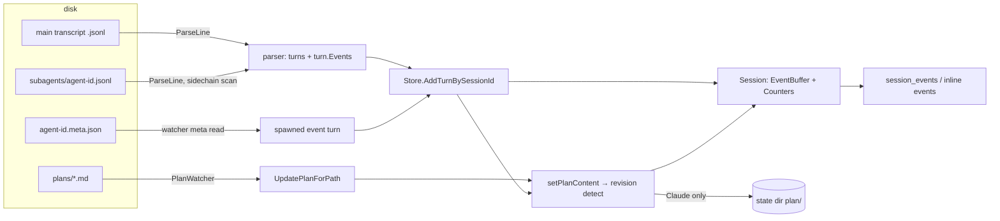
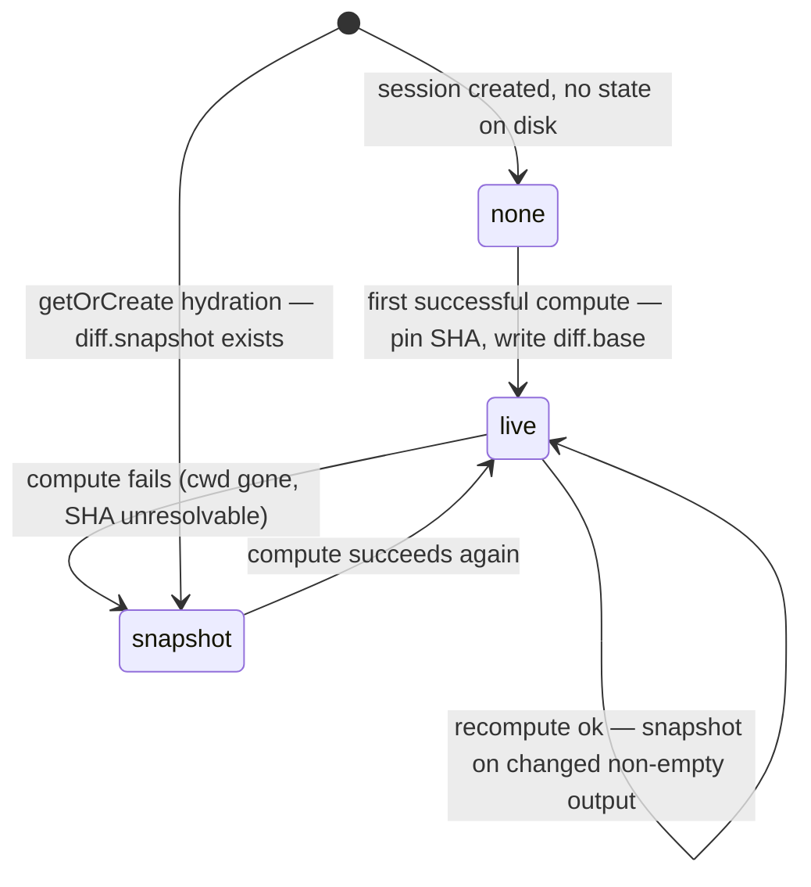

# Deep Analysis — Implementation Plan

## TLDR

- Peek becomes the data source for deep session analysis: a typed event stream (skill invocations, plan lifecycle, permission denials, user answers, subagent spawn/result) extracted from both agents' transcripts, plus derived counters and usage totals.
- The session diff becomes durable: merge-base pinned per session as a SHA at first compute, last non-empty diff persisted as a snapshot under `~/.peek/state/`, served with explicit `source`/`captured_at` after merge, cherry-pick, or worktree cleanup, surviving daemon restarts.
- Plan revision history is recorded (initial version + unified diff per change); Claude revisions persist to the state dir (disk forgets overwritten plan files), Codex revisions re-derive from the rollout.
- Exposure: new `session_events` tool (events + counters + usage + plan revisions + diff availability + unsupported list), compact event entries in `session_full`/`session_latest`/`session_get` on by default, `remember` arg returning project memory, usage totals in `session_get`, and the Codex usage fix (worse than the concept assumed: Codex usage currently never lands at all).
- Implements the four concept blocks of [concept.md](plans/deep_analysis/concept/concept.md) — [signals](plans/deep_analysis/concept/signals.md), [subagents](plans/deep_analysis/concept/subagents.md), [diff retention](plans/deep_analysis/concept/diff_retention.md), [surface](plans/deep_analysis/concept/surface.md).

## Context

- **Problem:** analysis-relevant signals (plan rejections, denials, skills, subagents) are silently dropped by both parsers today — `tool_use`/`tool_result` blocks are discarded at [claude/parser.go:200](claude/parser.go:200), `function_call` items at [codex/parser.go:141](codex/parser.go:141) — and the session diff dies with worktree cleanup ([watcher/diff_watcher.go:82](watcher/diff_watcher.go:82) just returns on git failure).
- **Design being implemented:** the clarified concept [plans/deep_analysis/concept/concept.md](plans/deep_analysis/concept/concept.md) (binding, zero open questions) with its four block docs.
- **Persistence principle (binding):** persist only what disk doesn't remember — events/subagents/memory/usage re-derive from transcripts in memory; only diff pins+snapshots and Claude plan revisions get the state dir `~/.peek/state/<agent>/<session-id>/`.
- **Constraint:** signal extraction is allowlist-based (`Skill`, `ExitPlanMode`, `Agent`, `AskUserQuestion`, Codex `exec_command` escalation, generic denial pattern) — never a general tool-call mirror.
- **Constraint:** all shapes verified against real artifacts (this session: approval/denial/persisted-output/AskUserQuestion/subagent meta/Codex escalation pair) — see Baseline.

## Scope

- **In:**
  - **event model:** typed `session.Event` + ring buffer + counters on `Session`
  - **claude extraction:** tool_use/tool_result allowlist scan, slash-command tags, plan attachment events, persisted-output resolution, sidechain (subagent) event scan
  - **codex extraction:** escalated `exec_command` permission events, subagent rollouts parsed in subagent mode attached to the parent, usage keep-last fix
  - **plan revisions:** store-side change detection, initial + unified diffs, Claude persistence, alteration counting
  - **diff durability:** per-session SHA pin, snapshot persistence, snapshot serving with `source`/`captured_at`, restart hydration
  - **state dir:** new `state` package, `--state-dir`/`--state-retention-days` flags + env vars, GC at startup and daily
  - **tool surface:** new `session_events`; events + usage + `remember` on existing tools; structured `session_diff` response
  - **subagent meta:** watcher reads `subagents/agent-*.meta.json` → spawned events; new-dir backfill fix
  - **docs:** README tool/flag/env/parity updates, mcpb manifest tool list
- **Out (explicit non-goals, all concept backlog/decisions):**
  - **cost estimation / ccusage:** stays outside peek
  - **full subagent turn browsing:** backlog
  - **cross-session aggregation:** backlog (config-server territory)
  - **event suppression arg:** backlog
  - **memory type filtering:** backlog
  - **general tool-call mirroring:** parity-concept decision unchanged
  - **Codex plan approval events:** not detectable, documented parity gap
- **Not changed:**
  - **turn distillation:** conversational turn extraction, ring size, title derivation
  - **uncommitted diff:** stays live-only ([diff_retention.md](plans/deep_analysis/concept/diff_retention.md) decision)
  - **peek-diff hook file:** untouched
  - **Codex index watcher:** untouched
- **Deferred findings:**
  - **manifest drift:** [mcpb/manifest.json](mcpb/manifest.json) `tools` lacks `session_uncommitted_diff` (pre-existing; this plan adds `session_events` but does not silently backfill the missing row — flagged here)
  - **RULE-CLI-001 partial violation:** [cmd/start.go:157](cmd/start.go:157) binds flags by string lookup, not an options struct (pre-existing; new flags follow the existing in-repo pattern)
  - **store TODO:** `Agent.IsValid` TODO at [session/store.go:41](session/store.go:41) untouched

## Assumptions

| Assumption | Reality | Location |
|---|---|---|
| Concept: "Claude requestId keep-last merge is already correct; fix Codex cumulative `token_count` (keep-last, not sum)" | Worse: Codex usage turns carry no `Role`, fail `Turn.Validate`, and **never reach the store at all** — `TotalUsage` for Codex is always empty today. Also the final in-flight turn's usage is never folded into `TotalUsage` (fold happens only when the *next* request arrives) | [session/turn.go:50](session/turn.go:50), [codex/parser.go:174](codex/parser.go:174), [session/session.go:64](session/session.go:64) |
| Concept: memory dir = "the transcript's project directory" | Worktree sessions' memory lives in the **base** project dir (`...-peek-mcp/memory/`), not the worktree-encoded dir (`...-peek-mcp--claude-worktrees-<name>/`); older worktree dirs *do* carry their own `memory/`. Both exist in the wild → two-step lookup needed | verified on disk 2026-07-22 (this session's own memory vs transcript location) |
| [signals.md](plans/deep_analysis/concept/signals.md) event-kind list omits `plan_mode_reenter` | Its Flows section maps `plan_mode_reentry` attachments to `mode_reenter` events — the kind list is truncated; `plan_mode_reenter` is included | [signals.md](plans/deep_analysis/concept/signals.md) Models vs Flows |
| [subagents.md](plans/deep_analysis/concept/subagents.md): unknown-parent events "buffered briefly, then dropped" | Implemented as drop-on-unknown-parent (no buffer): startup walk order guarantees parent-before-subagent (Claude: `<id>.jsonl` sorts before `<id>/`; Codex: parent rollout has the earlier timestamp-named file), live operation trivially parent-first — see [D10](#d10) |
| [signals.md](plans/deep_analysis/concept/signals.md): Codex parser "emits one `revised` event per block after the first" | Revision detection is centralized store-side for both agents (each later block changes `PlanContent` → same detector) — one mechanism instead of two, identical event outcome — see [D3](#d3) |
| [signals.md](plans/deep_analysis/concept/signals.md): counters "derived, computed from the event buffer" | Counters are maintained incrementally at event append — a recompute over the 500-cap ring would undercount once events roll off — see [D4](#d4) |
| [surface.md](plans/deep_analysis/concept/surface.md): "events interleave with turns in timestamp order" + "pagination priority turns → events → plan → diff" | Both hold only if events are a **separate timestamp-ordered block**: a separate drain segment in `session_full` pages, a separate `events` array in `session_get`/`session_latest`; readers interleave by timestamp — see [D5](#d5) |
| [diff_retention.md](plans/deep_analysis/concept/diff_retention.md): "`session_diff` tries the live compute first" | Live computes stay watcher-driven (turn-triggered, existing architecture); the tool serves store state with a `source` flag that flips to `snapshot` when the live compute fails — same observable behavior, no git calls in the request path — see [D13](#d13) |
| PlanWatcher sees every intermediate plan version | Only post-daemon-start writes: PlanWatcher has no backfill ([watcher/plan_watcher.go](watcher/plan_watcher.go) reacts to events only) — revision history starts when peek first sees the file; hydration prevents phantom revisions after restart |

## Decisions

| ID | Problem | Facts | Decision | Why |
|---|---|---|---|---|
| <a id="d1"></a>D1 | Concept decisions | — | [USER] All concept decisions are binding inputs: state dir `~/.peek/state/<agent>/<session-id>/` + `--state-dir`/`PEEK_STATE_DIR`; retention default 90d + `--state-retention-days`/`PEEK_STATE_RETENTION_DAYS`; pin **and** snapshot; `remember` arg name; inline events on by default; subagent MVP = result+meta+event scan; revisions = initial + diff-to-previous; allowlist extraction; events in-memory only | Approved concept, zero open questions |
| <a id="d2"></a>D2 | How events travel from parser to store | [F1!](#f1), [F20!](#f20) | `Turn` gains `Events []*Event` — a fourth signal-turn variant next to plan/title/usage signals; `Parser` interface unchanged | Mirrors the established signal-turn pattern exactly (controllable, no interface churn); a new `ParseResult` type would be a second envelope concept |
| <a id="d3"></a>D3 | Where plan revisions are detected | [F5!](#f5) | Store-side, in a single `setPlanContent` choke point both write paths funnel through; the Codex parser does **not** emit `revised` events itself (deviation from signals.md wording, same outcome) | Single source of truth — parser-side emission would double-count with store-side detection; debuggable: one code path for both agents |
| <a id="d4"></a>D4 | Counter semantics vs 500-event ring | [F20!](#f20) | Counters are plain ints incremented in `Session.AddEvent` (exhaustive kind switch), not recomputed from the ring (deviation from signals.md wording) | Reliable: ring overflow must not silently undercount; recompute-from-ring degrades unpredictably on event-heavy sessions |
| <a id="d5"></a>D5 | "Inline" events response shape | [F11!](#f11), [F12!](#f12) | Events are a separate timestamp-ordered block everywhere: `events` string segment in `session_full` pages (drain order turns → events → plan → diff → memory), `events` array in `session_get`/`session_latest` envelopes; compact one-line entries (kind, timestamp, actor, ≤200-char summary); full payloads only in `session_events` | The concept's pagination-priority sentence is only implementable with a separate segment; timestamped entries let any reader interleave; alternative (entries mixed into the turns array) makes turns-first pagination impossible |
| <a id="d6"></a>D6 | Unified diff implementation + restart comparison | [F16!](#f16) | `github.com/pmezard/go-difflib/difflib` (already vendored via testify — becomes a direct dependency, no new module); state dir additionally stores `plan/latest.md` so restart change-detection is a string compare, never patch application | difflib cannot apply patches; storing the latest full version makes hydration trivial and cheap |
| <a id="d7"></a>D7 | State package placement + import direction | [F5!](#f5) | New leaf package `state` with **no import of `session`** (plain record types `DiffBase`, `PlanVersion`); `session.Store` holds `StateDir *state.Dir` (concrete pointer) and maps records to domain types | `Store` lives in `session`, which everything imports — `state` importing `session` would cycle; concrete pointer field passes RULE-STRUCT-003; Store already owns plan-file IO ([session/store.go:246](session/store.go:246)), so it owning plan persistence follows the existing layer split; DiffWatcher owns git/diff IO and therefore diff persistence |
| <a id="d8"></a>D8 | Memory dir resolution for worktree sessions | [F13!](#f13), [F14!](#f14) | Two-step lookup from the transcript's own path (`Session.FilePath`, now actually populated): `<project-dir>/memory/`, else strip the `--claude-worktrees-<name>` suffix from the encoded dir name and retry. Claude-only; Codex → `unsupported` | Both layouts exist in the wild; deriving from transcript location (not cwd re-encoding) is the concept's own rule |
| <a id="d9"></a>D9 | Codex usage landing + semantics | [F3!](#f3), [F4!](#f4) | `Turn.Validate` gains a usage-signal exemption (Usage set, no role → session id suffices); store applies **keep-last** for usage-signal turns (`TotalUsage = *turn.Usage`); Claude's additive per-request path unchanged; exposure uses new `Session.CurrentUsage()` = `TotalUsage` + in-flight `TurnActive.Usage` | Codex `token_count` is a cumulative snapshot (keep-last is the only correct fold); without the exemption the signal never lands; `CurrentUsage()` fixes the never-folded final request without touching the merge |
| <a id="d10"></a>D10 | Unknown-parent subagent events | [F9!](#f9) | Subagent-signal turns (all events carry an actor) never create sessions: store looks up, drops with a debug log when the parent is absent — no buffering | Walk order makes parent-first deterministic (Claude lexical, Codex timestamp-named files); a buffer is speculative state for a case that cannot occur in practice; degradation (drop + log) is predictable |
| <a id="d11"></a>D11 | Claude spawned-event source | [F8!](#f8), [F15!](#f15) | Watcher reads `subagents/agent-<id>.meta.json` (whole-file, session id from the path, timestamp = file mtime, dedupe via the existing `files` map); new-dir handling upgraded from `Add` to `walkAndWatch` so dirs appearing mid-session get backfilled | meta.json is the concept-mandated source ([USER] subagent MVP); it has no session id inside, so path-derivation is unavoidable — confined to this one file kind |
| <a id="d12"></a>D12 | Denial vs plan-rejection dispatch | [F15!](#f15) | A denial-prefixed `is_error` result maps by pending tool name: `ExitPlanMode` → `plan_rejected`; every other tool → `permission_denied{tool}`; non-denial `is_error` on allowlist tools keeps its specific mapping (`subagent_result{is_error}`) | Verified: ExitPlanMode rejection uses the *same* denial text — without the name dispatch every plan rejection would double-count as a permission denial |
| <a id="d13"></a>D13 | Diff pin + snapshot mechanics | [F6!](#f6), [F7!](#f7) | On a session's first successful compute: resolve base name via existing inference, pin `git merge-base HEAD <name>` **SHA**, persist `diff.base`, thereafter `git diff <sha>`; every changed non-empty output overwrites `diff.snapshot` (atomic, 5 MB cap); compute failure flips `DiffSource` to `snapshot` (keeping content + captured-at); empty live output serves live and never overwrites the snapshot; hydration at `getOrCreate` reloads pin + snapshot (`captured_at` = file mtime) | Pin-as-SHA survives branch advance/merge (current ref-name cache does not, [F6!](#f6)); serving from store state keeps git out of the request path; mtime-as-captured-at avoids a metadata sidecar |
| <a id="d14"></a>D14 | Payload and history caps | — | Ring 500 events/session; approved-plan payload 64 KB; subagent result 32 KB; revision diff 64 KB (+truncation marker); 50 revisions/session (beyond: events+counters continue, diffs dropped); persisted-output read 256 KB; memory block 64 KB; snapshot 5 MB | Concept limits sections verbatim; approved-plan cap chosen at 64 KB (concept caps the read at 256 KB but a 500-slot ring must stay bounded: worst case 500×256 KB is not) |
| <a id="d15"></a>D15 | Response-shape breaks | [F12!](#f12) | `session_get` → envelope `{turns, events, total_usage, memory?}`; `session_latest` → `{turns, events}`; `session_diff` → `{diff, diff_target, source, captured_at?}`; `session_full` envelope gains `events` + `memory` segments. Breaking for consumers of the bare shapes — swept in Contracts | The added blocks (usage, memory, source) cannot ride bare arrays/strings; one consistent envelope per tool beats side-channel fields |
| <a id="d16"></a>D16 | Alteration classification across restarts | [F5!](#f5) | `PlanRevision.IsAlteration` decided live (Claude: after the first `plan_mode_exit` event; Codex: every revision) and persisted in the filename (`NNN.diff` vs `NNN.draft.diff`) so hydration restores the split losslessly | Concept: pre-presentation edits are drafting, not alteration; re-deriving the split after restart is impossible (overwritten versions are gone), so the classification must persist with the artifact |
| <a id="d17"></a>D17 | GC scheduling | — | [USER] retention 90d default; GC in a goroutine started from `cmd/start.go`: once at startup, then a 24 h ticker; a session dir is pruned when its newest artifact is older than retention; `--state-retention-days 0` disables GC | Concept decision ("runs at startup and periodically"); daily cadence suffices for a 90-day horizon |

## Baseline (verified)

Base branch: `main` (worktree branch `claude/feature-design-deep-analysis-94877f`, clean at plan time). Real data inspected this session: Claude transcript `a50eb4fd-*` (Skill tool_use, ExitPlanMode approval behind `<persisted-output>` + rejection with denial text, AskUserQuestion input/result), subagent dir `fb3c03a8-*/subagents/` (meta.json fields, sidechain entry fields), Codex rollout `rollout-2026-07-22T18-14-40-*` (escalated grant + denial pair), memory dirs for worktree vs base project.

| ID | Fact | Needed for | Location |
|---|---|---|---|
| <a id="f1"></a>F1! | Claude content blocks model only `type`+`text`; tool_use (`name`,`id`,`input`) and tool_result (`tool_use_id`,`is_error`,`content`) are dropped; tool-result-only user turns vanish (string-fallback fails on arrays) | [D2](#d2), [§9](#c9), [§10](#c10) | [claude/content.go:5](claude/content.go:5), [claude/parser.go:195](claude/parser.go:195) |
| <a id="f3"></a>F3! | Codex `token_count` turns carry Usage + SessionId but no Role → fail `Turn.Validate` in the watcher gate → Codex usage never reaches the store | [D9](#d9), [§5](#c5), [§7](#c7) | [codex/parser.go:174](codex/parser.go:174), [session/turn.go:50](session/turn.go:50), [watcher/watcher.go:175](watcher/watcher.go:175) |
| <a id="f4"></a>F4! | `Session.AddTurn` folds `TurnActive.Usage` into `TotalUsage` only when the **next** request arrives — the final request's usage is never folded; fold is additive `Usage.Add` | [D9](#d9), [§6](#c6) | [session/session.go:57](session/session.go:57), [session/usage.go:37](session/usage.go:37) |
| <a id="f5"></a>F5! | Plan content is strictly last-wins through two write paths (`AddTurnBySessionId` plan branch → `updatePlanContent`, and `UpdatePlanForPath`); no history anywhere; store already does plan-file IO (ReadFile + worktree fallback) | [D3](#d3), [D7](#d7), [D16](#d16), [§7](#c7) | [session/store.go:76](session/store.go:76), [session/store.go:123](session/store.go:123), [session/store.go:240](session/store.go:240) |
| <a id="f6"></a>F6! | Diff base is an in-memory ref-**name** cache keyed by `{branch,cwd}`, lost on restart; `UpdateDiff` overwrites unconditionally (empty included); on git failure `refresh` just returns — no fallback, no persistence | [D13](#d13), [§15](#c15) | [watcher/diff_watcher.go:90](watcher/diff_watcher.go:90), [session/store.go:104](session/store.go:104), [watcher/diff_watcher.go:82](watcher/diff_watcher.go:82) |
| <a id="f7"></a>F7! | `writeFileAtomic` (tmp + rename) is the repo's only write pattern, used for the peek-diff hook file | [D13](#d13), [§1](#c1) | [watcher/diff_watcher.go:324](watcher/diff_watcher.go:324) |
| <a id="f8"></a>F8! | Watcher registers a newly created dir but does **not** backfill files already inside it; only `.jsonl` files are read; per-file parser instances keyed in `w.files` | [D11](#d11), [§14](#c14) | [watcher/watcher.go:70](watcher/watcher.go:70), [watcher/watcher.go:84](watcher/watcher.go:84), [watcher/watcher.go:142](watcher/watcher.go:142) |
| <a id="f9"></a>F9! | Subagent filtering today: Claude drops `isSidechain` lines; Codex drops the whole rollout by leaving `p.sessionId` unset; `SessionMeta.Source` already parses `ParentThreadId` + `AgentNickname` | [D10](#d10), [§10](#c10), [§13](#c13) | [claude/parser.go:28](claude/parser.go:28), [codex/parser.go:77](codex/parser.go:77), [codex/session_meta.go:44](codex/session_meta.go:44) |
| <a id="f11"></a>F11! | `PageBuilder.build(turns, plan, diff)` drains strings into pages by priority with byte budgets (`utf8SafeSlice`); continuation via `PageStore` + `request_id`/`has_more` | [D5](#d5), [§18](#c18) | [tools/pages.go:67](tools/pages.go:67) |
| <a id="f12"></a>F12! | `session_get`/`session_latest` return a bare `[]*session.Turn`; `session_diff`/`session_plan` return bare strings; only `session_full` has an envelope; no tool serializes `total_usage` | [D5](#d5), [D15](#d15), [§19](#c19) | [tools/tools.go:238](tools/tools.go:238), [tools/tools.go:289](tools/tools.go:289), [tools/tools.go:337](tools/tools.go:337) |
| <a id="f13"></a>F13! | `Session.FilePath` is declared but never written — dead field | [D8](#d8), [§7](#c7), [§14](#c14) | [session/session.go:32](session/session.go:32) |
| <a id="f14"></a>F14! | Memory layout: this worktree session's transcripts live under `...-peek-mcp--claude-worktrees-feature-design-deep-analysis-94877f/` while its memory is under `...-peek-mcp/memory/`; an older worktree project dir (`awesome-franklin-a0d912`) carries its own `memory/` | [D8](#d8), [§11](#c11) | on-disk inspection 2026-07-22 |
| <a id="f15"></a>F15! | Verified real shapes:<br>denial: `is_error:true` + text starting `The user doesn't want to proceed with this tool use.` — **ExitPlanMode rejection uses the same text**<br>approval: text starting `User has approved your plan`, large ones as `<persisted-output>` pointer to `<project>/<session-id>/tool-results/<tool_use_id>.txt`<br>`AskUserQuestion` result: `Your questions have been answered: "Q"="A"...`<br>slash commands: `<command-name>/x</command-name>` in user text<br>subagent meta: `{agentType, description, toolUseId, spawnDepth}`, sidechain lines carry `agentId` + parent `sessionId`<br>Codex escalation: `exec_command` call args `{cmd, justification, sandbox_permissions:"require_escalated"}`, denial output contains `Rejected("rejected by user")`, grant output a normal exec result | [D11](#d11), [D12](#d12), [§10](#c10), [§13](#c13) | transcripts listed above |
| <a id="f16"></a>F16! | `github.com/pmezard/go-difflib` is already vendored (indirect via testify) | [D6](#d6) | [go.mod:54](go.mod:54) |
| <a id="f20"></a>F20! | `Turn` is the universal signal envelope: plan-signal and title-signal variants bypass role/timestamp validation; store dispatches on the signal fields | [D2](#d2), [D4](#d4), [§5](#c5) | [session/turn.go:32](session/turn.go:32), [session/store.go:60](session/store.go:60) |
| <a id="f17"></a>F17 | mcpb manifest carries an explicit `tools` name list (currently missing `session_uncommitted_diff`) | [§21](#c21) | [mcpb/manifest.json](mcpb/manifest.json) |
| <a id="f18"></a>F18 | Flag↔env pattern: `flags.X` in `init()`, `envFallbacks` map `flag → PEEK_UPPER_SNAKE`, `pathFlags` get `~` expansion in `applyEnvFallbacks` | [§20](#c20) | [cmd/start.go:157](cmd/start.go:157), [cmd/start.go:194](cmd/start.go:194), [cmd/start.go:223](cmd/start.go:223) |
| <a id="f19"></a>F19 | `Store.TurnAdded` channel drives DiffWatcher refreshes; watcher goroutines wired in `cmd/start.go` | [§15](#c15), [§20](#c20) | [session/store.go:24](session/store.go:24), [cmd/start.go:110](cmd/start.go:110) |
| <a id="f21"></a>F21 | `tools/` has zero test files; no test anywhere fakes `mcp.CallToolRequest` | Tests | repo-wide grep |
| <a id="f22"></a>F22 | Test styles:<br>parsers: `fixtures/*.jsonl` + `splitLines` + Codex `seededParser`<br>models: the `testCase` table style<br>watchers: internals called directly on `t.TempDir()` git repos (`gitRun`/`initRepo` helpers) | Tests | [claude/parser_test.go:12](claude/parser_test.go:12), [codex/parser_test.go:22](codex/parser_test.go:22), [watcher/diff_watcher_test.go:16](watcher/diff_watcher_test.go:16), [session/turn_buffer_test.go:9](session/turn_buffer_test.go:9) |

## Exemplar & reuse

| Existing | Used for |
|---|---|
| `writeFileAtomic` pattern ([watcher/diff_watcher.go:324](watcher/diff_watcher.go:324)) | all state-dir writes (`state` package re-implements it with 0600/0700 perms) |
| signal-turn pattern ([session/turn.go:32](session/turn.go:32)) | event-signal and usage-signal turn variants |
| `TurnBuffer` ring ([session/turn_buffer.go](session/turn_buffer.go)) | `EventBuffer` (same structure, `*Event` items) |
| pending-state-per-file parser ([codex/parser.go:29](codex/parser.go:29)) | Claude pending tool_use map, Codex pending escalation map, subagent mode |
| flag↔env↔`~`-expansion template ([cmd/start.go:157](cmd/start.go:157)) | `--state-dir`, `--state-retention-days` |
| `resolveSession` + latest-fallback handler shape ([tools/tools.go:169](tools/tools.go:169)) | `session_events` handler |
| `intArgFromRequest` ([tools/forms.go:12](tools/forms.go:12)) | `boolArgFromRequest` |
| existing plan worktree fallback ([session/store.go:251](session/store.go:251)) | unchanged, now funneled through `setPlanContent` |
| `github.com/pmezard/go-difflib/difflib` (vendored) | unified diffs for plan revisions |

- Changes **without** an exemplar (risk signal): `state` package (no persistence precedent in repo — mirrors only the atomic-write idiom), `claude/memory.go` (no file-reading sibling beyond plan reads), `session_events` handler tests (no tools-layer test precedent, [F21](#f21)).

## Changes

### Signal flow (overview)



### Diff retention states (overview)



### <a id="c1"></a>1. State persistence package (new)

location: `state/dir.go`
mirrors: no direct sibling — atomic-write idiom from [watcher/diff_watcher.go:324](watcher/diff_watcher.go:324); leaf package, imports nothing internal ([D7](#d7))

```go
package state

import (
	"fmt"
	"os"
	"path/filepath"
	"sort"
	"strconv"
	"strings"
	"time"

	"github.com/pkg/errors"
)

const (
	diffBaseFile     = "diff.base"
	diffSnapshotFile = "diff.snapshot"
	planDir          = "plan"
	planLatestFile   = "latest.md"

	draftDiffSuffix = ".draft.diff"
	diffSuffix      = ".diff"
	initialFile     = "000.md"

	dirPerm  = 0o700
	filePerm = 0o600

	MaxSnapshotBytes = 5 * 1024 * 1024
)

type Dir struct {
	root string
}

func NewDir(root string) *Dir {
	return &Dir{root: root}
}

type DiffBase struct {
	Sha    string
	Target string
}

type PlanVersion struct {
	Content      string
	Index        int
	IsAlteration bool
	ModTime      time.Time
}

func (d *Dir) sessionDir(agent, sessionId string) string {
	return filepath.Join(d.root, sanitize(agent), sanitize(sessionId))
}

func (d *Dir) writeFile(path, content string) error {
	if err := os.MkdirAll(filepath.Dir(path), dirPerm); err != nil {
		return errors.Wrap(err, "Dir.writeFile: Failed to create state directory")
	}

	tmp := path + ".tmp"
	if err := os.WriteFile(tmp, []byte(content), filePerm); err != nil {
		return errors.Wrap(err, "Dir.writeFile: Failed to write temp file")
	}

	return os.Rename(tmp, path)
}

func (d *Dir) GC(retention time.Duration) {
	if retention <= 0 {
		return
	}

	cutoff := time.Now().Add(-retention)
	agentDirs, err := os.ReadDir(d.root)
	if err != nil {
		return
	}

	for _, agentDir := range agentDirs {
		d.pruneAgentDir(filepath.Join(d.root, agentDir.Name()), cutoff)
	}
}

func (d *Dir) pruneAgentDir(path string, cutoff time.Time) {
	sessionDirs, err := os.ReadDir(path)
	if err != nil {
		return
	}

	for _, sessionDir := range sessionDirs {
		sessionPath := filepath.Join(path, sessionDir.Name())
		if newestModTime(sessionPath).Before(cutoff) {
			os.RemoveAll(sessionPath)
		}
	}
}

func (d *Dir) ReadDiffBase(agent, sessionId string) (DiffBase, bool) {
	data, err := os.ReadFile(filepath.Join(d.sessionDir(agent, sessionId), diffBaseFile))
	if err != nil {
		return DiffBase{}, false
	}

	sha, target, _ := strings.Cut(strings.TrimSpace(string(data)), " ")
	if sha == "" {
		return DiffBase{}, false
	}

	base := DiffBase{Sha: sha, Target: target}
	return base, true
}

func (d *Dir) ReadDiffSnapshot(agent, sessionId string) (content string, capturedAt time.Time, ok bool) {
	path := filepath.Join(d.sessionDir(agent, sessionId), diffSnapshotFile)
	info, err := os.Stat(path)
	if err != nil {
		return "", time.Time{}, false
	}

	data, err := os.ReadFile(path)
	if err != nil {
		return "", time.Time{}, false
	}

	return string(data), info.ModTime(), true
}

func (d *Dir) ReadPlanLatest(agent, sessionId string) (string, bool) {
	data, err := os.ReadFile(filepath.Join(d.sessionDir(agent, sessionId), planDir, planLatestFile))
	if err != nil {
		return "", false
	}
	return string(data), true
}

func (d *Dir) ReadPlanVersions(agent, sessionId string) []*PlanVersion {
	dir := filepath.Join(d.sessionDir(agent, sessionId), planDir)
	files, err := os.ReadDir(dir)
	if err != nil {
		return nil
	}

	versions := make([]*PlanVersion, 0)
	for _, file := range files {
		version := planVersionFromFile(dir, file)
		if version != nil {
			versions = append(versions, version)
		}
	}

	sort.Slice(versions, func(i, j int) bool { return versions[i].Index < versions[j].Index })
	return versions
}

func (d *Dir) WriteDiffBase(agent, sessionId string, base DiffBase) error {
	return d.writeFile(filepath.Join(d.sessionDir(agent, sessionId), diffBaseFile), base.Sha+" "+base.Target)
}

func (d *Dir) WriteDiffSnapshot(agent, sessionId, content string) error {
	if len(content) > MaxSnapshotBytes {
		content = content[:MaxSnapshotBytes] + "\n[peek: snapshot truncated at 5 MB]\n"
	}
	return d.writeFile(filepath.Join(d.sessionDir(agent, sessionId), diffSnapshotFile), content)
}

func (d *Dir) WritePlanLatest(agent, sessionId, content string) error {
	return d.writeFile(filepath.Join(d.sessionDir(agent, sessionId), planDir, planLatestFile), content)
}

func (d *Dir) WritePlanVersion(agent, sessionId string, version *PlanVersion) error {
	name := initialFile
	if version.Index > 0 {
		suffix := draftDiffSuffix
		if version.IsAlteration {
			suffix = diffSuffix
		}
		name = fmt.Sprintf("%03d", version.Index) + suffix
	}
	return d.writeFile(filepath.Join(d.sessionDir(agent, sessionId), planDir, name), version.Content)
}

func newestModTime(root string) time.Time {
	newest := time.Time{}
	filepath.WalkDir(root, func(path string, entry os.DirEntry, err error) error {
		if err != nil || entry.IsDir() {
			return nil
		}
		if info, infoErr := entry.Info(); infoErr == nil && info.ModTime().After(newest) {
			newest = info.ModTime()
		}
		return nil
	})
	return newest
}

func planVersionFromFile(dir string, file os.DirEntry) *PlanVersion {
	name := file.Name()
	if name == planLatestFile {
		return nil
	}

	info, err := file.Info()
	if err != nil {
		return nil
	}

	data, err := os.ReadFile(filepath.Join(dir, name))
	if err != nil {
		return nil
	}

	version := &PlanVersion{Content: string(data), ModTime: info.ModTime()}
	if name == initialFile {
		return version
	}

	isAlteration := strings.HasSuffix(name, diffSuffix) && !strings.HasSuffix(name, draftDiffSuffix)
	index, err := strconv.Atoi(strings.SplitN(name, ".", 2)[0])
	if err != nil {
		return nil
	}

	version.Index = index
	version.IsAlteration = isAlteration
	return version
}

func sanitize(component string) string {
	replacer := strings.NewReplacer("/", "_", "\\", "_", "..", "_")
	sanitized := replacer.Replace(component)
	if sanitized == "" {
		return "_"
	}
	return sanitized
}
```

### <a id="c2"></a>2. Event model (new)

location: `session/event.go`
mirrors: `session/turn.go` + `session/usage.go` (typed model + Validate style)

```go
package session

import (
	"time"

	"github.com/pkg/errors"
)

type EventKind string

const (
	EventKindPermissionDenied EventKind = "permission_denied"
	EventKindPlanApproved     EventKind = "plan_approved"
	EventKindPlanModeEnter    EventKind = "plan_mode_enter"
	EventKindPlanModeExit     EventKind = "plan_mode_exit"
	EventKindPlanModeReenter  EventKind = "plan_mode_reenter"
	EventKindPlanRejected     EventKind = "plan_rejected"
	EventKindPlanRevised      EventKind = "plan_revised"
	EventKindSkillInvoked     EventKind = "skill_invoked"
	EventKindSubagentResult   EventKind = "subagent_result"
	EventKindSubagentSpawned  EventKind = "subagent_spawned"
	EventKindUserAnswer       EventKind = "user_answer"
)

const (
	SkillSourceSlash = "slash"
	SkillSourceTool  = "tool"
)

type Counters struct {
	PermissionDenials int `json:"permission_denials"`
	PlanAlterations   int `json:"plan_alterations"`
	PlanRejections    int `json:"plan_rejections"`
	SkillsInvoked     int `json:"skills_invoked"`
	SubagentsSpawned  int `json:"subagents_spawned"`
}

type Event struct {
	Actor      string             `json:"actor,omitempty"`
	Kind       EventKind          `json:"kind"`
	Permission *PermissionPayload `json:"permission,omitempty"`
	Plan       *PlanPayload       `json:"plan,omitempty"`
	Skill      *SkillPayload      `json:"skill,omitempty"`
	Subagent   *SubagentPayload   `json:"subagent,omitempty"`
	Timestamp  time.Time          `json:"timestamp"`
	UserAnswer *UserAnswerPayload `json:"user_answer,omitempty"`
}

func (e *Event) Validate() error {
	if e == nil {
		return errors.New("Event.Validate: called on nil")
	}

	// Kind
	if e.Kind == "" {
		return errors.New("Event.Validate: Missing field Kind")
	}

	return nil
}

type PermissionPayload struct {
	Command       string `json:"command,omitempty"`
	Justification string `json:"justification,omitempty"`
	Tool          string `json:"tool"`
}

type PlanPayload struct {
	Content  string `json:"content,omitempty"`
	Revision int    `json:"revision,omitempty"`
}

type SkillPayload struct {
	Args   string `json:"args,omitempty"`
	Skill  string `json:"skill"`
	Source string `json:"source"`
}

type SubagentPayload struct {
	AgentId     string `json:"agent_id,omitempty"`
	AgentType   string `json:"agent_type,omitempty"`
	Content     string `json:"content,omitempty"`
	Description string `json:"description,omitempty"`
	IsError     bool   `json:"is_error,omitempty"`
	SpawnDepth  int    `json:"spawn_depth,omitempty"`
	ToolUseId   string `json:"tool_use_id,omitempty"`
}

type UserAnswerPayload struct {
	Answers   string   `json:"answers"`
	Questions []string `json:"questions,omitempty"`
}
```

### <a id="c3"></a>3. Event ring buffer (new)

location: `session/event_buffer.go`
mirrors: [session/turn_buffer.go](session/turn_buffer.go) — same structure, `*Event` items

```go
package session

import "errors"

// EventBuffer behaves like a circular buffer if full
type EventBuffer struct {
	capacity int
	items    []*Event
}

func NewEventBuffer(capacity int) *EventBuffer {
	return &EventBuffer{
		capacity: capacity,
		items:    make([]*Event, 0, capacity),
	}
}

func (b *EventBuffer) Validate() error {
	if b == nil {
		return errors.New("event buffer is nil")
	}

	if b.capacity <= 0 {
		return errors.New("event buffer capacity must be positive")
	}

	return nil
}

func (b *EventBuffer) All() []*Event {
	all := make([]*Event, len(b.items))
	copy(all, b.items)
	return all
}

func (b *EventBuffer) Len() int {
	return len(b.items)
}

func (b *EventBuffer) Push(event *Event) {
	if len(b.items) < b.capacity {
		b.items = append(b.items, event)
		return
	}

	b.items = append(b.items[1:], event)
}
```

### <a id="c4"></a>4. Plan revision model (new)

location: `session/plan_revision.go`
mirrors: `session/usage.go` (small typed model)

```go
package session

import "time"

type PlanRevision struct {
	Content      string    `json:"content,omitempty"` // full content, initial version only
	Diff         string    `json:"diff,omitempty"`    // unified diff vs previous, revisions only
	Index        int       `json:"index"`
	IsAlteration bool      `json:"is_alteration,omitempty"`
	Timestamp    time.Time `json:"timestamp"`
}
```

### <a id="c5"></a>5. Turn signal variants (modified) — HOT: guard change, see [H1](#h1)

location: `session/turn.go`

- `Turn` gains `Events` (signal payload), `FilePath` (transcript path, set by the watcher, [D8](#d8)).
- `Validate` gains event-signal and usage-signal exemptions — an explicit guard weakening, written out under [Hot items H1](#h1).
- New predicates classify signal turns for the store.

```diff
 type Turn struct {
 	Role         Role        `json:"role"`
 	Text         string      `json:"text"` // may be empty
 	Timestamp    time.Time   `json:"timestamp"`
 	Meta         *Meta       `json:"meta"`
 	RequestId    string      `json:"request_id,omitempty"` // optional
 	Usage        *Usage      `json:"usage,omitempty"`      // optional
+	Events       []*Event    `json:"-"`                    // signal payload, not serialized
+	FilePath     string      `json:"-"`                    // transcript path, set by the watcher
 	PlanFilePath string      `json:"-"`                    // plan signal only, not serialized
 	PlanContent  string      `json:"-"`                    // inline plan content from attachment
 	CustomTitle  string      `json:"-"`                    // title signal only, not serialized
 	TitleSource  TitleSource `json:"-"`
 }
```

New predicates (full code):

```go
func (t *Turn) IsEventSignal() bool {
	return len(t.Events) > 0 && t.Role == "" && t.PlanFilePath == "" && t.Usage == nil
}

func (t *Turn) IsSubagentSignal() bool {
	if !t.IsEventSignal() {
		return false
	}

	for _, event := range t.Events {
		if event.Actor == "" {
			return false
		}
	}
	return true
}

func (t *Turn) IsUsageSignal() bool {
	return t.Usage != nil && t.Role == ""
}
```

`Validate` diff (the full resulting function is in [H1](#h1)):

```diff
 func (t *Turn) Validate() error {
 	// ...
 	// title-signal turns only carry a session ID and title
 	if t.CustomTitle != "" {
 		// ...
 		return nil
 	}
+
+	// event-signal turns only carry a session ID and events
+	if t.IsEventSignal() {
+		if t.Meta.SessionId == "" {
+			return errors.New("Turn.Validate: event signal turn requires session ID")
+		}
+		return nil
+	}
+
+	// usage-signal turns (Codex token_count) only carry a session ID and usage
+	if t.IsUsageSignal() {
+		if t.Meta.SessionId == "" {
+			return errors.New("Turn.Validate: usage signal turn requires session ID")
+		}
+		return errors.Wrap(t.Usage.Validate(), "Turn.Validate")
+	}
 
 	if t.Role != RoleUser && t.Role != RoleAssistant {
 	// ...
```

Note: `errors.Wrap(nil, ...)` returns nil (pkg/errors), so the usage branch returns nil on valid usage.

### <a id="c6"></a>6. Session state (modified)

location: `session/session.go`

```diff
 type Session struct {
+	planExitSeen bool
+
 	Meta            Meta        `json:"meta"`
 	Agent           Agent       `json:"agent"`
 	Title           string      `json:"title,omitempty"`
 	TitleSource     TitleSource `json:"title_source,omitempty"`
 	LastActive      time.Time   `json:"last_active"`
 	TotalUsage      Usage       `json:"total_usage"`
+	Counters        Counters    `json:"-"`
+	DiffBase        string      `json:"-"` // pinned merge-base SHA
+	DiffCapturedAt  time.Time   `json:"-"`
+	DiffSource      DiffSource  `json:"-"`
+	Events          *EventBuffer `json:"-"`
 	FilePath        string      `json:"-"`
 	PlanFilePath    string      `json:"-"`
 	PlanContent     string      `json:"-"`
+	PlanRevisions   []*PlanRevision `json:"-"`
 	DiffOutput      string      `json:"-"`
 	DiffTarget      string      `json:"diff_target,omitempty"`
 	UncommittedDiff string      `json:"-"` // git diff HEAD, refreshed by the poller
 	TurnActive      *Turn       `json:"-"`
 	TurnsFinished   *TurnBuffer
 }
```

New type + constant:

```go
type DiffSource string

const (
	DiffSourceLive     DiffSource = "live"
	DiffSourceSnapshot DiffSource = "snapshot"
)

const EventBufferCapacity = 500
```

New methods (full code):

```go
// PlanAlterations is counted at revision recording (Store.recordPlanRevision),
// where the drafting-vs-alteration classification is decided — not here.
func (s *Session) AddEvent(event *Event) {
	s.Events.Push(event)

	switch event.Kind {
	case EventKindPermissionDenied:
		s.Counters.PermissionDenials++
	case EventKindPlanModeExit:
		s.planExitSeen = true
	case EventKindPlanRejected:
		s.Counters.PlanRejections++
	case EventKindSkillInvoked:
		s.Counters.SkillsInvoked++
	case EventKindSubagentSpawned:
		s.Counters.SubagentsSpawned++
	case EventKindPlanApproved, EventKindPlanModeEnter, EventKindPlanModeReenter,
		EventKindPlanRevised, EventKindSubagentResult, EventKindUserAnswer:
	}
}

func (s *Session) CurrentUsage() *Usage {
	total := s.TotalUsage
	if s.TurnActive != nil {
		total.Add(s.TurnActive.Usage)
	}
	return &total
}

// Codex: the initial version's existence means the plan was already presented
// (first proposed_plan block), so every later change is an alteration.
// Claude: alterations start once the plan was first presented via ExitPlanMode.
func (s *Session) isAlterationPhase() bool {
	if s.Agent == AgentCodex {
		return len(s.PlanRevisions) >= 1
	}
	return s.planExitSeen
}
```

`Validate` diff:

```diff
 	if s.TurnsFinished == nil {
 		return errors.New("turns must not be nil")
 	}
+
+	if s.Events == nil {
+		return errors.New("events must not be nil")
+	}
 
 	return nil
 }
```

### <a id="c7"></a>7. Store: event routing, plan revisions, usage keep-last, state hydration (modified) — HOT: no-create guard, see [H3](#h3)

location: `session/store.go`

- Imports gain `time` (already present), `github.com/pmezard/go-difflib/difflib`, `github.com/kevinhorst/peek-mcp/state`.
- New constants + field:

```diff
 const (
 	derivedTitleMaxRunes = 80
 	maxTitleCandidates   = 5
+	maxPlanRevisions     = 50
+	maxRevisionDiffBytes = 64 * 1024
 )
 
 type Store struct {
 	mu sync.RWMutex
 
+	StateDir       *state.Dir
 	TurnAdded      chan Id
 	depth          int
 	enabledAgents  []Agent
 	plainTitleById map[Id]string
 	sessions       map[Id]*Session
 }
```

`AddTurnBySessionId` — full final function (dispatch order: subagent guard → title → transcript path → events → plan → usage → chat):

```go
func (s *Store) AddTurnBySessionId(id Id, agent Agent, turn *Turn) {
	if turn.IsSubagentSignal() {
		s.addSubagentEvents(id, turn)
		return
	}

	session := s.getOrCreate(id, agent)
	s.mu.Lock()
	defer s.mu.Unlock()

	// update only title
	if turn.CustomTitle != "" {
		if session.LastActive.IsZero() && !turn.Timestamp.IsZero() {
			session.LastActive = turn.Timestamp
		}

		if !session.HasNewTitle(turn.CustomTitle, turn.TitleSource) {
			return
		}

		slog.Debug("Updating title", "session", id, "title", turn.CustomTitle, "source", turn.TitleSource)
		s.setTitle(session, turn.CustomTitle, turn.TitleSource)
		return
	}

	if turn.FilePath != "" && session.FilePath == "" {
		session.FilePath = turn.FilePath
	}

	for _, event := range turn.Events {
		s.appendEvent(session, event)
	}

	// update only plan content
	if turn.PlanFilePath != "" {
		slog.Debug("Updating plan", "session", id)
		session.PlanFilePath = turn.PlanFilePath
		s.updatePlanContent(session, turn)

		// Codex plan turns are also chat turns; Claude plan signals carry no text
		if turn.Text == "" {
			return
		}
	}

	// Codex token_count snapshots are cumulative: keep-last, never summed
	if turn.IsUsageSignal() {
		session.TotalUsage = *turn.Usage
		return
	}

	if turn.Role == "" {
		return
	}

	isUntitled := session.Title == ""
	isUserPrompt := turn.Role == RoleUser && turn.Text != ""
	if isUntitled && isUserPrompt {
		if derivedTitle := deriveTitle(turn.Text); derivedTitle != "" {
			s.setTitle(session, derivedTitle, TitleSourceDerived)
		}
	}

	// update user or assistent turn
	session.AddTurn(turn)

	select {
	case s.TurnAdded <- id:
	default:
	}
}
```

New event helpers (full code):

```go
// Subagent events never create sessions: a subagent whose parent is unknown
// is not analysis-relevant (walk order guarantees parent-first, see plan D10).
func (s *Store) addSubagentEvents(id Id, turn *Turn) {
	s.mu.Lock()
	defer s.mu.Unlock()

	session, ok := s.sessions[id]
	if !ok {
		slog.Debug("Store.addSubagentEvents: Unknown parent session, dropping events", "session", id)
		return
	}

	for _, event := range turn.Events {
		s.appendEvent(session, event)
	}
}

func (s *Store) appendEvent(session *Session, event *Event) {
	resolveSubagentActor(session, event)
	session.AddEvent(event)
}

// A subagent result arrives on the parent transcript knowing only its
// toolUseId; the agent id lives in the matching spawned event's payload.
func resolveSubagentActor(session *Session, event *Event) {
	if event.Kind != EventKindSubagentResult {
		return
	}
	if event.Subagent == nil || event.Subagent.AgentId != "" {
		return
	}

	for _, seen := range session.Events.All() {
		if seen.Kind != EventKindSubagentSpawned {
			continue
		}
		if seen.Subagent == nil {
			continue
		}
		if seen.Subagent.ToolUseId != event.Subagent.ToolUseId {
			continue
		}

		event.Subagent.AgentId = seen.Subagent.AgentId
		return
	}
}
```

Plan revision recording (full code) — the single choke point ([D3](#d3)):

```go
func (s *Store) setPlanContent(session *Session, content string) {
	if content == "" || content == session.PlanContent {
		return
	}

	previous := session.PlanContent
	session.PlanContent = content
	s.recordPlanRevision(session, previous, content)
}

func (s *Store) recordPlanRevision(session *Session, previous, current string) {
	if previous == "" {
		initial := &PlanRevision{Content: current, Timestamp: time.Now()}
		session.PlanRevisions = append(session.PlanRevisions, initial)
		s.persistPlanVersion(session, initial, current)
		return
	}

	revision := &PlanRevision{
		Diff:         unifiedDiff(previous, current),
		Index:        len(session.PlanRevisions),
		IsAlteration: session.isAlterationPhase(),
		Timestamp:    time.Now(),
	}
	if revision.IsAlteration {
		session.Counters.PlanAlterations++
	}

	if len(session.PlanRevisions) < maxPlanRevisions {
		session.PlanRevisions = append(session.PlanRevisions, revision)
		s.persistPlanVersion(session, revision, current)
	}

	planPayload := &PlanPayload{Revision: revision.Index}
	event := &Event{Kind: EventKindPlanRevised, Plan: planPayload, Timestamp: revision.Timestamp}
	s.appendEvent(session, event)
}

// Overwritten Claude plan-file versions are the one plan artifact disk
// forgets; Codex revisions re-derive from the rollout and are not persisted.
func (s *Store) persistPlanVersion(session *Session, revision *PlanRevision, latest string) {
	if s.StateDir == nil || session.Agent != AgentClaude {
		return
	}

	record := &state.PlanVersion{
		Content:      revision.Content,
		Index:        revision.Index,
		IsAlteration: revision.IsAlteration,
	}
	if revision.Index > 0 {
		record.Content = revision.Diff
	}

	agent := string(session.Agent)
	id := string(session.Meta.SessionId)
	if err := s.StateDir.WritePlanVersion(agent, id, record); err != nil {
		slog.Warn("Store.persistPlanVersion: Failed to write plan version", "session", id, "err", err)
	}
	if err := s.StateDir.WritePlanLatest(agent, id, latest); err != nil {
		slog.Warn("Store.persistPlanVersion: Failed to write plan latest", "session", id, "err", err)
	}
}

func unifiedDiff(previous, current string) string {
	diff := difflib.UnifiedDiff{
		A:        difflib.SplitLines(previous),
		B:        difflib.SplitLines(current),
		Context:  3,
		FromFile: "previous",
		ToFile:   "current",
	}

	text, err := difflib.GetUnifiedDiffString(diff)
	if err != nil {
		slog.Warn("unifiedDiff: Failed to compute diff", "err", err)
		return ""
	}

	if len(text) > maxRevisionDiffBytes {
		text = text[:maxRevisionDiffBytes] + "\n[peek: revision diff truncated at 64 KB]\n"
	}
	return text
}
```

Both existing plan write paths funnel into `setPlanContent`:

```diff
 func (s *Store) updatePlanContent(session *Session, turn *Turn) {
 	if turn.PlanContent != "" {
-		session.PlanContent = turn.PlanContent
+		s.setPlanContent(session, turn.PlanContent)
 		return
 	}
 
 	if content, err := os.ReadFile(turn.PlanFilePath); err == nil {
-		session.PlanContent = string(content)
+		s.setPlanContent(session, string(content))
 		return
 	}
 
 	// Worktree fallback: Claude Code reports plan path as ~/.claude/plans/<name>
 	// but worktree sessions write to <cwd>/.claude/plans/<name>.
 	if cwd := turn.Meta.CWD; cwd != "" {
 		alt := filepath.Join(cwd, ".claude", "plans", filepath.Base(turn.PlanFilePath))
 		if content, err := os.ReadFile(alt); err == nil {
 			session.PlanFilePath = alt
-			session.PlanContent = string(content)
+			s.setPlanContent(session, string(content))
 			return
 		}
 	}
```

```diff
 func (s *Store) UpdatePlanForPath(filePath, content string) {
 	// ...
 	for _, session := range s.sessions {
 		if session.PlanFilePath == filePath {
-			session.PlanContent = content
+			s.setPlanContent(session, content)
 		}
 	}
 }
```

Diff state setters (full code + diff):

```diff
 func (s *Store) UpdateDiff(id Id, target, output string) {
 	s.mu.Lock()
 	defer s.mu.Unlock()
 	slog.Debug("Updating diff", "session", id)
 
 	if session, ok := s.sessions[id]; ok {
 		session.DiffOutput = output
 		session.DiffTarget = target
+		session.DiffSource = DiffSourceLive
+		session.DiffCapturedAt = time.Now()
 	}
 }
```

```go
// MarkDiffSnapshot keeps DiffCapturedAt: it still names the time of the last
// successful compute, which is exactly what the snapshot content is from.
func (s *Store) MarkDiffSnapshot(id Id) {
	s.mu.Lock()
	defer s.mu.Unlock()

	session, ok := s.sessions[id]
	if !ok {
		return
	}
	if session.DiffOutput == "" {
		return
	}

	session.DiffSource = DiffSourceSnapshot
}

func (s *Store) PinDiffBase(id Id, sha, target string) {
	s.mu.Lock()
	defer s.mu.Unlock()

	if session, ok := s.sessions[id]; ok {
		session.DiffBase = sha
		session.DiffTarget = target
	}
}
```

`getOrCreate` hydration ([D13](#d13), [D16](#d16)):

```diff
 	session := &Session{
-		Meta:          Meta{SessionId: id},
 		Agent:         agent,
+		Events:        NewEventBuffer(EventBufferCapacity),
+		Meta:          Meta{SessionId: id},
 		TurnsFinished: NewTurnBuffer(s.depth),
 	}
+	s.hydrateFromState(session)
 	s.sessions[id] = session
 	return session
 }
```

```go
func (s *Store) hydrateFromState(session *Session) {
	if s.StateDir == nil {
		return
	}

	agent := string(session.Agent)
	id := string(session.Meta.SessionId)

	if base, ok := s.StateDir.ReadDiffBase(agent, id); ok {
		session.DiffBase = base.Sha
		session.DiffTarget = base.Target
	}

	if snapshot, capturedAt, ok := s.StateDir.ReadDiffSnapshot(agent, id); ok {
		session.DiffOutput = snapshot
		session.DiffSource = DiffSourceSnapshot
		session.DiffCapturedAt = capturedAt
	}

	s.hydratePlanState(session, agent, id)
}

// Restores the revision history and the latest full content so that replayed
// plan attachments (which re-read the current file) compare equal and do not
// produce phantom revisions after a restart.
func (s *Store) hydratePlanState(session *Session, agent, id string) {
	versions := s.StateDir.ReadPlanVersions(agent, id)
	if len(versions) == 0 {
		return
	}

	for _, version := range versions {
		revision := &PlanRevision{
			Index:        version.Index,
			IsAlteration: version.IsAlteration,
			Timestamp:    version.ModTime,
		}
		if version.Index == 0 {
			revision.Content = version.Content
		} else {
			revision.Diff = version.Content
		}

		session.PlanRevisions = append(session.PlanRevisions, revision)
		if revision.IsAlteration {
			session.Counters.PlanAlterations++
		}
	}

	if latest, ok := s.StateDir.ReadPlanLatest(agent, id); ok {
		session.PlanContent = latest
	}
}
```

### <a id="c8"></a>8. Claude entry: agent id (modified)

location: `claude/entry.go`

```diff
 type Entry struct {
+	AgentId           string          `json:"agentId"`
 	CurrentWorkingDir string          `json:"cwd"`
 	GitBranch         string          `json:"gitBranch"`
 	IsSidechain       bool            `json:"isSidechain"`
```

### <a id="c9"></a>9. Claude content blocks: tool_use / tool_result (modified)

location: `claude/content.go`

```diff
+import "encoding/json"
+
 type ContentBlock struct {
+	Id        string          `json:"id"`
+	Content   json.RawMessage `json:"content"`
+	Input     json.RawMessage `json:"input"`
+	IsError   bool            `json:"is_error"`
+	Name      string          `json:"name"`
 	Type string `json:"type"`
 	Text string `json:"text"`
+	ToolUseId string          `json:"tool_use_id"`
 }
```

Final struct (fields `Id` first, then alphabetical):

```go
type ContentBlock struct {
	Id        string          `json:"id"`
	Content   json.RawMessage `json:"content"`
	Input     json.RawMessage `json:"input"`
	IsError   bool            `json:"is_error"`
	Name      string          `json:"name"`
	Text      string          `json:"text"`
	ToolUseId string          `json:"tool_use_id"`
	Type      string          `json:"type"`
}
```

### <a id="c10"></a>10. Claude parser: allowlist event extraction (modified)

location: `claude/parser.go`

- The parser becomes stateful per file (pending tool_use map), mirroring the Codex parser's per-file state ([F9!](#f9)).
- Known volume caveat: `plan_mode` attachments may repeat during a plan phase — each becomes a `plan_mode_enter` event; the 500-ring absorbs this, and `session_events` consumers see the raw stream. Not deduplicated (no reliable phase marker).

New constants + struct + constructor:

```go
const (
	toolNameAgent           = "Agent"
	toolNameAskUserQuestion = "AskUserQuestion"
	toolNameExitPlanMode    = "ExitPlanMode"
	toolNameSkill           = "Skill"

	contentTypeToolResult = "tool_result"
	contentTypeToolUse    = "tool_use"

	approvalPrefix        = "User has approved your plan"
	denialPrefix          = "The user doesn't want to proceed with this tool use."
	persistedOutputMarker = "<persisted-output>"
	toolResultsDir        = "tool-results"

	commandNameOpenTag  = "<command-name>"
	commandNameCloseTag = "</command-name>"
	commandArgsOpenTag  = "<command-args>"
	commandArgsCloseTag = "</command-args>"

	maxApprovedPlanBytes   = 64 * 1024
	maxPendingTools        = 64
	maxPersistedReadBytes  = 256 * 1024
	maxSubagentResultBytes = 32 * 1024
)

type Parser struct {
	pendingTools map[string]*pendingToolUse
}

func NewParser() *Parser {
	return &Parser{pendingTools: make(map[string]*pendingToolUse)}
}

type pendingToolUse struct {
	input json.RawMessage
	name  string
}

type askUserQuestion struct {
	Question string `json:"question"`
}

type askUserQuestionInput struct {
	Questions []askUserQuestion `json:"questions"`
}

type skillInput struct {
	Args  string `json:"args"`
	Skill string `json:"skill"`
}
```

`ParseLine` sidechain branch:

```diff
 	if entry.IsSidechain {
-		return nil
+		return p.handleSidechain(entry)
 	}
```

`handleUser` — full final function (tool-result-only user entries currently vanish, [F1!](#f1); now they yield event-signal turns):

```go
func (p *Parser) handleUser(entry *Entry) *session.Turn {
	var message Message
	if err := json.Unmarshal(entry.Message, &message); err != nil {
		slog.Debug("handleUser: unmarshal", "err", err)
		return nil
	}
	if err := message.Validate(); err != nil {
		slog.Debug("handleUser: validate", "err", err)
		return nil
	}

	events := p.eventsFromUserContent(entry, &message)

	text := extractTextBlocks(message.Content)
	if event := slashCommandEvent(entry, text); event != nil {
		events = append(events, event)
	}

	isPrompt := entry.PromptId != "" && strings.TrimSpace(text) != ""
	if !isPrompt {
		return eventTurn(entry, events)
	}

	turn := &session.Turn{
		Events:    events,
		Role:      session.RoleUser,
		Text:      text,
		Timestamp: entry.Timestamp,
		Meta: &session.Meta{
			SessionId: entry.SessionId,
			CWD:       entry.CurrentWorkingDir,
			GitBranch: entry.GitBranch,
			Origin:    originFromEntry(entry),
		},
	}

	err := turn.Validate()
	if err != nil {
		slog.Debug("handleUser: turn validate", "err", err)
		return nil
	}

	return turn
}
```

`handleAssistant` diff (events attach to the existing turn):

```diff
 func (p *Parser) handleAssistant(entry *Entry) *session.Turn {
 	// ...
 	text := extractTextBlocks(message.Content)
+	events := p.eventsFromAssistantContent(entry, &message)
 
 	var usage *session.Usage
 	// ...
 	turn := &session.Turn{
+		Events:    events,
 		Role:      session.RoleAssistant,
 		Text:      text,
 		// ...
```

`handleAttachment` diff (mode events, [D1](#d1) mapping; `plan_file_reference` maps to no event):

```diff
 	if !isPlanAttachment(attachment.Type) {
 		return nil
 	}
 
+	events := planModeEvents(entry, attachment.Type)
+
 	if attachment.PlanFilePath == "" {
-		return nil
+		return eventTurn(entry, events)
 	}
 
 	return &session.Turn{
+		Events:       events,
 		PlanFilePath: attachment.PlanFilePath,
 		PlanContent:  attachment.PlanContent,
 		Meta: &session.Meta{
```

New functions (full code):

```go
func (p *Parser) handleSidechain(entry *Entry) *session.Turn {
	var message Message
	if err := json.Unmarshal(entry.Message, &message); err != nil {
		return nil
	}

	var events []*session.Event
	switch entry.Type {
	case EntryTypeUser:
		events = p.eventsFromUserContent(entry, &message)
	case EntryTypeAssistant:
		events = p.eventsFromAssistantContent(entry, &message)
	}

	return eventTurn(entry, events)
}

func (p *Parser) eventsFromAssistantContent(entry *Entry, message *Message) []*session.Event {
	blocks := contentBlocks(message.Content)

	events := make([]*session.Event, 0)
	for index := range blocks {
		block := &blocks[index]
		if block.Type != contentTypeToolUse {
			continue
		}

		p.rememberToolUse(block)

		if block.Name == toolNameSkill {
			events = append(events, skillEvent(entry, block))
		}
	}

	if len(events) == 0 {
		return nil
	}
	return events
}

func (p *Parser) eventsFromUserContent(entry *Entry, message *Message) []*session.Event {
	blocks := contentBlocks(message.Content)

	events := make([]*session.Event, 0)
	for index := range blocks {
		block := &blocks[index]
		if block.Type != contentTypeToolResult {
			continue
		}

		pending, ok := p.pendingTools[block.ToolUseId]
		if !ok {
			continue
		}
		delete(p.pendingTools, block.ToolUseId)

		event := toolResultEvent(entry, block, pending)
		if event != nil {
			events = append(events, event)
		}
	}

	if len(events) == 0 {
		return nil
	}
	return events
}

func (p *Parser) rememberToolUse(block *ContentBlock) {
	if block.Id == "" {
		return
	}

	if len(p.pendingTools) >= maxPendingTools {
		p.pendingTools = make(map[string]*pendingToolUse)
	}
	p.pendingTools[block.Id] = &pendingToolUse{input: block.Input, name: block.Name}
}

func contentBlocks(raw json.RawMessage) []ContentBlock {
	var blocks []ContentBlock
	if err := json.Unmarshal(raw, &blocks); err != nil {
		return nil
	}
	return blocks
}

func eventTurn(entry *Entry, events []*session.Event) *session.Turn {
	if len(events) == 0 {
		return nil
	}

	turn := &session.Turn{
		Events: events,
		Meta: &session.Meta{
			SessionId: entry.SessionId,
			CWD:       entry.CurrentWorkingDir,
		},
	}
	return turn
}

// The ExitPlanMode rejection reuses the generic denial text, so the pending
// tool name — not the message — decides rejected-vs-denied (plan D12).
func toolResultEvent(entry *Entry, block *ContentBlock, pending *pendingToolUse) *session.Event {
	var text string
	if err := json.Unmarshal(block.Content, &text); err != nil {
		text = extractTextBlocks(block.Content)
	}

	isDenied := block.IsError && strings.HasPrefix(text, denialPrefix)

	switch pending.name {
	case toolNameExitPlanMode:
		return planVerdictEvent(entry, block, text)
	case toolNameAgent:
		return subagentResultEvent(entry, block, text, isDenied)
	case toolNameAskUserQuestion:
		return userAnswerEvent(entry, block, pending, text, isDenied)
	default:
		if !isDenied {
			return nil
		}
		return permissionDeniedEvent(entry, pending.name)
	}
}

func planVerdictEvent(entry *Entry, block *ContentBlock, text string) *session.Event {
	if block.IsError {
		return &session.Event{
			Actor:     entry.AgentId,
			Kind:      session.EventKindPlanRejected,
			Timestamp: entry.Timestamp,
		}
	}

	content := resolvePersistedOutput(text, entry.SessionId, block.ToolUseId)
	if !strings.Contains(content, approvalPrefix) {
		return nil
	}

	if len(content) > maxApprovedPlanBytes {
		content = content[:maxApprovedPlanBytes] + "\n[peek: approved plan truncated at 64 KB]\n"
	}
	payload := &session.PlanPayload{Content: content}
	return &session.Event{
		Actor:     entry.AgentId,
		Kind:      session.EventKindPlanApproved,
		Plan:      payload,
		Timestamp: entry.Timestamp,
	}
}

func subagentResultEvent(entry *Entry, block *ContentBlock, text string, isDenied bool) *session.Event {
	if isDenied {
		return permissionDeniedEvent(entry, toolNameAgent)
	}

	content := resolvePersistedOutput(text, entry.SessionId, block.ToolUseId)
	if len(content) > maxSubagentResultBytes {
		content = content[:maxSubagentResultBytes] + "\n[peek: subagent result truncated at 32 KB]\n"
	}

	payload := &session.SubagentPayload{
		Content:   content,
		IsError:   block.IsError,
		ToolUseId: block.ToolUseId,
	}
	return &session.Event{
		Actor:     entry.AgentId,
		Kind:      session.EventKindSubagentResult,
		Subagent:  payload,
		Timestamp: entry.Timestamp,
	}
}

func userAnswerEvent(entry *Entry, block *ContentBlock, pending *pendingToolUse, text string, isDenied bool) *session.Event {
	if isDenied {
		return permissionDeniedEvent(entry, toolNameAskUserQuestion)
	}

	var input askUserQuestionInput
	if err := json.Unmarshal(pending.input, &input); err != nil {
		slog.Debug("userAnswerEvent: unmarshal", "err", err)
	}

	questions := make([]string, 0, len(input.Questions))
	for _, question := range input.Questions {
		questions = append(questions, question.Question)
	}

	payload := &session.UserAnswerPayload{Answers: text, Questions: questions}
	return &session.Event{
		Actor:      entry.AgentId,
		Kind:       session.EventKindUserAnswer,
		Timestamp:  entry.Timestamp,
		UserAnswer: payload,
	}
}

func permissionDeniedEvent(entry *Entry, tool string) *session.Event {
	payload := &session.PermissionPayload{Tool: tool}
	return &session.Event{
		Actor:      entry.AgentId,
		Kind:       session.EventKindPermissionDenied,
		Permission: payload,
		Timestamp:  entry.Timestamp,
	}
}

func skillEvent(entry *Entry, block *ContentBlock) *session.Event {
	var input skillInput
	if err := json.Unmarshal(block.Input, &input); err != nil {
		slog.Debug("skillEvent: unmarshal", "err", err)
	}

	payload := &session.SkillPayload{
		Args:   input.Args,
		Skill:  input.Skill,
		Source: session.SkillSourceTool,
	}
	return &session.Event{
		Actor:     entry.AgentId,
		Kind:      session.EventKindSkillInvoked,
		Skill:     payload,
		Timestamp: entry.Timestamp,
	}
}

func slashCommandEvent(entry *Entry, text string) *session.Event {
	name := textBetween(text, commandNameOpenTag, commandNameCloseTag)
	name = strings.TrimPrefix(strings.TrimSpace(name), "/")
	if name == "" {
		return nil
	}

	args := strings.TrimSpace(textBetween(text, commandArgsOpenTag, commandArgsCloseTag))
	payload := &session.SkillPayload{
		Args:   args,
		Skill:  name,
		Source: session.SkillSourceSlash,
	}
	return &session.Event{
		Actor:     entry.AgentId,
		Kind:      session.EventKindSkillInvoked,
		Skill:     payload,
		Timestamp: entry.Timestamp,
	}
}

func planModeEvents(entry *Entry, attachmentType string) []*session.Event {
	var kind session.EventKind
	switch attachmentType {
	case AttachmentTypePlanMode:
		kind = session.EventKindPlanModeEnter
	case AttachmentTypePlanModeExit:
		kind = session.EventKindPlanModeExit
	case AttachmentTypePlanModeReentry:
		kind = session.EventKindPlanModeReenter
	}

	if kind == "" {
		return nil
	}

	event := &session.Event{
		Actor:     entry.AgentId,
		Kind:      kind,
		Timestamp: entry.Timestamp,
	}
	return []*session.Event{event}
}

// resolvePersistedOutput follows a <persisted-output> pointer, but only into
// the session's own tool-results directory — the pointer text is
// attacker-influenceable content from a tool result.
func resolvePersistedOutput(text string, sessionId session.Id, toolUseId string) string {
	if !strings.HasPrefix(text, persistedOutputMarker) {
		return text
	}

	path := persistedOutputPath(text)
	if !isSessionToolResultPath(path, sessionId, toolUseId) {
		return text
	}

	file, err := os.Open(path)
	if err != nil {
		slog.Debug("resolvePersistedOutput: open", "err", err)
		return text
	}
	defer file.Close()

	data, err := io.ReadAll(io.LimitReader(file, maxPersistedReadBytes))
	if err != nil {
		slog.Debug("resolvePersistedOutput: read", "err", err)
		return text
	}
	return string(data)
}

func persistedOutputPath(text string) string {
	_, after, found := strings.Cut(text, "Full output saved to: ")
	if !found {
		return ""
	}

	path, _, _ := strings.Cut(after, "\n")
	return strings.TrimSpace(path)
}

func isSessionToolResultPath(path string, sessionId session.Id, toolUseId string) bool {
	if path == "" || sessionId == "" {
		return false
	}
	if filepath.Base(path) != toolUseId+".txt" {
		return false
	}

	parent := filepath.Dir(path)
	if filepath.Base(parent) != toolResultsDir {
		return false
	}

	return filepath.Base(filepath.Dir(parent)) == string(sessionId)
}

func textBetween(text, openTag, closeTag string) string {
	_, after, found := strings.Cut(text, openTag)
	if !found {
		return ""
	}

	inner, _, found := strings.Cut(after, closeTag)
	if !found {
		return ""
	}
	return inner
}

```

Imports gain `io`, `os`, `path/filepath`.

### <a id="c11"></a>11. Claude project memory reader (new)

location: `claude/memory.go`
mirrors: no direct sibling (risk signal) — file-read + cap idiom from the plan reads in [session/store.go:246](session/store.go:246)

```go
package claude

import (
	"os"
	"path/filepath"
	"strings"

	"github.com/pkg/errors"
)

const (
	memoryDirName        = "memory"
	memoryIndexFile      = "MEMORY.md"
	worktreeDirSeparator = "--claude-worktrees-"

	frontmatterFence = "---"
	typeFieldPrefix  = "type:"

	markdownSuffix = ".md"
	maxMemoryBytes = 64 * 1024
)

type Memory struct {
	Facts     []*MemoryFact `json:"facts,omitempty"`
	Index     string        `json:"index,omitempty"`
	Truncated bool          `json:"truncated,omitempty"`
}

type MemoryFact struct {
	Body string `json:"body"`
	Name string `json:"name"`
	Type string `json:"type,omitempty"`
}

// ReadMemory resolves the project's auto-memory from the transcript's own
// location: newer worktree sessions keep memory in the base project dir,
// older ones in the worktree-encoded dir — both layouts exist on disk.
func ReadMemory(transcriptPath string) (*Memory, error) {
	memoryDir := resolveMemoryDir(filepath.Dir(transcriptPath))
	if memoryDir == "" {
		return nil, errors.New("ReadMemory: No memory directory found")
	}

	memory := &Memory{}
	budget := maxMemoryBytes

	if index, err := os.ReadFile(filepath.Join(memoryDir, memoryIndexFile)); err == nil {
		memory.Index = string(index)
		budget -= len(memory.Index)
	}

	entries, err := os.ReadDir(memoryDir)
	if err != nil {
		return nil, errors.Wrap(err, "ReadMemory: Failed to read memory directory")
	}

	for _, entry := range entries {
		if !isFactFile(entry) {
			continue
		}
		if budget <= 0 {
			memory.Truncated = true
			break
		}

		fact := readFact(memoryDir, entry.Name())
		if fact == nil {
			continue
		}

		budget -= len(fact.Body)
		memory.Facts = append(memory.Facts, fact)
	}

	return memory, nil
}

func factType(body string) string {
	if !strings.HasPrefix(body, frontmatterFence) {
		return ""
	}

	for _, line := range strings.Split(body, "\n") {
		trimmed := strings.TrimSpace(line)
		if strings.HasPrefix(trimmed, typeFieldPrefix) {
			return strings.TrimSpace(strings.TrimPrefix(trimmed, typeFieldPrefix))
		}
	}
	return ""
}

func isDir(path string) bool {
	info, err := os.Stat(path)
	if err != nil {
		return false
	}
	return info.IsDir()
}

func isFactFile(entry os.DirEntry) bool {
	if entry.IsDir() {
		return false
	}
	if entry.Name() == memoryIndexFile {
		return false
	}
	return strings.HasSuffix(entry.Name(), markdownSuffix)
}

func readFact(memoryDir, name string) *MemoryFact {
	data, err := os.ReadFile(filepath.Join(memoryDir, name))
	if err != nil {
		return nil
	}

	body := string(data)
	fact := &MemoryFact{
		Body: body,
		Name: strings.TrimSuffix(name, markdownSuffix),
		Type: factType(body),
	}
	return fact
}

func resolveMemoryDir(projectDir string) string {
	direct := filepath.Join(projectDir, memoryDirName)
	if isDir(direct) {
		return direct
	}

	base := filepath.Base(projectDir)
	stripped, _, found := strings.Cut(base, worktreeDirSeparator)
	if !found {
		return ""
	}

	fallback := filepath.Join(filepath.Dir(projectDir), stripped, memoryDirName)
	if isDir(fallback) {
		return fallback
	}
	return ""
}
```

### <a id="c12"></a>12. Codex response item: function calls (modified)

location: `codex/response_item.go`

```go
type ResponseItem struct {
	Arguments string          `json:"arguments"`
	CallId    string          `json:"call_id"`
	Content   []ContentBlock  `json:"content"`
	Name      string          `json:"name"`
	Output    json.RawMessage `json:"output"`
	Role      session.Role    `json:"role"`
	Type      string          `json:"type"`
}
```

- `Output` is `json.RawMessage`: observed as a string in the verified rollout, but format drift must not make the whole item unparseable.
- Imports gain `encoding/json`.

### <a id="c13"></a>13. Codex parser: permissions + subagent mode (modified)

location: `codex/parser.go`

New constants, state, and types:

```go
const (
	execCommandTool         = "exec_command"
	functionCallOutputType  = "function_call_output"
	functionCallType        = "function_call"
	maxPendingCalls         = 64
	rejectedByUserMarker    = `Rejected("rejected by user")`
	sandboxRequireEscalated = "require_escalated"
)

type Parser struct {
	model            string
	pendingEscalated map[string]*escalatedCall
	sessionId        session.Id
	subagentActor    string
}

func NewParser() *Parser {
	return &Parser{pendingEscalated: make(map[string]*escalatedCall)}
}

type escalatedCall struct {
	cmd           string
	justification string
}

type execCommandArgs struct {
	Cmd                string `json:"cmd"`
	Justification      string `json:"justification"`
	SandboxPermissions string `json:"sandbox_permissions"`
}
```

`handleSessionMeta` — the drop branch becomes subagent mode:

```diff
-	// Sub-agent rollouts are separate helper sessions — the Codex analog of
-	// Claude's isSidechain filter. sessionId stays unset, so every later
-	// line of this file is ignored (parser state is per file, see watcher).
 	if meta.Source.IsSubagent() {
-		slog.Debug("handleSessionMeta: Dropping sub-agent rollout", "id", meta.Id)
-		return nil
+		return p.handleSubagentMeta(&meta, ts)
 	}
```

New functions (full code):

```go
// Sub-agent rollouts stay out of session_list: no session is created for
// them — their signal events attach to the parent via parent_thread_id, and
// the store drops them when the parent is unknown (subagent no-create rule).
func (p *Parser) handleSubagentMeta(meta *SessionMeta, ts time.Time) *session.Turn {
	if meta.Source.ParentThreadId == "" {
		slog.Debug("handleSubagentMeta: Dropping sub-agent rollout without parent", "id", meta.Id)
		return nil
	}

	p.sessionId = session.Id(meta.Source.ParentThreadId)
	p.subagentActor = meta.Source.AgentNickname
	if p.subagentActor == "" {
		p.subagentActor = string(meta.Id)
	}

	payload := &session.SubagentPayload{
		AgentId:   string(meta.Id),
		AgentType: meta.Source.AgentNickname,
	}
	event := &session.Event{
		Actor:     p.subagentActor,
		Kind:      session.EventKindSubagentSpawned,
		Subagent:  payload,
		Timestamp: ts,
	}

	turn := &session.Turn{
		Events: []*session.Event{event},
		Meta:   &session.Meta{SessionId: p.sessionId},
	}
	return turn
}
```

`handleResponseItem` diff — function calls handled for both modes, chat messages only for main sessions:

```diff
 	if item.Type != codexMessageType {
-		return nil
+		return p.handleFunctionItem(&item, ts)
 	}
+
+	if p.subagentActor != "" {
+		return nil
+	}
 
 	switch item.Role {
```

`handleEventMessage` diff — no usage from subagent rollouts:

```diff
 	if p.sessionId == "" {
 		return nil
 	}
+	if p.subagentActor != "" {
+		return nil
+	}
```

New permission functions (full code):

```go
func (p *Parser) handleFunctionItem(item *ResponseItem, ts time.Time) *session.Turn {
	switch item.Type {
	case functionCallType:
		p.rememberEscalatedCall(item)
		return nil
	case functionCallOutputType:
		return p.handleFunctionCallOutput(item, ts)
	}
	return nil
}

// Sandbox blocks without escalation (approval policy "never") are ordinary
// failed execs, not user denials — only require_escalated calls are tracked.
func (p *Parser) rememberEscalatedCall(item *ResponseItem) {
	if item.Name != execCommandTool || item.CallId == "" {
		return
	}

	var args execCommandArgs
	if err := json.Unmarshal([]byte(item.Arguments), &args); err != nil {
		slog.Debug("rememberEscalatedCall: unmarshal", "err", err)
		return
	}
	if args.SandboxPermissions != sandboxRequireEscalated {
		return
	}

	if len(p.pendingEscalated) >= maxPendingCalls {
		p.pendingEscalated = make(map[string]*escalatedCall)
	}
	p.pendingEscalated[item.CallId] = &escalatedCall{cmd: args.Cmd, justification: args.Justification}
}

// Grants stay implicit (a normal output follows) — parity with the Claude
// side, where only denials are evented.
func (p *Parser) handleFunctionCallOutput(item *ResponseItem, ts time.Time) *session.Turn {
	pending, ok := p.pendingEscalated[item.CallId]
	if !ok {
		return nil
	}
	delete(p.pendingEscalated, item.CallId)

	var output string
	if err := json.Unmarshal(item.Output, &output); err != nil {
		output = string(item.Output)
	}

	if !strings.Contains(output, rejectedByUserMarker) {
		return nil
	}

	payload := &session.PermissionPayload{
		Command:       pending.cmd,
		Justification: pending.justification,
		Tool:          execCommandTool,
	}
	event := &session.Event{
		Actor:      p.subagentActor,
		Kind:       session.EventKindPermissionDenied,
		Permission: payload,
		Timestamp:  ts,
	}

	turn := &session.Turn{
		Events: []*session.Event{event},
		Meta:   &session.Meta{SessionId: p.sessionId},
	}
	return turn
}
```

### <a id="c14"></a>14. Watcher: new-dir backfill, subagent meta, transcript path (modified)

location: `watcher/watcher.go`

New-dir handling upgraded ([F8!](#f8), [D11](#d11)) and meta files read, in `Run`:

```diff
 			// new directory, new session has been started
 			path := event.Name
 			if info, err := os.Stat(path); err == nil && info.IsDir() {
 				if !event.Has(fsnotify.Create) {
 					continue
 				}
 
-				err = watcher.Add(path)
-				if err != nil {
-					slog.Warn("watcher.Add", "err", err)
-				}
+				w.walkAndWatch(watcher, path)
 				continue
 			}
 
 			// new or changed file
 			if strings.HasSuffix(path, jsonlSuffix) {
 				err = w.readNewLines(path)
 				if err != nil {
 					slog.Warn("readNewLines", "err", err)
 				}
 			}
+
+			if isSubagentMetaPath(path) {
+				w.readSubagentMeta(path)
+			}
```

`walkAndWatch` diff (backfill also covers meta files):

```diff
 		if strings.HasSuffix(path, jsonlSuffix) {
 			err = w.readNewLines(path)
 			if err != nil {
 				slog.Warn("walkAndWatch: readNewLines", "err", err)
 			}
 		}
+		if isSubagentMetaPath(path) {
+			w.readSubagentMeta(path)
+		}
 		return nil
```

`readNewLines` diff (transcript path onto the turn, [D8](#d8)):

```diff
 			if len(line) > 0 {
 				turn := watched.parser.ParseLine(line)
 				err = turn.Validate()
 				if err != nil {
 					continue
 				}
+				turn.FilePath = path
 
 				w.store.AddTurnBySessionId(turn.Meta.SessionId, w.agent, turn)
 			}
```

New constants + functions (full code):

```go
const (
	agentFilePrefix  = "agent-"
	metaJsonSuffix   = ".meta.json"
	subagentsDirName = "subagents"
)

type subagentMeta struct {
	AgentType   string `json:"agentType"`
	Description string `json:"description"`
	SpawnDepth  int    `json:"spawnDepth"`
	ToolUseId   string `json:"toolUseId"`
}

func isSubagentMetaPath(path string) bool {
	if !strings.HasSuffix(path, metaJsonSuffix) {
		return false
	}
	if !strings.HasPrefix(filepath.Base(path), agentFilePrefix) {
		return false
	}
	return filepath.Base(filepath.Dir(path)) == subagentsDirName
}

// The meta file carries no session id — the parent session id is the
// grandparent directory name (<project>/<sessionId>/subagents/), the one
// path-derived identity in the codebase. The files map marks it processed
// so re-walks do not emit duplicate spawned events.
func (w *Watcher) readSubagentMeta(path string) {
	w.mu.Lock()
	defer w.mu.Unlock()

	if _, done := w.files[path]; done {
		return
	}

	info, err := os.Stat(path)
	if err != nil {
		return
	}

	data, err := os.ReadFile(path)
	if err != nil {
		slog.Warn("Watcher.readSubagentMeta: Failed to read meta file", "path", path, "err", err)
		return
	}

	var meta subagentMeta
	if err := json.Unmarshal(data, &meta); err != nil {
		slog.Warn("Watcher.readSubagentMeta: Failed to parse meta file", "path", path, "err", err)
		return
	}

	w.files[path] = &watchedFile{offset: info.Size()}

	agentId := strings.TrimSuffix(strings.TrimPrefix(filepath.Base(path), agentFilePrefix), metaJsonSuffix)
	sessionId := session.Id(filepath.Base(filepath.Dir(filepath.Dir(path))))

	payload := &session.SubagentPayload{
		AgentId:     agentId,
		AgentType:   meta.AgentType,
		Description: meta.Description,
		SpawnDepth:  meta.SpawnDepth,
		ToolUseId:   meta.ToolUseId,
	}
	event := &session.Event{
		Actor:     agentId,
		Kind:      session.EventKindSubagentSpawned,
		Subagent:  payload,
		Timestamp: info.ModTime(),
	}
	turn := &session.Turn{
		Events: []*session.Event{event},
		Meta:   &session.Meta{SessionId: sessionId},
	}

	w.store.AddTurnBySessionId(sessionId, w.agent, turn)
}
```

Imports gain `encoding/json`.

### <a id="c15"></a>15. DiffWatcher: SHA pin, snapshot persistence, source flip (modified)

location: `watcher/diff_watcher.go`

Constructor + struct diff (state dir dependency; nil disables persistence):

```diff
 type DiffWatcher struct {
 	store    *session.Store
 	interval time.Duration
 	window   time.Duration
+	stateDir *state.Dir
 	running  sync.Map // session.Id -> struct{}; one in-flight turn-diff per session
 	polling  sync.Map // cwd -> struct{}; one in-flight poll per repo
 	lastDiff sync.Map // gitDir -> string; last written uncommitted diff, to skip no-op writes
 
 	baseMu    sync.Mutex
 	baseByKey map[diffBaseKey]string
 }
 
-func NewDiffWatcher(store *session.Store, interval, window time.Duration) *DiffWatcher {
+func NewDiffWatcher(store *session.Store, interval, window time.Duration, stateDir *state.Dir) *DiffWatcher {
 	return &DiffWatcher{
 		store:     store,
 		interval:  interval,
 		window:    window,
+		stateDir:  stateDir,
 		baseByKey: make(map[diffBaseKey]string),
 	}
 }
```

`refresh` — full final function (see the [state diagram](#diff-retention-states-overview)):

```go
// refresh recomputes the working-tree diff against the session's pinned base,
// triggered when that session gets a new turn. Failures flip the served
// source to the persisted snapshot instead of silently keeping stale state.
func (w *DiffWatcher) refresh(ctx context.Context, id session.Id, cwd string) {
	defer w.running.Delete(id)

	sess, ok := w.store.GetById(id)
	if !ok {
		return
	}

	if !gitReady(ctx, cwd) {
		w.store.MarkDiffSnapshot(id)
		return
	}

	base := sess.DiffBase
	target := sess.DiffTarget
	if base == "" {
		pinnedBase, pinnedTarget, pinned := w.pinBase(ctx, id, cwd)
		if !pinned {
			w.store.MarkDiffSnapshot(id)
			return
		}
		base = pinnedBase
		target = pinnedTarget
	}

	output, err := gitDiff(ctx, cwd, base)
	if err != nil {
		logDiffErr(string(id), "git diff", err)
		w.store.MarkDiffSnapshot(id)
		return
	}

	previous := sess.DiffOutput
	w.store.UpdateDiff(id, target, output)
	w.persistSnapshot(sess, output, previous)
	slog.Debug("DiffWatcher: refreshed diff", "session", id, "base", base, "bytes", len(output))
}
```

New functions (full code):

```go
// pinBase resolves the target branch once (existing inference) and pins the
// merge-base as a SHA, so later target-branch advances, merges, and branch
// deletions cannot move or collapse the session's diff.
// TODO: explore + impact with everything git can actually do to a branch —
// the pin assumes benign history and will likely break on funky git states.
func (w *DiffWatcher) pinBase(ctx context.Context, id session.Id, cwd string) (sha, target string, ok bool) {
	target = w.diffBase(ctx, cwd)
	sha, err := gitOutput(ctx, cwd, "merge-base", "HEAD", target)
	if err != nil {
		logDiffErr(string(id), "git merge-base", err)
		return "", "", false
	}

	w.store.PinDiffBase(id, sha, target)
	w.persistBase(ctx, id, sha, target)
	return sha, target, true
}

func (w *DiffWatcher) persistBase(ctx context.Context, id session.Id, sha, target string) {
	if w.stateDir == nil {
		return
	}

	sess, ok := w.store.GetById(id)
	if !ok {
		return
	}

	base := state.DiffBase{Sha: sha, Target: target}
	if err := w.stateDir.WriteDiffBase(string(sess.Agent), string(id), base); err != nil {
		slog.Warn("DiffWatcher.persistBase: Failed to write diff base", "session", id, "err", err)
	}
}

// Empty outputs never overwrite the snapshot: an empty live diff is served
// live, but the last real work is retained for post-cleanup analysis.
func (w *DiffWatcher) persistSnapshot(sess *session.Session, output, previous string) {
	if w.stateDir == nil || output == "" {
		return
	}
	if output == previous {
		return
	}

	agent := string(sess.Agent)
	id := string(sess.Meta.SessionId)
	if err := w.stateDir.WriteDiffSnapshot(agent, id, output); err != nil {
		slog.Warn("DiffWatcher.persistSnapshot: Failed to write snapshot", "session", id, "err", err)
	}
}
```

- `git diff <sha>` replaces `git diff --merge-base <name>`: at pin time the SHA *is* the merge-base, so semantics are identical while the pin is fresh — and unlike the ref name, the SHA does not move afterward.
- **[USER] Acknowledged naive:** the pin approach will most probably break with funky git states (rebase, force-push, history rewrites); exploring git's full failure space is deliberately out of scope for now — the TODO comment on `pinBase` marks it.
- `pollRepo` / uncommitted diff: unchanged (live-only, concept decision).
- Imports gain `github.com/kevinhorst/peek-mcp/state`.

### <a id="c16"></a>16. Tools: bool arg helper (modified)

location: `tools/forms.go`
mirrors: `intArgFromRequest` ([tools/forms.go:12](tools/forms.go:12))

```go
func boolArgFromRequest(request mcp.CallToolRequest, name string) bool {
	value, ok := request.GetArguments()[name].(bool)
	if !ok {
		return false
	}
	return value
}
```

### <a id="c17"></a>17. Tools: viewmodels, split per concern (modified + new files)

location: `tools/viewmodels.go` (modified), `tools/viewmodels_events.go` (new), `tools/viewmodels_memory.go` (new), `tools/viewmodels_sessions.go` (new)
mirrors: `tools/viewmodels.go` (type + JSON-tag style); [USER] new viewmodels split into separate logical files, not all in one

File split:

- `tools/viewmodels.go` — keeps the existing `sessionFullResult` family and `sessionListItem`; only the segment fields are added
- `tools/viewmodels_events.go` — event entry, summaries, `sessionEventsResult`, `planRevisionsView`
- `tools/viewmodels_memory.go` — `memoryBlockResult`
- `tools/viewmodels_sessions.go` — `sessionGetResult`, `sessionLatestResult`, `sessionDiffResult`

`tools/viewmodels.go` — `sessionFullResult` gains the two new page segments:

```diff
 type sessionFullResult struct {
 	Turns      string `json:"turns,omitempty"`
+	Events     string `json:"events,omitempty"`
 	Plan       string `json:"plan,omitempty"`
 	Diff       string `json:"diff,omitempty"`
 	DiffTarget string `json:"diff_target,omitempty"`
+	Memory     string `json:"memory,omitempty"`
 }
```

`tools/viewmodels_memory.go` — full file content (package + imports elided to the type):

```go
type memoryBlockResult struct {
	Facts       []*claude.MemoryFact `json:"facts,omitempty"`
	Index       string               `json:"index,omitempty"`
	Truncated   bool                 `json:"truncated,omitempty"`
	Unsupported string               `json:"unsupported,omitempty"`
}
```

`tools/viewmodels_sessions.go` — full types:

```go
type sessionDiffResult struct {
	CapturedAt string `json:"captured_at,omitempty"`
	Diff       string `json:"diff"`
	DiffTarget string `json:"diff_target,omitempty"`
	Source     string `json:"source"`
}

type sessionGetResult struct {
	Events     []*eventEntry      `json:"events,omitempty"`
	Memory     *memoryBlockResult `json:"memory,omitempty"`
	TotalUsage *session.Usage     `json:"total_usage,omitempty"`
	Turns      []*session.Turn    `json:"turns"`
}

type sessionLatestResult struct {
	Events []*eventEntry   `json:"events,omitempty"`
	Turns  []*session.Turn `json:"turns"`
}
```

`tools/viewmodels_events.go` — full types + functions:

```go
const maxEventSummaryChars = 200

type eventEntry struct {
	Actor     string            `json:"actor,omitempty"`
	Event     session.EventKind `json:"event"`
	Summary   string            `json:"summary,omitempty"`
	Timestamp time.Time         `json:"timestamp"`
}

type planRevisionsView struct {
	Count      int                     `json:"count"`
	Revisions  []*session.PlanRevision `json:"revisions,omitempty"`
	Timestamps []time.Time             `json:"timestamps,omitempty"`
}

type sessionEventsResult struct {
	Counters      session.Counters   `json:"counters"`
	Diff          string             `json:"diff"`
	Events        []*session.Event   `json:"events"`
	PlanRevisions *planRevisionsView `json:"plan_revisions,omitempty"`
	Unsupported   []string           `json:"unsupported,omitempty"`
	Usage         *session.Usage     `json:"usage"`
}

func newEventEntries(events []*session.Event) []*eventEntry {
	entries := make([]*eventEntry, 0, len(events))
	for _, event := range events {
		entry := &eventEntry{
			Actor:     event.Actor,
			Event:     event.Kind,
			Summary:   summarizeEvent(event),
			Timestamp: event.Timestamp,
		}
		entries = append(entries, entry)
	}
	return entries
}

func summarizeEvent(event *session.Event) string {
	summary := ""
	switch event.Kind {
	case session.EventKindPermissionDenied:
		summary = permissionSummary(event.Permission)
	case session.EventKindPlanApproved, session.EventKindPlanModeEnter,
		session.EventKindPlanModeExit, session.EventKindPlanModeReenter,
		session.EventKindPlanRejected:
	case session.EventKindPlanRevised:
		summary = planRevisionSummary(event.Plan)
	case session.EventKindSkillInvoked:
		summary = skillSummary(event.Skill)
	case session.EventKindSubagentResult, session.EventKindSubagentSpawned:
		summary = subagentSummary(event.Subagent)
	case session.EventKindUserAnswer:
		summary = userAnswerSummary(event.UserAnswer)
	}
	return truncateSummary(summary)
}

func permissionSummary(payload *session.PermissionPayload) string {
	if payload == nil {
		return ""
	}
	if payload.Command == "" {
		return payload.Tool
	}
	return payload.Tool + ": " + payload.Command
}

func planRevisionSummary(payload *session.PlanPayload) string {
	if payload == nil {
		return ""
	}
	return "revision " + strconv.Itoa(payload.Revision)
}

func skillSummary(payload *session.SkillPayload) string {
	if payload == nil {
		return ""
	}
	if payload.Args == "" {
		return payload.Skill
	}
	return payload.Skill + " " + payload.Args
}

func subagentSummary(payload *session.SubagentPayload) string {
	if payload == nil {
		return ""
	}
	if payload.Description != "" {
		return payload.AgentType + ": " + payload.Description
	}
	return firstLine(payload.Content)
}

func userAnswerSummary(payload *session.UserAnswerPayload) string {
	if payload == nil {
		return ""
	}
	return firstLine(payload.Answers)
}

func firstLine(text string) string {
	line, _, _ := strings.Cut(text, "\n")
	return strings.TrimSpace(line)
}

func truncateSummary(summary string) string {
	runes := []rune(summary)
	if len(runes) <= maxEventSummaryChars {
		return summary
	}
	return string(runes[:maxEventSummaryChars])
}
```

Imports: `viewmodels_events.go` uses `strconv`, `strings`, `time`, `session`; `viewmodels_memory.go` uses `claude`; `viewmodels_sessions.go` uses `session`, `time`.

### <a id="c18"></a>18. Tools: pagination segments (modified)

location: `tools/pages.go`

`build` — full final function; params alphabetical per RULE-CALL-003, drain priority turns → events → plan → diff → memory ([D5](#d5)); the loop variable is renamed per RULE-NAME-003:

```go
// TODO: refactor
func (b *PageBuilder) build(diff, events, memory, plan, turns string) (first *sessionFullResult, next []*sessionFullResult) {
	// Check if everything fits in a single page
	contentSize := len(turns) + len(events) + len(plan) + len(diff) + len(memory)
	if b.Size <= 0 || contentSize <= b.Size {
		slog.Info("PageBuilder.build: fits in a single page", "size", contentSize, "page_size", b.Size)
		first = &sessionFullResult{
			Diff:   diff,
			Events: events,
			Memory: memory,
			Plan:   plan,
			Turns:  turns,
		}
		return first, nil
	}

	// Check how many pages we need to build, round up
	pageCount := math.Ceil(float64(contentSize) / float64(b.Size))
	pages := make([]*sessionFullResult, int(pageCount))
	slog.Info("PageBuilder.build: building", "pageCount", pageCount, "size", b.Size)

	for pageIndex := 0; pageIndex < int(pageCount); pageIndex++ {
		page := &sessionFullResult{}
		pages[pageIndex] = page
		size := b.Size

		// drain turns, events, plan, diff, and memory into pages by priority
		turnChunk := utf8SafeSlice(turns, size)
		page.Turns = turnChunk
		turns = turns[len(turnChunk):]
		if len(turnChunk) == size {
			continue
		}
		size = size - len(turnChunk)

		eventChunk := utf8SafeSlice(events, size)
		page.Events = eventChunk
		events = events[len(eventChunk):]
		if len(eventChunk) == size {
			continue
		}
		size = size - len(eventChunk)

		planChunk := utf8SafeSlice(plan, size)
		page.Plan = planChunk
		plan = plan[len(planChunk):]
		if len(planChunk) == size {
			continue
		}
		size = size - len(planChunk)

		diffChunk := utf8SafeSlice(diff, size)
		page.Diff = diffChunk
		diff = diff[len(diffChunk):]
		if len(diffChunk) == size {
			continue
		}
		size = size - len(diffChunk)

		memoryChunk := utf8SafeSlice(memory, size)
		page.Memory = memoryChunk
		memory = memory[len(memoryChunk):]
	}

	return pages[0], pages[1:]
}
```

### <a id="c19"></a>19. Tools: session_events + extended handlers (modified)

location: `tools/tools.go`

Registration — new tool block in `Register` (full code), plus `remember` arg added to the `session_get` and `session_full` schemas:

```go
	sessionEvents := mcp.NewTool("session_events",
		mcp.WithDescription("Returns the typed event stream of a session (plan lifecycle, permission denials, skill invocations, subagent spawns/results, user answers) plus derived counters, token usage totals, plan revision history, and diff availability (live | snapshot | none). Turns are not included — use session_full for those."),
		mcp.WithString("id",
			mcp.Description("Session ID (omit for most recent session)"),
		),
		mcp.WithString("title",
			mcp.Description("Session title. Exact match first (case-insensitive); falls back to substring match. Scoped to agent when provided. For Codex, titles come from Codex's session index (thread name)."),
		),
		mcp.WithString("agent",
			mcp.Description("Agent: \"claude\" or \"codex\". Required when id and title are omitted."),
		),
		mcp.WithBoolean("revisions",
			mcp.Description("Include plan revision diffs (default false; they dominate response size)"),
		),
	)
	sessionEvents.Meta = withMaxResultSize()
	server.AddTool(sessionEvents, sessionEventsHandler(store))
```

```diff
 	sessionGet := mcp.NewTool("session_get",
 		mcp.WithDescription("Returns the last N turns from a specific session by ID or title."),
 		// ...
+		mcp.WithBoolean("remember",
+			mcp.Description("Include the project's auto-memory (MEMORY.md + fact files). Claude sessions only."),
+		),
 	)
```

```diff
 	sessionFull :=
 		mcp.NewTool("session_full",
 			// ...
+			mcp.WithBoolean("remember",
+				mcp.Description("Include the project's auto-memory (MEMORY.md + fact files). Claude sessions only."),
+			),
 		)
```

New handler + helpers (full code):

```go
func sessionEventsHandler(s *session.Store) server.ToolHandlerFunc {
	return func(ctx context.Context, request mcp.CallToolRequest) (*mcp.CallToolResult, error) {
		currentSession, err := resolveSession(s, request)
		if err != nil {
			if !errors.Is(err, errSessionSelectorMissing) {
				return mcp.NewToolResultError(err.Error()), nil
			}
			agent, agentErr := resolveAgentFromRequest(s, request)
			if agentErr != nil {
				return mcp.NewToolResultError(agentErr.Error()), nil
			}
			found, ok := s.Last(agent)
			if !ok {
				return respondWithText("No sessions found.")
			}
			currentSession = found
		}

		result := &sessionEventsResult{
			Counters:      currentSession.Counters,
			Diff:          diffAvailability(currentSession),
			Events:        currentSession.Events.All(),
			PlanRevisions: newPlanRevisionsView(currentSession, boolArgFromRequest(request, "revisions")),
			Unsupported:   unsupportedSignals(currentSession.Agent),
			Usage:         currentSession.CurrentUsage(),
		}
		return respond(ctx, result)
	}
}

func diffAvailability(currentSession *session.Session) string {
	if currentSession.DiffOutput == "" {
		return "none"
	}
	if currentSession.DiffSource == session.DiffSourceSnapshot {
		return "snapshot"
	}
	return "live"
}

func memoryBlock(currentSession *session.Session) *memoryBlockResult {
	if currentSession.Agent != session.AgentClaude {
		return &memoryBlockResult{Unsupported: "memory is not available for codex sessions"}
	}
	if currentSession.FilePath == "" {
		return &memoryBlockResult{Unsupported: "transcript path unknown"}
	}

	memory, err := claude.ReadMemory(currentSession.FilePath)
	if err != nil {
		return &memoryBlockResult{Unsupported: err.Error()}
	}

	block := &memoryBlockResult{
		Facts:     memory.Facts,
		Index:     memory.Index,
		Truncated: memory.Truncated,
	}
	return block
}

func newPlanRevisionsView(currentSession *session.Session, includeDiffs bool) *planRevisionsView {
	if len(currentSession.PlanRevisions) == 0 {
		return nil
	}

	view := &planRevisionsView{Count: len(currentSession.PlanRevisions)}
	for _, revision := range currentSession.PlanRevisions {
		view.Timestamps = append(view.Timestamps, revision.Timestamp)
	}
	if includeDiffs {
		view.Revisions = currentSession.PlanRevisions
	}
	return view
}

func unsupportedSignals(agent session.Agent) []string {
	if agent == session.AgentCodex {
		return []string{"skills", "memory", "user_answers", "plan_approval", "subagent_results"}
	}
	return nil
}
```

`sessionGetHandler` — full final function:

```go
func sessionGetHandler(s *session.Store) server.ToolHandlerFunc {
	return func(ctx context.Context, request mcp.CallToolRequest) (*mcp.CallToolResult, error) {
		currentSession, err := resolveSession(s, request)
		if err != nil {
			return mcp.NewToolResultError(err.Error()), nil
		}

		turnNumber := DefaultReturnedTurns
		n := intArgFromRequest(request, "n")
		if n > 0 {
			turnNumber = n
		}

		turns := currentSession.Turns(turnNumber)
		if len(turns) == 0 {
			return mcp.NewToolResultError("No turns found"), nil
		}

		result := &sessionGetResult{
			Events:     newEventEntries(currentSession.Events.All()),
			TotalUsage: currentSession.CurrentUsage(),
			Turns:      turns,
		}
		if boolArgFromRequest(request, "remember") {
			result.Memory = memoryBlock(currentSession)
		}

		return respondWithText(result)
	}
}
```

`sessionLatestHandler` diff:

```diff
 		turns := lastSession.Turns(turnNumber)
 		if len(turns) == 0 {
 			return mcp.NewToolResultText("No turns found"), nil
 		}
 
-		return respondWithText(turns)
+		result := &sessionLatestResult{
+			Events: newEventEntries(lastSession.Events.All()),
+			Turns:  turns,
+		}
+		return respondWithText(result)
```

`sessionDiffHandler` diff (structured response, [D15](#d15)):

```diff
-		return respondWithText(currentSession.DiffOutput)
+		result := &sessionDiffResult{
+			Diff:       currentSession.DiffOutput,
+			DiffTarget: currentSession.DiffTarget,
+			Source:     diffAvailability(currentSession),
+		}
+		if currentSession.DiffSource == session.DiffSourceSnapshot {
+			result.CapturedAt = currentSession.DiffCapturedAt.Format(time.RFC3339)
+		}
+		return respondWithText(result)
```

`sessionFullHandler` diff (events + memory segments; the marshal-failure fallback keeps the tool serving turns):

```diff
 		diff := sess.DiffOutput
 		plan := sess.PlanContent
 
-		firstPage, nextPages := NewPageBuilder(maxResponseBytes(ctx)).build(turns, plan, diff)
+		events := marshalEventEntries(sess)
+		memory := ""
+		if boolArgFromRequest(request, "remember") {
+			memory = marshalMemoryBlock(sess)
+		}
+
+		firstPage, nextPages := NewPageBuilder(maxResponseBytes(ctx)).build(diff, events, memory, plan, turns)
 		firstPage.DiffTarget = sess.DiffTarget
```

```go
func marshalEventEntries(currentSession *session.Session) string {
	entries := newEventEntries(currentSession.Events.All())
	if len(entries) == 0 {
		return ""
	}

	data, err := json.Marshal(entries)
	if err != nil {
		return ""
	}
	return string(data)
}

func marshalMemoryBlock(currentSession *session.Session) string {
	data, err := json.Marshal(memoryBlock(currentSession))
	if err != nil {
		return ""
	}
	return string(data)
}
```

Imports gain `time`, `github.com/kevinhorst/peek-mcp/claude`.

### <a id="c20"></a>20. cmd: state wiring, flags, GC (modified) — HOT: goroutine, see [H2](#h2)

location: `cmd/start.go`

```diff
 		pollInterval, _ := flags.GetDuration("poll-interval")
 		pollWindow, _ := flags.GetDuration("poll-window")
+		stateDirPath, _ := flags.GetString("state-dir")
+		stateRetentionDays, _ := flags.GetInt("state-retention-days")
```

```diff
 		store := session.NewStore(depth, agents...)
+
+		var stateDir *state.Dir
+		if stateDirPath != "" {
+			stateDir = state.NewDir(stateDirPath)
+			store.StateDir = stateDir
+			go runStateGC(ctx, stateDir, stateRetentionDays)
+		}
```

```diff
 		go func() {
-			err := watcher.NewDiffWatcher(store, pollInterval, pollWindow).Run(ctx)
+			err := watcher.NewDiffWatcher(store, pollInterval, pollWindow, stateDir).Run(ctx)
 			if err != nil && !errors.Is(err, context.Canceled) {
```

```diff
 	flags.Duration("poll-window", time.Hour, "Only poll repos whose session was active within this window")
+	flags.String("state-dir", filepath.Join(defaultHome(".peek"), "state"), "State directory for diff pins/snapshots and plan revisions (empty disables persistence)")
+	flags.Int("state-retention-days", 90, "Days to keep per-session state before GC removes it (0 disables GC)")
 	flags.String("log-level", "info", "Log level: debug, info, warn, error")
```

```diff
 var envFallbacks = map[string]string{
 	// ...
 	"poll-window":   "PEEK_POLL_WINDOW",
+	"state-dir":             "PEEK_STATE_DIR",
+	"state-retention-days":  "PEEK_STATE_RETENTION_DAYS",
 	"log-level":     "PEEK_LOG_LEVEL",
 }
 
 var pathFlags = map[string]bool{
 	"claude-home": true,
 	"codex-home":  true,
+	"state-dir":   true,
 }
```

New function (full code — the [H2](#h2) hot item):

```go
func runStateGC(ctx context.Context, stateDir *state.Dir, retentionDays int) {
	if retentionDays <= 0 {
		return
	}

	retention := time.Duration(retentionDays) * 24 * time.Hour
	stateDir.GC(retention)

	ticker := time.NewTicker(24 * time.Hour)
	defer ticker.Stop()

	for {
		select {
		case <-ctx.Done():
			return
		case <-ticker.C:
			stateDir.GC(retention)
		}
	}
}
```

Imports gain `github.com/kevinhorst/peek-mcp/state`.

### <a id="c21"></a>21. mcpb manifest (modified)

location: `mcpb/manifest.json`

- `tools` array gains the new tool (final entry content):

```json
{
  "name": "session_events"
}
```

- The pre-existing missing `session_uncommitted_diff` row is a deferred finding (Scope), not silently fixed here.

### <a id="c22"></a>22. Dependency + docs (modified)

location: `go.mod`, `README.md`

- **go.mod:** `github.com/pmezard/go-difflib v1.0.0` moves from indirect to direct (used by `session/store.go`); run `go mod tidy && go mod vendor`.
- **README** (anchors from Baseline exploration): `## MCP Tools` gains a `### session_events` subsection with the param table (id, title, agent, revisions); `session_get`/`session_full` param tables gain `remember`; `session_diff` section documents `source`/`captured_at`; `### Agent parity` matrix gains rows for Events (Claude full / Codex permissions+subagents+plan revisions), Memory (Claude only), Subagent visibility, and updates the Token-usage row (accurate totals now shipped); `## Flags` and `### Environment variables` tables gain `--state-dir`/`PEEK_STATE_DIR` and `--state-retention-days`/`PEEK_STATE_RETENTION_DAYS`; `## Limitations` documents the Codex parity gaps (no plan approval detection, no skills/memory/user answers) and the snapshot semantics.

## Hot items

Per [context/general/hot-items.md](context/general/hot-items.md); every implementation below is written out in full for approval before any code.

### <a id="h1"></a>H1 — Guard change: Turn.Validate exemptions (class 5)

Two new bypasses in the validation gate that decides whether a parsed line reaches the store. Full final function:

```go
func (t *Turn) Validate() error {
	if t == nil {
		return errors.New("Turn.Validate: called on nil")
	}

	if t.Meta == nil {
		return errors.New("Turn.Validate: meta must not be nil")
	}

	// plan-signal turns only carry a session ID and plan file path
	if t.PlanFilePath != "" {
		if t.Meta.SessionId == "" {
			return errors.New("Turn.Validate: plan signal turn requires session ID")
		}
		return nil
	}

	// title-signal turns only carry a session ID and title
	if t.CustomTitle != "" {
		if t.Meta.SessionId == "" {
			return errors.New("Turn.Validate: title signal turn requires session ID")
		}
		if t.TitleSource == "" {
			return errors.New("Turn.Validate: title signal turn requires title source")
		}
		return nil
	}

	// event-signal turns only carry a session ID and events
	if t.IsEventSignal() {
		if t.Meta.SessionId == "" {
			return errors.New("Turn.Validate: event signal turn requires session ID")
		}
		return nil
	}

	// usage-signal turns (Codex token_count) only carry a session ID and usage
	if t.IsUsageSignal() {
		if t.Meta.SessionId == "" {
			return errors.New("Turn.Validate: usage signal turn requires session ID")
		}
		return errors.Wrap(t.Usage.Validate(), "Turn.Validate")
	}

	if t.Role != RoleUser && t.Role != RoleAssistant {
		return errors.Errorf("Turn.Validate: role must be \"user\" or \"assistant\": %s", t.Role)
	}

	if t.Timestamp.IsZero() {
		return errors.New("Turn.Validate: timestamp must not be zero")
	}

	if t.Usage != nil {
		if err := t.Usage.Validate(); err != nil {
			return errors.Wrap(err, "Turn.Validate")
		}
	}

	return nil
}
```

- Why the weakening is correct: both new variants are producer-controlled signal shapes (mirroring the existing plan/title bypasses) — they cannot be produced by malformed chat entries because chat entries always carry a role, and role-less turns without signal payloads still fail. The usage-signal branch is the one that makes Codex usage land at all ([F3!](#f3)).

### <a id="h2"></a>H2 — Goroutine: state GC (class 2)

`runStateGC` in [§20](#c20) — full code there. Lifecycle: started once from the `start` command when a state dir is configured; terminates on `ctx.Done()` (the same signal context every watcher uses); no shared state (the `state.Dir` is read-only config; GC touches only the filesystem); no channels besides the ticker.

### <a id="h3"></a>H3 — Guard: subagent no-create rule (class 5)

`addSubagentEvents` in [§7](#c7) — full code there. The guard: subagent-signal turns (every event carries an actor) bypass `getOrCreate` and are dropped when the parent session is unknown. This is the concept's "must not create sessions" security consideration; the walk-order argument for why drops cannot occur in practice is [D10](#d10).

### H4 — Not present

No new interfaces, no generics, no anonymous structs, no SQL, no migrations. The `Parser` interface is intentionally unchanged ([D2](#d2)).

## Tests

Unit tests, in the repo's two established styles ([F22](#f22) — fixture style for parsers, `testCase` table style for models, direct-internal-call style for watchers). New fixtures are cut from the real artifacts verified this session (paths in Baseline).

| Location.Method | Cases | Comment |
|---|---|---|
| claude/parser_test.go TestParseLine_SkillEvents | skill-tool-use<br>slash-command-tags<br>skill-inside-sidechain-actor-set | fixtures from the real transcript |
| claude/parser_test.go TestParseLine_PlanEvents | exit-plan-approved-inline<br>exit-plan-approved-persisted-output<br>exit-plan-rejected<br>mode-enter-exit-reenter-attachments<br>plan-file-reference-no-event | persisted-output fixture writes the pointed-to file into a temp session dir |
| claude/parser_test.go TestParseLine_PermissionAndAnswers | denied-edit-tool<br>ask-user-question-answered<br>ask-user-question-denied<br>unknown-tool-result-ignored | denial text verbatim from transcript |
| claude/parser_test.go TestParseLine_SubagentResult | agent-result-captured<br>agent-result-truncated-32k<br>agent-denied-is-permission-event | |
| claude/parser_test.go TestResolvePersistedOutput | valid-session-path<br>foreign-path-rejected<br>wrong-tool-use-id-rejected<br>missing-file-falls-back | table-driven; security guard cases |
| claude/memory_test.go TestReadMemory | direct-memory-dir<br>worktree-suffix-fallback<br>no-memory-dir-errors<br>budget-truncation | `t.TempDir()` layouts for both real-world shapes |
| codex/parser_test.go TestParseLine_PermissionEvents | escalated-denied-event<br>escalated-granted-no-event<br>non-escalated-failure-no-event | fixture from the verified rollout |
| codex/parser_test.go TestParseLine_SubagentRollout | spawned-event-with-parent<br>no-parent-dropped<br>chat-and-usage-suppressed-in-subagent-mode<br>escalated-denial-carries-actor | `seededParser` variant seeding subagent meta |
| codex/parser_test.go TestParseLine_TokenCount | usage-signal-validates | extends the existing token_count test with `turn.Validate()` — the gap that hid [F3!](#f3) |
| session/turn_test.go TestValidate | event-signal-ok<br>event-signal-missing-session<br>usage-signal-ok<br>usage-signal-invalid-usage<br>existing cases unchanged | table-driven |
| session/event_buffer_test.go TestPushAndAll | under-capacity<br>overflow-drops-oldest<br>validate-nil-and-zero-capacity | mirrors turn_buffer_test.go |
| session/session_test.go TestAddEventCounters | denial-increments<br>rejection-increments<br>skill-increments<br>spawn-increments<br>mode-exit-sets-phase | |
| session/session_test.go TestCurrentUsage | totals-plus-active-turn<br>no-active-turn | covers the never-folded final request ([F4!](#f4)) |
| session/store_test.go TestAddTurnBySessionId_Events | events-appended<br>event-only-turn-no-chat-turn<br>subagent-events-drop-unknown-parent<br>subagent-result-resolves-agent-id<br>usage-signal-keep-last | keep-last: two cumulative snapshots → totals equal the last |
| session/store_test.go TestPlanRevisions | initial-version-recorded<br>change-appends-diff-and-event<br>identical-content-no-revision<br>codex-second-block-is-alteration<br>claude-pre-exit-is-draft<br>cap-50-keeps-counting | drives `setPlanContent` through both write paths |
| session/store_test.go TestHydrateFromState | pin-and-snapshot-restored<br>plan-revisions-restored-with-alteration-count<br>replayed-equal-content-no-phantom-revision | uses a seeded `state.Dir` in `t.TempDir()` |
| state/dir_test.go TestDirReadWrite | diff-base-roundtrip<br>snapshot-roundtrip-with-mtime<br>plan-versions-roundtrip-draft-vs-alteration<br>snapshot-5mb-truncation<br>sanitized-path-components | table-driven |
| state/dir_test.go TestGC | old-session-pruned<br>fresh-session-kept<br>zero-retention-noop | mtimes set via `os.Chtimes` |
| watcher/watcher_test.go TestReadSubagentMeta | spawned-event-on-parent<br>duplicate-read-no-second-event<br>non-meta-json-ignored | direct call, `t.TempDir()` layout |
| watcher/watcher_test.go TestWalkAndWatch_NewDirBackfill | files-present-at-dir-create-are-read | regression for [F8!](#f8) |
| watcher/diff_watcher_test.go TestRefresh_PinAndSnapshot | pin-survives-target-advance<br>pin-survives-branch-merge<br>failure-flips-to-snapshot<br>empty-live-keeps-snapshot<br>snapshot-written-on-change-only | real git repos via `gitRun`/`initRepo` |
| tools/pages_test.go TestBuild | single-page-all-segments<br>turns-before-events-before-plan<br>memory-drains-last<br>utf8-boundary-respected | new file — pure-function tests, no MCP faking needed |
| tools/viewmodels_events_test.go TestSummarizeEvent | one case per event kind<br>200-char-truncation | table-driven |

- Integration tests: none automated — the running-system checks live in Verification (real daemon against `~/.claude`/`~/.codex`, no test infrastructure available for MCP end-to-end in this repo, [F21](#f21)).
- Not tested: `session_events`/`session_get` handler bodies via faked `mcp.CallToolRequest` — no MCP-request test precedent exists in the repo ([F21](#f21)) and the handlers are thin over tested helpers (`newEventEntries`, `memoryBlock`, `diffAvailability`, `newPlanRevisionsView` get direct unit tests via viewmodels/tools tests); the live-daemon verification covers the wiring. Codex subagent *result* capture — no result event exists for Codex (documented parity gap).

## Contracts & sweeps

| Contract | Sides | Sweep |
|---|---|---|
| `session_get` response: bare turn array → `{turns, events, total_usage, memory?}` | peek-mcp ⇄ peek skill (`~/.claude/skills/peek`, external), anthropic-skills peek plugin (external), README | README tool section; note to update the external peek skill after release; repo-wide grep for `session_get` |
| `session_latest` response: bare turn array → `{turns, events}` | same consumers | same sweep |
| `session_diff` response: bare string → `{diff, diff_target, source, captured_at?}` | same consumers + tool description text in tools.go | grep `session_diff` across repo, README, manifest description |
| `session_full` envelope: + `events`, + `memory` fields | pagination continuation pages (same struct), README | pages_test covers page shape |
| New tool `session_events` | tools.go registration, README tool table, mcpb manifest `tools` list | grep `session_events` — all three present |
| New flags/env `--state-dir`/`PEEK_STATE_DIR`, `--state-retention-days`/`PEEK_STATE_RETENTION_DAYS` | cmd/start.go (flags, envFallbacks, pathFlags), README flags + env tables | grep `PEEK_STATE` — all listed |
| State dir layout `<state>/<agent>/<session-id>/{diff.base, diff.snapshot, plan/…}` | state package ⇄ Store hydration ⇄ DiffWatcher persistence | state/dir_test roundtrips are the contract tests |
| `session.Event` JSON shape | session package ⇄ session_events consumers (session-analyze skill, future) | README parity matrix documents kinds + unsupported list |
| difflib direct dependency | go.mod, vendor/ | `go mod tidy && go mod vendor`; build proves vendoring |

- The external peek skills are not in this repo: the response-shape changes are documented in the README and must be flagged in the release notes; adapting the skills is follow-up work outside this plan (stop condition S11 if verification shows breakage).

## Verification

- [ ] Run `make test` — all packages pass, including the new `state` and `tools` test files.
- [ ] Run `go vet ./...` and `gofmt -l .` (excluding vendor) — no findings.
- [ ] Run `make build-local` — builds clean with the vendored difflib as a direct dep.
- [ ] Start the daemon (`make serve-http`) against real homes — expect startup replay to log no parse-error floods and `~/.peek/state/` to appear with `0700` dirs.
- [ ] Call `session_events` for this very design session (`agent: claude`) — expect `skill_invoked` (feature-design, source slash), `subagent_spawned` ×3 (Explore agents with descriptions), `subagent_result` ×3 with agent ids resolved, and non-zero usage totals.
- [ ] Call `session_events` for a Codex session with a permission denial (the probe rollout `rollout-2026-07-22T18-14-40-*` if still present) — expect exactly one `permission_denied` with cmd + justification, `unsupported` listing skills/memory/user_answers/plan_approval/subagent_results.
- [ ] Call `session_get` with `remember: true` on a worktree session — expect the base project's MEMORY.md in the memory block (the two-step fallback working).
- [ ] Call `session_get` on a Codex session — expect `total_usage` matching the last `token_count` snapshot of the rollout (not a sum).
- [ ] Cherry-pick scenario end-to-end: create a throwaway repo + worktree session, let the daemon pin + snapshot, merge/cherry-pick the commits, delete worktree and branch, restart the daemon — expect `session_diff` to return the snapshot with `source: "snapshot"` and a `captured_at`.
- [ ] Plan revision flow: run a plan-mode session, overwrite the plan file twice post-exit — expect `session_events` to show 2 `plan_revised`, `plan_alterations: 2`, and `revisions: true` to return unified diffs; restart the daemon — expect identical revision history (hydration).
- [ ] Degenerate cases: `session_events` on a session with zero events — expect empty events array, zero counters, `diff: "none"`; `remember: true` on a project without a memory dir — expect the `unsupported` explanation, not an error; `--state-dir ""` — expect no `~/.peek` writes and unchanged live behavior.
- [ ] `/peek` in a live Claude Code session — expect the skill to render turns and inline events without erroring on the new envelopes (S11 if it breaks).

## Stop conditions

| ID | Condition | Action |
|---|---|---|
| S1 | An approved signature/contract can't hold as planned | Stop and report. Never improvise architecture mid-edit. |
| S2 | Second failed fix on the same mechanism | Stop, research the actual cause, redesign. No third band-aid. |
| S3 | Missing prerequisite (generated code, running infra) | Run the producing step. If infrastructure is down, ask. Never skip validation, never start infrastructure yourself. |
| S4 | Discovered work materially exceeds the approved scope | Ask before continuing. |
| S5 | Same kind of bug found a second time: inside own diff → fix every instance now. Pre-existing, outside the diff | Report and ask before searching further; sweeps eat context and are the user's call. |
| S6 | A structural obstacle (import cycle, package visibility) tempts a new abstraction (interface, DTO, wrapper) | Stop and report. The fix is relocating the component, not indirection. |
| S7 | Real Codex rollout shapes deviate from the verified fixtures (e.g. `function_call_output.output` is structured, `arguments` not a JSON string) | Stop and report with the offending real line — never guess a format. |
| S8 | difflib's unified-diff output proves unusable for the revision history (headers, encoding) | Stop and report — never hand-roll a diff algorithm. |
| S9 | The `session`→`state` import direction cannot hold (hidden cycle via another package) | Stop and report per S6 — do not introduce an interface to break it. |
| S10 | Persisted-output path validation rejects real transcript pointers | Stop and report the real path shape — never loosen the validation to make a fixture pass. |
| S11 | Live verification shows the peek skill (or another consumer) breaks on the new response envelopes | Stop and report before adapting anything outside this repo. |

## Open questions

None — all decisions resolved in the table above; the concept had zero open questions at intake.

## Changelog

| Date | Trigger | What changed |
|---|---|---|
| — | initial | plan created |
| 2026-07-22 | review notes (pre-approval) | TODO on diff pinning (naive vs funky git states, [USER]); viewmodels split into per-concern files (§17); TODO: refactor on PageBuilder.build (§18) |
