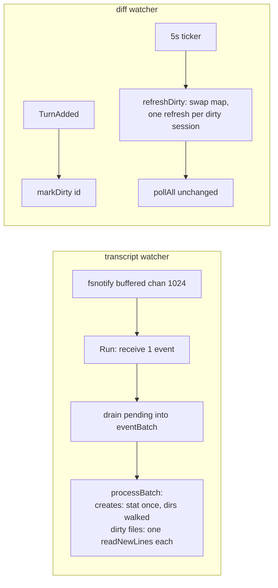

# Watcher swarm-load coalescing — Change Plan

route: `change`

## TLDR

- The shared HTTP `peek-mcp` daemon pins ~1 CPU core during a review-agent swarm (16 lanes, 70-80 subagent worktrees writing transcripts concurrently). Root-caused today: the single-threaded fsnotify event loop pays full per-event cost (stat + open + seek + read + close) for every individual write, and every main-session turn immediately forks its own `git diff`.
- Fix direction is **less total work, not more cores**: coalesce event bursts into batches (one read per dirty file per batch) on a buffered fsnotify channel, and replace the per-turn immediate diff refresh with a dirty-mark flushed by the existing 5s ticker.
- Result: during a swarm, per-file reads collapse from one-per-write-syscall to one-per-batch, and git subprocess rate is bounded by the tick interval — peek stays lightweight; idle latency is unchanged (empty channel → immediate processing).
- An optional third change (decouple startup transcript-ingest horizon from the 90-day state retention) is an OPEN decision.

## Context

- Symptom: `peek-mcp` HTTP daemon at ~80% CPU (~1 core) in Activity Monitor during a `railroad-review` swarm; diagnosed this session and independently confirmed by a sibling-session diagnosis (smine side).
- Cause: single event loop at [watcher/watcher.go:92](watcher/watcher.go:92) handles every fsnotify event serially with per-event syscall cost; [watcher/diff_watcher.go:63](watcher/diff_watcher.go:63) forks `git diff` per main-session turn.
- Design being implemented: the fix directions scoped in this session's diagnosis (coalescing, bounded git rate) — no external design doc.
- Constraint: goal is lower *total* CPU, so no parallelization of ingestion; peek's "lightweight" positioning is the driver.
- Constraint: repo goroutine rules ([context/go/go-goroutines.md](context/go/go-goroutines.md)) bind all new concurrent code — notably RULE-GR-007 (no `sync.Map`; mutex declared above the typed map it guards).

## Drivers

| ID | Observed | Wanted | Impact | Origin |
|---|---|---|---|---|
| DR1 | HTTP daemon at ~80% of a core during 16-lane / 70-80-subagent swarm; every write syscall by every agent triggers a full stat+open+seek+read+close cycle on the one event loop | Bursts coalesced: one read per dirty file per batch; low single-digit CPU% during swarms | behavior-preserving (performance; same turns ingested) | Activity Monitor observation 2026-09-12; this session's diagnosis |
| DR2 | Every main-session turn immediately forks `git diff` for that session; only in-flight dedup per session id — near-continuous git churn under 16 concurrent sessions | Turn-diff refresh rate bounded by the existing 5s tick, bursts per session coalesced | behavioral — turn diff staleness up to one tick interval (5s), see [Behavior contract](#behavior-contract) | Diagnosis F12 |
| DR3 | Every fresh `peek-mcp` spawn (one per Claude/Codex session) re-parses up to 90 days of transcript history at startup (~40s at ~100% CPU observed) | Startup ingest horizon tunable independently of state retention | behavioral if opted in (less history served) | Sibling-session diagnosis F10/F11 — OPEN, see [D6](#d6) |

## Scope

- **In:**
  - **watcher batch coalescing:** buffered fsnotify channel + drain-into-batch + one read per dirty path per batch ([§1](#change-1))
  - **create-only stat:** `os.Stat` only for Create events, not every Write ([§1](#change-1))
  - **diff refresh coalescing:** delete the immediate per-turn refresh path; dirty-mark + flush on the existing ticker ([§2](#change-2))
- **Out:**
  - **loop sharding / worker pools:** parallelizing ingestion multiplies core usage — opposite of the goal
  - **file-handle caching:** fd lifecycle management (LRU, idle close) is a new concept; coalescing already removes the open/close multiplier
  - **orphaned stdio instances (diagnosis F13):** separate lifecycle concern, not swarm lag
  - **`sync.Map` migration of existing DiffWatcher fields:** style-guide cleanup without a driver; new code follows RULE-GR-007, existing fields untouched
- **Not changed:**
  - **parse pipeline:** `Parser.ParseLine`, offset tracking, store ingestion — untouched; same turns land in the store
  - **pollAll uncommitted-diff path:** already per-repo deduped and change-gated; stays as is
- **Deferred findings:**
  - **kqueue fd-per-file cost:** fsnotify on darwin holds an open fd per watched file (observed via `lsof`, thousands of fds on the daemon) — memory/fd pressure, not CPU; not addressed here

## Assumptions

| Assumption | Reality | Location |
|---|---|---|
| Diagnosis assumed drain-coalescing works on the existing watcher | `fsnotify.NewWatcher()` returns an **unbuffered** Events channel — a non-blocking drain would coalesce almost nothing; `NewBufferedWatcher` (v1.10.1, vendored) is required for batching to bite | [vendor/github.com/fsnotify/fsnotify/fsnotify.go:279](vendor/github.com/fsnotify/fsnotify/fsnotify.go:279) |
| Diagnosis F8 weighted inline `walkAndWatch` as a major cost | Per-new-dir walks are small (a fresh session/subagent dir holds a handful of entries); the expensive walk is the pre-loop startup walk. Kept synchronous — see [D5](#d5) | [watcher/watcher.go:137](watcher/watcher.go:137) |
| Diagnosis assumed subagent turns also trigger diff refreshes | `TypeTurnAdded` is published only for main-session turns; subagent turns publish `TypeEventAdded` only — DR2's churn scales with the 16 main sessions, not the 80 subagents | [session/store.go:160](session/store.go:160), [session/store.go:163-185](session/store.go:163) |

## Current state

Facts double as the evidence table (change route); pivotal rows first.

| ID | Fact | Needed for | Location |
|---|---|---|---|
| <a id="f1"></a>F1! | `Watcher.Run` is one `for{select}` loop; each event handled to completion before the next is received | [D1](#d1), [§1](#change-1) | [watcher/watcher.go:92-135](watcher/watcher.go:92) |
| <a id="f2"></a>F2! | Every event — including every Write — pays `os.Stat` for the is-dir check before file handling | [D2](#d2), [§1](#change-1) | [watcher/watcher.go:107](watcher/watcher.go:107) |
| <a id="f3"></a>F3! | `readNewLines` is offset-tracked per path and incremental: re-invoking it after N writes reads the appended bytes exactly once; extra invocations read zero bytes but still pay open/seek/readall/close | [D1](#d1) — makes N→1 coalescing semantically safe | [watcher/watcher.go:194-251](watcher/watcher.go:194) |
| <a id="f4"></a>F4! | `fsnotify.NewWatcher()` Events channel is unbuffered; `NewBufferedWatcher(sz)` exists in the vendored v1.10.1 | [D1](#d1) | [vendor/github.com/fsnotify/fsnotify/fsnotify.go:279-296](vendor/github.com/fsnotify/fsnotify/fsnotify.go:279) |
| <a id="f5"></a>F5! | DiffWatcher: `TypeTurnAdded` → immediate `go w.refresh(...)`, deduped only by in-flight session id (`running`); a 5s ticker separately drives `pollAll` | [D4](#d4), [§2](#change-2) | [watcher/diff_watcher.go:58-83](watcher/diff_watcher.go:58) |
| <a id="f6"></a>F6! | New-code concurrency rules: fixed worker pools only for batch work, no `sync.Map`, mutex above its map, `wg.Go` | [D4](#d4), [Hot items](#hot-items) | [context/go/go-goroutines.md](context/go/go-goroutines.md) |
| <a id="f7"></a>F7 | Subagent meta files are one-shot: `readSubagentMeta` marks the path done in `w.files` and skips re-reads | [§1](#change-1) — batch must route meta paths same as today | [watcher/watcher.go:253-303](watcher/watcher.go:253) |
| <a id="f8"></a>F8 | `refresh` re-resolves the session by id and self-cleans `running`; it is safe to invoke from any goroutine at any time | [§2](#change-2) | [watcher/diff_watcher.go:96-132](watcher/diff_watcher.go:96) |
| <a id="f9"></a>F9 | Startup ingest horizon is derived from `--state-retention-days` (default 90); no independent knob | [D6](#d6) | [cmd/start.go:65-71](cmd/start.go:65), [cmd/start.go:333](cmd/start.go:333) |
| <a id="f10"></a>F10 | Default `--poll-interval` is 5s; `Run` floors non-positive intervals to 1s | [§2](#change-2) | [cmd/start.go:330](cmd/start.go:330), [watcher/diff_watcher.go:50-52](watcher/diff_watcher.go:50) |

## Target state



- **Principle — batching over parallelism:** amortize fixed per-event cost across bursts instead of spreading it over cores; implemented with a buffered channel plus a non-blocking drain (`select`/`default`), self-balancing: batch size grows exactly when processing falls behind, idle latency stays zero.
- **Principle — single mechanism:** the immediate per-turn refresh path is deleted, not throttled around; the ticker becomes the only place turn-diffs are scheduled (one source of truth for git cadence).

## Behavior contract

- **Must not change:**
  - every complete transcript line is ingested exactly once, in file order (offset tracking untouched)
  - new session/subagent directories get watched and backfilled on their Create event
  - subagent meta files produce exactly one `EventKindSubagentSpawned`
  - `pollAll` cadence, per-repo dedup, and `peek-diff` hook-file writes
  - diff content: same pinned base, same exclusions, same snapshot persistence
- **Intentional changes (flagged):**
  - turn-triggered diff refresh latency: immediate → up to one tick interval (5s default), bursts within a tick coalesced to one refresh per session ([DR2](#drivers), [D4](#d4))

## Decisions

| ID | Problem | Facts | Decision | Why |
|---|---|---|---|---|
| <a id="d1"></a>D1 | Per-event cost dominates swarm CPU | [F1](#f1), [F3](#f3), [F4](#f4) | Coalesce: `NewBufferedWatcher(1024)`, drain pending events into an `eventBatch` (dirty-path set + created list), process each dirty path once | Reduces total work (controllable knob: buffer size; debuggable: batch is a plain value; reliable: degrades to today's one-event batches at idle). Rejected: worker-pool sharding — spreads the same work over more cores, the opposite of "lightweight"; time-debounce — adds latency and a timer concept for no gain over drain |
| <a id="d2"></a>D2 | `os.Stat` per Write event is pure waste | [F2](#f2) | Stat only Create events; Writes go straight to the dirty set | A Write on a directory path is a no-op downstream anyway (fails both `isTranscriptPath` and `isSubagentMetaPath`); only Creates can introduce directories |
| <a id="d3"></a>D3 | Open/close per read remains after coalescing | [F3](#f3) | No file-handle cache | One open per file per batch is bounded and cheap; an fd cache needs LRU/idle-close lifecycle — a new concept without a remaining driver |
| <a id="d4"></a>D4 | Per-turn immediate `git diff`, redundant under bursts | [F5](#f5), [F6](#f6), [F8](#f8) | Delete the immediate refresh path; `TurnAdded` only marks the session dirty (`sync.Mutex` + `map[session.Id]struct{}`), the existing ticker flushes dirty sessions before `pollAll` | Single mechanism instead of immediate-path + throttle + trailing-edge flush; git rate bounded by tick; RULE-GR-007 shape for the new map. Rejected: per-session throttle on the immediate path — keeps two mechanisms alive and needs a pending-flush anyway for the last turn of a burst |
| <a id="d5"></a>D5 | Diagnosis flagged inline `walkAndWatch` as blocking the loop | [F1](#f1) | Keep `walkAndWatch` synchronous in the batch path | A new dir at Create time holds a handful of entries — walk cost is trivial; the expensive full-tree walk runs once before the loop starts. Moving it off-loop adds ordering hazards (reads racing watch registration) for no measurable win |
| <a id="d6"></a>D6 | Fresh stdio spawns re-parse 90 days of history ([DR3](#drivers)) | [F9](#f9) | [USER] b — add `--ingest-days` flag, default = `--state-retention-days` (zero behavior change unless set; claude-configs then sets a low value for stdio spawns) | Per-session spawn cost is the second user-visible half of "peek is not lightweight"; Phase 3 is in scope |

## Open questions

- none — Q1 resolved to [D6](#d6) = b at approval

## Baseline (verified)

N/A — change route; the facts table lives in [Current state](#current-state). Base branch: `claude/subagent-scan-cap-9c85db` (this worktree, contains the earlier `maxSubagentStats` raise).

## Exemplar & reuse

| Existing | Used for |
|---|---|
| `w.files` offset map + `readNewLines` idempotence ([F3](#f3)) | unchanged read path invoked once per dirty file |
| `running` in-flight dedup + `refresh` self-cleanup ([F8](#f8)) | reused verbatim by the ticker flush |
| existing ticker in `DiffWatcher.Run` | flush trigger — no new timer |

- No change in this plan lacks an exemplar: both files are modified in place following their own current structure; tests mirror `watcher_test.go` / `diff_watcher_test.go` direct-invocation style.

## Changes

| File | Kind | Entry |
|---|---|---|
| watcher/watcher.go | modified | [§1](#change-1) |
| watcher/watcher_test.go | modified | [§1](#change-1) (tests) |
| watcher/diff_watcher.go | modified | [§2](#change-2) |
| watcher/diff_watcher_test.go | modified | [§2](#change-2) (tests) |
| cmd/start.go | modified | [§3](#change-3) |

### <a id="change-1"></a>§1 Watcher batch coalescing (modified) — Phase 1, shippable alone

location: `watcher/watcher.go`
mirrors: in-place restructuring of `Run`; helpers follow the file's existing free-function style (`isSubagentMetaPath` et al.)

- **eventBatch** (new type in the same file) — complete final code:

```go
const eventChannelBuffer = 1024

type eventBatch struct {
	created []string
	dirty   map[string]struct{}
}

func newEventBatch() *eventBatch {
	return &eventBatch{dirty: make(map[string]struct{})}
}

func (b *eventBatch) add(event fsnotify.Event) {
	if event.Has(fsnotify.Create) {
		b.created = append(b.created, event.Name)
		return
	}
	if event.Has(fsnotify.Write) {
		b.dirty[event.Name] = struct{}{}
	}
}

func (b *eventBatch) drain(events <-chan fsnotify.Event) {
	for {
		select {
		case event, ok := <-events:
			if !ok {
				return
			}
			b.add(event)
		default:
			return
		}
	}
}
```

- **Run** — diff:

```diff
 func (w *Watcher) Run(ctx context.Context) error {
-	watcher, err := fsnotify.NewWatcher()
+	watcher, err := fsnotify.NewBufferedWatcher(eventChannelBuffer)
 	if err != nil {
 		return err
 	}
 	defer watcher.Close()

 	// Add root directories and backfill existing files
 	w.walkAndWatch(watcher, w.agentDir)
 	w.store.SeedDiffCache()

 	for {
 		select {
 		case <-ctx.Done():
 			return ctx.Err()
 		case event, ok := <-watcher.Events:
 			if !ok {
 				slog.Info("watcher closed")
 				return nil
 			}
-			if !event.Has(fsnotify.Write) && !event.Has(fsnotify.Create) {
-				continue
-			}
-
-			// new directory, new session has been started
-			path := event.Name
-			if info, err := os.Stat(path); err == nil && info.IsDir() {
-				if !event.Has(fsnotify.Create) {
-					continue
-				}
-
-				w.walkAndWatch(watcher, path)
-				continue
-			}
-
-			// new or changed file
-			if w.isTranscriptPath(path) {
-				err = w.readNewLines(path)
-				if err != nil {
-					slog.Warn("readNewLines", "err", err)
-				}
-			}
-
-			if isSubagentMetaPath(path) {
-				w.readSubagentMeta(path)
-			}
+			batch := newEventBatch()
+			batch.add(event)
+			batch.drain(watcher.Events)
+			w.processBatch(watcher, batch)

 		case err, ok := <-watcher.Errors:
 			if !ok {
 				return nil
 			}
 			slog.Error("watcher error", "err", err)
 		}
 	}
 }
```

- **processBatch** (new method) — complete final code:

```go
// processBatch handles a coalesced burst: creates first (a new directory must
// be watched before its files' writes are read), then each dirty path once.
func (w *Watcher) processBatch(watcher *fsnotify.Watcher, batch *eventBatch) {
	for _, path := range batch.created {
		info, err := os.Stat(path)
		if err != nil {
			continue
		}
		if info.IsDir() {
			w.walkAndWatch(watcher, path)
			continue
		}
		batch.dirty[path] = struct{}{}
	}

	for path := range batch.dirty {
		if w.isTranscriptPath(path) {
			if err := w.readNewLines(path); err != nil {
				slog.Warn("readNewLines", "err", err)
			}
		}
		if isSubagentMetaPath(path) {
			w.readSubagentMeta(path)
		}
	}
}
```

- **Behavior preserved:** created files (Create then Writes in one batch) are read once via the dirty set; created dirs are walked exactly as before; non-Write/non-Create events are ignored (dropped in `add`); meta paths route through `readSubagentMeta` with its existing one-shot guard ([F7](#f7)).

### <a id="change-2"></a>§2 Diff refresh coalescing (modified) — Phase 2, shippable alone

location: `watcher/diff_watcher.go`
mirrors: in-place; new map follows RULE-GR-007 (mutex directly above the map on the owning struct)

- **struct** — diff:

```diff
 type DiffWatcher struct {
 	store    *session.Store
 	broker   *events.Broker
 	interval time.Duration
 	window   time.Duration
 	stateDir *state.Dir
 	running  sync.Map // session.Id -> struct{}; one in-flight turn-diff per session
 	polling  sync.Map // cwd -> struct{}; one in-flight poll per repo
 	lastDiff sync.Map // gitDir -> string; last written uncommitted diff, to skip no-op writes

+	dirtyMu sync.Mutex
+	dirty   map[session.Id]string // session -> cwd; turn-diff refreshes pending for the next tick
+
 	baseMu    sync.Mutex
 	baseByKey map[diffBaseKey]string
 }
```

- `NewDiffWatcher` initializes `dirty: make(map[session.Id]string)` (diff omitted — one constructor line).

- **Run** — diff:

```diff
 		case ev := <-ch:
 			if ev.Type != events.TypeTurnAdded {
 				continue
 			}
 			id := session.Id(ev.SessionId)
 			sess, ok := w.store.GetById(id)
 			if !ok || sess.Meta.CWD == "" {
 				continue
 			}
 			if !w.isWithinWindow(sess) {
 				continue
 			}
-			if _, loaded := w.running.LoadOrStore(id, struct{}{}); loaded {
-				continue
-			}
-			go w.refresh(ctx, id, sess.Meta.CWD)
+			w.markDirty(id, sess.Meta.CWD)

 		case <-ticker.C:
+			w.refreshDirty(ctx)
 			w.pollAll(ctx)
 		}
```

- **markDirty / refreshDirty** (new methods) — complete final code:

```go
func (w *DiffWatcher) markDirty(id session.Id, cwd string) {
	w.dirtyMu.Lock()
	defer w.dirtyMu.Unlock()
	w.dirty[id] = cwd
}

// refreshDirty flushes turn-diff refreshes accumulated since the last tick —
// one refresh per session regardless of how many turns arrived in between.
func (w *DiffWatcher) refreshDirty(ctx context.Context) {
	w.dirtyMu.Lock()
	pending := w.dirty
	w.dirty = make(map[session.Id]string)
	w.dirtyMu.Unlock()

	for id, cwd := range pending {
		if _, loaded := w.running.LoadOrStore(id, struct{}{}); loaded {
			continue
		}
		go w.refresh(ctx, id, cwd)
	}
}
```

- **Behavior notes:** a session still mid-refresh at flush time is skipped by the existing `running` guard and its entry is consumed — the next turn re-marks it; window/CWD gating stays at mark time, unchanged.

### <a id="change-3"></a>§3 Ingest-horizon flag (modified) — Phase 3, shippable alone

location: `cmd/start.go`

- **flag** — diff:

```diff
 	flags.Int("state-retention-days", 90, "Days to keep per-session state before GC removes it, and how far back startup ingests transcripts (0 disables both)")
+	flags.Int("ingest-days", 0, "How far back startup ingests transcripts (0 = follow state-retention-days)")
```

- **horizon derivation** — diff:

```diff
 		stateRetentionDays, _ := flags.GetInt("state-retention-days")
+		ingestDays, _ := flags.GetInt("ingest-days")
 		// ...
 		ingestHorizon := time.Duration(stateRetentionDays) * 24 * time.Hour
+		if ingestDays > 0 {
+			ingestHorizon = time.Duration(ingestDays) * 24 * time.Hour
+		}
```

- **env mapping:** add `"ingest-days": "PEEK_INGEST_DAYS"` to the existing env table ([cmd/start.go:396](cmd/start.go:396)).
- The claude-configs change (setting `--ingest-days` on the stdio fragment) is a separate change in that repo — out of this plan.

## Hot items

- **Goroutines/channels/locking** — both touched mechanisms are in a hot class; example implementations are written out in full above:
  - the coalescing loop: `eventBatch.drain` non-blocking select + `processBatch` ([§1](#change-1)) — single consumer goroutine unchanged, no new goroutines
  - the dirty-map flush: `dirtyMu`/`dirty` per RULE-GR-007, swap-under-lock then launch outside the lock ([§2](#change-2)) — reuses the existing per-session `running` dedup and per-refresh goroutine pattern
- No worker pools introduced (RULE-GR-001 not applicable — deliberately, per [D1](#d1)).

## Tests

| Location.Method | Cases | Comment |
|---|---|---|
| watcher_test.go `TestEventBatch_Coalesce` | five writes same path → one dirty entry<br>writes on two paths → two entries<br>create → created list, not dirty<br>create-and-write flags on one event → created only<br>chmod/rename-only event → dropped | pure value-type test, no fs needed |
| watcher_test.go `TestProcessBatch` | created dir with pre-existing jsonl → file ingested (walk ran)<br>created file plus queued writes → session has all lines exactly once<br>meta path in dirty set → one subagent-spawned event | drives `processBatch` directly, mirrors `TestWalkAndWatch_Horizon` style |
| diff_watcher_test.go `TestDiffWatcher_RefreshDirty` | two marks same session → one refresh (diff populated once, map emptied)<br>mark while refresh in flight → skipped, not re-queued<br>flush empties dirty map | drives `markDirty`/`refreshDirty` directly, mirrors `TestDiffWatcher_Refresh` setup |
| — | not tested: `NewBufferedWatcher` buffer behavior — vendored library contract, not ours | |

- Existing safety net: `TestWalkAndWatch_Horizon`, `TestReadNewLines_PerFileParserState`, all `diff_watcher_*` tests pin ingestion order, offsets, pinning, snapshots — must stay green untouched (except `Run`-shape-dependent tests if any exist; none found).

## Test runbook

- **swarm-storm smoke** — synthetic write storm against a running daemon, CPU observed (see Verification; shell-driven, no request files — peek has no callable ingest surface).
- DR1 is behavior-preserving: existing watcher tests re-verify ingestion; DR2 behavioral: `TestDiffWatcher_RefreshDirty` pins the new cadence.

## Contracts & sweeps

| Contract | Sides | Sweep |
|---|---|---|
| broker event semantics (`TypeTurnAdded` consumers) | store → DiffWatcher, control SSE | `grep -rn "TypeTurnAdded" --include=*.go .` (excl. vendor) — only diff_watcher.go consumption changes; control SSE untouched |
| `refresh` invocation contract (self-cleaning `running`) | Run → refresh | callers of `w.refresh` after change: only `refreshDirty` |
| flag surface (`--ingest-days`, if D6=b) | cmd/start.go ↔ docs/reference.md | update the flag table in docs/reference.md in the same phase |

## Verification

- [ ] `make test` — all packages green
- [ ] `make build-local` — builds
- [ ] Synthetic storm: start `./dist/peek-mcp start --transport http --port 14242 --claude-home <tmp-home>` against a temp home; run a shell loop appending JSONL lines to 50 files across 10 session dirs for 60s — daemon CPU in `top` stays low single-digit % (before this change the same storm drives it toward a full core)
- [ ] During the storm, `curl localhost:14242` session list shows all sessions with correct turn counts — no lost lines under coalescing
- [ ] Create a new session dir mid-storm with a pre-filled transcript — it appears in the store (batch dir-walk path)
- [ ] Turn-diff still updates: in a real repo session, make a change, observe the diff fragment refresh within ~5-6s (new cadence)
- [ ] Degenerate: empty batch impossible by construction (batch always holds the triggering event); zero-write idle daemon shows ~0% CPU as today
- [ ] If D6=b: `./dist/peek-mcp start --ingest-days 7 ...` on a home with older transcripts — startup skips them; without the flag, 90-day behavior unchanged

## Stop conditions

| ID | Condition | Action |
|---|---|---|
| S1 | An approved signature/contract can't hold as planned | stop and report — never improvise architecture mid-edit |
| S2 | Second failed fix on the same mechanism | stop, research the actual cause, redesign — no third band-aid |
| S3 | Missing prerequisite (generated code, running infra) | run the producing step; if infrastructure is down, ask — never skip validation |
| S4 | Discovered work materially exceeds approved scope | ask before continuing |
| S5 | Same kind of bug found twice: in own diff → fix all in diff; pre-existing outside | report and ask before sweeping |
| S6 | Structural obstacle tempts a new abstraction | stop and report — relocate, don't indirect |
| S7 | Coalescing changes observable ingestion order or drops lines in any existing test | stop — the batch design is wrong, do not weaken the test |
| S8 | `NewBufferedWatcher` behaves differently from `NewWatcher` beyond channel buffering (platform quirk) | stop and report before working around |

## Changelog

| Date | Trigger | What changed |
|---|---|---|
| — | initial | plan created |
| 2026-09-12 | Q: D6 ingest horizon | resolved b by user at approval — Phase 3 in scope |
